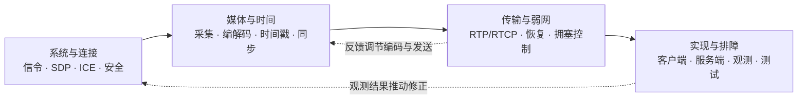

---
aliases:
  - RTC 知识图谱
  - RTC 学习总览
tags:
  - rtc/moc
type: moc
status: growing
---

# RTC 知识总览

## 如果你刚开始（先看这里）

先别管下面的专题目录、Canvas 树和 P0/P1。那些是给「已经有点底」时查阅用的。

一通电话，你先记住三件事：

1. **建连**：双方用信令交换 SDP（offer / answer），谈好「传什么」。
2. **通路**：用 ICE 找出一条真正能通的网络路径（常是 UDP）。
3. **媒体**：采集 → 编码 → RTP 打包发出；对端收包 → 缓冲 → 解码 → 播放。

**第一次只读这三篇**（按顺序，每篇先看顶部「阅读提示」里的主干即可）：

1. [[RTC]]
2. [[实时媒体链路]]
3. [[端到端延迟]]

读完小目标：合上笔记，自己画出「采集 → 编码 → 打包 → 网络 → 接收缓冲 → 解码 → 播放」，并标出三个可能变慢的地方。然后记到 [[00-知识地图/学习路线/学习进度模板|我的学习进度]]。

每次只盯一个主题；文里的 `[[链接]]` 最多点开一层，陌生词先记下来，读完再查。

---

## 今天从哪个入口进

- **零基础 / 第一次：** 就用上面的三篇，别往下翻完整目录。
- **继续上次：** [[00-知识地图/学习路线/学习进度模板|我的学习进度]]
- **已经学过、要查某个词：** [[#按现有概念快速查阅]]

## 四条主线怎样连成一次实时通信

用人话讲：先接通，再传声音/画面，网络不好时靠反馈调整，出了问题再观测排查。四条线是同一通电话的不同侧面，不是四门无关的课。

## 读完一篇之后去哪

每篇概念笔记和专题说明底部都有 **阅读导航**（上一篇 / 下一篇 / **第一次阅读下一站** / 所属专题 / 回总览）。
完整线性链见 [[00-知识地图/学习路线/概念阅读导航链|概念阅读导航链]]；阶段练习仍以 [[00-知识地图/学习路线/RTC 工程师学习路线.canvas|学习路线]] 为准。
第一次阅读三篇读完后，点笔记底部的「第一次阅读下一站」或回到本页「后续学习顺序」。

**看图：** 双方对打的过程用时序图（图前有「图在说什么」）；单端状态机 / 管线 / 结构用 flowchart——约定见 [[00-知识地图/学习路线/时序图画法约定|时序图画法约定]]。Canvas 树只帮你定位范围，**不替代**笔记里的初读分隔与下一站。

## 第一次阅读

按顺序读 [[RTC]] → [[实时媒体链路]] → [[端到端延迟]]。先按每篇顶部的“阅读提示”理解主干，第一次不必读完所有工程细节。

这次只完成一个小目标：合上笔记，画出“采集 → 编码 → 打包 → 网络 → 接收缓冲 → 解码 → 播放”，说明每一步做什么，并指出三个可能增加延迟的位置。完成后到 [[00-知识地图/学习路线/学习进度模板|学习进度]] 记录；能复述与做过实验分别标记。

每次只读一个主题，内部链接最多追一层；不影响当前理解的陌生词先记下来，读完再查。

## 后续学习顺序

先读 01 系统目标 → 05 媒体表示 → 06 时间同步 → 07 音频与 Opus → 09 RTP → 11 接收缓冲，形成最小音频通路。然后补会话连接、视频、反馈和弱网，最后深入 RTC 客户端与 SFU。测试与测量贯穿每一步。

按阶段验收：[[00-知识地图/学习路线/RTC 工程师学习路线.canvas|RTC 学习路线]]。它只决定阅读先后，不另建一套知识范围。

路线中的本地编解码和 RTP/UDP 实验用于巩固底层机制。想先体验通话时，可在了解协商、ICE 和安全传输的基本作用后，提前尝试 [[00-知识地图/专题说明/04 WebRTC 应用接入与源码阅读#采集、预览与权限|浏览器最小通话]]，再回到原阶段继续学习。

## 各种地图怎么用

| 入口 | 用途 | 什么时候打开 |
| --- | --- | --- |
| [[00-知识地图/学习路线/RTC 工程师学习路线.canvas\|学习路线]] | 安排顺序与阶段练习（读法仍看笔记初读/下一站） | 决定下一步学什么 |
| 下方的专题说明 | 解释学习目标、知识组和练习 | 开始学一个专题 |
| [[#按现有概念快速查阅\|主题地图]] | 按领域查概念 | 遇到具体名词或问题 |
| [[00-知识地图/RTC 树状知识地图.canvas\|总知识树]]与专题树 | 展示知识范围和关系 | 需要全局定位或视觉浏览 |
| [[90-参考资料/参考资料索引\|参考资料索引]] | 查书籍、论文和岗位调研 | 概念笔记不够用，或需要查来源 |

> **第一次阅读可以先跳过本节以下内容。** 下面是完整索引（约 16 个专题），方便以后查阅，不是要求一次读完。

范围：4 条 RTC 主线、16 个专题、64 个知识组、192 个学习条目。总树直接列出全部条目，点击专题标题打开详细树，点击具体知识点进入说明；现有概念详解接入相应主题地图或专题树。

## 完整专题目录

### 系统与连接

| 专题 | 树状展开 | 本专题要解决的问题 |
| --- | --- | --- |
| [[00-知识地图/专题说明/01 RTC 系统与低延迟目标\|01 RTC 系统与低延迟目标]] | [[00-知识地图/RTC专题树/01 RTC 系统与低延迟目标.canvas\|打开专题树]] | 先知道一通音视频电话由哪些环节组成，再把术语放到对应的位置。 |
| [[00-知识地图/专题说明/02 信令与 SDP 协商\|02 信令与 SDP 协商]] | [[00-知识地图/RTC专题树/02 信令与 SDP 协商.canvas\|打开专题树]] | 在发送媒体前，让双方就会话、媒体能力、传输参数和方向达成一致。 |
| [[00-知识地图/专题说明/03 ICE、STUN、TURN 与传输安全\|03 ICE、STUN、TURN 与传输安全]] | [[00-知识地图/RTC专题树/03 ICE、STUN、TURN 与传输安全.canvas\|打开专题树]] | 解决“对方在什么地址、哪条路真正可达、媒体怎样受到保护”。 |
| [[00-知识地图/专题说明/04 WebRTC 应用接入与源码阅读\|04 WebRTC 应用接入与源码阅读]] | [[00-知识地图/RTC专题树/04 WebRTC 应用接入与源码阅读.canvas\|打开专题树]] | 先把完整通话跑起来，再沿单条数据链定位实现，而不是从源码第一行开始通读。 |

### 媒体与时间

| 专题 | 树状展开 | 本专题要解决的问题 |
| --- | --- | --- |
| [[00-知识地图/专题说明/05 音视频数据、采集与播放\|05 音视频数据、采集与播放]] | [[00-知识地图/RTC专题树/05 音视频数据、采集与播放.canvas\|打开专题树]] | 先认识网络里传输内容的前身：声音样本与图像像素，以及它们如何进入程序。 |
| [[00-知识地图/专题说明/06 时间系统与音画同步\|06 时间系统与音画同步]] | [[00-知识地图/RTC专题树/06 时间系统与音画同步.canvas\|打开专题树]] | 把序号、媒体时间、现实时间和本地等待时间分开，建立“何时播放”的正确模型。 |
| [[00-知识地图/专题说明/07 音频处理与 Opus\|07 音频处理与 Opus]] | [[00-知识地图/RTC专题树/07 音频处理与 Opus.canvas\|打开专题树]] | 解决“声音如何变小”“为什么有回声、噪声和断续”，先会接入，再深入算法。 |
| [[00-知识地图/专题说明/08 视频编码与 H.264\|08 视频编码与 H.264]] | [[00-知识地图/RTC专题树/08 视频编码与 H.264.canvas\|打开专题树]] | 理解图像压缩和帧间依赖，避免把“一张图”“一个 NALU”“一个 RTP 包”混为一谈。 |

### 传输与弱网

| 专题 | 树状展开 | 本专题要解决的问题 |
| --- | --- | --- |
| [[00-知识地图/专题说明/09 RTP 打包、解析与传输\|09 RTP 打包、解析与传输]] | [[00-知识地图/RTC专题树/09 RTP 打包、解析与传输.canvas\|打开专题树]] | 让接收端知道包属于谁、采用什么负载格式、在媒体时间轴上处于哪里。 |
| [[00-知识地图/专题说明/10 RTCP 与质量反馈\|10 RTCP 与质量反馈]] | [[00-知识地图/RTC专题树/10 RTCP 与质量反馈.canvas\|打开专题树]] | 让发送端知道接收情况，并为同步、丢包恢复和后续速率调整提供信息。 |
| [[00-知识地图/专题说明/11 接收端 Jitter Buffer 与 NetEQ\|11 接收端 Jitter Buffer 与 NetEQ]] | [[00-知识地图/RTC专题树/11 接收端 Jitter Buffer 与 NetEQ.canvas\|打开专题树]] | 把到达不均匀的网络数据，变成播放设备需要的连续媒体节奏。 |
| [[00-知识地图/专题说明/12 丢包恢复、带宽估计与拥塞控制\|12 丢包恢复、带宽估计与拥塞控制]] | [[00-知识地图/RTC专题树/12 丢包恢复、带宽估计与拥塞控制.canvas\|打开专题树]] | 在有限带宽和播放时限内决定：等一等、重传、用冗余恢复，还是放弃并降低发送压力。 |

### RTC 实现与排障

| 专题 | 树状展开 | 本专题要解决的问题 |
| --- | --- | --- |
| [[00-知识地图/专题说明/13 RTC 媒体处理与 FFmpeg\|13 RTC 媒体处理与 FFmpeg]] | [[00-知识地图/RTC专题树/13 RTC 媒体处理与 FFmpeg.canvas\|打开专题树]] | 用工具观察媒体，用库接入媒体处理；把“能运行命令”与“能管理 API 状态”分开训练。 |
| [[00-知识地图/专题说明/14 RTC 终端设备与生命周期\|14 RTC 终端设备与生命周期]] | [[00-知识地图/RTC专题树/14 RTC 终端设备与生命周期.canvas\|打开专题树]] | 把同一条媒体链路接到不同平台时，设备、线程、内存和生命周期有哪些差异？ |
| [[00-知识地图/专题说明/15 SFU 与多人通信系统\|15 SFU 与多人通信系统]] | [[00-知识地图/RTC专题树/15 SFU 与多人通信系统.canvas\|打开专题树]] | 从两人直连扩展到多人发布/订阅，理解转发、带宽分配和服务端状态。 |
| [[00-知识地图/专题说明/16 测试、测量、排障与性能\|16 测试、测量、排障与性能]] | [[00-知识地图/RTC专题树/16 测试、测量、排障与性能.canvas\|打开专题树]] | 让知识最终变成可验证的工程能力：能复现问题、找到证据、比较改动效果。 |

## 学习条目与笔记深度

- 每个条目都有入门说明；每个知识组都有针对该组的练习和验收要求。
- “配套详解”指向已有概念笔记，提供相关机制、工程要点和参考资料；不能理解为该条目全部实现细节均已写完。
- P0 是闭环基础，P1 是 RTC 核心工程能力，P2 是 RTC 相关专项深入。优先级与个人掌握状态分开记录。
- 笔记属性 `status: growing` 表示内容还在完善，不代表你已经学过；个人阅读、复述和实验状态记录在 [[00-知识地图/学习路线/学习进度模板|学习进度]]。
- 本树聚焦 RTC：通用 C++ 语法课、独立 Linux/算法课程、点播 ABR、静态图像压缩和离线超分不列为学习分支。RTC 中的线程寿命、UDP/MTU 和设备约束仍在具体专题内说明。

## 必须串起来的机制（学完一段后再回来看）

第一次阅读可以跳过本节。等你走通最小通路后，用下面几条检查「概念有没有连成闭环」：

1. 采样与媒体时长 → 编码帧 → RTP 时间戳 → 接收缓冲 → 播放计划。
2. SDP 能力与方向 → ICE 选路 → DTLS/SRTP → 实际媒体收发；每一步独立观测。
3. 丢失检测 → NACK/RTX 或 FEC → 恢复截止；过期数据不能无限等待。
4. RTCP/TWCC 反馈 → 带宽估计 → 编码预算与 Pacing → 网络排队 → 新反馈。
5. 视频参考依赖 → PLI/FIR → 关键帧峰值 → 发送预算与接收恢复。
6. SFU 发布订阅 → 逐接收端选层与反馈 → 总出口流量、体验与容量。

这些关系在概念笔记中继续展开。树中层级表示分类，不能把所有兄弟节点当成严格时序。

## 按现有概念快速查阅

- [[基础与媒体地图]]
- [[会话与信令地图]]
- [[连接与安全地图]]
- [[媒体传输地图]]
- [[编解码与媒体处理地图]]
- [[网络质量地图]]
- [[服务端架构地图]]
- [[客户端工程地图]]
- [[测试与排障地图]]

16 张当前专题树位于 `00-知识地图/RTC专题树/`。日常学习使用本页与当前专题说明。

## 来源

统一入口：[[90-参考资料/参考资料索引|参考资料索引]]。教材与原文入口：[[音视频与 WebRTC 书库]]、[[av_core_sources_v1]]。来源用于深入查阅，不作为主树中的知识节点计数。新增学习说明基于参考大纲相关部分及 RTC 工程机制整理，使用时以所选协议、库和平台版本核对实现。
