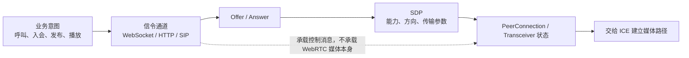

# 会话与信令地图

## 关系速览

## 会话主线

- [[WebRTC 会话生命周期]]：从创建、协商、连接、收发到关闭组织状态。
- [[信令服务器]]：传递业务状态、描述和候选，不承担媒体协议本身。
- [[实时通信中的信令消息与业务消息]]：区分命令、事件、状态快照、媒体反馈和媒体数据，定义版本、幂等与业务成功证据。
- [[WebSocket]]：理解信令常用双向通道的握手、帧、消息、心跳、重连和背压边界。
- [[Offer Answer]]：协调两端何时提出和接受媒体能力。
- [[SDP]]：表达媒体行、方向、编解码、ICE 与安全参数。
- [[WHIP 与 WHEP]]：用 HTTP 创建发布/播放会话；区分 endpoint、session resource、ICE PATCH 与媒体面。

## 媒体对象与数据

- [[MediaStream Track 与 Transceiver]]：连接业务轨道与协商方向。
- [[RTCDataChannel 与 SCTP]]：在 DTLS 传输上提供可配置可靠性的消息通道。
- [[SIP]]：理解传统呼叫控制及 WebRTC 网关互通边界。

## 建议学习路径

从会话生命周期建立总状态轴，再用 [[实时通信中的信令消息与业务消息]] 和 [[WebSocket]] 分清语义与承载；接着学习 Offer/Answer 与 SDP 如何表达意图，最后把 Track、Transceiver 和 DataChannel 放回这条时间线。SIP 适合作为传统呼叫控制的对照，WHIP/WHEP 适合作为直播发布与播放的 HTTP 信令对照。

## 掌握标准

- 能解释信令服务器为何不属于 WebRTC 强制协议，却是应用建联所需的业务通道。
- 能区分 WebSocket Open、消息已处理、业务状态生效和媒体可播放，并设计重连后的版本/幂等收敛。
- 能从 SDP 找到媒体方向、编解码能力、ICE 凭据和安全指纹。
- 能区分重新协商、ICE restart、轨道替换和新建 PeerConnection。
- 能解释 WHIP 的 POST、Location、ETag、Trickle ICE PATCH、ICE restart PATCH 和 DELETE 各自改变哪一层状态。

建联下一阶段见 [[连接与安全地图]]；总览见 [[00-知识地图/RTC 知识总览|RTC 知识总览]]。
