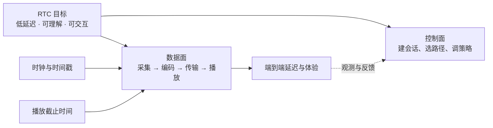

# 基础与媒体地图

## 关系速览

## 先建立系统边界

- [[RTC]]：理解实时通信优化的目标和取舍。
- [[数据面与控制面]]：区分媒体搬运、会话控制和质量反馈。
- [[实时媒体链路]]：沿发送、网络和接收路径追踪一帧媒体。

## 再建立时间约束

- [[时钟与时间戳]]：明确不同时间域、频率、单位和回绕。
- [[播放截止时间]]：判断等待、恢复或丢弃是否仍有价值。
- [[端到端延迟]]：把总体验拆成可测量的分段预算。

## 下一步

- 会话如何建立：[[会话与信令地图]]
- 媒体如何表达和处理：[[编解码与媒体处理地图]]
- 媒体如何传输和恢复：[[媒体传输地图]]

## 阅读导航

- **线性顺序（第一次阅读扩展）：** [[RTC]] → [[实时媒体链路]] → [[端到端延迟]] → [[播放截止时间]] → [[时钟与时间戳]] → [[数据面与控制面]]
- **完整链：** [[00-知识地图/学习路线/概念阅读导航链|概念阅读导航链]]
- **回看：** [[RTC 知识总览]]

## 建议学习路径

先用 [[RTC]] 确定优化目标，再沿 [[实时媒体链路]] 追踪一帧媒体；随后用数据面/控制面区分职责，最后建立时钟、播放截止和端到端延迟预算。完成后应能画出发送、网络、接收三段链路，并解释“可靠送达”为什么不一定适合实时播放。

## 掌握标准

- 能把一次卡顿定位到采集、编码、发送、网络、缓冲、解码或呈现阶段。
- 能区分 RTP 时间戳、系统时间、采集时间和实际播放时间。
- 讨论优化时能同时说明延迟、连续性、质量、带宽和资源代价。

返回 [[00-知识地图/RTC 知识总览|RTC 知识总览]]。
