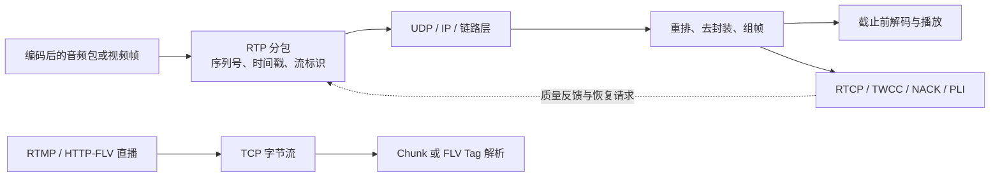

# 媒体传输地图

## 关系速览

## 包与流

- [[从 RTP 到网卡、路由器与物理链路]]：从 IP、MAC、ARP/NDP 到网卡、交换机、路由器和物理信号，跟随一个媒体包走完网络路径。
- [[DHCP]]：从手机连接 Wi-Fi 的真实过程理解 DORA、租约续期、报文字段、Relay、DHCPv6 以及地址配置故障。
- [[UDP IP Socket 与 MTU]]：理解 RTP 下方的数据报、Socket 队列、路径 MTU 和真实线上开销。
- [[TCP]]：理解可靠有序字节流、连接状态、流量/拥塞控制、应用分帧，以及 TCP 在 RTC 中的回退与队头阻塞边界。
- [[TLS]]：理解 TCP 上的安全握手、证书验证、方向分离密钥与 Record，并区分安全通道和上层业务成功。
- [[WebSocket]]：理解 TCP 上的双向消息、分片与背压，以及它承载信令和自定义媒体时不同的上层职责。
- [[RTMP 推流与拉流]]：理解 TCP 上的 RTMP 握手、Chunk 分帧、`publish/play` 状态、AVC/AAC 配置和直播推拉流排障。
- [[HTTP-FLV 拉流服务]]：理解长 HTTP 响应中的 FLV Header/Tag、codec config、GOP cache、首屏和慢客户端隔离。
- [[RTP]]：用序列号、时间戳、SSRC 和负载类型承载实时媒体。
- [[RTP 流标识与复用]]：用 SSRC、PT、MID/RID 和 BUNDLE 区分复用流。
- [[RTP 头扩展]]：解析扩展块并按 SDP 映射 MID、RID、TWCC、音量等语义。
- [[Opus RTP 负载格式]]：从 RTP payload 恢复 Opus packet、时长和解码边界。
- [[H264 RTP 负载格式]]：处理 Single NALU、STAP-A、FU-A 和访问单元边界。
- [[RTCP]]：反馈接收质量、同步映射和媒体事件。
- [[RTCP 报文计算与调度状态机]]：计算 SR/RR、jitter 与 RTT，并调度周期报告和即时反馈。
- [[TWCC]]：提供逐包传输到达反馈，供发送侧估计网络状态。

## 恢复与接收

- [[丢包恢复策略]]：依据播放截止、依赖关系和带宽预算选择恢复手段。
- [[NACK]]：反馈特定序列号缺失。
- [[RTX]]：用独立负载封装重传原包。
- [[FEC]]：用冗余在无往返等待时恢复部分损失。
- [[RED ULPFEC 与 FlexFEC]]：区分冗余封装、保护集合和独立修复流。
- [[PLI 与 FIR]]：触发视频恢复到新的可解码起点。
- [[抖动缓冲]]：把网络到达节奏转换为稳定播放节奏。
- [[视频 RTP 接收与组帧状态机]]：从安全 RTP 包经过重排、去封装和依赖判断形成解码就绪帧。

## 建议学习路径

第一轮先读 [[从 RTP 到网卡、路由器与物理链路]]，建立端到端硬件和分层路径，再用 [[DHCP]] 理解终端怎样取得地址、网关、DNS 与租约，然后对照 UDP/IP/MTU 与 TCP 的数据报/字节流语义；用 [[WebSocket]] 区分 TCP 读取、协议帧和应用消息，用 [[RTMP 推流与拉流]] 与 [[HTTP-FLV 拉流服务]] 对照直播会话、封装和起播，随后读 RTP 与 RTCP，理解媒体承载和反馈。第二轮学习流标识、头扩展、Opus/H.264 负载和 TWCC；第三轮把组帧、NACK、RTX、FEC、关键帧请求和抖动缓冲放进“是否赶得上播放截止时间”的统一决策。

## 掌握标准

- 能区分 IP、端口、MAC 与媒体标识，并解释二层转发、三层路由、NAT 和媒体中继的差别。
- 能解释 DHCP DORA、租约续期和 Relay，并区分 Wi-Fi 关联、获得网络配置与互联网业务成功。
- 能区分 TCP 字节流与 UDP 数据报，解释可靠有序交付、应用分帧、队头阻塞以及各自适合的 RTC 数据语义。
- 能区分 TCP 读取、WebSocket frame/message、HTTP 响应数据和 FLV Tag，并为慢客户端设计有界背压。
- 能说明 RTMP 如何用 Chunk 在 TCP 上复用命令和媒体，并区分连接成功、发布/播放成功与真正可解码渲染。
- 能说明 HTTP-FLV 新观众为什么需要 codec config 与关键帧，并从首字节追踪到首帧渲染。
- 能用 SSRC、序列号、时间戳、Payload Type、MID/RID 区分包、帧和流。
- 能说明丢包后何时重传、何时用冗余、何时请求关键帧、何时直接隐藏或丢弃。
- 能从 RTCP/TWCC、Stats 和抓包还原反馈到恢复的时序。

发送控制见 [[网络质量地图]]，总览见 [[00-知识地图/RTC 知识总览|RTC 知识总览]]。
