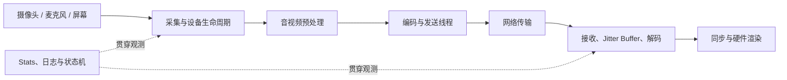

# 客户端工程地图

## 关系速览

## 媒体与生命周期

- [[采集与渲染]]：管理设备、格式、实时回调和呈现。
- [[RTC 音频预处理状态机]]：约束实时音频块、AEC 参考、NS/AGC/VAD 与漂移修正。
- [[视频预处理与硬件渲染管线]]：管理 GPU surface、硬件 codec、fence、队列和实际呈现。
- [[MediaStream Track 与 Transceiver]]：连接业务轨道、发送接收器与协商方向。
- [[Native WebRTC 线程模型]]：约束异步任务、对象寿命和关闭顺序。

## 接收与观测

- [[NetEQ]]：管理音频自适应延迟、PLC 和时域调整。
- [[视频 RTP 接收与组帧状态机]]：管理视频包重排、帧完整性和解码就绪条件。
- [[音视频同步]]：把多种媒体时钟映射到共同播放时间。
- [[WebRTC Stats]]：暴露候选、传输、RTP 和媒体处理统计。

## 建议学习路径

先追踪采集、处理、编码、网络、解码和渲染的线程与 buffer 生命周期；再学习 NetEQ 和音视频同步如何处理播放时间；最后用 WebRTC Stats 把设备、协议与呈现指标串成端到端证据。

## 掌握标准

- 能说明 Track/Transceiver、采集 source、编码器和渲染器的生命周期关系。
- 能避免在实时回调中阻塞，并正确处理跨线程 buffer 所有权和关闭顺序。
- 能区分收包、解码与实际呈现，使用时间序列而非单次快照定位问题。

媒体算法见 [[编解码与媒体处理地图]]，诊断方法见 [[测试与排障地图]]，总览见 [[00-知识地图/RTC 知识总览|RTC 知识总览]]。
