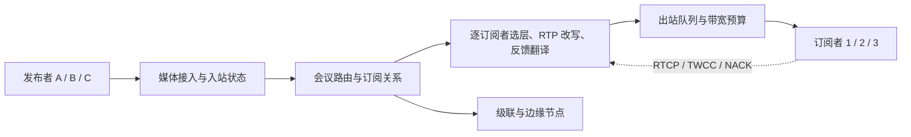

# 服务端架构地图

## 关系速览

## 从拓扑到媒体状态

- [[WebRTC 拓扑选择]]：比较 Mesh、SFU、MCU 与混合拓扑。
- [[媒体服务器]]：理解转发、混流、录制、网关和控制边界。
- [[会议媒体路由与订阅]]：把业务发布订阅映射到流、轨道和反馈路径。

## 典型实现

- [[SFU]]：按订阅选择性转发编码媒体。
- [[SFU RTP 改写与反馈翻译]]：维护逐订阅序号/时间戳映射、RTX、RTCP 和反馈状态。
- [[MCU]]：解码、混合或合成后重新编码。
- [[级联与边缘节点]]：跨地域扩容、就近接入和故障域隔离。

## 建议学习路径

先用拓扑选择比较 Mesh、SFU 和 MCU，再学习媒体服务器的数据面/控制面边界。之后进入发布订阅和反馈路由，最后研究 SFU 选层、MCU 混合以及跨区级联。

## 掌握标准

- 能按订阅矩阵、包速率、带宽、编解码算力和延迟估算容量。
- 能从业务参与者追踪到 transport、publication、subscription 和 RTP 状态。
- 能说明节点过载、故障迁移和跨区路径对用户体验的影响。

终端与服务端如何协作见 [[客户端工程地图]]，质量控制见 [[网络质量地图]]，总览见 [[00-知识地图/RTC 知识总览|RTC 知识总览]]。
