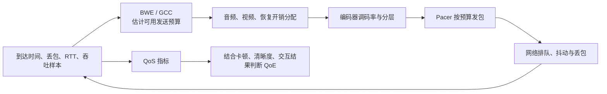

# 网络质量地图

## 关系速览

## 发送侧控制闭环

- [[带宽估计]]：从反馈和探测推断当前可发送容量。
- [[TWCC]]：为逐包到达和时序分析提供传输反馈。
- [[延迟趋势与过载检测]]：识别排队增长及过载状态。
- [[GCC]]：组合探测、延迟/丢包估计和码率控制。
- [[GCC 探测与码率控制状态机]]：追踪 probing、确认吞吐、ALR 和增减速状态转换。
- [[Pacing]]：按目标速率、优先级和探测计划平滑发包。
- [[带宽分配]]：在音频、视频层、重传、FEC 和 padding 间分配预算。

## 策略与结果

- [[拥塞控制]]：解释整个反馈控制问题及稳定性取舍。
- [[弱网对抗]]：组合码率调整、恢复、缓冲和降级策略。
- [[QoS 与 QoE]]：把传输和媒体指标映射到用户体验。

## 建议学习路径

先把拥塞控制理解为反馈闭环，再依次学习 TWCC 观测、延迟趋势、带宽估计和 GCC 控制。随后看 pacing 如何执行发送节奏、带宽分配如何在媒体与恢复间分预算，最后用弱网对抗和 QoE 检查策略是否真正改善体验。

## 掌握标准

- 能区分网络容量估计、编码目标码率、pacing 速率和线上实际负载。
- 能解释延迟型拥塞信号、丢包信号和探测的不同作用与误判风险。
- 能从弱网注入到恢复阶段评估降码率、选层、重传和缓冲是否稳定。

接收恢复见 [[媒体传输地图]]，实验验证见 [[测试与排障地图]]，总览见 [[00-知识地图/RTC 知识总览|RTC 知识总览]]。
