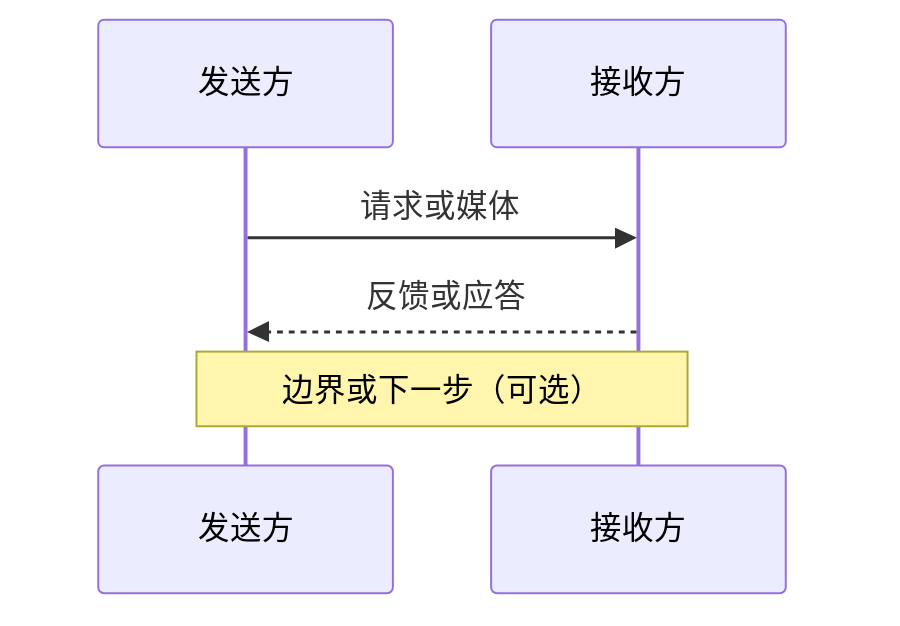

---
aliases:
  - RTC 时序图画法
  - sequenceDiagram 约定
tags:
  - rtc/moc
  - rtc/learning
type: learning-guide
status: growing
---

# 时序图画法约定

[[RTC 知识总览|返回阅读首页]] · [[笔记可读性改造规范]] · [[AGENTS]]

本文约定：用 **Mermaid `sequenceDiagram`** 画「左—右对打」通信过程，让第一次阅读能看见谁先发什么、对端回什么。与 [[笔记可读性改造规范]] 配套；冲突时以 AGENTS 的导航/准确性为准。

## 1. 何时画、何时不画

**适合画（能回答「谁先发什么、对端回什么、中间谁经手」）**

- 信令协商：Offer / Answer、候选 Trickle
- 建连：ICE Binding、TURN allocation、DTLS 握手
- 媒体对打：RTP 去、RTCP / NACK / PLI 回
- 恢复：NACK → RTX；关键帧请求 → 关键帧
- 多人：发布端 → SFU → 订阅端

**不适合硬画左右时序**

- 单端流水线（采集 → 编码 → 打包）：用步骤列表或 `flowchart`
- 纯定义 / 字段表（PCM、色度抽样）
- 算法内部状态（GCC 探测细节）：用状态机或框线图

## 2. 版式约定（强制）

1. **左右角色**：左侧 = 本次交互的主动端（通常「发送方 / 发起方」）；右侧 = 对端（「接收方 / 应答方」）。需要信令、TURN、SFU 时，**中间加参与者**，不要把中间人画成左右之一。
2. **一张图一条主线**：不要把协商 + ICE + 媒体全塞进一张；拆图或 `Note` 点到为止。
3. **箭头语义**
   - 实线 `->>`：媒体、请求、Offer、RTP、RTX
   - 虚线 `-->>`：反馈、应答、RTCP、NACK、可选路径
   - 叉 `-->>` / `--x`（若主题支持）：拒绝、过期、走不通（慎用，Obsidian 渲染以实机为准）
4. **图前必有一句「图在说什么」**（粗体或引用），图后可补一句边界（示意 ≠ 保证）。
5. **放在初读区**：`先记住这三句` 之后、`初读到此为止` 之前；工程细节仍进折叠后。
6. **参与者命名用中文短名**：`发送方` / `接收方` / `信令` / `SFU` / `TURN`；少用裸字母 A/B（样板里若保留 A/B，须在标签写全称）。

### 最小模板

````markdown
**图在说什么：** （一句话）


````

## 3. 文风与准确性

- 图上文字用业务语言，协议名点到即可；字段细节留给正文表格。
- 时间关系只表达**因果顺序**，不要在图上写死「一定 20 ms」这类保证值；定量放正文并标「示意」。
- 加密媒体仍画「RTP / RTCP」逻辑方向即可；不必每张都画 SRTP 壳，除非本篇主题就是加密。
- 与现有 `flowchart` 并存时：时序图讲「对打」，流程图讲「单端变形」。


## 3.5 何时用 flowchart / stateDiagram（不是时序图）

左右 `sequenceDiagram` 适合**双方对打**。下列情况改用结构/状态图，并同样在图前写「图在说什么」：

| 场景 | 推荐 | 说明 |
| --- | --- | --- |
| 单端状态机 | `stateDiagram-v2` | ICE/GCC/FFmpeg send-receive、码率 Hold/Increase/Decrease |
| 处理管线 | `flowchart TB/LR` | 收包组帧、音频预处理链、诊断里程碑 |
| 对象/线程结构 | `flowchart` | NAT 映射 vs 过滤、Native 序列归属 |

不要把状态机「画成左右两人对话」；那是时序图的用法。

## 4. 样板（按主题对照）

| 样板 | 笔记 | 图在讲什么 |
| --- | --- | --- |
| 协商 | [[Offer Answer]] | 发起方 ↔ 信令 ↔ 应答方的 Offer/Answer |
| 会话总览 | [[WebRTC 会话生命周期]] | 协商 → ICE → DTLS → 媒体 → 挂断 |
| 媒体对打 | [[RTP]] | 发送方 RTP 去、接收方 RTCP 回 |
| 丢包恢复 | [[NACK]] | 缺口 → NACK →（可选）RTX |
| 关键帧刷新 | [[PLI 与 FIR]] | PLI/FIR 去、关键帧回 |
| 找路总览 | [[ICE]] | 交换候选 → Binding 验路 → selected pair |
| 验路提名 | [[ICE 连通性检查与选路]] | Binding + 提名（Succeeded ≠ 已选用） |
| 反射地址 | [[STUN]] | Binding 问公网映射（不中继媒体） |
| 中继 | [[TURN]] | Allocate → 许可 → 经 TURN 转发 |
| 握手 | [[DTLS]] | ClientHello…Finished → 导出 SRTP 密钥 |
| 媒体保护 | [[SRTP]] | protect → 传输 → verify/解密 |
| 多人转发 | [[SFU]] | 发布端 → SFU → 订阅端 + 反馈回环 |
| 订阅路由 | [[会议媒体路由与订阅]] | 意图 → 映射/选层 → 出站与反馈 |
| 服务端合成 | [[MCU]] | 多路解码合成 → 少路新编码输出 |
| 传输反馈 | [[TWCC]] | transport seq 去、Transport Feedback 回 |
| 拥塞闭环 | [[拥塞控制]] / [[GCC]] | 反馈 → 目标速率 → 分配 → Pacer |
| 发送调度 | [[Pacing]] | 突发入队 → 平滑出队 → 反馈回灌 |
| 级联边缘 | [[级联与边缘节点]] | 边缘发布 → 按需跨区 → 远端扇出 |
| 重传封装 | [[RTX]] | NACK → RTX（OSN）/ 不重传 |
| 观测反馈 | [[RTCP]] | RTP 对打 + SR/RR/紧急反馈 |
| 再找路 | [[ICE Restart]] | 新代凭据 → 再交换 → 再验路 |
| 出站改写 | [[SFU RTP 改写与反馈翻译]] | 入站/出站映射 + NACK 翻译 |
| 信令中转 | [[信令服务器]] | 客户端 ↔ 信令 ↔ 客户端 |
| 业务消息 | [[实时通信中的信令消息与业务消息]] | 命令 → 权威状态 → 事件（≠ 媒体已停） |
| 传统信令 | [[SIP]] | INVITE/Answer/ACK → 媒体另路 → BYE |
| HTTP 推流入口 | [[WHIP 与 WHEP]] | POST Offer → ICE/DTLS → 媒体；PATCH/DELETE 控面 |
| 地址租约 | [[DHCP]] | DORA 四步拿租约（ACK 后才装配置） |
| TCP 建连 | [[TCP]] | SYN → SYN+ACK → ACK → ESTABLISHED |
| TCP 关闭 | [[TCP]] | FIN/ACK 半关闭 → 对端 FIN → TIME-WAIT |

| TLS 握手 | [[TLS]] | ClientHello…Finished → 加密 Record 传应用数据 |
| WebSocket | [[WebSocket]] | HTTP Upgrade/101 → 双向帧 |
| RTMP 推拉 | [[RTMP 推流与拉流]] | 握手+connect/publish（拉流 play 对称） |
| HTTP-FLV | [[HTTP-FLV 拉流服务]] | 长 HTTP 响应持续写 FLV Tag |
| DataChannel | [[RTCDataChannel 与 SCTP]] | DCEP 打开 → 可靠/部分可靠消息 |
| 信令驱动 PC | [[信令与 PeerConnection 状态机]] | 信令 Offer/Answer/候选驱动 PC 状态 |
| SDP 交换 | [[SDP]] | createOffer/setLocal → 信令 → setRemote/Answer |
| ICE 候选交换 | [[ICE 候选与候选对]] | gather → trickle → 组成候选对 |
| Track/收发单元 | [[MediaStream Track 与 Transceiver]] | addTrack → 协商 → ontrack；replaceTrack 换源 |
| 报文保护细节 | [[SRTP 与 SRTCP 报文保护]] | protect → 验证/重放窗 → 交付或丢弃 |
| 多层转发 | [[Simulcast]] | 多层推 SFU → 按订阅只转一层 |
| ICE 多轴状态 | [[ICE 状态机]] | gathering / checklist / connection 三套并行 |
| NAT 映射过滤 | [[NAT 映射与过滤行为]] | 映射与过滤分立；失败才 TURN |
| RTCP 调度 | [[RTCP 报文计算与调度状态机]] | 统计 → 周期/紧急反馈抢带宽 |
| 视频组帧 | [[视频 RTP 接收与组帧状态机]] | 包→帧→依赖→截止→解码 |
| FFmpeg 解码环 | [[FFmpeg 解码状态机]] | send/receive + EAGAIN/drain |
| 音频预处理链 | [[RTC 音频预处理状态机]] | AEC→NS→AGC→VAD（+远端参考） |
| GCC 码率态 | [[GCC 探测与码率控制状态机]] | Hold/Increase/Decrease（ALR 例外） |
| Native 序列 | [[Native WebRTC 线程模型]] | signaling/network/media 序列投递 |
| 状态机诊断 | [[WebRTC 状态机诊断]] | 多轴里程碑时间线对齐 |

后续批量加图时，对照上表文风，不要另起一套箭头习惯。

## 5. 单图检查清单

- [ ] 左 / 右（及中间人）角色一眼能认
- [ ] 只有一条主线；多余分支用 `alt` 或拆图
- [ ] 实线 / 虚线符合「媒体·请求」vs「反馈·应答」
- [ ] 图前有「图在说什么」；在初读区、折叠线前
- [ ] 未把示意写成 SLA；导航与双向链接未破坏

## 6. 修订记录

- 2026-09-21：初版。约定 Mermaid 左右对打、样板三篇、与可读性规范的关系。
- 2026-09-21：扩样板 ICE / 连通性检查 / TURN / DTLS / SFU / PLI。
- 2026-09-21：再扩 STUN（初读上提）、会话生命周期、会议路由、MCU、SRTP。
- 2026-09-21：再扩 TWCC、级联与边缘、拥塞控制、GCC、Pacing。
- 2026-09-21：P0 补齐 RTX、RTCP、ICE Restart、SFU RTP 改写、信令服务器、信令与业务消息。
- 2026-09-21：既有时序图补「图在说什么」：SIP、WHIP 与 WHEP、DHCP（WHIP 参与者改中文短名）。
- 2026-09-21：补 TCP 三次握手与四次挥手时序图（工程区）。
- 2026-09-21：P1 补齐 TLS、WebSocket、RTMP、HTTP-FLV、DataChannel、信令↔PC、SDP、ICE 候选交换。
- 2026-09-21：P2 补齐 Track/Transceiver、SRTP 与 SRTCP 报文保护、Simulcast。
- 2026-09-21：状态机/NAT/线程补 flowchart·stateDiagram，并写明与时序图分工。
