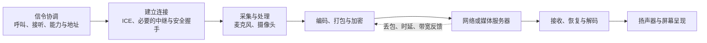

# RTC

> [!tip] 阅读提示
> **前置：** 无；这是第一篇。
> **初读：** 从“一句话说明”读到“学完本页，应该能回答什么”，先理解实时交互的目标。
> **深入：** “解决的问题”之后的字段、原理与工程实现可在学习协议后回看。

## 一句话说明

RTC 是 **Real-Time Communication，中文叫“实时通信”**。它让不同地点的人或设备通过网络，以足够低的延迟交换声音、画面或交互数据，使参与者能够及时回应彼此。日常的语音通话、视频通话和多人视频会议，都是典型的 RTC 应用。

## RTC 到底是什么

你和朋友打视频电话时，你说出一句话，对方很快听到；你挥一下手，对方很快看到；对方也可以马上说话或做动作回应你。让这种持续的远程交流顺畅进行，就是 RTC 要解决的事情。

RTC 指的是这类**实时交互的通信方式，以及实现它所需的一整套技术与系统能力**。这个名字本身不指定某个软件、某家公司或者某一种网络协议。不同产品可以采用不同实现，但都需要处理媒体获取、网络连接、数据传输和接收呈现等问题。

在这个知识库里，RTC 主要指互联网音视频实时通信。声音和画面是最常见的内容，也可以配合文字、协同操作或控制指令。一次会话不要求每个人都同时发送音频和视频：例如会议中有人只听，屏幕共享通常也只有部分成员发送画面。

### “实时”是什么意思

“实时”意味着信息能够在交互需要的时间内到达并被使用。它不要求零延迟，采集、编码、传输、解码和播放都要花时间。

例如，视频会议中对方说完话，你很快就能接话，交流就比较自然；如果每句话都要隔几秒才听到，就容易发生抢话、重复确认和长时间停顿。即使声音最终完整送达，这种体验也不能满足自然通话的要求。

工程上会为具体场景设定延迟目标。普通通话常以百毫秒量级的单向端到端延迟作为设计关注范围，但没有一个适用于所有产品的统一 RTC 分界值；这个量级也不是对所有网络条件的保证。远程控制、语音通话和多人互动的容忍度不同。

### 为什么实时通话比“把文件发过去”复杂

文件可以等下载完整后再打开。通话中的声音和画面却在不断产生，接收端通常需要边接收边播放，不能一直等数据补齐。

假设一小段声音在网络中丢失，系统需要判断：还有没有时间补回来？如果等它会让整段对话越来越滞后，就可能用已有声音估计一个短暂的替代输出，并继续播放。这种处理叫“丢包隐藏”，它维持连续性，但不能还原原始内容。

另一方面，“加入会议”“结束通话”等控制消息，往往需要可靠传递或确认状态。因此，RTC 会根据内容决定可靠性策略，不能把“所有数据都允许丢”当作它的定义。

## 一次视频通话是怎样完成的

以你和朋友各用一部手机通话为例：

1. **协调通话。** 应用先传递呼叫、接听等消息，双方交换支持的音视频格式与连接信息。这类协调消息通常称为“信令”。
2. **建立可用的网络路径。** 双方尝试找到能够互相收发数据的路径；不能直接连通时，可能需要服务器中继。在 WebRTC 通话中，还需要完成相应的安全握手。
3. **取得声音与画面。** 麦克风把声音变成数字音频，摄像头不断产生视频帧。
4. **压缩并发送。** 编码器减少要传输的数据量，再把编码结果打包，按网络能承受的节奏发送。
5. **接收并播放。** 对方收到数据后，处理乱序和短暂等待，把压缩数据解码成声音与图像，再交给扬声器和屏幕呈现。
6. **持续适应变化。** 网络变差时，系统可能降低视频码率、分辨率或帧率，并调整恢复策略，尽量让通话继续进行。

对方说话或开启摄像头时，也有一条反向的媒体路径。上述协调、媒体收发和质量调整在通话期间相互配合，并不是每发送一帧都重新执行一次完整建连流程。

进一步理解每一环的数据形态与作用，见 [[实时媒体链路]]。

## RTC 与直播、点播有什么区别

| 场景 | 典型例子 | 对延迟和播放的主要要求 |
| --- | --- | --- |
| RTC 实时互动 | 语音通话、视频会议、主播连麦 | 参与者需要及时回应，必须控制交互延迟，同时保持声音和画面连续 |
| 以观看为主的直播 | 观看正在进行的赛事或直播节目 | 内容正在产生，但观众通常不参与同一条即时对话；可按业务目标使用更多缓冲来换取稳定播放 |
| 点播 | 播放已经录制的视频 | 内容事先存在，可以预加载、暂停和拖动进度，对实时反馈的要求通常较低 |

这些场景可以出现在同一个产品里。例如互动直播中，主播与连麦者之间使用 RTC，而大量观众通过另一条直播分发链路观看。直播也可以采用低延迟技术，不能只看产品名字或某个协议名就判断它是否具备实时互动能力。

## RTC、WebRTC、协议和 SDK 是什么关系

| 名称 | 它是什么 | 在通话中的作用 |
| --- | --- | --- |
| RTC | 实时通信这一类需求、技术与系统能力 | 回答“怎样让双方及时交流” |
| WebRTC | 支持实时通信的一组标准、浏览器 API 及相关实现生态 | 提供采集、连接、安全媒体传输和数据通道等能力，也可通过原生实现用于客户端 |
| RTP、RTCP、ICE 等协议或机制 | 通信中各个环节遵循的规则 | 分别涉及媒体承载、质量报告与反馈、网络连通等问题 |
| RTC SDK | 将若干 RTC 能力封装成应用可调用接口的软件开发包 | 应用通过它接入采集、通话、入退房、设备控制和统计等功能；具体范围由 SDK 决定 |
| 视频会议或通话应用 | 面向用户的完整产品 | 在 RTC 能力之上增加账号、房间、界面、权限和业务流程 |

WebRTC 是实现 RTC 的重要技术体系。RTC 也可以通过其他方案实现。使用 WebRTC 时，业务信令、房间管理和服务端拓扑仍需由应用或服务方案设计，浏览器提供的 API 不会自动构成一套完整会议产品。

## 学完本页，应该能回答什么

- **RTC 做什么？** 让远端参与者及时交换声音、画面或数据，并能及时回应。
- **为什么需要控制延迟？** 信息过晚到达会破坏接话、协作和操作反馈，即使最终收到也未必有用。
- **RTC 是一个协议吗？** RTC 表示整类实时通信能力，具体实现通常由多个协议、媒体处理模块和应用组件共同组成。
- **视频通话的基本路径是什么？** 协调和建连之后，媒体持续经过采集、编码、传输、解码与播放，并根据运行反馈调整。

以下内容是这一定义的工程展开。初次阅读可以先理解上面的例子，再逐步学习具体机制。

## 解决的问题

在有限网络和计算资源下，让有时效性的媒体或交互数据尽量在仍有用的时间内抵达、恢复并呈现。

## 核心机制

- 发送端把采集数据预处理、编码、封包并按节奏发送；接收端在截止时间前完成恢复、解码、同步和播放。
- 数据面承载媒体，控制面负责建联、协商、反馈和自适应，两者共同决定体验。
- 直播和点播也处理媒体，但其交互时延、缓冲容忍度和恢复策略与 RTC 不同。

## 工程要点

- 任何优化都应同时说明延迟、画质/音质、流畅度、资源和失败边界。
- “接通”不等于“可用”：还要观察首帧、持续播放、音画同步和弱网恢复。

## 工作流程或状态流

1. **采集与生成**：设备或文件源生成带采集时间的音频样本、视频帧或应用消息。
2. **处理与发送**：预处理、编码、封装和发送调度把数据转成适合当前链路的报文。
3. **传输与反馈**：网络、NAT、媒体服务器和接收端共同决定报文能否在截止时间前到达；反馈报告丢包、RTT、抖动和带宽变化。
4. **恢复与呈现**：接收端重排、解码、同步和播放。媒体数据过晚时，可按类型丢弃、执行丢包隐藏或采用其他替代呈现策略，避免无界等待；需要可靠处理的业务消息另有确认与恢复机制。
5. **持续调整与结束**：发送端依据反馈调整码率、帧率、分层和队列；会话关闭时停止源、清理传输和释放资源。

## 关键对象、字段与报文

- **媒体单元**：音频样本以采样率和采样时长计量，视频帧带捕获时间、关键帧/参考帧关系和编码尺寸。
- **RTP/RTCP**：RTP 的 SSRC、序列号、时间戳和 payload type 支撑媒体重排和解码；RTCP 携带接收报告、反馈和发送端时间映射。
- **传输状态**：连接状态、选中候选对、往返时间、发送/接收字节数和队列长度描述当前链路。
- **体验指标**：首帧时间、卡顿时长、渲染帧率、音频断续、端到端延迟和有效码率比单一“在线”状态更有意义。

## 原理细节

RTC 音视频通路的核心约束之一是播放截止时间，即一份媒体数据最晚什么时候还来得及参与播放。媒体重传需要考虑恢复结果是否仍有用；视频关键帧丢失可能影响后续参考帧，音频则常用丢包隐藏或有限恢复维持连续输出。发送端的 pacing（按节奏发包）、拥塞控制和编码器共同决定突发大小，接收端的抖动缓冲又会在连续性与延迟之间作选择。业务控制与可靠数据通道则需要依据各自的语义处理消息，不能直接套用媒体过期丢弃策略。

## 工程实现与取舍

- 先定义场景预算：通话、互动直播、远程控制和文件传输对延迟、可靠性和公平性的权重不同。
- 让媒体面与控制面各自有明确所有权；控制消息丢失要可重试，媒体数据则按截止时间决定是否恢复。
- 采用可观测的实验变量，例如固定分辨率、编码器、网络条件和统计窗口，避免把偶然网络变化误判成优化收益。
- 资源紧张时优先保证音频和关键控制消息，再降低视频层级或发送频率；不要让单个大文件传输压垮媒体队列。

## 常见误区与失败表现

- 把低 RTT 当作低媒体延迟：排队、编码、缓冲和渲染仍可能造成明显滞后。
- 把“已建立连接”当作体验正常：可能只有控制通道成功，媒体未收包或无法解码。
- 只统计平均码率：突发、尾延迟、卡顿和恢复失败会被平均值掩盖。
- 盲目追求不丢包：为等待迟到报文增加的缓冲可能比丢一帧更影响交互。

## 可观测指标与验证

- 端到端：首帧、音频起播、P50/P95/P99 延迟、卡顿率、渲染帧率和音频 PLC/FEC 使用率。
- 网络与队列：RTT、抖动、丢包、重传率、发送队列、接收缓冲和选中路径类型。
- 媒体：编码耗时、解码失败、关键帧间隔、分辨率/帧率切换和渲染时间戳。
- 验证方法：在受控丢包、带宽、延迟和网络切换条件下，对比“接通、稳定播放、恢复、关闭”四个阶段的时间线。

## 示例场景

视频会议中，用户从 Wi-Fi 切到蜂窝网络。信令仍在线，但原 ICE 路径失效；系统应先观察连接和媒体状态，触发路径恢复，短暂降低视频发送预算，并保证音频优先恢复。恢复后再依据带宽估计逐步提升视频层级，而不是立即恢复到切换前的码率。

## 阅读导航

- **上一篇：** [[00-知识地图/专题说明/01 RTC 系统与低延迟目标|01 RTC 系统与低延迟目标]]（回到本专题说明）
- **下一篇：** [[实时媒体链路]]
- **所属专题：** [[00-知识地图/专题说明/01 RTC 系统与低延迟目标|01 RTC 系统与低延迟目标]]
- **回看：** [[RTC 知识总览]] · [[00-知识地图/学习路线/学习进度模板|学习进度]] · [[00-知识地图/学习路线/RTC 工程师学习路线.canvas|阶段路线]]

- **第一次阅读下一站：** [[实时媒体链路]]

> 读完先回所属专题做练习/验收，再点下一篇。内部链接最多再追一层；不影响理解的陌生词先记下。

## 图谱关系

- 主题：[[基础与媒体地图]]
- 展开：[[实时媒体链路]]
- 约束：[[播放截止时间]]、[[QoS 与 QoE]]

## 参考资料

- 《WebRTC 实时通信》第 1 章，`90-参考资料/音视频与 WebRTC 书库/real-time-communication-with-webrtc/translation/01-introduction.md`
- 《Learning WebRTC》第 1 章，`90-参考资料/音视频与 WebRTC 书库/learning-webrtc/translation/01-getting-started-with-webrtc.md`
