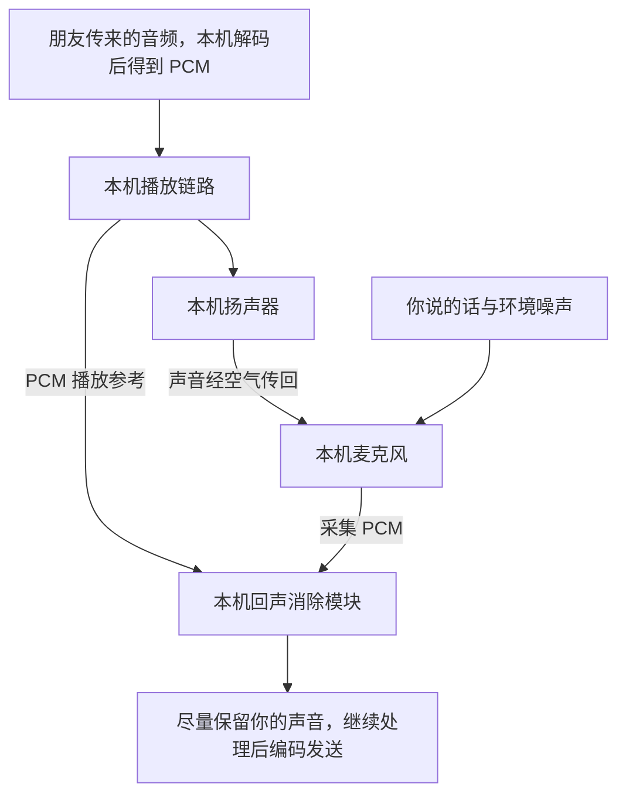

# 实时媒体链路

> [!tip] 阅读提示
> **前置：** [[RTC]]。
> **初读：** 读“一句话说明”、紧接着的数据形态说明与“总体数据通路”，画出发送到播放的路径。
> **深入：** 第二轮沿“一块声音如何到达对方扬声器”逐步读；线程、状态流与协议字段按需查阅。

## 一句话说明

实时媒体链路描述声音或画面如何从发送端麦克风、摄像头出发，经过处理、编码、网络传输、接收缓冲和解码，最终由接收端扬声器或屏幕呈现。理解这条链路，是为了知道每一步拿到什么数据、完成什么工作，以及延迟或故障可能出现在哪里。

## 先纠正“一帧从头传到尾”的说法

“一帧声音”不是十分准确的日常表达。声音在时间上连续，麦克风先产生一串 PCM 采样，程序通常把连续采样切成 10 ms 或 20 ms 的音频块进行处理。编码后，它会变成一个或多个压缩数据包；接收端解码后，又产生新的 PCM 采样块。

视频更适合使用“帧”这个词。摄像头产生一幅像素图像，但编码器会把它变成压缩码流。一个压缩视频帧可能拆成多个 RTP 包，接收端必须重新组装，才能解码出用于显示的像素帧。

因此，不是同一个内存对象原封不动地穿过整个系统。数据形态会不断变化：

```text
音频：空气振动 → 模拟电信号 → PCM 采样 → 音频块 → Opus 数据
      → RTP/SRTP 包 → Opus 数据 → PCM 采样 → 模拟电信号 → 声音

视频：光线 → 传感器数据 → YUV/RGB 像素帧 → H.264 等压缩数据
      → 多个 RTP/SRTP 包 → 压缩视频帧 → YUV/RGB 像素帧 → 屏幕光线
```

真正贯穿链路的是“这是哪一路媒体”“它在媒体时间轴上的位置”“它和前后数据有什么关系”。这些信息通常由 Track、SSRC、RTP 时间戳、序列号和内部追踪标识共同表达。

## 解决的问题

当出现卡顿、黑屏、爆音或延迟升高时，沿数据经过的每一层确定“数据在哪里、由谁拥有、为何没有按时继续”。

## 核心机制

发送侧依次完成采集、预处理、编码、封包和发送调度；网络或媒体服务器负责传递；接收侧完成安全处理、重排与恢复、解码、同步和渲染。信令、质量反馈与拥塞控制不搬运媒体内容，但会改变这条链路的状态和参数。

## 总体数据通路

一场双向通话包含两条方向相反的发送链路。下面只画 A 向 B 发送媒体的方向；B 向 A 还有一条结构相同的链路。

```text
发送端 A
设备采集
  ↓ 原始 PCM / 像素帧
音视频预处理
  ↓ 处理后的 PCM / 像素帧
编码器
  ↓ Opus / H.264 等压缩数据
RTP 打包 + SRTP 加密
  ↓ UDP 数据报
发送调度与网络
  ↓ 直连、TURN 中继或 SFU 转发
接收端 B
收包 + SRTP 解密 + RTP 分流
  ↓ 可识别的媒体包
重排、丢包恢复、抖动缓冲或视频组帧
  ↓ 可解码的压缩音频包 / 视频帧
解码器
  ↓ PCM / 像素帧
音视频同步与播放调度
  ↓ 到达设备播放时刻的数据
扬声器 / 屏幕
```

这条图是媒体数据通路。信令、ICE、RTCP、带宽估计和拥塞控制位于它的控制侧：它们不会代替 RTP 搬运这一帧媒体，但会决定采用哪条网络路径、使用什么编码格式、发多快、丢包后是否恢复以及何时降低画质。

## 一块声音如何到达对方扬声器

下面以 `48 kHz`、单声道、每次处理 `20 ms` 的语音为例。每个音频块包含 `48000 × 0.020 = 960` 个采样。实际 WebRTC 音频处理内部也可能采用 10 ms 块，具体分块必须以实现和接口为准。

### 1. 麦克风和音频驱动采集

人的声音先形成空气振动。麦克风将振动转换为模拟电信号，音频设备的模数转换器按照采样率将它离散化，驱动再把 PCM 样本放入设备缓冲区。

应用通常通过系统音频回调取得一块 PCM。此时数据的关键属性包括采样率、每个样本的格式、声道数、每声道样本数和设备捕获时间。回调晚执行或设备缓冲过大，会在媒体进入 RTC 引擎之前就产生延迟或丢样。

常见执行位置：系统音频线程或 RTC 的音频设备线程。回调中不能做长时间磁盘 IO、等待大锁或进行无界内存分配，否则下一次设备周期可能来不及处理。

### 2. 音频预处理

麦克风采集到的 PCM 里，除了你说话的声音，还可能混有风扇噪声、扬声器漏回来的声音，也可能存在音量太小或忽大忽小的问题。音频预处理通常位于采集与编码之间，目的是改善随后发给对方的声音。

常见功能如下，实际启用哪些功能、按什么顺序处理，需要以具体实现和配置为准。

| 功能 | 做什么 | 通话中的例子 |
| --- | --- | --- |
| 回声消除（AEC） | 尽量去掉本机扬声器播放后又被本机麦克风收进去的声音，同时保留本机用户说话的声音 | 对方说“你好”，你开着免提，避免这句“你好”又传回对方，形成回声 |
| 降噪（NS） | 减弱背景噪声，同时尽量保留语音 | 降低风扇、空调等噪声，让对方更容易听清你说话 |
| 自动增益控制（AGC） | 调节语音电平，使声音尽量保持在合适范围，并配合限幅避免输出过大 | 你离麦克风远近发生变化时，尽量减小传给对方的音量差异；已经削波失真的输入不能靠调小音量还原 |
| 语音活动检测（VAD） | 判断当前音频是否包含语音，输出分类结果或概率 | 为静音期减少编码发送量、发言提示等功能提供依据；VAD 本身不负责降噪，也不等于用户点击了静音 |

**为什么回声消除需要“播放参考”？**

以你和朋友通话为例：朋友的声音经过网络到达你的设备，由你的扬声器播放，再经过空气和房间反射进入你的麦克风。如果原样发送回去，朋友就会听到自己的回声。

此时，你的麦克风可能同时收到“你说的话＋扬声器播放的朋友声音＋环境噪声”。回声消除需要知道本机扬声器在播放什么，才能估计其中哪一部分是回声。



这里的“远端声音”指朋友传来的声音，**播放参考和麦克风输入都在你的设备内部取得**。你的设备既接收并播放朋友的声音，也采集并发送你的声音，因此本机的接收播放链路需要向发送前处理链路提供参考。

播放参考通常从本机播放链路的 PCM 中取得，还需要考虑播放缓冲、设备输出和采集带来的延迟，才能与麦克风里的回声对齐。它不是把两路 PCM 直接相减；扬声器和房间会改变声音的音量、延迟和形态，算法需要估计这些变化。详见 [[回声消除]]。

**格式适配与连续处理。** 如果设备输出不符合处理模块的接口要求，还需要重采样、声道转换或分块。例如，设备一次交付 20 ms 音频，而模块要求每次处理 10 ms，就需要按顺序拆成两块，保持采样和时间连续。格式适配可能位于模块之前或内部。

处理后的音频仍然是 PCM，尚未变成 Opus 等压缩数据；部分模块还会输出语音概率、建议增益等辅助信息。降噪需要持续估计噪声，AGC 需要跟踪近期电平，AEC 需要跟踪回声路径，因此不能把每一块都当作互不相关的新声音。随意跳过、重复或打乱音频块，可能造成爆音、音量跳变或回声消除效果下降；设备切换和中断恢复应按接口约定更新状态。

**执行位置与延迟。** 音频预处理可能运行在专用处理线程、编码线程，或由音频回调驱动的实时任务中。等待凑齐音频块、算法等待后续采样、重采样缓存以及线程排队，都可能增加延迟。例如，设备每 10 ms 交付一块音频时，即使平均处理只需 2 ms，某次等锁阻塞 50 ms 仍可能造成积压。工程上要关注处理耗时、队列长度和阻塞操作。进一步阅读 [[RTC 音频预处理状态机]]。

### 3. 音频编码

音频编码器把 PCM 压缩为适合网络传输的码流。例如 Opus 编码器可以把一个 20 ms 音频块压缩为一个 Opus packet。这里的 `packet` 是编解码器输出单元，还不是 IP 网络包。

编码器使用码率、帧长、声道和复杂度等参数。帧长越大，单包协议开销比例通常越低，但必须先等待更多采样，算法和丢包影响范围也会变化。编码输出应保留对应的媒体时长和时间轴位置。

常见执行位置：音频编码线程。延迟来源包括凑齐编码帧、编码耗时和等待编码线程。

### 4. RTP 打包、加密和发送

编码器产生的 Opus 数据，还需要经过媒体打包、安全保护和网络分层处理，才能真正离开本机。

**先处理媒体身份、安全与发送节奏。** RTP 打包器把 Opus 数据放进 RTP payload，并添加 RTP 头。序列号帮助接收端发现丢包与排序；时间戳表示音频在媒体时间轴上的位置；SSRC 标识 RTP 源；Payload Type 指示如何解释负载，其含义来自会话协商。SRTP 对媒体提供加密、认证与抗重放等保护，通常不会把所有 RTP 头字段都隐藏。发送调度器按 pacing 和带宽预算安排发包；保护与排队的具体先后取决于实现，但媒体进入不可信网络前必须完成相应保护。

**再交给操作系统、驱动和网卡。** 以常见的 SRTP over UDP 为例：

| 层次    | 负责什么                             | 本次发送用到的标识                    |
| ----- | -------------------------------- | ---------------------------- |
| UDP   | 承载应用数据报，让接收主机按地址、端口等信息分流到 Socket | 源端口、目的端口                     |
| IP    | 给数据报添加网络地址，通过路由逐跳接近目的地           | 源 IP、目的 IP                   |
| 数据链路层 | 按当前链路的规则封装并交付帧                   | 以太网、Wi-Fi 等使用的 MAC 地址与相应链路字段 |
| 物理层   | 将比特编码为电、光或无线信号，在介质上传播            | 网线、光纤、无线信道及对应物理制式            |

应用通过 Socket 接口提交数据，内核根据路由选择出口与下一跳；在以太网等链路上，还需要通过 ARP（IPv4）或 NDP（IPv6）取得下一跳的链路层地址。驱动和网卡接着完成发送队列、帧处理与物理发送等工作。普通 WebRTC 应用通常不需要自己填写 IP 头或 MAC 头。

例如，向外网朋友发送音频时，**IP 目的地址可以是朋友的公网候选地址，本地以太网目的 MAC 却通常是你家网关的 MAC**。电脑先把帧交给网关，再由网关继续转发；它不需要提前知道朋友网卡的 MAC。

ICE 选择可用的候选通信路径，例如直连或 TURN 中继；内核和沿途路由器仍各自决定下一跳。若使用 TURN，客户端发往的是 TURN 服务器，还会有相应 TURN 封装；客户端经 TURN/TCP 或 TURN/TLS 连接时，这一段外层传输也不是 UDP。不能把一种常见路径当作所有部署的固定协议栈。

常见应用执行位置是网络线程或发送调度线程，下层还有内核、驱动与网卡参与。延迟可能来自 pacing 队列、Socket/网卡队列、邻居解析、系统调度和无线介质等待。`send` 成功通常只代表本机接受了数据，尚不能证明对方已经收到。

各层字段、封装字节与完整地址示例见 [[从 RTP 到网卡、路由器与物理链路]]、[[UDP IP Socket 与 MTU]]。

### 5. 网络、TURN 或 SFU 传递

**“直连”仍然可能经过很多硬件。** 一条家庭宽带路径可能是：

```text
你的终端网卡
  → 交换机或 Wi-Fi 接入点 AP
  → 家庭网关（可能同时承担路由、NAT、防火墙等功能）
  → 光猫与运营商接入设备
  → 运营商汇聚、骨干及互联网络
  → 对方接入网、网关、交换机或 AP
  → 对方终端网卡
```

这些角色可能集成在同一台设备中，实际顺序和数量取决于接入方式；手机蜂窝网络还涉及基站和移动核心网。“双方直连”主要表示媒体不经 TURN/SFU 等媒体中继或转发服务，不表示两台终端之间只有一根线。

**交换机与路由器分别处理不同层。** 同一 VLAN 内的普通二层交换机按目的 MAC 转发以太网帧，通常不改端点 MAC。路由器则查 IP 转发表、选择下一跳、递减 TTL/Hop Limit，并为出口链路重新封装；若出口也是以太网，新的帧使用该出口接口和下一跳的 MAC。因此 MAC 服务于局部链路，不会以“你的 MAC → 朋友的 MAC”的形式一路穿过普通 IP 路由网络。

普通 IP 路由转发中，源/目的 IP 通常保持不变；经过 NAT 时，地址或 UDP 端口可能被改写。例如私网源 `192.168.1.10:50000` 可映射成公网源 `198.51.100.10:62000`。这类地址转换与 MAC 的逐链路封装是两件事，NAT/防火墙也不保证任意外部数据都能进入内网。

**TURN 与 SFU 又属于不同角色。** 直连失败或受限网络中，TURN 可作为中继转交媒体数据；多人会议中，SFU 按发布订阅关系接收并发送媒体。这些服务器也经过各自的 IP 路由、链路和物理网络，且 TURN 与 SFU 可以同时出现在一条通话路径中。

网络可能造成时延变化、丢包、乱序和重复。SFU 还可能改变某些转发层面的序列映射或选择不同的 Simulcast/SVC 层，但通常不会像 MCU 那样把所有媒体解码并重新合成。具体行为取决于服务器实现。

链路本身也影响实时性：Wi-Fi 单播通常有确认和有限重试，可能把无线错误变成“晚到的包”；普通以太网不会提供同样的逐帧确认重传。物理信号受距离、干扰和链路制式影响，网络设备还会产生出口排队、拥塞丢弃或策略过滤。因此，UDP 不负责重传，不等于底层链路完全没有重试；带宽很高，也不等于传播和排队延迟很低。

详见 [[从 RTP 到网卡、路由器与物理链路#一次跨家庭网络通话的逐跳例子|逐跳地址变化示例]] 和 [[从 RTP 到网卡、路由器与物理链路#从源到目的地，会经过哪些硬件|硬件职责表]]。

### 6. 接收、解密和 RTP 分流

数据到达接收设备时，先由物理层恢复信号、链路层检查并接收帧，再由网卡、驱动和内核完成 IP/UDP 处理及 Socket 分流。接收侧沿这些层去封装；帧损坏、内核缓冲溢出或应用读取不及时，都可能使媒体数据无法按时交给 RTC 模块。

接收端 Socket 得到 UDP 数据报后，先完成必要的包分类与 SRTP 校验、解密。认证失败的数据不能继续进入媒体处理。RTP 层再根据 SSRC、MID、RID、Payload Type 等信息，把包交给正确的接收流和解码器。

序列号、时间戳和到达时刻会被记录，用于丢失检测、抖动估计和播放调度。这里“收到包”只说明网络数据到达，并不代表已经有可播放的声音。

常见执行位置：网络接收线程。延迟来源包括 Socket 接收积压、解密和分流线程排队。

### 7. 重排、恢复和音频抖动缓冲

网络包可能乱序或晚到。接收端根据序列号重新排序，发现缺口后结合剩余播放时间决定短暂等待、请求重传、使用带内 FEC，还是直接交给解码器做丢包隐藏。

音频抖动缓冲把不均匀的网络到达节奏转换成稳定的设备播放节奏。缓冲太小会频繁来不及播放，太大则增加对话延迟。NetEQ 一类模块还会根据缓冲状态执行加速、扩展或合并输出。

常见执行位置：音频接收或播放线程。延迟主要来自目标抖动缓冲、等待乱序或恢复以及任务排队。

### 8. 解码并交给播放设备

Opus 解码器把收到的压缩数据恢复为 PCM；缺包时也可能生成 PLC 替代声音。输出格式要匹配后续混音和设备播放格式，必要时还会重采样或混音。

播放调度器按照本地播放时钟周期性地向系统音频设备提供样本。数模转换器把 PCM 转成模拟信号，经扬声器再次形成空气振动，对方最终听见声音。

“解码完成”仍不是链路终点。PCM 可能继续等待混音缓冲、系统音频缓冲和硬件播放周期。真正的端到端音频延迟应尽量测到声学输出，而不是只测到解码函数返回。

## 一帧画面如何到达对方屏幕

视频与音频共享会话、网络和安全基础，但视频帧通常更大，存在关键帧和参考帧依赖，显示设备也不像音频设备那样以固定采样块连续拉取数据。

### 1. 摄像头曝光、传感器和 ISP

光线进入摄像头后，传感器在曝光时间内积累信号。图像信号处理器可能执行去马赛克、降噪、白平衡、曝光和颜色转换，系统再向应用提供 YUV、RGB 或硬件纹理形式的视频帧。

帧应携带捕获时间、宽高、像素格式、颜色信息和旋转方向。摄像头内部排队、曝光时间、帧率和驱动缓冲都会产生延迟；应用收到回调的时间不能自动视为真实曝光时间。

常见执行位置：摄像头线程或平台采集回调。硬件 buffer 的所有权和可访问线程必须明确，否则容易发生花屏、绿屏或使用已释放表面。

### 2. 视频预处理和内容适配

原始帧可能先经过旋转、裁剪、缩放、颜色转换、美颜、背景处理或帧率调整。RTC 的内容适配还会依据发送预算降低分辨率或帧率。

处理后仍是像素帧或硬件表面。CPU 和 GPU 之间的复制、格式不兼容、滤镜排队和模型推理都可能增加延迟。所谓零拷贝只有在采集、处理、编码器共享兼容内存和同步机制时才成立。

### 3. 视频编码

视频编码器利用帧内预测和帧间预测压缩像素帧。编码结果可能是关键帧，也可能依赖之前参考帧的预测帧。H.264 输出通常由一个或多个 NAL 单元组成，多个 NAL 单元共同构成该时刻可传输的编码访问单元。

编码器可能因为前瞻、帧重排序、码率控制、硬件队列或等待参考帧而增加延迟。RTC 常采用低延迟配置，并控制 GOP、关键帧峰值和发送队列。编码完成时间不能替代原始捕获时间。

常见执行位置：视频编码线程或硬件编码器回调线程。

### 4. 视频 RTP 分包、加密和发送

压缩视频帧常大于一个网络包可安全承载的大小，因此 RTP 打包器要按照对应负载格式拆分。例如 H.264 的大 NAL 单元可以使用 FU-A 分片，也可以按规则聚合小 NAL 单元。

同一视频帧的多个 RTP 包通常共享一个 RTP 时间戳，但具有连续的序列号；Marker 位可按负载格式帮助标记访问单元边界。随后执行 SRTP 保护、pacing 和 UDP 发送。

关键帧比普通预测帧大，可能突然占用发送预算。若直接形成突发，就可能在本机、路由器或蜂窝网络队列中增加延迟和丢包。

### 5. 网络和媒体服务器

视频包经过直连、TURN 或 SFU 路径。SFU 可以根据订阅端带宽选择某一路 Simulcast 流或 SVC 层。每个接收端的下行条件不同，因此同一发送源的不同订阅者可能收到不同质量层。

传输中丢失一个分片，可能导致整个编码帧无法组装；丢失参考帧还会影响后续预测帧。视频恢复不能只看“丢了几个包”，还要考虑这些包属于哪一帧、是否存在依赖以及恢复能否赶上显示截止。

### 6. 接收、解密、重排和视频组帧

接收端完成 SRTP 校验与解密，再按 SSRC 等标识分流。RTP 接收逻辑依据序列号处理乱序和重复，根据负载格式把分片重新组成 NAL 单元和完整编码帧。

发现缺包时可以发送 NACK 请求 RTX；无法恢复且参考链损坏时，可以通过 PLI 或 FIR 请求新的可解码刷新点。请求关键帧不会立即修复当前帧，它只是促使发送端产生新的恢复入口，还会带来码率峰值。

### 7. 视频解码

只有在负载类型、参数集和参考依赖满足时，编码帧才能交给正确的视频解码器。解码器输出 YUV/RGB 像素帧或硬件表面。

即使网络持续收包，也可能因为缺少 SPS/PPS、关键帧、参考帧或硬件解码资源而没有输出。解码线程积压时，越旧的帧越可能失去显示价值；实时系统通常需要限制队列并丢弃已经过期的工作。

### 8. 音视频同步和屏幕呈现

解码帧进入渲染队列后，系统依据捕获时间、RTP/NTP 映射或内部同步信息，将视频与音频放到共同的播放时间线上。很多通话以音频连续为优先，视频过早时等待，过晚时可能丢帧追赶。

到达显示时刻后，渲染器执行必要的颜色转换和缩放，把画面提交给图形合成器。帧还可能等待垂直同步和屏幕扫描显示。真正看到画面的时刻晚于“解码完成”和“提交纹理”的时刻。

常见延迟来源包括渲染队列、GPU 同步、系统合成器和显示刷新周期。

## 两条辅助闭环怎样影响媒体链路

### 会话与连接闭环

在发送媒体前，双方通常要通过信令交换会话描述，协商编解码能力、媒体方向和安全参数；ICE 再收集和检查候选路径；DTLS 完成身份校验并建立 SRTP 所需密钥。网络切换时，ICE 路径还可能重新选择或重启。

这个闭环回答“媒体应该按什么格式发、从哪条路径发、怎样安全地发”。协商成功、ICE connected 和 DTLS 成功是不同阶段，任一步成功都不能单独证明屏幕已经有画面。

### 质量控制闭环

接收端通过 RTCP 报告、TWCC 反馈和本地统计反映到达、丢失、抖动与解码情况。发送端的带宽估计和拥塞控制根据反馈更新目标速率，编码器调整码率、分辨率或帧率，pacer 再按新的预算发送。

```text
收包与到达时间
  ↓
RTCP / TWCC / 本地统计
  ↓
带宽估计与拥塞控制
  ↓
编码参数、选层和发送节奏
  ↓
新的网络结果与反馈
```

这是持续运行的反馈循环，不是建连完成后只执行一次。

## 每一阶段的数据、线程和延迟

下表是常见划分，不是所有 SDK 的固定线程模型；具体实现可能合并或拆分线程。

| 阶段 | 输入 → 输出 | 常见执行位置 | 典型延迟或故障来源 |
| --- | --- | --- | --- |
| 音频采集 | 空气振动 → PCM | 设备/音频回调线程 | 设备周期、驱动缓冲、回调阻塞 |
| 视频采集 | 光线 → 像素帧/纹理 | 摄像头回调线程 | 曝光、ISP、摄像头队列 |
| 媒体预处理 | 原始 PCM/像素 → 处理后媒体 | 音频处理、视频处理或 GPU 线程 | 分块、滤镜、重采样、GPU 同步 |
| 编码 | 原始媒体 → 压缩帧 | 编码线程/硬件回调 | 帧长、前瞻、码控、硬件队列 |
| RTP/SRTP | 压缩帧 → 安全网络包 | 网络或发送线程 | 分片、加密、pacing 队列 |
| 网络/SFU | 数据报 → 转发数据报 | 内核、网络和服务器 | 排队、丢包、抖动、路由、中继 |
| 收包与恢复 | 网络包 → 可解码媒体单元 | 网络、接收和缓冲线程 | 解密、乱序等待、RTX/FEC、组帧 |
| 解码 | 压缩媒体 → PCM/像素 | 解码线程/硬件回调 | 参考缺失、解码耗时、表面耗尽 |
| 同步与呈现 | 解码媒体 → 声音/屏幕画面 | 音频播放、渲染和系统合成线程 | 抖动缓冲、同步等待、设备缓冲、刷新周期 |

## 怎样沿链路定位问题

排障时，不要从用户现象直接猜某一个协议。应寻找“最后一个确认正常的边界”和“第一个确认异常的边界”。

例如远端黑屏，可以依次问：

1. 摄像头是否持续产生帧，捕获时间是否前进？
2. 视频处理和编码器是否持续收到输入，是否输出编码帧？
3. RTP 包是否进入发送队列并真正发出？关键帧是否形成异常突发？
4. 接收端是否收到对应 SSRC 和 Payload Type 的包？是否通过 SRTP 校验？
5. 分片是否组成完整编码帧？是否缺关键帧、参数集或参考帧？
6. 解码器是否有输出？输出格式和硬件表面是否有效？
7. 渲染器是否收到帧？帧是否因为过期、同步策略或图形错误未呈现？

声音断续也采用相同方法，只是将视频组帧、关键帧和渲染器替换为音频抖动缓冲、Opus 解码/PLC 和音频设备播放。每一步都要有计数、时间戳、队列等待和明确的丢弃原因，才能把网络问题与本地处理问题分开。

## 一个端到端延迟拆解示例

假设一次语音通话测得单向声学延迟约 210 ms，可以先拆成示意预算：

| 阶段 | 示例耗时 |
| --- | ---: |
| 发送端设备采集与分块 | 20 ms |
| 音频处理与编码 | 10 ms |
| 发送排队与网络 | 65 ms |
| 接收重排和抖动缓冲 | 70 ms |
| 解码、播放缓冲和硬件输出 | 35 ms |
| 其他调度与测量误差 | 10 ms |
| 合计 | 210 ms |

这些数字只是演示如何分解，不是 RTC 的标准配置。看到 210 ms 后，不能直接得出“网络太慢”；本例中接收缓冲和设备链路合计占了很大部分。真实排查必须在相同时间基下记录各阶段事件，或用声学/光学回环测量端点，再结合分段 trace 分配延迟。

## 工程要点

- 为每一段记录输入输出格式、时间域、所有权、队列上限和运行线程。
- 端到端测量必须定义起点和终点；只测网络 RTT 不能代表媒体播放延迟。
- 发生卡顿或黑屏时，沿链路逐段确认“是否收到、是否可解、是否赶得上播放”。

## 工作流程或状态流

1. 采集回调产生原始样本，进入音频处理或视频预处理队列。
2. 编码器消耗原始数据，输出压缩帧；封装器为其分配序列关系、时间戳和负载类型。
3. 发送调度器按 pacing 和拥塞预算发出 RTP/RTCP 或其他数据报；安全层可能在此处加密和认证。
4. 接收端完成验签/解密、重排、去重、丢包恢复和抖动缓冲，再把可解码数据交给解码器。
5. 解码帧进入同步和渲染队列。队列积压、过期或停止时，各阶段应通过状态和计数器反馈给上层。

## 关键对象、字段与报文

- 原始音频通常以采样格式、声道数、采样率和捕获时间表示；视频以像素格式、宽高、帧类型和捕获时间表示。
- 编码帧携带关键帧、参考帧、编码耗时和码率信息；它不是 RTP 报文，也可能被拆成多个网络负载。
- RTP 的 SSRC、序列号、时间戳和 payload type 负责接收端关联、排序和解码选择；RTCP 记录传输和接收反馈。
- 每个队列要有容量、当前深度、入队/出队时间和丢弃原因，才能区分网络丢包与本地排队丢弃。

## 原理细节

每一段都可能改变数据的时间语义：采集时间是源时钟，RTP 时间戳是媒体时钟，排队时间是本地单调时钟，呈现时间还受同步策略影响。网络报文到达并不意味着媒体可播放，接收端必须满足依赖、完整性和截止时间。线程切换和队列边界则决定了延迟是否以突发形式累积。

## 工程实现与取舍

- 队列应有明确上限和丢弃策略；实时视频通常丢弃过期帧或非关键帧，音频优先保持连续。
- 编解码器、传输和渲染线程之间通过不可变帧或引用计数传递所有权，避免回调结束后继续使用已释放的缓冲。
- 统一记录 trace/session/SSRC/track 标识，避免只在网络层有日志、在采集和渲染层无法关联。
- 硬件编码/解码可降低 CPU，但会引入设备队列、格式转换和驱动延迟；比较方案时要测全链路而非只测编码耗时。

## 常见误区与失败表现

- 把“收到 RTP”当成“收到可解码帧”：可能缺少关键帧、参考帧或格式协商。
- 把黑屏归因于网络：渲染线程阻塞、颜色格式错误和解码器状态也会产生相同表象。
- 只看某一时刻的队列深度：应查看入队延迟、出队速度和丢弃原因的时间序列。
- 跨线程直接修改共享帧：竞态可能表现为偶发花屏、音频爆音或关闭时崩溃。

## 可观测指标与验证

- 每段记录输入/输出计数、队列深度、等待时间、处理耗时、丢弃数和失败码。
- 传输层关联 packetsSent/Received、丢包、重传和 RTT；媒体层关联解码帧、渲染帧和首帧时间。
- 用单帧 trace 或测试水印串起采集、编码、发送、接收、解码和渲染时间；必要时抓包核对 RTP 序列和时间戳。
- 构造“只收不解、只解不播、限速、丢关键帧、网络切换”等故障注入，验证每一段的告警和恢复边界。

## 示例场景

远端声音断续但抓包显示 RTP 持续到达。检查时间线后发现接收线程被视频解码占满，音频包在共享队列中排队并错过播放截止时间。将音频队列和解码任务隔离、限制视频队列后，网络指标不变而音频断续恢复，说明根因在本地调度而非链路丢包。

## 阅读导航

- **上一篇：** [[RTC]]
- **下一篇：** [[端到端延迟]]
- **所属专题：** [[00-知识地图/专题说明/01 RTC 系统与低延迟目标|01 RTC 系统与低延迟目标]]
- **回看：** [[RTC 知识总览]] · [[00-知识地图/学习路线/学习进度模板|学习进度]] · [[00-知识地图/学习路线/RTC 工程师学习路线.canvas|阶段路线]]

- **第一次阅读下一站：** [[端到端延迟]]

> 读完先回所属专题做练习/验收，再点下一篇。内部链接最多再追一层；不影响理解的陌生词先记下。

## 图谱关系

- 主题：[[基础与媒体地图]]
- 分面：[[数据面与控制面]]
- 约束：[[端到端延迟]]
- 承载：[[RTP]]
- 呈现：[[采集与渲染]]

## 沿主链路继续深入

| 主链路边界 | 字段、算法与实现专题 |
| --- | --- |
| PCM 进入音频编码前 | [[RTC 音频预处理状态机]] |
| 摄像头/GPU 到硬件 codec 和屏幕 | [[视频预处理与硬件渲染管线]] |
| 编码帧进入网络前 | [[Opus RTP 负载格式]]、[[H264 RTP 负载格式]]、[[RTP 头扩展]] |
| RTP 下方的数据报和发送队列 | [[UDP IP Socket 与 MTU]] |
| RTP/RTCP 的机密性、认证和重放保护 | [[SRTP 与 SRTCP 报文保护]] |
| 视频收包到解码器输入 | [[视频 RTP 接收与组帧状态机]] |
| 网络反馈到发送速率 | [[GCC 探测与码率控制状态机]] |
| SFU 入站包到逐订阅出站包 | [[SFU RTP 改写与反馈翻译]] |
| 周期质量报告与即时反馈 | [[RTCP 报文计算与调度状态机]] |
| 冗余封装与视频 FEC 恢复 | [[RED ULPFEC 与 FlexFEC]] |

## 参考资料

- 《WebRTC 实时通信》第 2-5 章，`90-参考资料/音视频与 WebRTC 书库/real-time-communication-with-webrtc/translation/`
- 《WebRTC 权威指南》第 1-5 章，`90-参考资料/音视频与 WebRTC 书库/webrtc-authoritative-guide-zh/content/`
