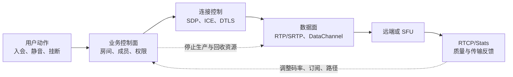

# 数据面与控制面

> [!tip] 阅读提示
> **前置：** [[基础与媒体地图]]；会话骨架见 [[WebRTC 会话生命周期]]。
> **初读：** 先读「一句话说明」「问题边界」「核心机制」，弄清两面各管什么、为何不能混通道。
> **深入：** 工作流程、关联 ID、实现取舍与跨面时间线，在联调或排障时再读。

## 一句话说明

数据面负责搬运音视频或应用数据，控制面负责建立会话、选择路径、反馈质量并调整发送策略；两者相关但不能混为同一条通道。

## 问题边界

- **上游：** 身份认证、房间匹配、能力与业务意图（谁听谁、看谁、是否录制）。
- **下游：** PeerConnection/传输是否连通、RTP/DataChannel 是否按时流动、策略是否收敛。
- **本概念回答：** 如何在不阻塞实时媒体的前提下，可靠完成入会、协商、质量反馈、重连和业务状态收敛。
- **本概念不负责：** SDP 字段语义（见 [[SDP]]）、ICE 选路细节（见 [[ICE]]）、单包是否过期（见 [[播放截止时间]]）。
- **易混淆：**
  - 信令 WebSocket 已连接 ≠ 通话媒体正常。
  - RTCP 反馈 ≠ 业务呼叫信令（入会/挂断/鉴权）。
  - ICE connected ≠ 编码/播放/订阅一定正常。
  - DataChannel 可靠模式 ≠ 可拿来塞满媒体同队列的大文件。

## 核心机制

- **数据面：** RTP/SRTP 与 DataChannel 承载实时内容，强调截止时间、顺序、带宽与安全。
- **业务控制面：** 交换会话状态、SDP、候选与业务命令；WebRTC **不强制**某一种信令协议。
- **媒体控制闭环：** RTCP 跟随媒体会话反馈统计与事件，却不承担业务呼叫状态。

```text
业务信令 (可靠、可重试、幂等)
    -> 协商 / 订阅 / 挂断意图
传输状态 (ICE/DTLS) 独立推进
数据面 (RTP/RTCP/DataChannel) 按时流动
    -> 统计回灌控制策略 (码率/订阅/重连)
```

两面状态可能暂时不一致，必须用版本、幂等和超时收敛，而不是假设消息有序且必达。



图中的箭头表示依赖和反馈，不表示所有控制消息与媒体包共用同一个连接或队列。RTCP 靠近媒体控制闭环，但入会、鉴权和挂断仍属于业务控制问题。

## 工作流程

1. 控制面完成身份认证、房间匹配和能力协商，生成会话与连接标识。
2. 信令交换 Offer/Answer、候选和控制命令；ICE、DTLS 等传输状态独立推进。
3. 数据面开始收发 RTP/RTCP、DataChannel 或服务端转发媒体，并把统计反馈回控制面。
4. 控制面根据丢包、RTT、带宽和业务事件调整编码、订阅、路径或重连策略。
5. 挂断、超时或故障时，先停止数据生产和转发，再撤销控制状态、回收连接和缓存。

## 关键对象与关联

| 平面 | 典型字段 | 用途 |
| --- | --- | --- |
| 业务控制 | session/room/participant、角色、消息版本、幂等键、超时、错误码 | 入会意图与收敛 |
| 连接控制 | PC id、signalingState、ICE generation、selected pair、DTLS | 传输是否可用 |
| 数据面 | SSRC、seq、timestamp、反馈；DataChannel stream/可靠选项 | 媒体与应用数据 |
| 观测关联 | session + connection + track/SSRC + 方向 + 时间戳 + 来源 | 跨面排查 |

日志若只有“用户 ID”没有 connection/track，媒体故障会无法对齐到具体 PC。

## 服务端拆分时的边界

信令、TURN、SFU 拆开后，各自持有的状态与故障转移边界要写清：

- 信令挂了：是否允许已建媒体继续；重连后如何对账订阅。
- SFU 重启：控制面版本如何让客户端重订阅，而非只靠 RTCP。
- TURN 仅影响路径，不替代房间状态。

详见 [[信令服务器]]、[[媒体服务器]]、[[SFU]]；本篇只定两面职责。


## RTCP 落在哪一面

RTCP 属于**媒体传输的控制闭环**：丢包、RTT、TWCC、PLI 等驱动发送与恢复。它：

- 跟随 SSRC/媒体会话，可丢失或延迟；
- 不替代入会、鉴权、挂断、房间角色等业务状态；
- 高频统计应走媒体路径旁路汇总，而不是塞进业务 WebSocket 当唯一真相。

把“媒体反馈”与“业务信令”画在同一时间线时，用不同通道字段着色，避免把 RTCP 间隙误判为“信令断了”。

## 工程要点与取舍

- 控制消息：可靠、可重试、幂等；媒体报文：截止时间与拥塞预算；**避免共享队列互相阻塞**。
- 控制策略加安全阈值与恢复滞回，避免单样本频繁升降码或反复重连。
- 关闭路径：先切断新数据 → 等控制任务收尾 → 释放媒体与连接。
- 信令成功不代表媒体路径已连通；ICE 成功也不代表编码或播放正常。

## 常见误区与故障表现

| 误区 | 表现 |
| --- | --- |
| WebSocket 在就当通话好了 | ICE/DTLS/解码仍可能失败 |
| 把 RTCP 当业务信令 | 反馈可丢，挂断/鉴权不可靠 |
| 只在控制面重试 | 重复建 PC、旧候选导致状态分叉 |
| 大消息共用媒体队列 | 音频断续、视频过期 |
| 挂断只发信令不停车 | 幽灵上行占带宽与槽位 |

## 观测与验证

- **控制面：** 消息延迟、重传、乱序、幂等命中、状态版本、超时和错误码。
- **数据面：** 包速率、丢包、重传、RTT、抖动、码率、队列深度、首帧和卡顿。
- **跨面时间线：** 入会 → Offer → Answer → candidate → ICE connected → DTLS connected → 首包 → 首帧。
- **故障注入：** 信令断线、媒体丢包、服务端重启、客户端重复 BYE；验证两面可独立失败并最终收敛。

## 具体例子

用户点击挂断后，信令消息重试两次才到达，而媒体仍有待发送帧。正确顺序是本地先标记业务关闭、停止采集和发送，再关闭 DataChannel/PeerConnection；服务端收到重复 BYE 时按会话版本幂等处理，不能重新建立或继续转发旧媒体。另一例：信令显示“已订阅屏幕共享”，但 SFU 未绑定新 SSRC——应查控制面订阅版本与数据面 SSRC 是否同一代，而不是先改编码器。

## 阅读导航

- **上一篇：** [[播放截止时间]]
- **下一篇：** [[WebRTC 会话生命周期]]
- **所属专题：** [[00-知识地图/专题说明/01 RTC 系统与低延迟目标|01 RTC 系统与低延迟目标]]
- **回看：** [[RTC 知识总览]] · [[00-知识地图/学习路线/学习进度模板|学习进度]] · [[00-知识地图/学习路线/RTC 工程师学习路线.canvas|阶段路线]]

- **第一次阅读下一站：** [[00-知识地图/专题说明/01 RTC 系统与低延迟目标|01 RTC 系统与低延迟目标]]（三篇+基础补完后进入专题 01，或按总览后续顺序看专题 05）

> 读完先回所属专题做练习/验收，再点下一篇。内部链接最多再追一层；不影响理解的陌生词先记下。

## 图谱关系

- 主题：[[基础与媒体地图]]
- 数据通路：[[实时媒体链路]]
- 业务控制：[[信令服务器]]
- 消息语义：[[实时通信中的信令消息与业务消息]]
- 常用信令承载：[[WebSocket]]
- 媒体反馈：[[RTCP]]
- 会话：[[WebRTC 会话生命周期]]

## 参考资料

- 《WebRTC 权威指南》第 1、4、5 章，`90-参考资料/音视频与 WebRTC 书库/webrtc-authoritative-guide-zh/content/`
- 《WebRTC 实时通信》第 3、4 章，`90-参考资料/音视频与 WebRTC 书库/real-time-communication-with-webrtc/translation/`
