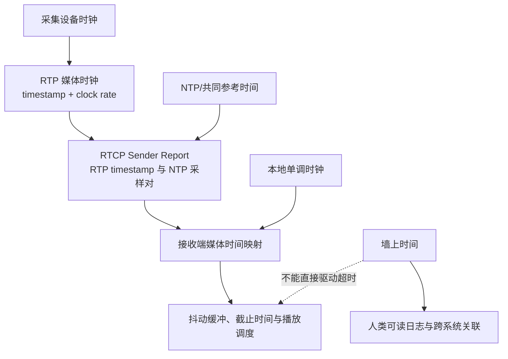

# 时钟与时间戳

> [!tip] 阅读提示
> **前置：** [[基础与媒体地图]]；延迟预算见 [[端到端延迟]]。
> **初读：** 先读「一句话说明」「问题边界」「核心机制」，弄清多种时钟域各自解决什么。
> **深入：** 回绕、偏移/频偏/抖动区分、工程取舍与观测，在同步或排障时再读。

## 一句话说明

RTC 同时使用采集时钟、RTP 媒体时钟、NTP 参考时间、单调时钟和播放时钟；时间戳只有连同时钟域、频率与单位才有意义。

## 问题边界

- **上游：** 采集设备时钟、编码器帧间隔、系统单调/墙上时间、RTCP SR 采样对。
- **下游：** 包排序与间隔、音视频同步、重传/播放截止、延迟与抖动测量。
- **本概念回答：** 如何把不同设备、线程和媒体流的时间信息映射到可比较的时间轴。
- **本概念不负责：** 单包是否还来得及播放（见 [[播放截止时间]]）、音画同步策略细节（见 [[音视频同步]]）、PTS/DTS 容器语义深挖（见 [[PTS DTS 与时间基]]）。
- **易混淆：**
  - RTP timestamp ≠ 毫秒墙上时间；必须带 clock rate。
  - sequence number ≠ 播放时间。
  - 单个 SR ≠ 精确全局时钟。
  - 墙上时间跳变 ≠ 应改变重传截止（应用单调时钟）。

## 核心机制

- RTP 时间戳表示媒体采样进度，允许随机初始值并会回绕，不能直接当作毫秒或墙上时间。
- RTCP Sender Report 提供 RTP 时间戳与 NTP 时间的采样对，用于把不同媒体流映射到共同参考轴。
- 本地超时和耗时应使用单调时钟；日历时间跳变不应改变重传截止或播放调度。

```text
capture clock -> RTP clock (by media rate)
RTP + RTCP SR -> NTP/common reference
local mono clock -> timeouts / queue delay / playout schedule
wall clock -> human logs / cross-system correlation only
```



## 工作流程

1. 采集端以设备时钟给样本打时间；编码和封包把媒体进度转换到约定的 RTP clock rate。
2. 发送端周期性生成 RTCP Sender Report，把 RTP timestamp 与 NTP 时间组成采样对。
3. 接收端用序列号处理顺序，用 RTP timestamp 计算媒体间隔，用 SR 或其他参考估计不同流之间的相对时间。
4. 播放调度将媒体时间映射到本地单调播放时钟，抖动缓冲通过延迟和速率调整吸收网络变化。
5. 长时间运行时持续估计 offset 和 drift；关闭或重连时清空不再适用的映射状态。

## 关键对象与字段

| 对象 | 要点 |
| --- | --- |
| RTP timestamp | 无符号媒体时钟计数；clock rate 定刻度；可随机初值；会回绕 |
| sequence number | 排序与丢包检测；不表示播放时间；须与 timestamp 同存 |
| RTCP SR | NTP 与 RTP 采样对；跨流映射；需多样本估不确定度 |
| 本地单调时间 | capture/receive/decode/render；字段名带单位如 `capture_time_us` |
| 墙上时间 | 仅日志与跨系统关联 |

## 偏移、频偏与抖动

| 现象 | 含义 | 处理方向 |
| --- | --- | --- |
| 偏移 (offset) | 两时钟当前读数差 | 参考点校正 |
| 频偏 (drift) | 单位时间内差值变化 | 估计斜率、微调播放速率 |
| 网络抖动 | 到达间隔变化 | 缓冲与调度，不当频偏硬掰 |

RTP 回绕不能用普通有符号大小比较，应使用序号空间或扩展时间戳，避免长通话后“时间倒退”。

## 常见 clock rate

| 媒体 | 常见 RTP clock rate | 备注 |
| --- | --- | --- |
| 视频 | 90 kHz | 与帧率无必然整数锁定 |
| 音频 | 等于采样率（如 48 kHz） | 视编解码约定 |
| 其他 | 以 SDP/`a=rtpmap` 为准 | 勿写死魔法数 |

把 RTP timestamp“直接 /1000”是高频误区：必须先知道 rate。

## 工程要点与取舍

- 所有超时、重传截止和队列耗时使用单调时钟；墙上时间只用于跨系统关联和人类可读日志。
- 变量名和日志必须带单位或时钟域，例如 `capture_time_us`、`rtp_timestamp_90k`。
- 设计时间映射时保留原始值、估计值和不确定度，避免多次转换后无法追溯误差来源。
- 音视频同步通常选择一个主时钟，通过微调播放速率、丢弃/补偿样本或调整缓冲实现收敛，不能频繁跳变时间轴。
- 音频采样率和视频帧率可能由设备漂移，长通话应观测并校正而不是假设整数关系永远成立。

## 常见误区与故障表现

| 误区 | 表现 |
| --- | --- |
| RTP timestamp /1000 | 时间轴错位，同步完全跑飞 |
| 把 seq 当时间 | 丢包与可变帧时长下推断失效 |
| 用墙上时间做超时 | NTP 校时导致截止提前/延后 |
| 单次 SR 定同步 | 网络延迟与采样误差被忽略 |
| 普通比较处理回绕 | 长通话后排序/间隔突变 |

## 观测与验证

- 记录各时钟域的原始时间、映射 offset、drift、RTP 回绕次数、SR 间隔和同步误差。
- 对比 RTP 发送/接收间隔、jitter、播放时钟速率和音视频 render timestamp，查看偏移是线性还是突发。
- 用长时间音视频测试、改变采样率、模拟系统校时和注入网络抖动验证回绕与漂移处理。
- 抓包检查 RTP timestamp/sequence 与 RTCP SR 是否相互匹配，避免仅依赖应用层日志。
- 成功标准：长通话后 A/V 漂移可解释并可收敛；超时不受手动改时影响。

## 具体例子

视频保持 90 kHz RTP 时钟，音频使用 48 kHz 采样时钟。两路都按各自时间戳排序，再通过 RTCP SR 映射到共同参考；若一小时后音频逐渐领先，优先检查设备采样时钟频偏和播放速率，而不是简单删掉一段音频。测量 E2E 时，发送侧用 `capture_time_us`，接收侧用 `render_time_us`（均为单调域），再单独记录 NTP 仅作跨机对齐辅助。

## 阅读导航

- **上一篇：** [[00-知识地图/专题说明/06 时间系统与音画同步|06 时间系统与音画同步]]（回到本专题说明）
- **下一篇：** [[RTP]]
- **所属专题：** [[00-知识地图/专题说明/06 时间系统与音画同步|06 时间系统与音画同步]]
- **回看：** [[RTC 知识总览]] · [[00-知识地图/学习路线/学习进度模板|学习进度]] · [[00-知识地图/学习路线/RTC 工程师学习路线.canvas|阶段路线]]

- **第一次阅读下一站：** [[数据面与控制面]]

> 读完先回所属专题做练习/验收，再点下一篇。内部链接最多再追一层；不影响理解的陌生词先记下。

## 图谱关系

- 主题：[[基础与媒体地图]]
- 媒体表示：[[PTS DTS 与时间基]]
- 网络映射：[[RTCP]]
- 下游：[[音视频同步]]、[[播放截止时间]]

## 参考资料

- 《WebRTC 权威指南》第 10 章，`90-参考资料/音视频与 WebRTC 书库/webrtc-authoritative-guide-zh/content/10-protocols.md`
- 《FFmpeg API 与解码流程参考》第 5 单元，`90-参考资料/音视频与 WebRTC 书库/ffmpeg-api-decoding-reference-zh/content/05-avpacket-and-time.md`
