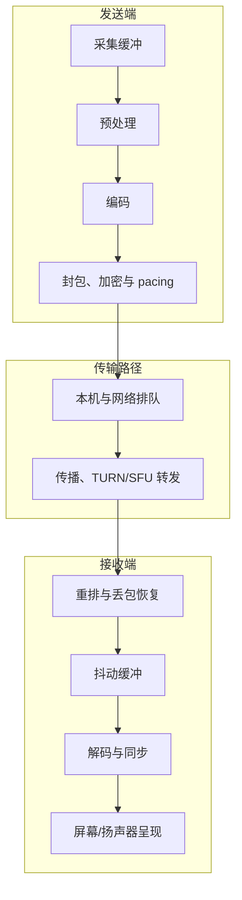

# 端到端延迟

> [!tip] 阅读提示
> **前置：** [[RTC]]、[[实时媒体链路]]；时间单位与时钟域见 [[时钟与时间戳]]。
> **初读：** 先读“一句话说明”“预算拆解”“单向延迟 ≠ RTT”和“具体例子”，标出三个主要加延迟的位置。
> **深入：** 测量关联、抖动缓冲与发送排队的耦合、P99 长尾归因在排障或定 SLA 时再读。

## 一句话说明

端到端延迟是**某一媒体单元**从发送端产生到接收端呈现之间的总耗时。它应拆成采集、预处理、编解码、发送排队、网络、服务端转发、接收缓冲、解码、同步和渲染等预算，而不是一个无法解释的黑盒数字。它衡量的是媒体路径上的**单向**体验时延，不等于往返时延（RTT）。

## 问题边界

- **上游问题：** 交互迟钝、对口型差、远端响应“慢半拍”、首帧慢、弱网后长时间“拖尾”。
- **本概念回答：** 总延迟由哪些段叠加？哪一段在恶化？降低某一段会牺牲什么？
- **本概念不负责：** 单包是否还值得重传（见 [[播放截止时间]]）、时钟如何跨域映射（见 [[时钟与时间戳]]）、拥塞控制如何改码率（见 [[GCC]] / [[带宽估计]]）。
- **易混淆：**
  - **RTT** = 往返控制/探测时延，通常不含采集、完整编码链和播放呈现。
  - **网络单向延迟** ⊂ 端到端延迟，只是其中一段。
  - **首帧延迟** ≠ 稳态通话延迟；建连、关键帧、ICE/DTLS 会主导首帧。
  - **应用层“消息延迟”**（信令、数据通道）与媒体端到端延迟要分开记账。

## 解决的问题

找到交互迟钝的真正预算来源，并判断降低某一段延迟是否会以卡顿、画质、回声残余或稳定性为代价。优化平均延迟却放任 P99，通常改善不了用户感知。

## 预算拆解

把“从嘴到耳 / 从镜头到屏”写成可加的分段。数值是数量级示意，**以实测为准**：

```text
E2E ≈
  采集缓冲与回调抖动
+ 预处理（AEC/NS/AGC 等）
+ 编码（含等关键帧 / 看队列）
+ 封包与加密
+ 发送侧 pacing / 排队
+ 网络传播 + 排队（含 TURN/SFU）
+ 接收重排 / 丢包恢复等待
+ 抖动缓冲目标深度
+ 解码
+ A/V 同步等待
+ 渲染提交与显示刷新等待
```

| 分段 | 典型贡献（示意） | 主要受谁推动 | 压低时常见代价 |
| --- | --- | --- | --- |
| 采集缓冲 | 5–40 ms | 回调块长、驱动缓冲 | CPU/调度上升，欠载爆音 |
| 预处理 | 0–30 ms | AEC 尾长、块适配 | 回声/噪声变差 |
| 编码 | 5–80 ms+ | 复杂度、关键帧、看队列 | 画质下降或码率不稳 |
| 发送排队 / Pacing | 0–100 ms+ | 码率>带宽、pacer、应用突发 | 队头阻塞、尾延迟爆炸 |
| 网络单向 | 10–200 ms+ | 路径、基站、跨洋、拥塞 | 无法“调参消除”，只能换路/降载 |
| SFU/TURN | 0–80 ms+ | 转发队列、转码、地理 | 架构与选型问题 |
| 抖动缓冲 | 20–200 ms | 抖动、目标上下界 | 卡顿↑ 或 延迟↑ |
| 解码+渲染 | 5–50 ms | 软解、GPU、VSync | 掉帧、发热 |

音频与视频的主瓶颈往往不同：音频更怕抖动缓冲与采集/播放时钟；视频更怕关键帧等待、组帧和发送侧积压。



这张图表示延迟预算的累加边界，不表示每段都有固定耗时。某段出现积压还可能向后放大，例如发送突发先增加网络到达抖动，再推动接收端提高抖动缓冲目标。

## 核心机制

总延迟不是固定常量：

1. **网络抖动**变大 → 接收端提高 [[抖动缓冲]] 目标 → 稳态 E2E 上升，换连续性。
2. **发送积压**（编码太慢、pacer 泄不出、应用突发）→ 排队延迟主导，即使 RTT 看起来还行。
3. **关键帧 / RTX / FEC / 探测 padding** → 短时码率峰值 → 队列与缓冲被推高 → **尾延迟**恶化。
4. **弱网恢复策略**（猛降码率、拉大缓冲、等关键帧）会在“能看”和“能互动”之间切换工作点。

系统始终在**连续性**与**交互性**之间动态调整；端到端延迟是该权衡的外显指标之一。

## 单向延迟 ≠ RTT

| 量 | 大致覆盖 | 常见来源 | 能否代替 E2E |
| --- | --- | --- | --- |
| RTT | 往返网络 + 部分栈处理 | STUN、RTCP、TWCC 往返 | **否** |
| 单向网络延迟 | 发送网卡→接收网卡 | OWAMP、路径估计、一侧打点 | 只是一段 |
| 媒体 E2E | 产生→呈现 | 同源水印 / 分段拼时间线 | 目标量本身 |

路径不对称时，`RTT/2` 会系统性偏估单向网络延迟。更重要的是：即使用完美的单向网络延迟，仍漏掉采集、编码、缓冲和显示。**用 RTT 当通话延迟 KPI，会把本地队列问题误判成“网络还行”。**

## 测量与关联：怎样才算数

端到端时间戳只有在**时钟同步或同源打点**成立时才能直接相减。推荐层次：

1. **实验室同源：** 同一主机环回、或光声耦合 + 屏幕/扬声器探针，得到真 E2E。
2. **分段单调时钟：** 在同一端内用单调时钟量处理/排队耗时（不依赖 NTP）。
3. **跨端关联：** RTP timestamp + sequence + SSRC + RTCP SR / abs-send-time 等，估计网络段；再与本地分段相加得到**估计 E2E**（带误差条）。
4. **测试水印：** 音视频嵌入可识别图案/蜂鸣，接收端视觉/能量检测，适合回归与竞品对比。

### 工作流程

1. 在发送端定义**起点**：摄像头曝光、采集回调入队、或“用户点击→应发出的那一帧”。不同起点不可混谈。
2. 记录预处理、编码、封包、发送排队、实际 socket 写出时间；**区分处理耗时与等待耗时**。
3. 在接收端记录到包、解密/重排、进入抖动缓冲、取出解码、同步、渲染提交、**屏幕/扬声器呈现**（若可得）。
4. 按同一媒体单元（帧/音频块）或可关联水印拼接时间线，分别算分段与总和。
5. 在网络与负载变化后，调码率、队列、抖动缓冲或渲染策略，**重测尾延迟**，不要只看均值回落。

### 关键对象与字段

- **采集/渲染时间戳：** 优先单调时钟；跨设备保存同步误差与单位（见 [[时钟与时间戳]]）。
- **RTP sequence、timestamp、SSRC、RTCP SR、transport-cc / abs-send-time：** 关联发送与接收。
- **分段指标：** 采集、编码、send queue、one-way network、jitter buffer current/target、decode、render wait。
- **窗口统计：** 样本数、P50/P95/P99、max、丢失样本比例；长尾必须单独报。

## 与抖动缓冲、截止时间的关系

- [[抖动缓冲]] 的 **target** 几乎是接收侧可控延迟的主旋钮：抬高 target → E2E↑、欠载↓。
- [[播放截止时间]] 决定迟到包还值不值得等：缓冲越大，截止越“宽松”，E2E 越高。
- 因此“把延迟打下去”若只砍 buffer 而不改善抖动/发送平滑，结果往往是卡顿换指标。

```text
抖动 ↑ → buffer target ↑ → E2E ↑ → 连续性暂时保住
发送突发 ↑ → 发送排队 ↑ → 到达抖动 ↑ → 又推动 buffer ↑
```

这是延迟自我强化的常见环；打断它通常要同时动 **pacing/码率** 与 **缓冲上界**。

## 首帧延迟与稳态延迟

| 类型 | 额外包含 | 优化重点 |
| --- | --- | --- |
| 首帧 / 首声 | ICE/DTLS、权限、首个关键帧、解码器冷启动、播放设备打开 | 并行化建连、更快关键帧、预热 |
| 稳态 E2E | 正常采集→呈现环 | 缓冲目标、排队、路径、编码时延 |
| 交互响应 | 从用户动作到远端可感知反馈（可能跨媒体+信令） | 定义清楚起点终点，勿与媒体 E2E 混用 |

产品文档若只写“延迟 < 200 ms”却不声明是首帧还是稳态、音频还是视频、P50 还是 P99，基本无法验收。

## 场景目标（数量级，非承诺）

| 场景 | 常见关注点 | 备注 |
| --- | --- | --- |
| 双人通话 | 音频 E2E 紧、回声与断续 | 视频可略松于音频 |
| 互动直播 / 连麦 | 主播→观众可放宽；连麦回传要紧 | 方向性不对称 |
| 在线白板 / 远程操控 | 交互响应与媒体延迟可能分离计量 | 控制通道单独 SLA |
| 会议（多向 SFU） | SFU 排队与转发地理 | 选最近 POPs、避免无谓转码 |

极低延迟通常要求更激进的丢弃、降质或更短缓冲；**没有免费的超低延迟**。

## 工程实现与取舍

- 用 trace ID、SSRC、track ID 或测试水印关联同一媒体单元；禁止拿“任意发送计数与接收计数”相减。
- **先分离**网络延迟 vs 本地队列/处理延迟，再决定调缓冲、换编码器还是修线程调度。
- 对通话与互动直播设不同目标函数；同一套默认 buffer 很难两头讨好。
- 生产监控同时保留：**估计 E2E**、各分段、设备能力标签（机型、耳机路由、是否硬解）。
- 发送侧关注 pacer 队列深度与“应用受限”；接收侧关注 buffer current 相对 target 的偏差与欠载次数。
- CPU 过载会伪装成网络问题：编码/解码耗时进 P99，但 RTT 漂亮。

## 长尾（P99）常见归因清单

按日志时间线核对，而不是先改码率：

1. 网络切换 / Wi-Fi↔蜂窝 / TURN 重绑  
2. 关键帧爆发或层层等待（尤其 simulcast/SVC 下错层）  
3. 发送 pacer 长时间背压  
4. 接收 buffer 目标被顶到上限后迟迟不回落  
5. 主线程/渲染线程卡顿、相机回调饿死  
6. 设备路由切换触发音频预处理重配（见 [[RTC 音频预处理状态机]]）  
7. SFU 过载或转码队列  
8. 统计窗口内样本过少，P99 被单次事件主导  

## 常见误区与失败表现

- **用 RTT 代替单向媒体延迟：** 路径不对称，且不含采集/编码/播放。  
- **只测“发送到收到”：** 收到后还要排队、解码、等 VSync/扬声器周期。  
- **只优化平均延迟：** 用户骂的是卡顿和拖尾，对应 P95/P99。  
- **把缓冲设为零：** 短时抖动变成频繁卡顿与音频断续。  
- **跨设备直接减墙上时间：** NTP 未同步时误差可大于被测延迟本身。  
- **音频视频共用一个 E2E 数字：** 二者缓冲与恢复策略不同，应分轨报告。  
- **优化了编码耗时却加大了发送队列：** 局部分数变好看，E2E 不变或更差。

## 可观测指标与验证

**端到端：** 首帧/首声、稳态 E2E、交互响应、P50/P95/P99、卡顿时长、恢复时间。

**分段：** 编码/解码耗时、发送/接收队列、jitter buffer target/current、帧间隔、render wait、SFU ingress→egress。

**关联网络与负载：** RTT、单向延迟估计、丢包、重传、selected candidate pair、码率、CPU/GPU、音频回调超时。

**验证方法：**

1. 受控网络仿真（延迟、抖动、带宽阶跃、丢包突发）  
2. 真机 + 耳机/扬声器路由切换  
3. 关键帧压力（层切换、分辨率阶跃）  
4. 弱网恢复后观察 buffer 是否“粘”在高位  
5. 报告条件、窗口、样本数、时钟同步方式和误差上界  

## 具体例子

**例 1：均值好看、体验很拖。**  
互动课堂音频平均 E2E 180 ms，P99 达 1.2 s。时间线显示：多数样本正常；少数 Wi-Fi 抖动把 jitter buffer target 从 40 ms 推到 200 ms，又叠上等关键帧。分开优化缓冲上限、关键帧间隔与切换恢复后，均值几乎不动，投诉下降。

**例 2：RTT 30 ms，通话仍“慢”。**  
发送端编码线程偶发 70 ms 阻塞，pacer 队列堆到 150 ms；接收端看起来“网络抖动大”并抬高缓冲。根因在发送侧线程，不在 ISP。分段打点后对症修调度。

**例 3：环回校准。**  
同机扬声器→麦克风光学/声学环回测得 95 ms；关掉 AEC 参考路径对比后，确认约 25 ms 来自播放设备缓冲。没有这条基线，跨版本对比会把设备差异当成算法回退。

**例 4：SFU 地理。**  
两端都在华东，媒体却经海外 POP 转发，单向网络段多 80–120 ms。候选与区域固定后，E2E 明显下降，而客户端 buffer 参数未改。

## 阅读导航

- **上一篇：** [[实时媒体链路]]
- **下一篇：** [[播放截止时间]]
- **所属专题：** [[00-知识地图/专题说明/01 RTC 系统与低延迟目标|01 RTC 系统与低延迟目标]]
- **回看：** [[RTC 知识总览]] · [[00-知识地图/学习路线/学习进度模板|学习进度]] · [[00-知识地图/学习路线/RTC 工程师学习路线.canvas|阶段路线]]

- **第一次阅读下一站：** [[播放截止时间]]

> 读完先回所属专题做练习/验收，再点下一篇。内部链接最多再追一层；不影响理解的陌生词先记下。

## 图谱关系

- 主题：[[基础与媒体地图]]
- 链路全景：[[实时媒体链路]]
- 截止约束：[[播放截止时间]]
- 缓冲贡献：[[抖动缓冲]]
- 发送贡献：[[Pacing]]
- 时间基础：[[时钟与时间戳]]
- 体验结果：[[QoS 与 QoE]]
- 拥塞耦合：[[GCC]]、[[带宽估计]]
- 观测：[[WebRTC Stats]]

## 参考资料

- 《WebRTC 的拥塞控制和带宽策略》，`90-参考资料/音视频与 WebRTC 书库/livevideostack-webrtc-congestion-control-zh/content/00-webrtc-congestion-control.md`
- 《WebRTC 中文专题参考资料》NetEQ 第 2-4 章，`90-参考资料/音视频与 WebRTC 书库/webrtc-reference-zh/content/`
- 同库 [[播放截止时间]]、[[抖动缓冲]]、[[实时媒体链路]]：与本篇分段预算对照阅读。
