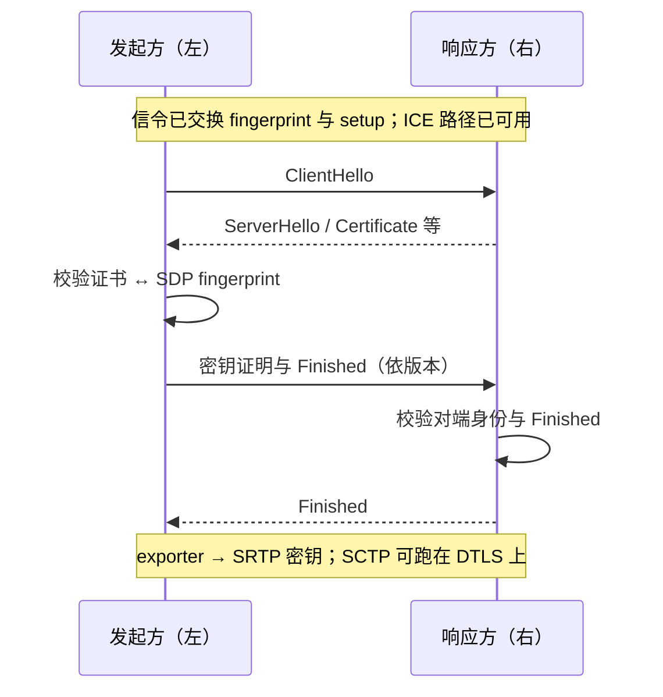

# DTLS

> [!tip] 阅读提示
> **前置：** [[ICE]]、[[SDP]]。[[TLS]] 可后读。
> **初读：** 读到「初读到此为止」就停。弄清：ICE 选好路之后，DTLS 负责握手认证并导出 SRTP 密钥。
> **深入：** fingerprint、套件失败分类、与 ICE restart 关系，联调时再读。

## 一句话说明

DTLS 是面向数据报传输的 [[TLS]] 变体，为 WebRTC 端点提供握手认证、机密性、完整性和密钥协商。它运行在 ICE 选出的路径之上，并把派生密钥交给 SRTP 或 SCTP 使用；它不是信令通道本身。

## 先记住这三句

1. DTLS ≈ 跑在 UDP/ICE 路径上的 TLS：做身份校验和密钥协商。
2. 顺序通常是：信令交换 fingerprint → ICE 通路可用 → DTLS 握手 → 导出密钥给 SRTP（媒体）或给 SCTP（数据通道）。
3. 握手「看起来成功」还要核对 SDP fingerprint；路径变了不等于每次都要从头重做完整身份协商。

## 核心机制

- SDP 中的 fingerprint 让对端把握手证书绑定到协商描述；`setup` 属性决定客户端/服务端角色。生产实现应校验证书指纹，而不是只看握手“成功”。
- ICE 先提供可达五元组，DTLS 再在其上完成 ClientHello、证书和 Finished 等握手。握手失败时，要区分路径不可达、指纹不匹配、版本/套件不兼容和证书问题。
- DTLS-SRTP 从已认证的 DTLS 会话导出 SRTP/SRTCP 密钥；数据通道使用 SCTP over DTLS，不能把 SCTP 明文暴露在公网。
- ICE restart 通常只更换路径和 ICE 凭据；只要协商的安全身份和角色仍适用，不应把每次路径变化都误判成完整 DTLS 重握手。

**图在说什么：** ICE 选好路之后，左发起方向右响应方做 DTLS 握手；校验 SDP fingerprint 通过后，才导出密钥给 SRTP / 数据通道。

图中消息是理解角色和验证点的主线，不是固定报文模板；顺序随 DTLS 版本、套件、是否双向证书而变。UDP 丢包时 flight 可能重传，不能只按抓包行数判断「握了许多次手」。

## 示例场景

两端 ICE selected pair 已变为 relay，但连接仍没有远端音频。日志显示 DTLS ClientHello 发出后持续超时，TURN 统计也没有返回包。此时先检查 TURN 双向通道和 MTU，而不是重启编码器；路径恢复后 DTLS 完成，SRTP 才开始解密媒体。

---

> [!warning] 初读到此为止
> 上面这些已经够第一次阅读。下面是工程展开与排障细节（字段、指标、状态流），**第二轮或遇到具体问题时再读**；第一次直接点文末「第一次阅读下一站」即可。

## 工程要点

- 记录 DTLS 状态、角色、fingerprint 摘要、握手耗时和失败原因，但不要记录私钥、完整敏感材料或未脱敏候选。
- 抓包看到 DTLS、SRTP 或 SCTP 的加密包，只能说明链路使用了保护；还需核对指纹校验、密钥边界和对端身份来源。
- 证书生成、轮换、线程安全和关闭顺序要有明确所有权。PeerConnection 关闭后停止握手重试和密钥使用。
- 中继、直连和 TCP/TLS 回退都应验证 DTLS 版本和 MTU 行为，避免只在局域网测试。

## 解决的问题

在已经找到可达路径后，确认对端身份并建立供媒体和数据使用的密钥，同时处理 UDP 可能丢包、乱序的握手环境。

## 工作流程或状态流

1. ICE 提供可达的传输路径，双方根据 SDP 的 fingerprint 和 setup 信息确定验证材料与握手角色。
2. DTLS ClientHello/ServerHello 协商版本和密码套件，双方交换证书并完成 Finished 校验。
3. 握手成功后，连接进入已连接状态，DTLS exporter 派生 SRTP/SRTCP 或 SCTP 所需密钥。
4. 媒体和数据开始使用派生密钥；路径切换、重连或关闭时按连接所有权更新或销毁安全状态。
5. 任一阶段失败都要区分重试握手、修复 ICE/信令还是终止会话，不能无限重传握手包。

## 关键对象、字段与报文

- SDP fingerprint、setup 角色、证书、公钥和握手状态是身份验证的关键输入。
- ClientHello、ServerHello、Certificate、CertificateVerify 和 Finished 构成常见握手消息序列；具体版本和套件由实现协商。
- DTLS 连接状态、握手重传计时器、最大报文长度和 exporter 上下文影响后续密钥使用。
- SRTP/SRTCP key、salt、SSRC/序列号状态和 SCTP association 是握手成功后的下游对象，不应与证书对象混为一谈。

## 原理细节

DTLS 继承 TLS 的认证和密钥协商，但面向可能丢失、乱序的 UDP 数据报设计，握手消息需要重传和分片处理。WebRTC 中 DTLS 通常建立在 ICE 选中的五元组上；DTLS 保护的是端点到端点的传输层，信令服务器和 TURN 只在各自职责范围内参与。SRTP 的媒体保护和 SCTP 的数据通道保护共享经过认证的 DTLS 会话，但不等于业务层 E2EE。

## 工程实现与取舍

- 指纹验证应绑定当前会话的远端描述和信任来源，避免只接受任意证书或只判断握手完成。
- 证书轮换要考虑连接复用、重新协商和旧密钥清理；私钥不能写入普通日志或跨会话共享。
- 对握手报文设置合理超时和最大重传次数，记录 MTU/分片相关错误；小 MTU 网络应验证直连和 TURN 路径。
- ICE restart 通常可复用现有 DTLS 身份，但实现仍需以当前 transport 状态为准，不能把复用写成协议保证。

## 常见误区与失败表现

- ICE connected 就认为 DTLS 已完成：常见表现是 selected pair 正常但没有 SRTP 数据或 DataChannel open。
- 只校验证书链不校验 fingerprint：自签名证书在 WebRTC 场景下仍需要与 SDP 身份绑定。
- 抓到 DTLS 包就认为媒体安全配置正确：可能指纹不匹配、密钥导出失败或 SRTP 状态未建立。
- 把 DTLS 失败归因于编码器：应先确认路径可达、握手角色、版本、套件和证书。

## 可观测指标与验证

- 记录 dtlsState、角色、握手开始/完成时间、重传次数、失败告警和协商的版本/套件。
- 关联 ICE selected pair、路径类型、MTU、SRTP/SCTP 启动时间和首个媒体/数据包。
- 抓包检查 ClientHello 到 Finished 的完整性；没有密钥时只验证握手和方向，不宣称能解析媒体明文。
- 用错误 fingerprint、受限 MTU、丢包/乱序、网络切换和证书轮换做故障注入，验证失败分类和清理逻辑。

## 阅读导航

- **上一篇：** [[TLS]]
- **下一篇：** [[SRTP]]
- **所属专题：** [[00-知识地图/专题说明/03 ICE、STUN、TURN 与传输安全|03 ICE、STUN、TURN 与传输安全]]
- **回看：** [[RTC 知识总览]] · [[00-知识地图/学习路线/学习进度模板|学习进度]] · [[00-知识地图/学习路线/RTC 工程师学习路线.canvas|阶段路线]]

- **第一次阅读下一站：** [[SRTP]]

> 读完先回所属专题做练习/验收，再点下一篇。内部链接最多再追一层；不影响理解的陌生词先记下。

## 图谱关系

- 身份输入：[[SDP]]携带 fingerprint 和 setup 协商参数。
- 字节流对照：[[TLS]]说明证书链、密钥派生和可靠字节流上的 Record；DTLS 另外处理数据报丢失、乱序与分片。
- 下层路径：[[ICE 连通性检查与选路]]先验证 DTLS 报文可达。
- 媒体输出：[[SRTP]]使用 DTLS-SRTP 导出的密钥保护 RTP/RTCP。
- 数据输出：[[RTCDataChannel 与 SCTP]]在 DTLS 上建立安全数据通道。
- 所属地图：[[连接与安全地图]]组织 ICE、DTLS 和媒体安全知识。

## 参考资料

- 《WebRTC 权威指南》第 10 章“协议”：`90-参考资料/音视频与 WebRTC 书库/webrtc-authoritative-guide-zh/content/10-protocols.md`
- 《WebRTC 权威指南》第 13 章“安全与隐私”：`90-参考资料/音视频与 WebRTC 书库/webrtc-authoritative-guide-zh/content/13-security-privacy.md`
- 《Learning WebRTC》第 6 章“使用 WebRTC 发送数据”：`90-参考资料/音视频与 WebRTC 书库/learning-webrtc/translation/06-sending-data-with-webrtc.md`
- 《WebRTC Cookbook》第 2 章“安全支持”：`90-参考资料/音视频与 WebRTC 书库/webrtc-cookbook/translation/02-supporting-security.md`
