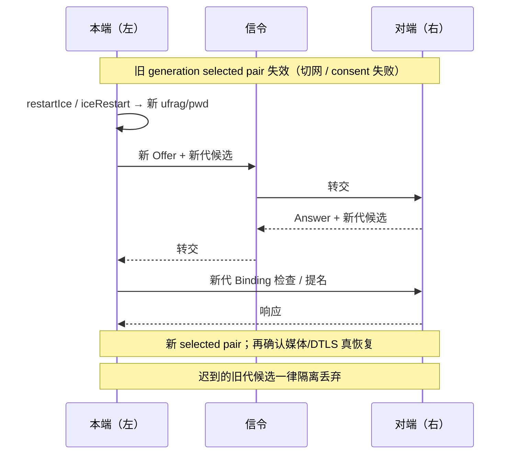
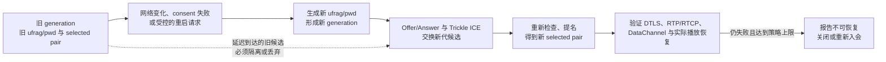

# ICE Restart

> [!tip] 阅读提示
> **前置：** [[ICE]]、[[ICE 状态机]]、[[Offer Answer]]。
> **初读：** 读到「初读到此为止」就停。弄清：Restart = 换新一代 ICE 凭据再找路，不是简单再 ping 一下。
> **深入：** 代次隔离、与 DTLS 关系、失败分类，排障时再读。

## 一句话说明

ICE Restart 是在同一 PeerConnection 会话中建立新的 ICE generation：通过新的 `ice-ufrag` 和 `ice-pwd` 触发重新收集、交换和检查候选，以恢复因网络接口、NAT 映射或路径状态变化而失效的连接。它不是简单重发旧候选，也不是业务层重新创建整个呼叫。

## 先记住这三句

1. ICE Restart = 在同一 PeerConnection 里开**新一代** ICE：新的 `ufrag`/`pwd`，重新收集、交换、检查候选。
2. 常见触发：网络切换、consent 失败、或应用主动 `restartIce()` / `iceRestart: true`。
3. 旧代候选必须隔离丢掉；路径恢复后也不等于整通通话已好——还要确认媒体/DTLS 侧是否真恢复。

## 核心机制

- 应用可调用 `restartIce()` 让连接在下一次协商中带上重启意图，也可在 `createOffer({ iceRestart: true })` 时显式生成新凭据；对端设置描述后按新的代次处理候选。
- 新 Offer/Answer 仍需经过信令服务器交换。旧 generation 的候选和检查结果不能替代新代次；Trickle ICE 消息必须带上足以区分代次的上下文。
- ICE Agent 重新收集候选并完成角色、检查和提名。路径恢复后媒体和数据可以继续使用；若 DTLS 指纹和角色不变，ICE restart 通常不等同于重新做一次完整 DTLS 身份协商。
- 如果重启仍失败，应区分网络不可达、信令未送达、凭据/候选错配、DTLS 或媒体层失败，再决定结束会话。

**图在说什么：** 路径挂了之后，左本端开新一代 `ufrag`/`pwd`，经信令与右对端再交换候选并验路；旧代迟到消息必须丢掉。

代次状态见下图。

**图在说什么：** 旧一代凭据与选中路径失效后，生成新 generation，再协商候选并验路——旧代迟到消息必须丢掉。

## 示例场景

移动端从家庭 Wi-Fi 切到蜂窝网络后，ICE state 进入 disconnected。客户端等待短暂退避仍未恢复，调用 restartIce 并发送新 Offer；新 selected pair 为 relay，音频先恢复，视频在带宽估计稳定后逐步恢复分层。

---

> [!warning] 初读到此为止
> 上面这些已经够第一次阅读。下面是工程展开与排障细节（字段、指标、状态流），**第二轮或遇到具体问题时再读**；第一次直接点文末「第一次阅读下一站」即可。

## 工程要点

- 典型触发条件包括网络切换、选中 pair 的 consent 失败、持续 `disconnected` 或明确检测到本地接口变化；短时抖动不应立即触发重启风暴。
- 重启要有退避、最大次数和超时，并确保同时发起 Offer 时执行统一的协商锁、完美协商或回滚策略。
- 记录旧/新 ICE generation、Offer 版本、selected pair 和恢复耗时；恢复后清理旧候选缓存和定时器。
- 重启成功只证明路径重新建立，还应确认 DTLS、RTP/RTCP、DataChannel 和实际播放状态已经恢复。

## 解决的问题

在 PeerConnection 仍有业务意义时，替换已经失效的网络路径和 ICE 凭据，避免把一次网络变化当成整通电话重建。

## 工作流程或状态流

1. 连接观察到网络接口变化、selected pair 失效、consent 失败或持续 disconnected，先经过退避和去重判断。
2. 本地生成新的 ICE ufrag/pwd，并通过下一次 Offer/Answer 让对端接受新的 generation。
3. 双方收集并交换新候选，丢弃或隔离旧 generation 的候选和检查结果。
4. 新候选对重新检查、提名并建立路径；媒体和数据在 transport 恢复后逐步恢复发送。
5. 若超时或多次重试失败，向业务层报告不可恢复，关闭连接或重新入会，而不是无限 restart。

## 关键对象、字段与报文

- 新旧 ufrag、pwd、ICE generation、Offer 版本和 signaling state 是区分代次的核心字段。
- candidate、end-of-candidates、selected pair、ICE/connection state 记录重启的输入和结果。
- restart 请求原因、开始时间、退避次数、成功耗时和恢复后的首包/首帧应进入会话时间线。
- DTLS fingerprint、transceiver 和 DataChannel 状态用于判断路径恢复后哪些上层资源可以复用。

## 原理细节

ICE restart 的协议信号是新的 ICE 凭据，而不是重复发送相同 candidate。新的凭据使对端把后续检查视为新一代；旧检查即使曾成功也不能证明新路径可达。若安全身份和连接角色没有变化，DTLS transport 可能继续复用或快速恢复，但媒体是否正常仍需重新验证。

## 工程实现与取舍

- 触发条件要有滞回：短暂丢包或单次 disconnected 不应立即启动多个 restart。
- 采用统一协商锁或完美协商策略处理与业务重新协商同时发生的 Offer，必要时回滚并重试。
- 重启期间可暂时降低视频预算、保持音频和控制消息；成功后逐步升码率，避免恢复瞬间形成拥塞。
- 服务器转发候选时保留会话和代次，清理旧缓存，避免延迟消息污染新 generation。

## 常见误区与失败表现

- 只重发旧候选：对端仍使用旧凭据，表现为 candidate 到达但检查不通过。
- 每次短暂抖动都 restart：会出现 Offer 冲突、连接反复切换和更长的中断。
- restart 完成就认为业务恢复：可能 DTLS 已恢复但媒体轨道停止、DataChannel 仍关闭或渲染未恢复。
- 把 ICE restart 当作完整重新入会：会错误清理业务状态、重复计费或丢失订阅关系。

## 可观测指标与验证

- 记录触发原因、旧/新 ufrag 摘要、Offer 版本、candidate 数、检查状态、selected pair 和恢复耗时。
- 关联 DTLS state、RTP/RTCP 收发、DataChannel readyState、首帧和音频断续时长。
- 模拟 Wi-Fi/蜂窝切换、NAT 绑定过期、UDP 阻断和信令延迟，检查是否只启动一次受控重试。
- 验证旧候选延迟到达、双方同时 restart、restart 期间挂断等边界，确保状态最终关闭或恢复。

## 阅读导航

- **上一篇：** [[ICE 连通性检查与选路]]
- **下一篇：** [[ICE 状态机]]
- **所属专题：** [[00-知识地图/专题说明/03 ICE、STUN、TURN 与传输安全|03 ICE、STUN、TURN 与传输安全]]
- **回看：** [[RTC 知识总览]] · [[00-知识地图/学习路线/学习进度模板|学习进度]] · [[00-知识地图/学习路线/RTC 工程师学习路线.canvas|阶段路线]]

- **第一次阅读下一站：** [[ICE 状态机]]

> 读完先回所属专题做练习/验收，再点下一篇。内部链接最多再追一层；不影响理解的陌生词先记下。

## 图谱关系

- 触发场景：[[NAT 映射与过滤行为]]的绑定超时或网络切换可能使旧路径失效。
- 协商载体：[[Offer Answer]]交换新的 ICE 凭据和候选代次。
- 重新检查：[[ICE 连通性检查与选路]]验证并提名新路径。
- 会话归属：[[WebRTC 会话生命周期]]负责重启前后的状态、超时和清理。
- 上位框架：[[ICE]]定义重启所继承的候选、角色和状态模型。

## 参考资料

- 《WebRTC 权威指南》第 9 章“NAT 与防火墙穿越”：`90-参考资料/音视频与 WebRTC 书库/webrtc-authoritative-guide-zh/content/09-nat-firewall-traversal.md`
- 《WebRTC 权威指南》第 6 章“对等连接与 Offer/Answer”：`90-参考资料/音视频与 WebRTC 书库/webrtc-authoritative-guide-zh/content/06-peer-connection-offer-answer.md`
- 《Learning WebRTC》第 5 章“连接客户端”：`90-参考资料/音视频与 WebRTC 书库/learning-webrtc/translation/05-connecting-clients-together.md`
- 《WebRTC Cookbook》第 4 章“调试 WebRTC 应用”：`90-参考资料/音视频与 WebRTC 书库/webrtc-cookbook/translation/04-debugging-a-webrtc-application.md`
