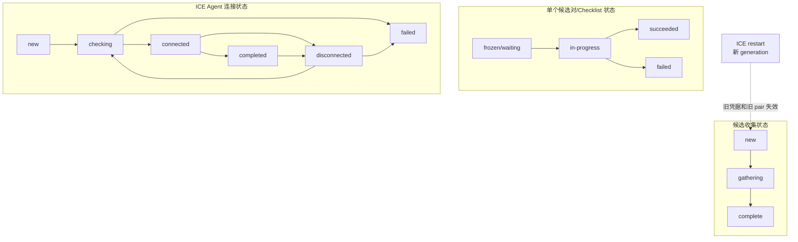

# ICE 状态机

> [!tip] 阅读提示
> **前置：** [[ICE]]、[[ICE 候选与候选对]]、[[ICE 连通性检查与选路]]。
> **初读：** 读到「初读到此为止」就停。弄清 gathering / connection / checklist 是三套并行状态，ICE connected ≠ 能播。
> **深入：** 分隔线后的问题边界、误区与观测，排障时再读。

## 一句话说明

ICE 状态机描述 Agent 在候选收集、连通性检查、提名选路和路径保活过程中的阶段与转移。它回答“现在卡在发现、检查还是已选路”，不等于 DTLS/SRTP 已成功，也不等于媒体已经可播。

## 先记住这三句

1. ICE 至少有三条时间线：**收集候选（gathering）**、**检查候选对（checklist）**、**连接结果（connected/failed 等）**——别混成一个灯。
2. `gathering complete` 或 `connected` 都不等于 DTLS 完成，更不等于画面已经出来。
3. 看状态是为了回答「卡在发现、检查，还是已经选路」；细状态表留给第二轮。

## 用一句话说清

ICE 不是一条状态，而是**三套进度条并行**：候选收集、候选对检查、Agent 连接态。`connected` 只说明「有路了」，不等于已经出声出画。

**第一次对照：**

| 你听到的词 | 人话 |
| --- | --- |
| gathering | 还在找本机可能的地址 |
| checking | 在试哪一对地址能打通 |
| connected / completed | 选中了可用路径 |
| failed / disconnected | 路不通或后来断了 |

（状态图保留在初读；转移表与 restart 细节在折叠线后。）



---

> [!warning] 初读到此为止
> 上面这些已经够第一次阅读。下面先是「原初读区深文」（可跳过），再是工程细节；**第一次直接点文末「第一次阅读下一站」即可。**


## 初读展开（原初读区深文，第二轮再读）

> 下面是本篇原先堆在初读区的展开内容，已整体后移，避免第一次阅读过载。

## 核心机制

至少要分开三条并行时间线：

1. **Gathering：** new → gathering → complete（或失败/超时）。
2. **Checklist / pair：** waiting → in-progress → succeeded/failed；controlling 侧提名。
3. **Agent 连接态：** new → checking → connected → completed / failed / disconnected → closed。

```text
Gathering:   new -> gathering -> complete
Checklist:   waiting -> in-progress -> succeeded|failed
Agent:       new -> checking -> connected -> completed
               \-> failed
             connected/completed -> disconnected -> checking|failed
             任意活动态 -> closed
ICE restart: 生成新 generation，旧 pair 与旧凭据作废
```

**图在说什么：** 三套状态并行——候选收集、候选对检查、ICE Agent 连接态；`connected` 只说明有路，不等于媒体已在播。


> （本图已上移到初读区，此处不重复。）


三组状态并行推进，不能把同一列当成同步发生。例如 gathering 已经 complete 时，Agent 仍可能 checking；某个 pair succeeded 时，也可能尚未提名为 selected pair。

### 状态表（Agent 连接态）

| 状态 | 含义 | 常见退出 |
| --- | --- | --- |
| new | 尚未开始检查 | 开始 checklist → checking |
| checking | 正在做连通性检查 | 至少一个 pair 成功 → connected；全部失败 → failed |
| connected | 已有可用 pair，媒体可尝试发送 | 所有组件完成 → completed；consent 丢失 → disconnected |
| completed | 检查清单收敛且有 nominated/selected | 网络变化 / restart |
| disconnected | 曾连通，现暂时不可达 | 恢复检查 → checking；超时 → failed |
| failed | 当前 generation 无法恢复 | restart 或关闭 |
| closed | Agent 释放 | 终态 |

### 关键对象与数据

- `ufrag` / `pwd`、`ice-options`、role（controlling/controlled）、tie-breaker
- 本地/远端 candidate、foundation、priority、component（RTP=1, RTCP=2 若未 mux）
- checklist、触发检查、nominated pair、selected pair
- generation / restart 计数；consent freshness 计时器
- 与信令相关：`end-of-candidates`、trickle 到达顺序

### 工作流程

1. 创建 Agent，配置 STUN/TURN、策略与地址族；进入 gathering。
2. 经信令交换凭据与候选（可 trickle）；远端候选到达即更新 checklist。
3. 按优先级发 STUN Binding 检查；成功 pair 进入 succeeded，controlling 提名。
4. 选定 pair 后更新连接态；开始 consent freshness。
5. 网络切换或调用 restart：提高 generation，换凭据，清空旧 pair，重新 gathering/checking。
6. 关闭时停止定时器并释放 socket/TURN 分配。


---

## 问题边界

- **上游：** 本地网络接口、ICE server 配置、信令交换的远端候选与 ufrag/pwd、控制角色。
- **下游：** selected pair（地址/协议）、consent 保活结果、是否允许启动 DTLS/媒体发送。
- **易混淆：**
  - `gathering complete` ≠ 媒体连通。
  - `connected` / `completed` ≠ DTLS handshake 完成。
  - ICE restart 是新一代凭据与候选，不是简单“再 ping 一次”。
  - 浏览器 `iceConnectionState` 与内部 checklist 细状态不是同一粒度。
  - 连通性检查与选路细节见 [[ICE 连通性检查与选路]]；TURN 生命周期诊断见 [[ICE 与 TURN 诊断]]，本篇聚焦状态与转移。
## 工程要点

- 日志必须带 **generation**、role、selected pair 五元组、失败原因码；否则无法区分“旧路径幽灵事件”。
- Trickle 下不要等 gathering complete 才开始检查；也不要在 restart 后继续用旧 pwd 验证。
- `disconnected` 是可恢复态，过早对用户提示“通话失败”会造成误杀。
- host/srflx/relay 失败模式不同：DNS、Allocate 401、UDP 阻断、TCP/TLS 回退要分开计数。
- 与 [[DTLS]] 的时序：通常 selected pair 可用后才握手；握手失败不要回写为 ICE failed，除非实现显式绑定。
- 双端同时 controlling 时依赖 tie-breaker；日志要打印角色决议结果。
- 统计与 NACK/RTX 映射在 restart 后必须换代次，避免串会话。
- 强制 `relay` 策略应单独验收 TURN 路径；直连成功不能代替中继可用性。

## 常见误区与故障

| 误区 / 故障 | 表现与排查 |
| --- | --- |
| 只看 gathering complete | 对端候选未到或检查全失败仍会 failed |
| 把 disconnected 当终态 | 短暂 Wi-Fi 切换常先 disconnected 再 recovered |
| restart 不换视觉通话 ID | 统计与 NACK 映射可能串代次 |
| TURN 凭据过期表现为 ICE failed | 根因在 Allocate，需看 401/438 |
| 双端同时 controlling | 角色冲突依赖 tie-breaker；查角色决议日志 |
| DTLS 失败写成 ICE failed | 除非实现显式绑定，应分阶段标注 |

| gathering 卡住 | 查 STUN/TURN DNS、UDP 阻断、Allocate 鉴权 |
| connected 但无媒体 | 查 DTLS/SRTP、RTP 是否增长，勿停在 ICE 成功 |

## 观测与验证

- **记录：** `iceGatheringState`、`iceConnectionState`、`selectedCandidatePair`、请求/响应 RTT、失败 pair 列表、TURN Allocate 结果、generation、role。
- **最小实验：** 直连 UDP 成功；阻断 UDP 后仅 relay 成功；拔网线出现 disconnected；恢复后回到 connected；调用 restart 观察到新 ufrag。
- **对照：** [[ICE 与 TURN 诊断]] 的分阶段清单，避免一上来抓 RTP；浏览器时间线可辅以 [[webrtc-internals]]。

### 具体例子

两端都在对称 NAT 后，host/srflx 检查失败，relay-relay 或 relay-srflx 成功并提名。Agent 进入 connected，随后 DTLS 才开始。若此时 TURN 刷新失败，可能先看到 disconnected/failed，而不是“编码错误”。

另一例：Wi-Fi 切蜂窝时先进入 disconnected，consent 超时前若新路径检查成功可回到 connected；若直接提示用户失败并挂断，属于把可恢复态当终态。

## 阅读导航

- **上一篇：** [[ICE Restart]]
- **下一篇：** [[TLS]]
- **所属专题：** [[00-知识地图/专题说明/03 ICE、STUN、TURN 与传输安全|03 ICE、STUN、TURN 与传输安全]]
- **回看：** [[RTC 知识总览]] · [[00-知识地图/学习路线/学习进度模板|学习进度]] · [[00-知识地图/学习路线/RTC 工程师学习路线.canvas|阶段路线]]

- **第一次阅读下一站：** [[TLS]]

> 读完先回所属专题做练习/验收，再点下一篇。内部链接最多再追一层；不影响理解的陌生词先记下。

## 图谱关系

- 主题：[[连接与安全地图]]
- 前置：[[ICE]]、[[ICE 候选与候选对]]、[[ICE 连通性检查与选路]]
- 相关：[[ICE Restart]]、[[STUN]]、[[TURN]]
- 下游：[[TLS]]、[[DTLS]]、[[SRTP]]
- 观测：[[ICE 与 TURN 诊断]]、[[WebRTC 状态机诊断]]

## 参考资料

- RFC 8445（ICE）、RFC 8838（Trickle ICE）相关章节；以所用浏览器/Native WebRTC 版本行为为准。
- 同库 [[ICE]]、[[ICE 连通性检查与选路]]、[[ICE 与 TURN 诊断]]。
