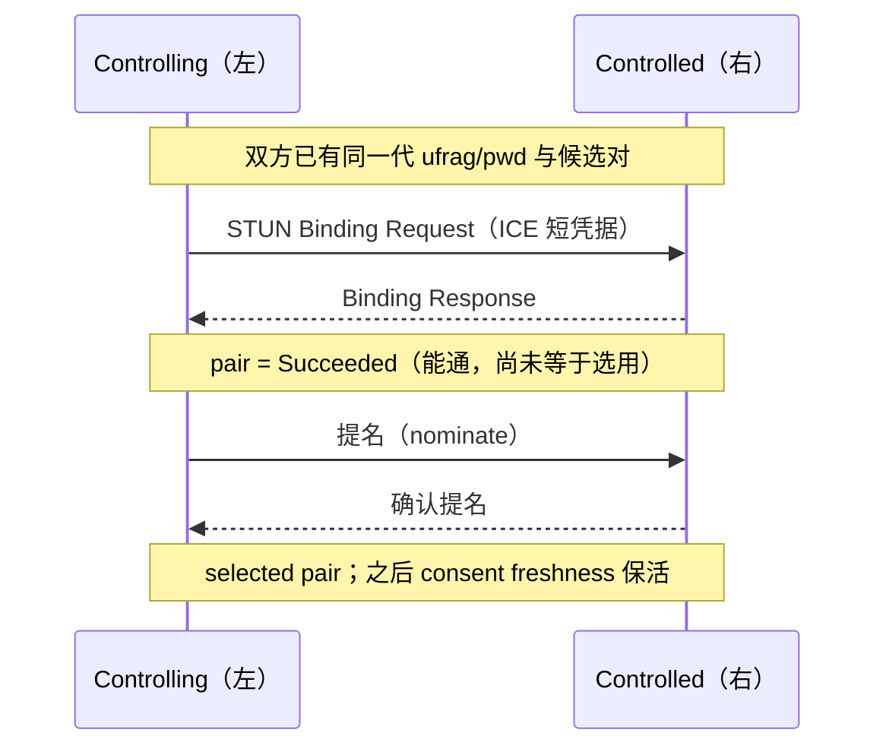
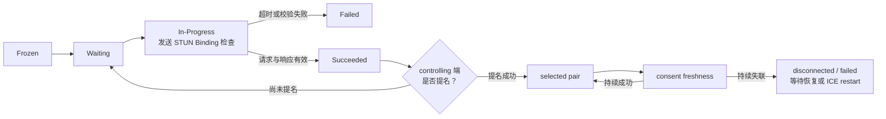

# ICE 连通性检查与选路

> [!tip] 阅读提示
> **前置：** [[ICE]]、[[ICE 候选与候选对]]、[[STUN]]。
> **初读：** 读到「初读到此为止」就停。弄清：用 STUN 检查候选对能不能双向通，再提名选出 selected pair。
> **深入：** 角色/提名细节、consent、状态流转，排障时再读。

## 一句话说明

ICE 连通性检查是 ICE Agent 使用 STUN 请求验证候选对双向可达性的过程；选路则在通过检查的候选对中，根据角色、优先级和策略提名一条实际使用的路径。候选收集成功不等于路径已连通。

## 先记住这三句

1. 连通性检查 = 对候选对发经认证的 STUN Binding，看能不能打个来回。
2. 检查成功（Succeeded）只说明「这条对能通」；**selected pair** 才是最终选用的路。
3. 连通后还要持续 consent；路径挂了可能 disconnected/failed，上层再决定重试或 ICE restart。

## 核心机制

1. 两端交换 ICE `ufrag`/`pwd` 和候选，建立候选检查清单。检查请求使用短期 ICE 凭据认证，响应证明对端能接收并返回流量。
2. Agent 通过 tie-breaker 确定 controlling/controlled 角色。施控方可在成功检查后提名候选对；受控方接受有效提名。角色冲突必须重新选定，而不是无限重试。
3. Trickle ICE 允许候选边收集边检查；检查状态可能经历 Frozen、Waiting、In-Progress、Succeeded 或 Failed，最终由选中的 pair 驱动 ICE connected/completed。
4. 连接建立后仍需持续 consent freshness。选中 pair 失效、对端不再响应或网络切换时，ICE 可能降为 disconnected/failed，并由上层决定重试或 ICE restart。

**图在说什么：** 左 controlling 对右 controlled 发经认证的 Binding；成功后再提名，才成为 selected pair（Succeeded ≠ 已选用）。

候选对内部状态机见下图。

**图在说什么：** 候选对从等待到发 Binding 检查：成功只是通了，还要 controlling 端提名，才会成为 selected pair。

`Succeeded` 只说明某个候选对检查成功，`selected pair` 才表示传输实际选用了它。真实 checklist 还会处理触发检查、foundation 解冻、角色冲突和多组件收敛，图中没有把这些内部队列简化成“只检查一对”。

## 示例场景

双方都有 host 和 relay 候选。host pair 的 Binding Request 能发出但响应被过滤，pair 进入 Failed；relay pair 的检查成功并被 controlling 端提名，ICE connected 后 DTLS 和 SRTP 才在 relay 路径上建立。

---

> [!warning] 初读到此为止
> 上面这些已经够第一次阅读。下面是工程展开与排障细节（字段、指标、状态流），**第二轮或遇到具体问题时再读**；第一次直接点文末「第一次阅读下一站」即可。

## 工程要点

- 诊断时分别记录 gathering、checking、connected、completed、disconnected 和 failed，以及 selected candidate pair 的类型、地址族、协议、RTT 和字节量。
- `succeeded` 只表示该 pair 通过检查；没有提名或没有与媒体段、BUNDLE 传输绑定，仍可能没有实际媒体。
- 检查超时、STUN 凭据不匹配、角色冲突、TURN 权限过期和防火墙回包丢失应分开归因，不能统称“ICE 失败”。
- 强制 relay、限制 UDP 或切换网络时做对照实验，确认选路变化以及 DTLS、RTP/RTCP、DataChannel 是否分别恢复。

## 解决的问题

验证候选对是否真的能双向传输，并在多个可达路径中选出当前使用的路径，同时维持对端许可和持续可达性。

## 工作流程或状态流

1. 双方交换 ICE 凭据和候选，Agent 形成检查清单并按 foundation、优先级和依赖关系安排检查。
2. controlling/controlled 角色通过 tie-breaker 确定；检查请求带短期凭据，响应证明对端能接收并返回 STUN。
3. pair 依次经历 Frozen、Waiting、In-Progress、Succeeded 或 Failed；成功 pair 可以被提名。
4. 选中 pair 绑定 RTP/RTCP、DTLS 和 SCTP 传输，ICE state 进入 connected/completed。
5. consent freshness 持续发送检查；失去响应时进入 disconnected/failed，由上层决定等待、切换或 restart。

## 关键对象、字段与报文

- 检查请求携带 username、priority、controlling/controlled、tie-breaker 和可选 USE-CANDIDATE 等属性。
- candidate pair 状态、pair priority、检查事务 ID、RTT、最近响应时间和提名状态是排障核心字段。
- ICE gathering/checking/connected/completed/disconnected/failed 描述不同阶段，不应混用成单一布尔值。
- selected candidate pair 统计应关联媒体传输、地址族、协议、relay 与本地/远端候选类型。

## 原理细节

候选收集是“我可能在哪里”，连通性检查是“这两个地址能否互相到达”。controlling 端负责提名，controlled 端接受合法提名；角色冲突需通过 tie-breaker 解决。检查成功仍不代表媒体解码正常，因为 DTLS、RTP/RTCP、编码协商和播放有独立状态。

## 工程实现与取舍

- 检查频率、超时和 consent 周期应受网络成本和实时性约束，避免大量候选导致检查风暴。
- 记录所有失败 pair 的归因，保留最终 selected pair；不要只保留“第一个成功”而丢失对照信息。
- 在强制 relay、UDP 禁用和网络切换场景使用同一套时间线，比较路径类型、RTT、恢复时间和媒体质量。
- selected pair 变更时通知上层，但不要让业务直接修改 ICE 内部状态或绕过检查。

## 常见误区与失败表现

- candidate 数量多就认为成功率高：候选越多也可能增加检查延迟和服务端压力。
- succeeded pair 就是 selected pair：没有提名、传输未绑定或新 generation 可能使它不实际使用。
- ICE completed 后忽略 consent：NAT 绑定过期后媒体会静默中断。
- 把所有失败归为 NAT：凭据、角色冲突、信令乱序、TURN 权限和回包过滤都可能导致相同状态。

## 可观测指标与验证

- 记录各阶段时间、候选对数量、检查请求/响应、超时、角色冲突、提名和 selected pair。
- 关联每个 pair 的 RTT、失败码、网络接口、地址族、协议、relay 使用和媒体首包时间。
- 抓包筛选 STUN，核对 username、USE-CANDIDATE、响应方向和实际 RTP/DTLS 是否使用同一路径。
- 通过关闭候选端口、阻断 UDP、延迟 STUN 响应和网络切换验证清单推进、回退和 consent 失败。

## 阅读导航

- **上一篇：** [[ICE 候选与候选对]]
- **下一篇：** [[ICE Restart]]
- **所属专题：** [[00-知识地图/专题说明/03 ICE、STUN、TURN 与传输安全|03 ICE、STUN、TURN 与传输安全]]
- **回看：** [[RTC 知识总览]] · [[00-知识地图/学习路线/学习进度模板|学习进度]] · [[00-知识地图/学习路线/RTC 工程师学习路线.canvas|阶段路线]]

- **第一次阅读下一站：** [[ICE Restart]]

> 读完先回所属专题做练习/验收，再点下一篇。内部链接最多再追一层；不影响理解的陌生词先记下。

## 图谱关系

- 检查对象：[[ICE 候选与候选对]]提供待验证的地址组合。
- 认证工具：[[STUN]]承载 Binding 检查和同意性维护。
- 失败回退：[[TURN]]在直连候选不可用时提供可检查的中继路径。
- 网络安全：[[DTLS]]在 ICE 路径选定后进行端点认证和密钥协商。
- 恢复动作：[[ICE Restart]]为新的网络代次重新收集并检查候选。

## 参考资料

- 《WebRTC 权威指南》第 9 章“NAT 与防火墙穿越”：`90-参考资料/音视频与 WebRTC 书库/webrtc-authoritative-guide-zh/content/09-nat-firewall-traversal.md`
- 《WebRTC 权威指南》第 10 章“协议”：`90-参考资料/音视频与 WebRTC 书库/webrtc-authoritative-guide-zh/content/10-protocols.md`
- 《Learning WebRTC》第 3 章“创建基本的 WebRTC 应用”：`90-参考资料/音视频与 WebRTC 书库/learning-webrtc/translation/03-creating-a-basic-webrtc-application.md`
- 《WebRTC Cookbook》第 4 章“调试 WebRTC 应用”：`90-参考资料/音视频与 WebRTC 书库/webrtc-cookbook/translation/04-debugging-a-webrtc-application.md`
