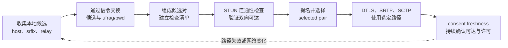

# ICE

> [!tip] 阅读提示
> **前置：** 无强前置；可先从本篇一句话说明读起。
> **初读：** 先读「一句话说明」和「核心机制」，弄清 ICE 解决什么问题、不负责什么。
> **深入：** 「工程要点」、「工作流程或状态流」、「工程实现与取舍」 在实现、联调或排障时再读。

## 一句话说明

ICE（Interactive Connectivity Establishment）是组合地址发现、候选交换、连通性检查和路径选择的框架。它使用 STUN 发现或验证端点地址，使用 TURN 提供中继，并在候选对中选出一条双方可达的传输路径。

## 核心机制

- ICE Agent 为本地接口、NAT 映射和 TURN 分配收集 host、server-reflexive、peer-reflexive、relay 等候选。
- 双方通过 SDP 或 Trickle ICE 交换候选和 ICE 凭据，将本地候选与远端候选组成候选对。
- Agent 按优先级建立检查清单，使用 STUN Binding 检查候选对的双向可达性，再由 controlling/controlled 角色提名并选定 pair。
- ICE 还承担路径上的对端许可和持续可达性维护。选路成功后，DTLS、SRTP 和 SCTP 才能使用这条路径承载数据。

## 工程要点

- 把候选收集、候选对检查、提名和 selected pair 分开记录；“拿到候选”或“ICE gathering complete”不等于媒体已连通。
- host、srflx 和 relay 的优先级受策略、网络、地址族和服务器配置影响，不要硬编码“直连永远最好”。
- 每次 ICE restart 都生成新的凭据和候选代次；旧候选、旧检查结果和新会话不能混用。
- 部署时为 UDP 受限环境准备 TURN/TLS 等回退，并用真实 selected pair、失败比例和延迟评估连接策略。

## 解决的问题

在不知道对端公网地址、NAT 类型和防火墙策略的情况下，系统地发现候选、验证双向可达性并选择一条可维护的通信路径。

## 工作流程或状态流

1. 创建 ICE Agent，读取 ICE server、候选策略、地址族和传输配置。
2. 收集 host、srflx、relay 等本地候选，并通过 SDP/信令交换候选与 ufrag/pwd。
3. 组合本地/远端候选对，安排 STUN 连通性检查，处理 controlling/controlled 角色和提名。
4. 将 selected pair 交给 RTP/RTCP、DTLS 和 SCTP；收集完成不等于检查和媒体均完成。
5. 通过 consent freshness 维护路径；网络变化时启动新的 ICE generation，结束时清理候选和计时器。

## 关键对象、字段与报文

- ICE server 配置决定 STUN 查询和 TURN Allocate 的地址、凭据、传输方式与生命周期。
- Candidate 携带 type、priority、foundation、component、protocol、地址和端口；candidate pair 还带状态、RTT 和提名。
- ufrag/pwd、generation、sdpMid、end-of-candidates 和 selected pair 把候选与协商阶段绑定。
- ICE gathering state、connection state、role 和 tie-breaker 描述 Agent 运行阶段与角色选择。

## 原理细节

ICE 将“地址发现”和“可达性验证”拆开：STUN 看到的映射只是一个观测，TURN 地址只是可用的中继候选，最终路径必须由候选对检查确认。优先级控制检查顺序和偏好，角色控制提名；路径建立后仍需 consent，避免继续向已经失效或未授权的端点发送媒体。

## 工程实现与取舍

- 候选数量、地址族和 relay 策略需要在成功率、启动时间、隐私和成本之间平衡。
- 记录 candidate generation 与会话 ID，避免重连或 ICE restart 的延迟消息污染当前 Agent。
- 将 ICE 状态与 DTLS、媒体和 DataChannel 状态分开处理；只在上层策略确定后执行重试或关闭。
- 强制 relay 适合作为受限网络的诊断对照，不应无条件牺牲直连延迟和服务器带宽。

## 常见误区与失败表现

- 把 ICE gathering complete 当作连接成功：它只说明本地候选收集暂告结束。
- 把 STUN server 当成媒体中继：STUN 不负责持续转发端到端数据。
- 认为 ICE 成功就代表用户能看到画面：DTLS、编解码、接收缓冲和渲染仍可能失败。
- 忽略 consent 和 generation：旧路径失效或重启后会出现“状态连接但媒体静默”。

## 可观测指标与验证

- 记录候选数、收集耗时、candidate 消息延迟、检查请求/响应、pair 状态、selected pair 和 consent 失败。
- 关联地址族、候选类型、传输方式、RTT、首个 DTLS/RTP 包、首帧和媒体恢复耗时。
- 抓包核对 STUN/DTLS/RTP 是否复用 selected pair，检查信令中候选和凭据是否属于同一 generation。
- 在直连、强制 relay、UDP 阻断、网络切换和多网卡环境做对照，报告成功率和成本。

## 示例场景

浏览器 A 在家庭网络，浏览器 B 在企业网络。双方交换 host、srflx、relay 候选；host 被过滤，srflx 检查超时，relay 成功。ICE 选定 relay 后，DTLS 和 SRTP 在该路径建立，业务层不需要知道具体中继实现细节，但应记录路径类型和延迟。

## 阅读导航

- **上一篇：** [[TURN]]
- **下一篇：** [[ICE 候选与候选对]]
- **所属专题：** [[00-知识地图/专题说明/03 ICE、STUN、TURN 与传输安全|03 ICE、STUN、TURN 与传输安全]]
- **回看：** [[RTC 知识总览]] · [[00-知识地图/学习路线/学习进度模板|学习进度]] · [[00-知识地图/学习路线/RTC 工程师学习路线.canvas|阶段路线]]

> 读完先回所属专题做练习/验收，再点下一篇。内部链接最多再追一层；不影响理解的陌生词先记下。

## 图谱关系

- 候选实体：[[ICE 候选与候选对]]定义地址属性及其组合方式。
- 检查选路：[[ICE 连通性检查与选路]]说明清单、角色、提名和 consent。
- 地址发现：[[STUN]]提供映射发现与 Binding 检查工具。
- 中继回退：[[TURN]]提供 relay 候选和受限网络下的可达路径。
- 所属地图：[[连接与安全地图]]组织 ICE、NAT 和传输安全知识。

## 参考资料

- 《WebRTC 权威指南》第 9 章“NAT 与防火墙穿越”：`90-参考资料/音视频与 WebRTC 书库/webrtc-authoritative-guide-zh/content/09-nat-firewall-traversal.md`
- 《WebRTC 权威指南》第 10 章“协议”：`90-参考资料/音视频与 WebRTC 书库/webrtc-authoritative-guide-zh/content/10-protocols.md`
- 《WebRTC 教程》第 7 章“STUN、TURN 与 ICE”：`90-参考资料/音视频与 WebRTC 书库/webrtc-tutorial-zh/content/07-chapter-7.md`
- 《Learning WebRTC》第 3 章“创建基本的 WebRTC 应用”：`90-参考资料/音视频与 WebRTC 书库/learning-webrtc/translation/03-creating-a-basic-webrtc-application.md`
