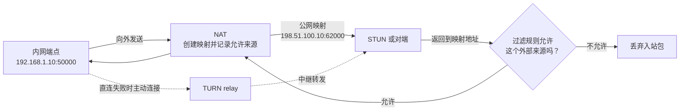

# NAT 映射与过滤行为

> [!tip] 阅读提示
> **前置：** 无强前置；可先从本篇一句话说明读起。
> **初读：** 先读「一句话说明」和「核心机制」，弄清 NAT 映射与过滤行为 解决什么问题、不负责什么。
> **深入：** 「工程要点」、「工作流程或状态流」、「工程实现与取舍」 在实现、联调或排障时再读。

## 一句话说明

NAT 映射决定内网源地址和端口如何转换为公网可见的地址和端口；过滤行为决定哪些外部来源可以向该映射回包。两者是相互独立的维度，不能只用“全锥形/对称 NAT”等旧分类推断 WebRTC 一定能否打洞。

## 核心机制

- 内网端点向外发送 UDP 包时，NAT 可能创建或复用一个绑定。常用行为描述包括端点无关映射、地址相关映射和地址与端口相关映射；不同目的地可能得到不同公网端口。
- 过滤也可能是端点无关、地址相关或地址与端口相关。严格过滤会丢弃未经先前出站流量许可的入站包，即使对端已经知道映射地址。
- STUN 服务器看到的地址形成 server-reflexive 候选，但它只反映该 STUN 路径上的映射。对端候选检查能否通过，还取决于映射保持时间、过滤规则、回包方向和防火墙策略。
- 直连不可用时，TURN 让端点主动连接中继，由中继转发数据，绕过对等端之间的入站过滤限制，但增加带宽、成本和延迟。

映射回答“内网源在外面显示成什么地址”，过滤回答“哪些外部来源可以回来”。图中地址是文档示例；NAT 是否复用端口、允许回包或执行 hairpin 必须以实际检查为准。

## 工程要点

- 测试时分别记录映射是否复用、端口是否改变、过滤是否依赖来源、UDP 绑定超时和是否支持 hairpin；一次 STUN 查询不能代表全部行为。
- ICE 保活、consent freshness 和应用流量都可能影响 NAT 绑定存活，但不能把保活当作可靠的永久租约；移动网络和运营商 NAT 变化尤其频繁。
- 设计部署时同时准备 IPv6、受限 UDP、TURN/TLS 等回退，并以实际 selected pair 和失败比例评估，而不是承诺“任意 NAT 都能直连”。
- 将 NAT 失败与信令、ICE 凭据、DTLS 和媒体解码问题分层记录；只有看到候选检查失败且路径行为吻合时，才归因于 NAT。

## 阅读导航

- **上一篇：** [[00-知识地图/专题说明/03 ICE、STUN、TURN 与传输安全|03 ICE、STUN、TURN 与传输安全]]（回到本专题说明）
- **下一篇：** [[STUN]]
- **所属专题：** [[00-知识地图/专题说明/03 ICE、STUN、TURN 与传输安全|03 ICE、STUN、TURN 与传输安全]]
- **回看：** [[RTC 知识总览]] · [[00-知识地图/学习路线/学习进度模板|学习进度]] · [[00-知识地图/学习路线/RTC 工程师学习路线.canvas|阶段路线]]

> 读完先回所属专题做练习/验收，再点下一篇。内部链接最多再追一层；不影响理解的陌生词先记下。

## 图谱关系

## 解决的问题

解释为什么端点知道一个公网地址仍可能无法互相发送 UDP，并为直连、保活、TURN 回退和网络切换提供可验证的行为模型。

## 工作流程或状态流

1. 内网端点从本地地址和端口发出 UDP，NAT 根据映射规则创建或复用外部绑定。
2. STUN server 观察映射并返回 server-reflexive 地址；端点把它加入 ICE 候选。
3. 对端向该地址发起检查，NAT 和防火墙依据过滤规则决定是否放行返回路径。
4. 绑定在空闲超时、网络切换或端口重映射后失效；ICE consent/保活或实际媒体可能延长但不能永久保证存活。
5. 直连不成立时，端点主动连 TURN，由 relay 接收和转发数据。

## 关键对象、字段与报文

- 映射关系至少包含内部源 IP/port、外部 IP/port、目的地址上下文和创建/刷新时间。
- 过滤行为描述允许的外部来源：端点无关、地址相关或地址与端口相关。
- STUN Binding 的 XOR-MAPPED-ADDRESS、候选类型和 selected pair 反映外部观察；它们不是 NAT 的完整配置快照。
- 绑定超时、端口复用、hairpin、IPv4/IPv6 和 TCP/UDP 是部署诊断所需的环境字段。

## 原理细节

映射回答“内网源如何呈现给外部”，过滤回答“哪些外部包能回来”，两者可独立变化。对称/锥形等旧称容易把多个维度压成一个标签；现代排障应观察具体映射和过滤行为。STUN 服务器与对端可能不是同一目的地，因此一个 server-reflexive 地址不必然适用于另一路径。

## 工程实现与取舍

- 用短周期保活和 consent 维持会话，但限制频率和带宽，避免大量空闲连接产生后台流量。
- 运营商 NAT 和移动网络的绑定变化不可完全预测，应把 ICE restart、relay 和 IPv6 作为回退，而不是依赖固定端口。
- NAT 诊断工具需获得用户授权，公网候选和内部地址写日志时脱敏并控制保留期。
- 以真实网络分布统计直连/relay 比例、绑定寿命和失败原因，不能只依据实验室的一类路由器。

## 常见误区与失败表现

- 只用一个 STUN server 给 NAT 分类：目的地变化可能得到不同映射。
- 看到 srflx 候选就认为端口已经对外开放：过滤策略仍可能丢弃入站检查。
- 把 TURN 连接成功当成 NAT 直连成功：relay 绕开了对等端的入站限制，成本和延迟也不同。
- 把所有 disconnected 都归因于 NAT：信令、凭据、服务器或本地线程也会造成同样状态。

## 可观测指标与验证

- 记录每次 STUN 查询的源/目的、映射地址、响应 RTT、错误码和间隔变化。
- 测量绑定空闲超时、端口复用率、过滤来源、hairpin 结果、selected pair 类型和 relay 使用率。
- 抓包比较出站 Binding、入站响应和对端检查方向，确认失败发生在映射、过滤还是服务端。
- 在家庭路由器、企业网络、移动网络、UDP 禁用、IPv6-only 和网络切换环境分别采样。

## 示例场景

端点从同一 NAT 向 STUN server 和对端发送请求，两个目的地得到不同外部端口；STUN 地址作为 srflx 候选交换后，对端检查仍被过滤。ICE 最终选择 TURN relay，应用应将其记录为“直连候选不可达、relay 成功”，而不是“STUN 失效”。

- 地址发现：[[STUN]]从外部观察映射并承载 Binding 请求。
- 候选表达：[[ICE 候选与候选对]]把映射地址组合成待检查路径。
- 选路验证：[[ICE 连通性检查与选路]]验证双方映射和过滤是否允许双向通信。
- 中继回退：[[TURN]]通过服务器转发绕过对等端直接入站限制。
- 用户体验：[[端到端延迟]]受中继距离、回退传输和 NAT 重绑定影响。

## 参考资料

- 《WebRTC 权威指南》第 9 章“NAT 与防火墙穿越”：`90-参考资料/音视频与 WebRTC 书库/webrtc-authoritative-guide-zh/content/09-nat-firewall-traversal.md`
- 《WebRTC 教程》第 3 章“WebRTC”：`90-参考资料/音视频与 WebRTC 书库/webrtc-tutorial-zh/content/03-webrtc.md`
- 《WebRTC 教程》第 7 章“STUN、TURN 与 ICE”：`90-参考资料/音视频与 WebRTC 书库/webrtc-tutorial-zh/content/07-chapter-7.md`
- 《WebRTC Cookbook》第 2 章“安全支持”：`90-参考资料/音视频与 WebRTC 书库/webrtc-cookbook/translation/02-supporting-security.md`
