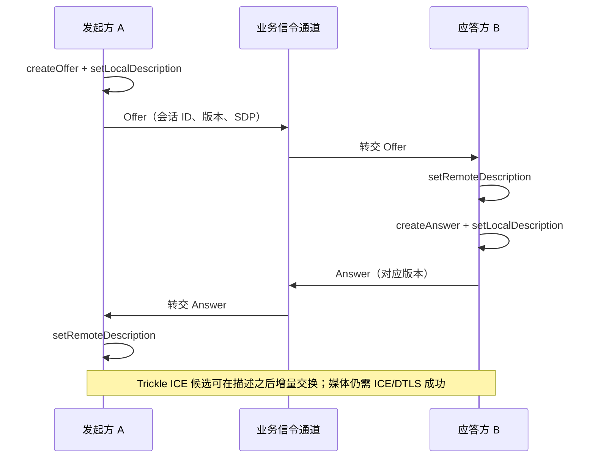

# Offer Answer

> [!tip] 阅读提示
> **前置：** 无强前置；可先从本篇一句话说明读起。
> **初读：** 先读「一句话说明」和「核心机制」，弄清 Offer Answer 解决什么问题、不负责什么。
> **深入：** 「工程要点」、「工作流程或状态流」、「工程实现与取舍」 在实现、联调或排障时再读。

## 一句话说明

Offer/Answer 是一种协商模型：一方提出会话能力和当前意图，另一方返回自己接受的兼容子集。它通过 SDP 落地媒体类型、方向、编解码、传输和安全参数，是“双方愿意怎样通信”的控制层，不等同于媒体已连通。

## 核心机制

- 创建方生成 Offer，设置本地描述并通过信令发送；接收方设置远端描述、生成 Answer、设置本地描述并回传；创建方最后设置远端 Answer。
- 初次协商可以包含音频、视频、数据通道和 ICE 参数。Trickle ICE 允许描述先到达，候选随后按事件增量发送。
- 增加或移除 Track、改变 Transceiver 方向、编码能力或 ICE 凭据可能触发重新协商。`mid` 和 `m=` 段的生命周期必须在双方状态机中保持一致。
- 同时出现两个 Offer 会产生 glare。应用应采用完美协商、角色约束或回滚策略，不能靠随机延迟掩盖状态竞争。

信令服务器负责传递双方描述，不替浏览器“接受”媒体参数。重新协商会再次走类似流程，并必须用 signaling state、版本和角色处理并发 Offer。

## 工程要点

- 严格区分 `signalingState`、本地/远端描述和 ICE candidate 到达状态；候选在远端描述可用前到达时应暂存并按会话代次回放。
- 信令消息带会话 ID、协商版本和幂等键，重连后不要把旧 Offer/Answer 或旧候选投递给新连接。
- 重新协商应有原因、超时和失败回滚；仅修改发送源时优先考虑 `replaceTrack` 是否足够，避免不必要的协商。
- 诊断时保存 Offer/Answer 的摘要和关键字段，不要把 SDP 全文无保护写入业务日志。

## 阅读导航

- **上一篇：** [[WebSocket]]
- **下一篇：** [[SDP]]
- **所属专题：** [[00-知识地图/专题说明/02 信令与 SDP 协商|02 信令与 SDP 协商]]
- **回看：** [[RTC 知识总览]] · [[00-知识地图/学习路线/学习进度模板|学习进度]] · [[00-知识地图/学习路线/RTC 工程师学习路线.canvas|阶段路线]]

> 读完先回所属专题做练习/验收，再点下一篇。内部链接最多再追一层；不影响理解的陌生词先记下。

## 图谱关系

## 解决的问题

让双方对媒体类型、收发方向、编解码、传输和安全参数形成一份兼容且有版本的共同描述，并支持后续增删轨道或恢复路径。

## 工作流程或状态流

1. 连接处于 stable，应用根据本地 Track、Transceiver、DataChannel 和策略创建 Offer。
2. 发起方设置 local description，并通过信令发送；接收方设置 remote description。
3. 接收方创建并设置 Answer，再经信令返回；发起方设置 remote Answer，双方进入可继续 ICE/DTLS 的状态。
4. candidate 可随描述或增量到达；本地/远端描述和 signaling state 必须与候选代次一致。
5. 新增轨道、改变方向、编码能力或 ICE 凭据时重新协商；关闭或回滚时清理 pending description 和待发消息。

## 关键对象、字段与报文

- SessionDescription 的 type、sdp、mid、m-line、方向、codec、ICE ufrag/pwd、candidate 和 fingerprint 是主要协商字段。
- signalingState、currentLocal/RemoteDescription、pendingLocal/RemoteDescription 描述当前状态和过渡状态。
- 信令消息需带会话 ID、协商版本、发送方/接收方、Offer/Answer 类型、候选 generation 和幂等键。
- transceiver 的 mid、direction/currentDirection、payload type 和 msid 是媒体变更时的重点。

## 原理细节

Offer 表达“我能提供并希望使用什么”，Answer 表达“在这些选项中我接受什么”。它不会替 ICE 检查地址，也不会替 DTLS 证明媒体已加密。并发 Offer 会产生 glare；完美协商通常用稳定的 polite/impolite 角色、rollback 和版本处理，而不是把竞态交给随机延时。

## 工程实现与取舍

- 把创建、设置本地、发送、设置远端和失败回滚封装成可追踪的状态机，不要在多个回调里任意调用协商接口。
- Trickle ICE 降低初始等待，但要求服务器支持候选乱序、end-of-candidates 和 generation；非 trickle 场景需等待完整 SDP。
- 仅更换同类媒体源时评估 replaceTrack，避免无意义协商；真正改变 m-line/方向/能力时明确发起协商。
- SDP 日志做摘要和敏感字段脱敏，保存足够的 mid/codec/ICE/DTLS 信息支持复现。

## 常见误区与失败表现

- createOffer 成功就认为对端已接受：远端描述、Answer、ICE 和 DTLS 仍可能失败。
- 同时接收两个 Offer 都直接 setRemoteDescription：常见结果是状态错误、旧轨道丢失或连接卡死。
- 候选早于远端描述到达时立即 addIceCandidate：可能报错或把候选丢掉，需按会话和代次暂存。
- 通过字符串替换 SDP 强改能力：容易破坏 mid、payload type、方向和安全字段的一致性。

## 可观测指标与验证

- 记录每次 create/setLocal/setRemote 的时间、类型、版本、state 变化、错误码和回滚。
- 关联 Offer/Answer 中的 m-line、mid、方向、codec、ICE 凭据、fingerprint 与 selected pair。
- 信令抓包检查 offer、answer、candidate 的目标、顺序、重复和版本；客户端检查 negotiationneeded 与 onicecandidate。
- 测试双方同时发起、重复消息、候选乱序、加轨/换轨、ICE restart、网络断线和挂断竞态。

## 示例场景

双方同时点击“开启摄像头”，各自触发 negotiationneeded 并创建 Offer。采用协商角色后，一方暂存本地 Offer，礼貌端回滚并接受远端 Offer，再生成 Answer；信令日志和 signalingState 能解释为什么没有创建第二条 PeerConnection。

- 描述载体：[[SDP]]承载 Offer/Answer 的媒体、传输和安全字段。
- 会话过程：[[WebRTC 会话生命周期]]定义创建、更新、恢复和关闭的时序。
- 媒体变更：[[MediaStream Track 与 Transceiver]]的方向或收发单元变化可能触发重新协商。
- 候选更新：[[ICE Restart]]通过新的 Offer/Answer 开始新的 ICE generation。
- 消息路由：[[信令服务器]]传递描述和候选，但不代替媒体连接。

## 参考资料

- 《WebRTC 权威指南》第 6 章“对等连接与 Offer/Answer”：`90-参考资料/音视频与 WebRTC 书库/webrtc-authoritative-guide-zh/content/06-peer-connection-offer-answer.md`
- 《Learning WebRTC》第 3 章“创建基本的 WebRTC 应用”：`90-参考资料/音视频与 WebRTC 书库/learning-webrtc/translation/03-creating-a-basic-webrtc-application.md`
- 《Learning WebRTC》第 5 章“连接客户端”：`90-参考资料/音视频与 WebRTC 书库/learning-webrtc/translation/05-connecting-clients-together.md`
- 《WebRTC Cookbook》第 1 章“对等连接”：`90-参考资料/音视频与 WebRTC 书库/webrtc-cookbook/translation/01-peer-connections.md`
