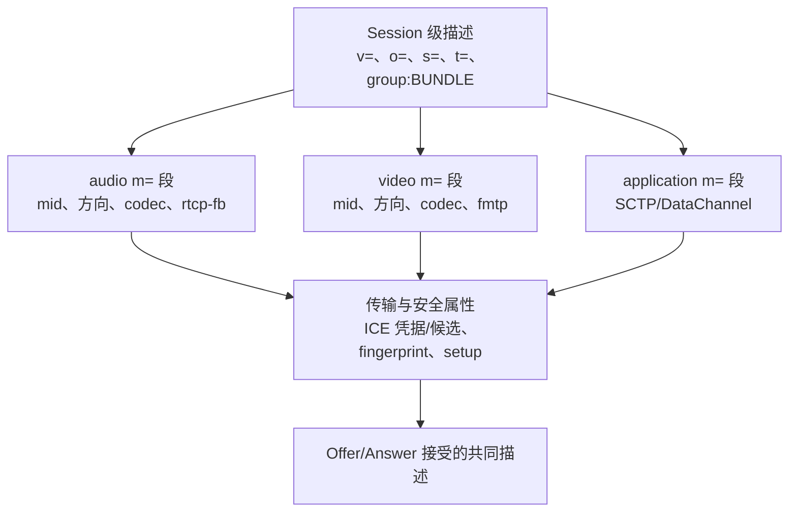
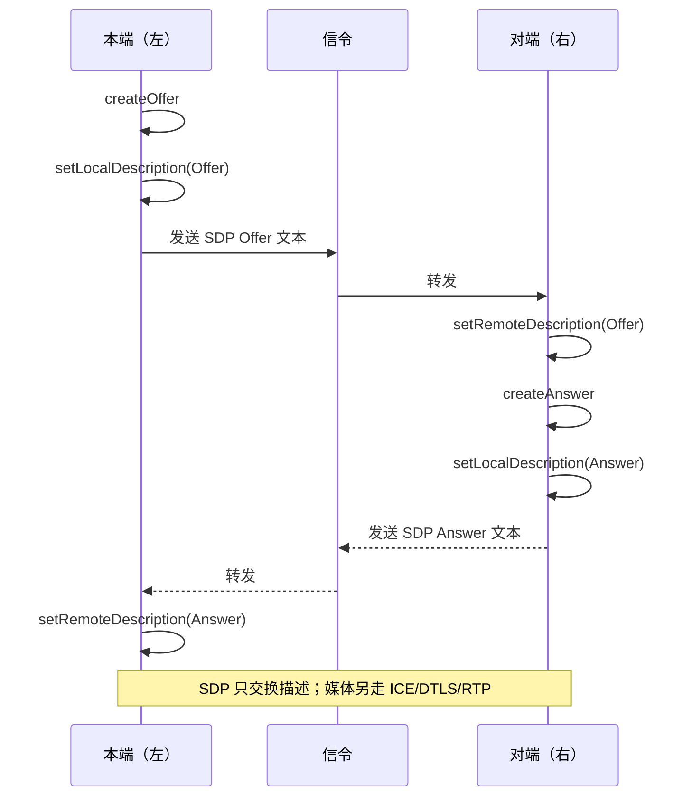

# SDP

> [!tip] 阅读提示
> **前置：** [[Offer Answer]]。
> **初读：** 读到「初读到此为止」就停。弄清：SDP 是「会话说明书」文本，不负责传媒体，也不负责打洞。
> **深入：** 分隔线后的字段、BUNDLE、重新协商细节，联调时再读。

## 一句话说明

SDP（Session Description Protocol）是一种描述会话能力和意图的文本格式，不负责传输信令，也不负责实际打洞。WebRTC 用它表达媒体段、收发方向、编解码能力、ICE 凭据、候选和 DTLS 指纹等协商参数。

## 先记住这三句

1. SDP = 用文本描述「有哪些媒体、方向如何、支持什么编码、ICE/安全参数是什么」——是说明书，不是运输车。
2. 常见块：`m=` 媒体段、方向（sendrecv 等）、编解码（rtpmap/fmtp）、ICE 凭据与候选、DTLS 指纹。
3. SDP 里写了地址，不代表通得了；真正通路仍靠 ICE 检查。Offer/Answer 只是双方就这份说明书达成一致。

## 核心机制

- `m=` 行定义一个媒体段，`a=mid` 为其提供稳定标识；`a=sendrecv`、`sendonly`、`recvonly`、`inactive` 表达方向。
- `a=rtpmap`、`a=fmtp` 和 `a=rtcp-fb` 描述负载类型、格式参数和反馈能力；动态 payload type 只能在双方正确映射后使用。
- `a=group:BUNDLE`、`a=rtcp-mux` 等属性允许多个媒体段复用传输；`a=ice-ufrag`、`a=ice-pwd` 和 candidate 属性关联 ICE 代次与地址。
- `a=fingerprint`、`a=setup` 表达 DTLS 身份校验和握手角色。SDP 写有地址并不代表该地址可达，实际路径仍由 ICE 检查决定。

**图在说什么：** 一份 SDP 先有会话级字段，再挂 audio/video/application 等 m= 段——各段各自带方向与编解码。

属性究竟位于 session level 还是 media level 要按规范和继承规则解析，图中只是把阅读视角分组。不能根据文本缩进猜层级，也不能把同名属性从一个 `m=` 段随意搬到另一个媒体段。

**图在说什么：** 左本端 createOffer+setLocal 后经信令把 SDP 给右对端 setRemote；Answer 对称回来——SDP 不传媒体。

## 示例场景

发送端新增屏幕共享轨道后，生成带新 video m-line 或复用现有 transceiver 的 Offer。接收端检查 mid、方向、codec 和 msid 后应答；即使 SDP 设置成功，仍需等待新 SSRC 的 RTP、解码和渲染首帧来确认共享真正可见。

---

> [!warning] 初读到此为止
> 上面这些已经够第一次阅读。下面是工程展开与排障细节（字段、指标、状态流），**第二轮或遇到具体问题时再读**；第一次直接点文末「第一次阅读下一站」即可。

## 工程要点

- 解析和比较 SDP 时按媒体段的 `mid`、方向和协商状态处理，不要依赖行顺序或把整段文本当作稳定字符串比较。
- 保存本地/远端描述及其版本，处理回滚、拒绝的 `m=` 段、无方向媒体和重新协商；避免在错误的 signaling state 调用接口。
- 变更 codec、方向、Transceiver 或 ICE 凭据时记录变更原因。对外日志应脱敏 ICE 密码、指纹和候选地址。
- Offer/Answer 成功只说明描述被接受；应继续观察 ICE、DTLS、RTP/RTCP 和实际播放状态。

## 解决的问题

让不同实现用可解析的文本交换媒体段、能力、方向、路径和安全参数，同时允许协商结果被日志、抓包和测试工具复现。

## 工作流程或状态流

1. 本地根据 Track、Transceiver、编解码器和传输配置生成 session/media 描述。
2. Offer/Answer 通过信令交换并设置为本地/远端描述；解析器校验 m-line、mid、方向和字段关系。
3. ICE candidate 可内嵌在 SDP 或作为 Trickle 消息单独到达；ICE credentials 绑定当前 generation。
4. 协商结果创建 RTP/RTCP、DTLS 和媒体收发状态；加轨、换方向或 ICE restart 时生成新描述。
5. 记录 current/pending description 和版本，回滚或关闭时释放尚未生效的描述状态。

## 关键对象、字段与报文

- session-level 行包括 v/o/s/t、BUNDLE 分组和全局属性；media-level 的 m=、c=、a= 行描述具体媒体段。
- mid、msid、direction、rtpmap、fmtp、rtcp-fb、rtcp-mux 和 group:BUNDLE 决定媒体映射与复用。
- ice-ufrag、ice-pwd、candidate、fingerprint、setup 和 sctp-port 表达传输/安全信息。
- payload type 是 RTP 动态映射，必须与 codec、clock rate、channels 和 fmtp 参数共同解析。

## 原理细节

SDP 是描述，不是传输协议；其中出现的 IP/端口、candidate 或 fingerprint 仍要由 ICE/DTLS 验证。m-line 顺序和 mid 在重新协商中承担稳定关联，拒绝或停用媒体段也要保留一致的会话结构。BUNDLE 和 rtcp-mux 让多个媒体段共享传输，但不消除每个媒体段的能力和方向语义。

## 工程实现与取舍

- 优先使用标准解析器和结构化对象，避免用字符串替换修改 payload type、candidate 或方向。
- 保存清洗后的 SDP 摘要和原始版本哈希；日志中脱敏 ICE 密码、候选和指纹，保留 mid/codec/方向以便定位。
- 生成描述时固定能力顺序和版本策略，减少无意义的文本差异；比较时按语义字段而不是整段字符串。
- 与 SIP 或非浏览器端互通时明确字段映射、codec 参数、DTLS-SRTP 与传统安全机制的边界。

## 常见误区与失败表现

- 看到 candidate 就认为可达：实际仍可能被 NAT/防火墙阻断。
- 只修改一行 m= 或 payload type：可能破坏 mid、方向、rtpmap/fmtp 和远端解码。
- 把 SDP 发送成功当成媒体成功：信令、ICE、DTLS、RTP 和渲染各有状态。
- 忽略 inactive/rejected m-line：重新协商后容易出现轨道错配或错误复用旧 transceiver。

## 可观测指标与验证

- 记录每个版本的 m-line/mid、方向、codec/payload、ICE generation、candidate 数和 fingerprint 摘要。
- 将 SDP 解析结果与 signalingState、selected pair、DTLS state、SSRC 和首帧关联。
- 抓取信令消息，校验 Offer/Answer 类型、版本、目标、候选代次和 end-of-candidates。
- 用加轨、停轨、方向切换、不同 codec、BUNDLE/RTCP mux、ICE restart 和 SIP 网关做兼容性测试。

## 阅读导航

- **上一篇：** [[Offer Answer]]
- **下一篇：** [[MediaStream Track 与 Transceiver]]
- **所属专题：** [[00-知识地图/专题说明/02 信令与 SDP 协商|02 信令与 SDP 协商]]
- **回看：** [[RTC 知识总览]] · [[00-知识地图/学习路线/学习进度模板|学习进度]] · [[00-知识地图/学习路线/RTC 工程师学习路线.canvas|阶段路线]]

- **第一次阅读下一站：** [[MediaStream Track 与 Transceiver]]

> 读完先回所属专题做练习/验收，再点下一篇。内部链接最多再追一层；不影响理解的陌生词先记下。

## 图谱关系

- 协商模型：[[Offer Answer]]使用 SDP 交换能力和意图。
- 传输参数：[[ICE 候选与候选对]]通过 SDP 或增量消息携带路径候选。
- 媒体对象：[[MediaStream Track 与 Transceiver]]把轨道、收发器和媒体段方向映射起来。
- 安全参数：[[DTLS]]使用 SDP 指纹和 setup 属性完成身份与角色协商。
- 所属地图：[[会话与信令地图]]组织 SDP 与会话控制知识。

## 参考资料

- 《Learning WebRTC》第 3 章“创建基本的 WebRTC 应用”：`90-参考资料/音视频与 WebRTC 书库/learning-webrtc/translation/03-creating-a-basic-webrtc-application.md`
- 《WebRTC 权威指南》第 6 章“对等连接与 Offer/Answer”：`90-参考资料/音视频与 WebRTC 书库/webrtc-authoritative-guide-zh/content/06-peer-connection-offer-answer.md`
- 《WebRTC 权威指南》第 17 章“术语表”：`90-参考资料/音视频与 WebRTC 书库/webrtc-authoritative-guide-zh/content/17-appendix-c-glossary.md`
- 《WebRTC Cookbook》第 1 章“对等连接”：`90-参考资料/音视频与 WebRTC 书库/webrtc-cookbook/translation/01-peer-connections.md`
