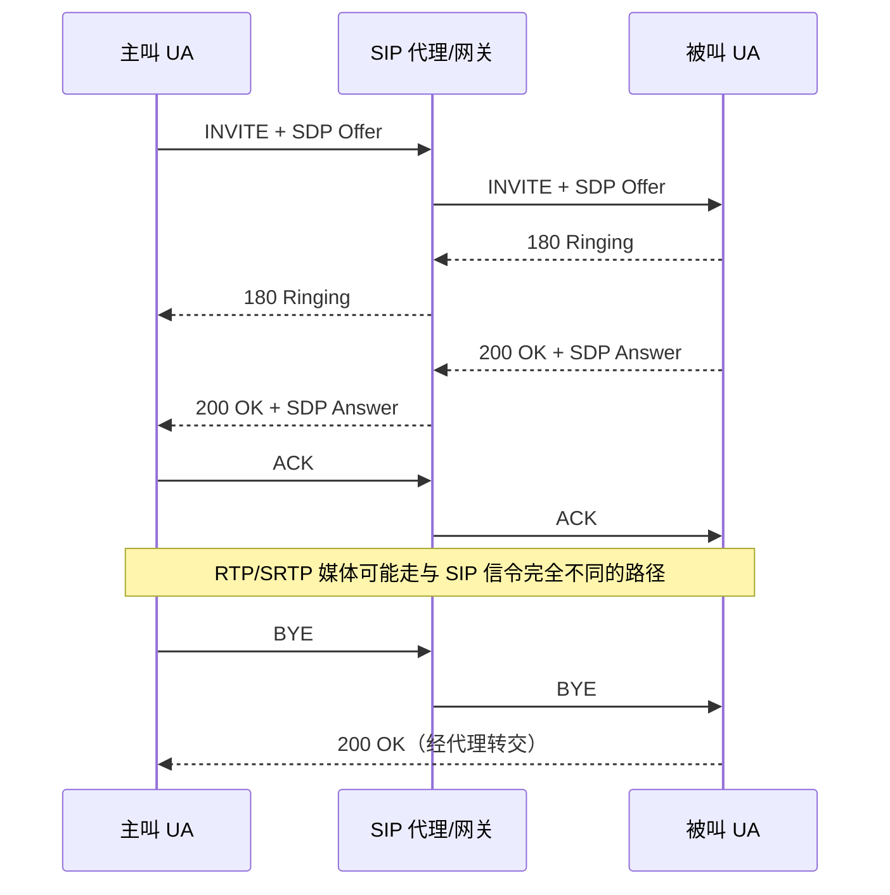

# SIP

> [!tip] 阅读提示
> **前置：** [[Offer Answer]]、[[信令服务器]]。WebRTC 不是必须用 SIP。
> **初读：** 读到「初读到此为止」就停。弄清：SIP 管会话信令，可带 SDP，但不等于媒体已通。
> **深入：** 事务/对话、与 WebRTC 互通网关，对接运营商或老系统时再读。

## 一句话说明

SIP 是用于创建、修改和终止多媒体会话的应用层信令协议，广泛用于 VoIP、运营商和会议系统。它可以携带 SDP，但不等于 RTP 媒体传输，也不是 WebRTC 应用必须采用的信令协议。

## 先记住这三句

1. SIP = 创建/修改/结束多媒体会话的**信令协议**（VoIP、运营商里很常见）；可以携带 SDP。
2. SIP 成功 ≠ RTP 媒体通了；信令路径和媒体路径经常不是同一条。
3. WebRTC **不必**用 SIP；和 SIP 世界互通通常要靠网关做 SDP/ICE/安全语义转换。

## 核心机制

- `INVITE` 发起或修改会话，`200 OK`/`ACK` 完成应答，`BYE` 结束已建立会话；实际部署还需处理重传、事务、对话和注册状态。
- SIP 消息中的 SDP 可描述媒体能力、方向、地址、编解码和安全参数；双方的 Offer/Answer 逻辑仍遵循相应协商规则。
- SIP 信令路径、ICE/STUN/TURN 路径和 RTP/SRTP 媒体路径可以由不同服务器或网络承载，信令成功不能证明媒体可达。
- WebRTC 与 SIP 互通通常需要网关转换浏览器 API、SDP 语义、ICE/DTLS-SRTP 与传统 RTP/SDES 或媒体服务器能力。

**图在说什么：** 左主叫经中间代理发 `INVITE`+Offer，右被叫回 Answer 再 `ACK`；信令走完后媒体可能走完全不同的路径，最后一方 `BYE` 结束。

这里只画出成功呼叫的主干。实际 SIP 还包含事务重传、鉴权、CANCEL、错误响应、Record-Route 和重新协商；WebRTC 网关也可能终止两侧媒体安全并重新建立另一侧传输。

## 示例场景

浏览器通过网关呼叫 SIP 电话。INVITE/200 OK 成功后，网关将浏览器的 ICE/DTLS-SRTP 能力转换成电话侧可用的 RTP/SRTP；若只看到 ACK 而无 RTP，应检查网关 SDP 映射与媒体地址，而不是重试 INVITE。

---

> [!warning] 初读到此为止
> 上面这些已经够第一次阅读。下面是工程展开与排障细节（字段、指标、状态流），**第二轮或遇到具体问题时再读**；第一次直接点文末「第一次阅读下一站」即可。

## 工程要点

- 明确 SIP 对话、业务呼叫和 PeerConnection 的 ID 映射，避免一个业务会话重复创建多个媒体连接或错误复用旧候选。
- 处理 codec、方向、payload type、SRTP/DTLS 能力和 NAT 穿越差异；不要仅转发 SDP 文本而忽略实现语义。
- 记录 INVITE/response/ACK/BYE 时间线，并与 ICE selected pair、DTLS 和媒体统计关联，分开定位信令与媒体故障。
- 若只是浏览器点对点应用，优先使用简单、明确的业务信令；引入 SIP 应有互通、注册、电话网或既有基础设施需求。

## 解决的问题

在已有 VoIP、运营商或会议系统中，用标准化事务、对话和注册机制建立/修改/终止会话，并把媒体协商交给 SDP 与底层传输。

## 工作流程或状态流

1. 用户代理通过 REGISTER 向 registrar 注册联系地址，服务端维护可达位置和有效期。
2. 主叫发送 INVITE，事务层处理临时响应；被叫可能返回 100/180 等状态，再以 200 OK 携带 Answer 完成应答。
3. 主叫发送 ACK 后媒体按双方 SDP、RTP/ICE/安全配置建立；会话期间可用 re-INVITE/UPDATE 修改能力。
4. 任一方发送 BYE，收到成功响应后结束对话；事务超时、取消或错误响应要清理媒体和注册状态。
5. WebRTC-SIP 网关还需把浏览器侧 ICE/DTLS-SRTP、Track 和 DataChannel 语义映射到传统系统。

## 关键对象、字段与报文

- Call-ID、From/To tag、CSeq 和 Contact 标识对话、顺序与后续路由；Via、Route/Record-Route 影响事务路径。
- INVITE/ACK/BYE/REGISTER/CANCEL 是常见方法；响应码区分临时进度、成功、客户端错误和服务端错误。
- SDP body 携带媒体方向、codec、地址、安全和候选信息；Content-Type/Length 影响解析。
- transaction、dialog、registration 和业务呼叫是不同状态，不能只用一个 call status 代替。

## 原理细节

SIP 的事务层负责请求/响应重传和超时，对话层负责已建立会话的身份和顺序，注册层负责联系地址。SIP 消息可以走代理或网关，媒体路径可以完全不同；因此 INVITE 200 OK 只证明信令协商完成，不证明 ICE、DTLS 或 RTP 可用。

## 工程实现与取舍

- WebRTC 网关要定义 codec、payload type、方向、ICE candidate、fingerprint 和 SRTP 密钥协商的映射，不要简单转发不兼容 SDP。
- 事务定时器、NAT keepalive、注册刷新和呼叫超时要有统一时间线；重试必须带正确 CSeq/对话上下文。
- 只需要浏览器点对点时，简单信令可降低部署和调试成本；引入 SIP 的收益主要来自既有电话网、注册和互通能力。
- 对公网信令启用鉴权、TLS、拓扑隐藏和输入限制，媒体服务器/TURN 与 SIP 代理的权限边界要清楚。

## 常见误区与失败表现

- 200 OK 后无媒体：可能是 SDP codec/方向、ICE、DTLS-SRTP 或 NAT 问题。
- 只看 From/To 文本判断对话：tag、Call-ID 和 CSeq 缺失会导致 ACK/BYE 路由错误。
- 把 SIP 代理当成 RTP 中继：信令可到达而媒体被防火墙拦截。
- 把 CANCEL、BYE、超时混为一种挂断：不同事务和清理时序会产生残留会话。

## 可观测指标与验证

- 记录 Call-ID、tag、CSeq、方法、响应码、事务重传、注册期限、对话建立/关闭时间。
- 关联 SIP 消息中的 SDP 摘要、ICE state、selected pair、DTLS state、RTP 首包和首帧。
- 抓包按 SIP、STUN、DTLS、RTP 分层过滤，确认信令事务和媒体路径是否分别成功。
- 用注册过期、代理重启、呼叫取消、双方同时修改、codec 不匹配和 NAT 受限网络进行互通测试。

## 阅读导航

- **上一篇：** [[信令与 PeerConnection 状态机]]
- **下一篇：** [[WHIP 与 WHEP]]
- **所属专题：** [[00-知识地图/专题说明/02 信令与 SDP 协商|02 信令与 SDP 协商]]
- **回看：** [[RTC 知识总览]] · [[00-知识地图/学习路线/学习进度模板|学习进度]] · [[00-知识地图/学习路线/RTC 工程师学习路线.canvas|阶段路线]]

- **第一次阅读下一站：** [[WHIP 与 WHEP]]

> 读完先回所属专题做练习/验收，再点下一篇。内部链接最多再追一层；不影响理解的陌生词先记下。

## 图谱关系

- 协商模型：[[Offer Answer]]定义 SIP 携带 SDP 时的提议与应答语义。
- 描述格式：[[SDP]]承载媒体能力、方向和安全参数。
- WebRTC 路由：[[信令服务器]]可作为 SIP 网关或旁路业务控制面。
- 网络穿越：[[ICE]]负责浏览器侧候选、检查和路径选择。
- 所属地图：[[会话与信令地图]]组织 SIP 与其他信令方案的边界。

## 参考资料

- 《WebRTC 权威指南》第 4 章“信令”：`90-参考资料/音视频与 WebRTC 书库/webrtc-authoritative-guide-zh/content/04-signaling.md`
- 《WebRTC 权威指南》第 6 章“对等连接与 Offer/Answer”：`90-参考资料/音视频与 WebRTC 书库/webrtc-authoritative-guide-zh/content/06-peer-connection-offer-answer.md`
- 《WebRTC 教程》第 7 章“STUN、TURN 与 ICE”：`90-参考资料/音视频与 WebRTC 书库/webrtc-tutorial-zh/content/07-chapter-7.md`
- 《WebRTC 权威指南》第 18 章“资源”：`90-参考资料/音视频与 WebRTC 书库/webrtc-authoritative-guide-zh/content/18-appendix-d-resources.md`
