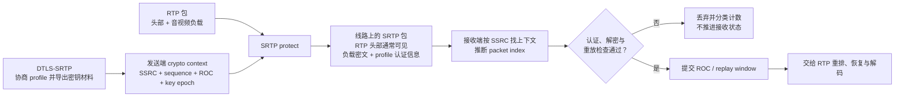

# SRTP

> [!tip] 阅读提示
> **前置：** 无强前置；可先从本篇一句话说明读起。
> **初读：** 先读「一句话说明」和「核心机制」，弄清 SRTP 解决什么问题、不负责什么。
> **深入：** 「工程要点」、「工作流程或状态流」、「工程实现与取舍」 在实现、联调或排障时再读。

## 一句话说明

SRTP 在 RTP 之上提供媒体负载加密、消息认证和重放保护；SRTCP 为 RTCP 控制报文提供对应保护。它保护的是媒体传输报文，不负责 SDP 协商、ICE 打洞或业务层端到端密钥管理。

## 核心机制

- WebRTC 通常使用 DTLS-SRTP，从经过认证的 DTLS 会话导出 SRTP/SRTCP 密钥、盐和会话参数。
- 加密和认证状态与 SSRC、序列号、ROC 和重放窗口相关；报文乱序本身不一定是错误，但重复、越界或认证失败的报文应被丢弃。
- RTP 头部中用于路由和解码的部分元数据通常仍可见，负载及扩展是否受保护取决于协商的 SRTP 配置。
- SRTP 与 RTCP 反馈、RTX/FEC 等机制配合工作；安全保护不会自动修复丢包、抖动或拥塞。

## 工程要点

- 抓包排障时先确认 ICE 路径和 DTLS 状态，再核对密钥导出、SSRC/序列号连续性和接收端重放窗口，不要把“有加密包”当成媒体正常。
- 密钥、证书和导出材料由连接生命周期统一管理；关闭、重新协商和 ICE restart 时明确哪些状态复用、哪些状态重置。
- 监测认证失败、重放丢弃、未知 SSRC、RTCP 解密失败和负载解码失败的计数，分别定位安全层与媒体层问题。
- 若要实现参会者之间的 E2EE，必须额外定义端点密钥和信任边界；SRTP 端点到 SFU 的保护不自动等于 E2EE。

## 解决的问题

在低延迟 RTP/RTCP 传输上提供机密性、完整性和抗重放能力，同时保留实时媒体需要的序列、时间戳和反馈机制。

## 工作流程或状态流

1. DTLS 握手完成并经过 fingerprint 验证，双方从 DTLS exporter 得到 SRTP/SRTCP 会话材料。
2. 发送端根据 SSRC、sequence number、ROC 和加密上下文保护 RTP/RTCP，附加认证标签后发出。
3. 接收端按包序扩展和重放窗口验证认证标签，拒绝重复/过旧/篡改报文，再交给解码或 RTCP 处理。
4. 发生 SSRC 变化、重新协商、关闭或传输切换时更新或清理对应安全上下文。

> [!note] 图的边界
> “RTP 头部通常可见”不是“整个头部永远明文”的承诺：头扩展是否加密、认证标签的形式与长度都取决于协商的 SRTP profile 和扩展规范。SRTP 通过后也只说明安全检查成功，不代表报文一定赶得上播放截止时间。

## 关键对象、字段与报文

- RTP header 的 SSRC、sequence number、timestamp、payload type 和扩展决定媒体关联与解码；负载由 SRTP 保护。
- ROC 扩展序列空间，replay window 记录已接收范围；认证 tag 用于检测篡改和错误密钥。
- SRTCP 使用 RTCP index 与对应上下文保护 Sender/Receiver Report、NACK、PLI 等控制反馈。
- DTLS fingerprint、exporter label、cipher/salt 和每个 SSRC 的状态是密钥与流关联的关键材料。

## 原理细节

SRTP 的机密性保护媒体负载，认证保护报文来源和完整性，重放窗口阻止攻击者重复旧包。为维持实时处理，接收端允许一定乱序并通过 ROC 推断扩展序号；状态不一致会表现为认证失败或持续丢包。SRTP 不负责传输可靠性、拥塞控制或端到端应用身份授权。

## 工程实现与取舍

- 使用实现提供的标准 SRTP/DTLS 集成，不手工拼接加密包；密钥和上下文的所有权随 transport 生命周期管理。
- 记录失败计数和摘要而非密钥/明文；关键配置变更要能关联到协商版本和 SSRC。
- 与 RTX/FEC/NACK 配合时保留原序号和恢复关系，先完成安全验证再交给媒体恢复层。
- SFU 通常在每条端点链路分别终止 SRTP；若需要端到端加密，另行设计密钥和转发不可见性。

## 常见误区与失败表现

- 看到加密 UDP 就认为 SRTP 正常：也可能是 DTLS 包、未知密钥或认证失败后的重试。
- 将包乱序当成攻击：合理乱序可接受，重放窗口和认证标签共同判断。
- 只统计网络丢包：认证失败、未知 SSRC、ROC 推断错误也会造成接收端丢弃。
- 把 SRTP 端点到 SFU 的链路保护称为 E2EE：服务器仍可能持有解密能力。

## 可观测指标与验证

- 记录 SRTP/SRTCP 解密成功、认证失败、重放丢弃、未知 SSRC、序列跳跃和 ROC 变化。
- 关联 DTLS state、fingerprint 摘要、selected pair、RTP 收发、解码失败和 RTCP 反馈。
- 抓包检查 DTLS 握手、SRTP/SRTCP 包型和方向；需要解析媒体时通过受控密钥导出工具，不在生产日志泄露密钥。
- 用丢包、乱序、重复包、SSRC 切换、密钥更新、SFU 多链路和错误 fingerprint 进行安全层测试。

## 示例场景

接收端 RTP 包持续到达，但解码帧为零。统计显示认证失败随 ICE restart 同步增加，原因是旧 SRTP 上下文仍绑定新传输代次。清理旧上下文并在 DTLS 状态确认后重新关联 SSRC，媒体恢复；单纯增加重传不会解决问题。

## Profile 与算法套件边界

SRTP profile 描述媒体包如何加密、认证、派生和防重放；DTLS cipher suite 描述 DTLS 握手本身，两者不是同一层。历史上常见的 AES-CM-128 加 HMAC-SHA1-80/32 将加密和认证分开；现代实现还可能协商 AEAD_AES_128_GCM 或 AEAD_AES_256_GCM，由 AEAD 一次完成机密性和完整性。具体可用 profile 由 DTLS-SRTP 的 use_srtp 协商和实现版本决定，不能从普通 TLS 套件名称推断。

常规 SRTP 主要认证 RTP 头并加密负载，哪些头扩展加密由单独 profile/扩展规定；SRTCP 还带自己的 index 与 E bit。选择 profile 时同时确认 tag 长度、MTU 开销、硬件支持、密钥生命周期和互通测试，不要只比较“是否 AES”。

## 密钥、索引与每 SSRC 状态

DTLS-SRTP exporter 产生双方方向分离的 master key/master salt，再由 SRTP KDF 按 profile 派生 session encryption/authentication/salt key。master key 和 salt 不能写入日志；实现只应把受控的 key handle 交给密码库。每个 SSRC 维护序列号、ROC、最高已接受 packet index、replay window、key epoch 和失败计数，SRTCP 另维护 SRTCP index/E 相关状态。

RTP packet index 是 ROC 与 16 位 sequence number 的拼接，用于派生包级 IV/nonce 和认证输入。ROC 推断、回绕、迟到旧包和重放窗口决定接收端是否接受一个看似合法的 sequence number；详细状态转换见[[SRTP 与 SRTCP 报文保护]]。

## 生命周期与排障顺序

先确认 ICE selected pair 和 DTLS fingerprint/状态，再确认 use_srtp profile 与 exporter 输出长度，之后检查每个 SSRC 的序列/ROC/replay 状态，最后再看解码和播放。ICE restart 不必然产生新的 DTLS-SRTP key epoch；若 DTLS transport 复用，旧 SRTP 上下文可能继续有效，若重新握手则必须原子切换到新 crypto context，不能混用新旧 key。

建议把失败分为 profile/协商失败、exporter/上下文初始化失败、认证失败、重放/过窗丢弃、未知 SSRC、SRTCP index/E bit 解析失败和媒体解码失败。这样能避免把所有“收到但无画面”都归因于网络。

## 阅读导航

- **上一篇：** [[DTLS]]
- **下一篇：** [[SRTP 与 SRTCP 报文保护]]
- **所属专题：** [[00-知识地图/专题说明/03 ICE、STUN、TURN 与传输安全|03 ICE、STUN、TURN 与传输安全]]
- **回看：** [[RTC 知识总览]] · [[00-知识地图/学习路线/学习进度模板|学习进度]] · [[00-知识地图/学习路线/RTC 工程师学习路线.canvas|阶段路线]]

> 读完先回所属专题做练习/验收，再点下一篇。内部链接最多再追一层；不影响理解的陌生词先记下。

## 图谱关系

- 密钥来源：[[DTLS]]通过 DTLS-SRTP 导出媒体保护所需密钥。
- 媒体承载：[[RTP]]提供序列号、时间戳和 SSRC 等受保护媒体报文结构。
- 控制保护：[[RTCP]]的反馈和统计由 SRTCP 提供对应安全性。
- 深入报文：[[SRTP 与 SRTCP 报文保护]]说明 profile、索引、重放窗口和收发处理顺序。
- 会话归属：[[WebRTC 会话生命周期]]管理密钥、传输和媒体状态的创建与关闭。
- 所属地图：[[连接与安全地图]]组织媒体安全和传输路径知识。

## 参考资料

- 《WebRTC 权威指南》第 5 章“对等媒体”：`90-参考资料/音视频与 WebRTC 书库/webrtc-authoritative-guide-zh/content/05-peer-media.md`
- 《WebRTC 权威指南》第 10 章“协议”：`90-参考资料/音视频与 WebRTC 书库/webrtc-authoritative-guide-zh/content/10-protocols.md`
- 《WebRTC 权威指南》第 13 章“安全与隐私”：`90-参考资料/音视频与 WebRTC 书库/webrtc-authoritative-guide-zh/content/13-security-privacy.md`
- 《WebRTC Cookbook》第 3 章“集成 WebRTC”：`90-参考资料/音视频与 WebRTC 书库/webrtc-cookbook/translation/03-integrating-webrtc.md`
