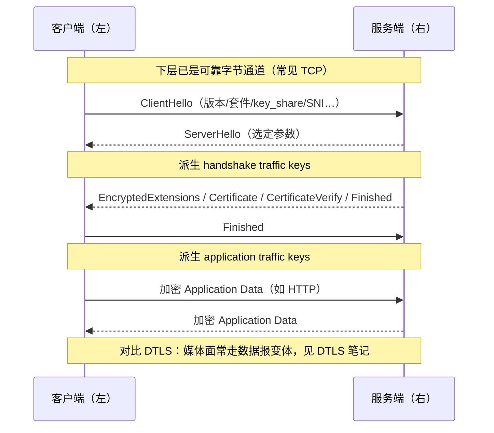

# TLS：握手、证书、密钥与加密记录

> [!tip] 阅读提示
> **前置：** 用 [[TCP]] 理解可靠字节流即可；密码学细节可后补。WebRTC 媒体安全见 [[DTLS]]。
> **初读：** 读到「初读到此为止」就停。重点：HTTPS 故事、TLS 1.3 握手主线、以及 TLS 和 DTLS/WSS 等关系。回答：浏览器怎么确认连接的不是假网站？
> **深入：** 证书链、HKDF、Record、0-RTT、TLS 终止与故障注入，第二轮再读。

## 一句话说明

TLS（Transport Layer Security）是在应用协议与可靠传输之间建立安全通道的协议：它通过握手协商版本和算法，验证服务端身份，利用密钥协商得到双方共享的会话密钥，再用 TLS Record 对后续数据加密并校验完整性。TLS 保护传输中的字节，但不替代业务登录、权限判断、输入校验，也不保证服务本身可信或没有漏洞。

## 先记住这三句

1. TLS = 在可靠传输（常见 TCP）之上建**安全通道**：验身份、协商密钥、再加密传应用数据。
2. 证书回答「对方是不是我要连的那个站」；会话密钥回答「之后怎么加密」——线路通了不等于对方可信。
3. WebRTC 音视频安全主线是 **DTLS**（数据报上的 TLS 变体）再导出 [[SRTP]]；本篇补的是 TLS 总底子，HTTPS/WSS 信令也会用到它。

## 用一句话说清

TLS 是「在不可信网络上，先确认对面大概是谁，再加密通话内容」的一层。浏览器打开 `https://` 时，就是它在干活。

**第一次只需记住：** TLS 管的是**可靠字节流上的安全**（常见跑在 TCP 上）。WebRTC **媒体面**更常用的是它的数据报亲戚 [[DTLS]]——握手思想相近，载体不同。

## 你打开一个 HTTPS 网站时

1. 浏览器连上服务器，开始握手（ClientHello…）
2. 服务器出示证书：证明「我大概是 example.com」
3. 双方算出密钥，之后 HTTP 内容在加密通道里传

 左客户端与右服务端做 TLS 1.3 握手（ClientHello…Finished）；握手成功后才在加密 Record 里传应用数据。

## 和 RTC 的关系

- 信令常走 **HTTPS / WSS**（HTTP 或 WebSocket 包在 TLS 里）
- 媒体加密主路径是 **DTLS → SRTP**，不要和 TLS 混成「都叫 SSL 就行」


**图在说什么：**



---

> [!warning] 初读到此为止
> 上面这些已经够第一次阅读。下面先是「原初读区深文」（可跳过），再是工程细节；**第一次直接点文末「第一次阅读下一站」即可。**


## 初读展开（原初读区深文，第二轮再读）

> 下面是本篇原先堆在初读区的展开内容，已整体后移，避免第一次阅读过载。

## 从打开 HTTPS 网页看懂 TLS

假设你在浏览器输入 `https://example.com`：

1. 浏览器先解析域名，并与服务器建立 TCP 连接；如果使用 HTTP/3，则底层改为 QUIC/UDP，后文单独说明。
2. 浏览器发送 TLS `ClientHello`，说明自己支持的 TLS 版本、密码套件、密钥交换参数，并通过 SNI 告诉服务器要访问哪个主机名。
3. 服务器选择共同参数，发回 `ServerHello`，随后提供证书链，并用证书对应的私钥签名本次握手摘要。
4. 浏览器检查证书是否由受信任机构签发、是否在有效期内、是否适用于 `example.com`，并验证服务器确实持有对应私钥。
5. 双方根据临时密钥交换结果和完整握手记录，各自计算出相同但未在网络中直接发送的会话密钥。
6. 浏览器验证 `Finished` 后发送自己的 `Finished`，随后通过加密的 TLS Record 发送 HTTP 请求。
7. 网站可能继续要求账号密码、Cookie 或 Token；这是应用层鉴权，不属于 TLS 身份验证本身。

```text
浏览器                      网站服务器
  |--- TCP connect ----------->|  先建立可靠字节通道
  |--- ClientHello ----------->|  我支持这些版本/算法，这是目标域名
  |<-- ServerHello ------------|  选择参数，双方开始派生握手密钥
  |<-- {Certificate} ----------|  这是我的身份证明
  |<-- {CertificateVerify} ----|  我确实持有证书对应的私钥
  |<-- {Finished} -------------|  我看到的握手记录完整一致
  |--- {Finished} ------------>|  客户端也确认一致
  |=== {HTTP request/data} ===>|  之后传输加密的应用数据
```

花括号 `{...}` 表示在 TLS 1.3 中，这些消息通常已经由握手流量密钥保护；只有 ClientHello 和 ServerHello 等初始消息仍需明文传输必要的协商信息。

> [!example] 生活化理解：进银行前先核对身份，再进密谈室
> TCP 连接像电话线路已经接通；证书验证像你核对银行执照、地址和防伪签章；密钥协商像双方当场算出一次性的密谈暗号；TLS Record 像随后装进防拆信封的每批资料。线路接通不代表对方真是银行，进入安全通道也不代表你的转账一定被授权。

## TLS 1.3 完整握手

本篇以 RFC 8446 的 TLS 1.3 为主。一个常见的仅验证服务器、使用临时 ECDHE 的完整握手如下：

```text
Client                                                   Server
  | ClientHello                                            |
  |  supported_versions, cipher_suites                     |
  |  key_share, signature_algorithms, SNI, ALPN ---------->|
  |                                                        |
  |<---------------- ServerHello                            |
  |                  selected version/cipher/key_share      |
  |                  [双方得到 handshake traffic keys]      |
  |<=============== {EncryptedExtensions}                  |
  |<=============== {Certificate}                          |
  |<=============== {CertificateVerify}                    |
  |<=============== {Finished}                             |
  |                                                        |
  | 验证证书、签名与 Finished                               |
  |================ {Finished} ---------------------------->|
  |                  [双方得到 application traffic keys]    |
  |<===============> {Application Data} <=================>|
```

若服务器发送 `CertificateRequest`，客户端还需要发送自己的 `Certificate` 与 `CertificateVerify`，形成 mTLS。若客户端最初的 `key_share` 不合适，服务器可发 `HelloRetryRequest` 要求换组后重新发送 ClientHello；它不是业务层重试。

### 为什么要分阶段

| 阶段 | 能证明什么 | 还不能证明什么 |
| --- | --- | --- |
| TCP connected | 字节通道在当时可用 | 对端身份、TLS 参数、应用可用性 |
| 收到 ServerHello | 版本、套件和 key share 已选择 | 证书有效、握手完成 |
| 证书验证通过 | 证书链和服务身份符合本地策略 | Finished 正确、业务鉴权成功 |
| Finished 验证通过 | 双方握手 transcript 一致并持有对应密钥 | HTTP/RTMP/WebSocket 业务已成功 |
| 首个应用响应 | 上层协议开始工作 | 用户操作已授权、媒体已播放 |

> [!example] 生活化理解：从接通客服电话到业务办结
> 电话接通对应 TCP；客服出示可验证的工号与机构证明对应证书；双方进入加密通话对应 TLS Finished；客服最后说“你的账户无权办理”则是应用层授权失败。前一层成功，只允许进入下一层，不能代替下一层的成功证据。


**图在说什么：** 左客户端与右服务端做 TLS 1.3 握手（ClientHello…Finished）；握手成功后才在加密 Record 里传应用数据。


> （本图已上移到初读区，此处不重复。）


## TLS 与 TCP、DTLS、HTTPS、WSS、RTMPS 的关系

### 与 TCP

```text
应用协议 -> TLS -> TCP -> IP
```

- TCP 提供可靠、有序字节流；TLS 在这条字节流上提供认证、机密性和完整性。
- TCP ACK 只说明对端 TCP 收到相应字节，不表示 TLS tag 已验证，更不表示应用已经处理。
- TCP 丢一个 segment 会阻塞其后 TLS 字节的可见交付，TLS 不会消除队头阻塞。
- TLS Record、自定义消息、TCP segment 和 IP packet 是四种不同边界。

> [!example] 生活化理解：道路与押运箱
> TCP 像保证货物按序补齐的运输道路，TLS 像道路上使用的上锁押运箱。箱子能防偷看和篡改，但道路前方堵车时，后面的押运箱仍无法准时到达。

### 与 DTLS

[[DTLS]] 是为数据报环境设计的 TLS 家族协议，不是“TLS 前面简单加一个 D”。

| 维度 | TLS | DTLS |
| --- | --- | --- |
| 下层语义 | 可靠、有序字节流，常见为 TCP | 可能丢失、乱序、重复的数据报，常见为 UDP/ICE 路径 |
| 握手传输 | 依赖下层按序补齐 | 协议自己处理握手重传、乱序和分片 |
| 数据边界 | TLS 向上恢复安全字节流 | DTLS 保留数据报语义 |
| RTC 常见用途 | HTTPS/WSS/RTMPS、TURN/TLS | WebRTC 中为端点认证和密钥建立，保护 DataChannel，并为 SRTP 导出密钥 |
| 身份绑定 | Web PKI 主机名验证、私有 CA 或 mTLS | WebRTC 常用 SDP fingerprint 绑定临时证书 |

WebRTC 媒体不是简单的 `RTP → TLS → TCP`。常见路径是 ICE 选出 UDP 路径后完成 DTLS 握手，再由 DTLS-SRTP exporter 产生 [[SRTP]] 密钥；媒体随后走 SRTP，DTLS 本身并不逐包封装所有 RTP 媒体。

### 与 HTTPS

HTTPS 表示 HTTP 使用经过认证的安全传输：

```text
HTTP/1.1 -> TLS -> TCP
HTTP/2   -> TLS -> TCP       （公网浏览器常见部署）
HTTP/3   -> QUIC + TLS 1.3 -> UDP
```

- SNI 常用于选择虚拟主机/证书，ALPN 常用于在 TLS 中选择 `http/1.1` 或 `h2`。
- TLS 认证网站服务身份；HTTP 层仍负责状态码、Cookie、Bearer Token、缓存和业务权限。
- 反向代理终止 TLS 后，代理到源站是否再次使用 TLS 是另一段部署决策。

### 与 WSS

`wss://` 是受安全传输保护的 WebSocket。经典浏览器路径是：

```text
WebSocket frames
  -> HTTP/1.1 Upgrade
  -> TLS
  -> TCP
```

WebSocket 也可通过 HTTP/2 或 HTTP/3 的扩展 CONNECT 建立，具体栈随客户端、服务器和代理能力变化。TLS 只保护链路；WebSocket 的 Origin、子协议、消息 schema、用户身份、心跳与重连仍由 [[WebSocket]] 和业务层负责。

### 与 RTMPS

```text
RTMP commands / chunks / media
  -> TLS
  -> TCP
```

`rtmps://` 通常表示 RTMP over TLS over TCP。OBS 与 RTMPS 接入服务器先完成 TCP/TLS，再进行 RTMP C0/C1/C2、`connect`、`createStream` 和 `publish`。TLS 成功只说明安全通道建立，不说明 stream key 有效或媒体已经进入服务器。

RTMPS 常部署在 `443` 以提高网络可达性，但端口不是 TLS 或 RTMPS 安全性的来源，实际监听与证书配置以服务端为准。详见 [[RTMP 推流与拉流]]。

### 关系总表

| 名称 | 典型协议栈 | TLS 在其中做什么 | TLS 不做什么 |
| --- | --- | --- | --- |
| HTTPS | HTTP/1.1 或 HTTP/2 → TLS → TCP；HTTP/3 走 QUIC | 认证网站、加密 HTTP 字节 | 不替代 HTTP 鉴权、缓存和语义 |
| WSS | WebSocket → HTTP 建立 → TLS/安全 QUIC | 保护握手与 WebSocket 数据 | 不定义 WebSocket 消息、心跳和业务状态 |
| RTMPS | RTMP → TLS → TCP | 保护 RTMP 命令、Chunk 和媒体 | 不验证 stream key，不保证发布/播放成功 |
| TURN/TLS | TURN client connection → TLS → TCP | 保护客户端到 TURN 服务的一跳 | 不等于端到端媒体都运行在 TLS/TCP |
| DTLS-SRTP | SRTP 密钥来自 DTLS；媒体走 SRTP | DTLS 做认证与密钥导出 | 普通 TLS Record 不承载每个 RTP 包 |

---

## 问题边界

### 本文中的客户端、服务器与端点

- **客户端端点：** 主动发起 TLS 握手的应用进程，例如浏览器、OBS、WebSocket 客户端或 API 调用程序。
- **服务器端点：** 接受 TLS 握手并提供证书的一方，例如网站、反向代理、CDN 边缘节点或 RTMPS 接入服务器。
- “端点”描述一次安全连接由谁终止 TLS。若 CDN 解密后再连接源站，客户端到 CDN 与 CDN 到源站是两段独立的 TLS 连接，不是一条贯穿到底的加密状态。

### TLS 提供什么

| 安全属性 | TLS 如何提供 | 不能据此推出什么 |
| --- | --- | --- |
| 机密性 | 使用协商出的对称密钥加密 Record payload | 无法隐藏 IP、端口、包长、时序等所有元数据 |
| 完整性 | AEAD tag 检测密文和关联头部被篡改 | 不能阻止端点应用自己产生错误数据 |
| 服务端认证 | 证书链、主机名校验、CertificateVerify | 证书有效不等于网站业务诚实或无漏洞 |
| 可选客户端认证 | mTLS 中验证客户端证书与私钥持有 | 不自动等于业务用户身份或具体操作权限 |
| 密钥协商 | 通常用临时 (EC)DHE + HKDF 生成方向分离密钥 | 证书公钥并非直接加密每个应用数据包 |

### TLS 不负责什么

- 不负责 DNS 解析、TCP 可靠性、QUIC 丢包恢复或应用消息边界。
- 不决定用户能否进房、能否推某条流、能否读取某个 API；这些属于应用鉴权与授权。
- 不隐藏通信双方 IP、连接持续时间、流量大小等全部侧信道；SNI 是否可见还与 ECH 部署有关。
- 不等于端到端加密。TLS 在代理、负载均衡器或 CDN 终止后，中间节点可以看到明文。
- 不会修复弱口令、越权、SQL 注入、恶意文件或已被攻陷的客户端/服务器。

### SSL 与 TLS 的称呼

现代安全连接使用 TLS。SSL 2.0/3.0 已淘汰；很多产品界面仍把证书、密钥或 TLS 配置历史性地叫作“SSL”。看到“SSL 证书”时，通常实际指 TLS 使用的 X.509 证书，不表示系统还应启用旧 SSL 协议。
## TLS 在协议栈中的位置

最常见的可靠字节流部署是：

```text
HTTP / WebSocket / RTMP / 自定义应用协议
                  ↓ 应用明文
TLS handshake + TLS Record
                  ↓ 加密后的有序字节
TCP
                  ↓ segment
IP 与链路层
```

TLS 依赖下层提供可靠、有序的字节流，但不继承 TCP 的应用消息边界，因为 TCP 本来就没有消息边界。应用的一次 `write()` 可能被拆进多个 TLS Record，一个 Record 也可能跨多次 `recv()` 才读完整。

HTTP/3 是重要例外：它运行在 QUIC 上，QUIC 集成 TLS 1.3 握手与密钥，但不使用“TLS Record over TCP”这一封装。不能把所有 HTTPS 都画成 `HTTP → TLS → TCP`。
## ClientHello 与 ServerHello

### ClientHello 的关键内容

| 字段/扩展 | 作用 | 常见故障 |
| --- | --- | --- |
| `supported_versions` | 声明支持的 TLS 版本 | 客户端与服务器没有共同版本 |
| `cipher_suites` | 声明 AEAD 与 hash 组合；TLS 1.3 套件不再同时编码证书算法和密钥交换 | 误把 TLS 1.2 套件名套到 TLS 1.3 |
| `key_share` | 提供临时 (EC)DHE 公共参数 | 曲线/组不兼容，触发 HelloRetryRequest 或失败 |
| `signature_algorithms` | 声明可验证的签名算法 | 证书或签名算法不被客户端接受 |
| `server_name`（SNI） | 告诉共享 IP 上的服务器目标主机名 | 缺失/错误时拿到默认证书或错误虚拟主机 |
| ALPN | 协商 `h2`、`http/1.1` 等上层协议 | TLS 成功但双方对后续字节解释不同 |
| PSK / `early_data` | 会话恢复和可选 0-RTT | ticket 失效、binder 错误、0-RTT 被拒绝 |

### ServerHello 的选择

服务器从客户端声明的范围中选择版本、密码套件和 key share。TLS 1.3 的 ServerHello 到达后，双方已经可以从共享秘密与握手 transcript 派生握手流量密钥；后续 EncryptedExtensions、Certificate、CertificateVerify 和 Finished 因而得到加密保护。

SNI 与 ALPN 职责不同：SNI 帮服务器选择证书和虚拟主机，ALPN 决定 TLS 完成后双方运行哪个应用协议。SNI 值正确不代表证书主机名一定匹配，ALPN 选中 `h2` 也不代表 HTTP 请求一定成功。
## 证书验证

### 证书链是什么

服务器通常发送：

```text
叶子证书：example.com
    | 由中间 CA 签名
    v
中间 CA 证书
    | 由根 CA 签名
    v
根 CA（通常不由服务器发送，已存在客户端 trust store）
```

叶子证书把服务身份、有效期、公钥和其他约束绑定在一起；CA 的签名让客户端能沿链追溯到本地信任的根。服务器没有必要发送根证书，因为“服务器自己送来的根”不会凭空获得信任。

> [!example] 生活化理解：身份证明需要可追溯的签发链
> 叶子证书像门店营业证，中间 CA 像地区管理机构，根 CA 像客户端事先认可的总机构。门店自己打印一张“我是可信根机构”的纸没有意义；关键是验证链最终落到你本来就信任的根，并且证件上的店名就是你要访问的店。

### 客户端应验证什么

1. **签名链：** 每一级证书签名正确，最终能构建到本地 trust anchor；服务器应发送所需中间证书。
2. **有效期：** 当前可信时间位于 `notBefore` 与 `notAfter` 之间；设备时间错误也会造成失败。
3. **服务身份：** URL 主机名与叶子证书 `subjectAltName` 中的 DNS-ID/IP-ID 按规则匹配；不能因为证书链有效就跳过主机名。
4. **用途与约束：** Key Usage、Extended Key Usage、Basic Constraints、Name Constraints 等符合证书角色与本地策略。
5. **算法与安全策略：** 签名算法、密钥大小和链深度符合当前实现策略，禁用已知不安全组合。
6. **吊销状态：** 根据产品策略处理 OCSP stapling、CRL 或其他状态来源；必须明确软失败/硬失败、隐私和可用性取舍。
7. **应用附加策略：** 若使用证书 pinning、私有 CA 或 mTLS，按当前环境和轮换设计执行额外验证。

主机名验证使用用户原本要访问的服务身份，而不是随意改用 DNS 解析后的 IP、CNAME 末端或服务器自己宣称的名字。通配符证书也只能按标准规则匹配有限层级，不能把 `*.example.com` 当作任意深度域名的万能匹配。

### Certificate、CertificateVerify 与 Finished 的区别

| 握手消息 | 证明内容 |
| --- | --- |
| Certificate | 提供证书链，其中包含服务身份与公钥 |
| CertificateVerify | 用证书私钥签名当前握手 transcript，证明对端持有私钥，并把身份绑定到本次握手 |
| Finished | 用握手密钥验证完整 transcript，证明密钥派生和此前握手消息在双方视角一致 |

证书本身不是“把会话密钥寄给服务器的加密盒”。TLS 1.3 的常见流程用证书签名来认证临时 ECDHE 交换，再用 ECDHE 结果派生对称密钥。

### 双向 TLS（mTLS）

普通公网 HTTPS 通常只验证服务器，用户身份由 Cookie、Token 或登录系统处理。mTLS 中服务器通过 CertificateRequest 要求客户端也提供证书和私钥持有证明，适合服务到服务、设备身份或高信任网络。

mTLS 认证的是客户端证书身份。它仍需映射到租户、设备、服务账号和权限，不能把“证书有效”直接升级为“允许执行任何操作”。
## 密钥协商与 TLS 1.3 Key Schedule

### 临时 (EC)DHE 在做什么

客户端和服务器各自生成临时私钥，并交换对应公开参数。双方把“自己的私钥 + 对方的公开参数”代入同一密钥交换算法，得到相同 shared secret；旁观者只看到公开参数，不能据此直接算出共享秘密。

> [!example] 生活化理解：共同算出一次性会议暗号
> 双方各自保留一份从不外传的私人材料，只交换可以公开的材料，然后分别算出同一个临时会议暗号。暗号本身没有在网络上直接传递。这个类比只解释“共享秘密如何不直接上网”，真正安全性依赖经过审计的曲线、随机数、实现和参数校验，不能自己发明算法。

### HKDF 派生而不是一把密钥到处用

TLS 1.3 把 PSK（若有）、(EC)DHE shared secret 和握手 transcript hash 输入 HKDF-Extract / HKDF-Expand-Label，派生多组用途、方向和阶段不同的秘密：

```text
PSK 或全零输入
  -> Early Secret
       ├─ early traffic secret（仅 0-RTT 场景）
       v
(EC)DHE shared secret
  -> Handshake Secret
       ├─ client handshake traffic secret
       └─ server handshake traffic secret
       v
  -> Master Secret
       ├─ client application traffic secret
       ├─ server application traffic secret
       ├─ exporter master secret
       └─ resumption master secret
```

- **方向分离：** 客户端发送密钥与服务器发送密钥不同，不能混用。
- **阶段分离：** handshake traffic key 与 application traffic key 不同。
- **用途分离：** 加密、IV、exporter、session resumption 等从不同 label 派生。
- **transcript 绑定：** 版本、参数、证书与握手消息被纳入 hash，篡改会使 Finished 或签名验证失败。

常见的临时 ECDHE 完整握手提供前向保密：以后即使服务器长期证书私钥泄露，也不能仅凭历史抓包还原过去的 ECDHE 会话密钥。但 PSK-only、实现缺陷、端点密钥日志或运行时攻陷等情况需要单独评估，不能笼统声称所有 TLS 会话都绝对前向保密。
## 会话恢复与 0-RTT

TLS 1.3 服务器可在完整握手后发送 `NewSessionTicket`。客户端保存 ticket 与相关 PSK 状态，后续连接用 PSK binder 证明自己持有恢复凭据，减少证书验证和计算成本；服务器仍可要求重新完整握手。

### 1-RTT 恢复

恢复握手可以更快建立新连接，并生成新的 application traffic keys。ticket 有有效期、作用域和轮换策略；缓存泄露会扩大冒用风险，服务端多节点还需管理 ticket key 的共享和轮换边界。

### 0-RTT Early Data

客户端可在握手完全确认前发送 early data，但它具有重要边界：

- 服务器可能拒绝 0-RTT，客户端必须知道如何安全重发或放弃。
- 0-RTT 不具备普通 1-RTT 数据同等级别的跨连接重放保护，攻击者可能重放请求。
- 只应承载明确允许重放、无副作用或有应用幂等保护的数据。
- 登录、支付、创建资源、`publish` 抢占直播流等操作不能因为“更快”就直接放入 0-RTT。

> [!example] 生活化理解：熟客先把单子塞进窗口
> 会话恢复像工作人员认出上次发过的临时通行证；0-RTT 像熟客在工作人员完成本次核验前先递交订单。它节省等待，但订单可能被重复递交，因此“查询菜单”与“扣款下单”不能使用同一重放策略。
## TLS Record：怎样保护应用数据

握手完成后，HTTP、WebSocket 或 RTMP 产生的是上层字节。TLS Record 层把字节切成有界片段，用当前方向的 traffic key 和 IV 通过 AEAD 保护，再交给 TCP。

```text
应用字节
  -> fragment / 可选 padding
  -> TLSInnerPlaintext（内容 + inner content type）
  -> AEAD encrypt(key, nonce, additional_data)
  -> TLSCiphertext header + encrypted_record
  -> TCP byte stream
```

### Record 中的关键状态

| 状态/字段 | 作用 | 工程边界 |
| --- | --- | --- |
| content type | 区分 handshake、alert、application data 等内容 | TLS 1.3 加密阶段外层常表现为 application_data，真实类型在密文内部 |
| legacy record version | 兼容线格式的版本字段 | 不能单凭它判断最终协商版本，应看握手结果 |
| length | 当前 TLSCiphertext 长度 | 必须在分配前校验协议上限 |
| record sequence number | 每方向隐式递增 | 不直接在线上发送，用于构造唯一 nonce |
| traffic key / IV | 当前方向、阶段和 key generation 的保护材料 | 不能跨方向、跨连接或错误 KeyUpdate 代次复用 |
| AEAD tag | 同时验证密文和关联数据完整性 | 验证失败不能把未认证明文交给应用 |

TLS 1.3 常见 AEAD 包括 AES-GCM 与 ChaCha20-Poly1305，具体选择由双方能力、实现策略和硬件环境决定。AEAD nonce 通常由当前 write IV 与 record sequence number 组合得到；同一密钥下复用 nonce 会破坏安全性，因此序号和 KeyUpdate 状态必须由成熟 TLS 库维护。

> [!example] 生活化理解：编号的防拆信封
> 每个 Record 像一个带隐式流水号的防拆信封。内容被遮住，封条还能发现篡改；收件人只有在封条验证通过后才能把内容交给上层。信封边界是运输层的批次，不等于“一条 HTTP 请求”或“一条 WebSocket 消息”。

### Record 边界不是应用消息边界

下面几种情况都合法：

```text
一次 HTTP request -> 多个 TLS Record -> 多个 TCP segment
多个小应用 write -> 一个或多个 TLS Record
一个 TLS Record -> 多次 TCP recv 才收齐
```

因此，应用协议仍必须维护自己的长度、分隔、帧或语法状态。TLS 库通常向应用恢复一个连续明文字节流，而不是替应用解析 HTTP、WebSocket 或 RTMP 消息。

### KeyUpdate、Alert 与关闭

- TLS 1.3 可用 `KeyUpdate` 推进当前方向的 application traffic secret；双方方向和请求回应状态要独立管理。
- `alert` 表达正常关闭或错误。日志应保留本地/远端、级别和描述，但不要把不同库的错误字符串当作跨平台稳定 API。
- `close_notify` 表示发送方不再发送 TLS 应用数据。仅收到 TCP EOF 而没有预期的 TLS 关闭语义，某些上层协议需要考虑截断风险；具体处理取决于 TLS 版本、库 API 和应用协议边界。
- TLS 1.3 移除了旧式 renegotiation；更新应用流量密钥使用 KeyUpdate，重新验证业务身份则由应用协议或新连接处理。
## 连接状态与所有权

### 不要把所有状态压成一个 connected

```text
DNSResolving
  -> TCPConnecting
  -> TLSClientHelloSent
  -> TLSNegotiating
  -> PeerCertificateVerifying
  -> HandshakeKeysReady
  -> TLSConnected
  -> ApplicationNegotiating / Authenticating
  -> ApplicationReady
  -> Closing / Failed
```

| 对象 | 建议所有权 | 生命周期注意事项 |
| --- | --- | --- |
| TLS configuration/context | 进程或服务配置层 | 保存协议范围、信任库、证书选择策略；并发使用按库保证 |
| TLS connection/session object | 单条网络连接 | 绑定 socket、握手状态、序号、traffic secret generation；不可跨连接复用 |
| certificate chain / private key | 证书管理组件或安全模块 | 支持原子轮换；私钥不进入普通日志和 core dump 流程 |
| trust store | 平台或产品信任策略 | 更新、私有 CA 和环境隔离要可审计 |
| session ticket cache | 客户端会话缓存 | 限定主机、ALPN、有效期与隐私边界 |
| application identity | HTTP/RTMP/WebSocket 业务层 | 不与 TLS connection ID 或证书序列号混为一谈 |

非阻塞网络库中，TLS 握手可能在“需要读”和“需要写”之间多次切换。一次 socket 可读/可写并不表示握手完成；只在 TLS 库明确返回成功并完成验证后，才能把连接提升为 TLSConnected。
## TLS 1.3 与 TLS 1.2 的版本边界

| 维度 | TLS 1.3 | TLS 1.2 |
| --- | --- | --- |
| 标准 | RFC 8446 | RFC 5246；仍用于兼容，但配置需收紧 |
| 常见完整握手时延 | 在 TCP 已建后约 1 RTT 可发送普通应用数据 | 常见完整握手约 2 RTT，取决于套件和流程 |
| 密钥交换 | 从套件名中拆出，常用临时 (EC)DHE；移除静态 RSA key exchange | 历史组合更多，包括需要禁用的旧式选择 |
| 证书消息可见性 | ServerHello 后的大部分握手消息已加密 | 服务器证书等握手内容通常明文可见 |
| 对称保护 | 仅保留 AEAD 套件 | 既有 AEAD，也有历史 CBC 等配置风险 |
| 恢复 | PSK + NewSessionTicket，支持受限 0-RTT | Session ID/Ticket 等机制，无 TLS 1.3 式 early data |
| 重协商 | 移除，使用 KeyUpdate 或新连接 | 存在 renegotiation 历史机制与安全边界 |

TLS 1.0 和 TLS 1.1 已被 RFC 8996 正式弃用。工程上优先 TLS 1.3，在确有兼容需求时保留经过收紧配置的 TLS 1.2；实际最低版本还要结合终端、平台政策和合规要求验证。

版本协商失败、密码套件不兼容、证书算法不支持和 ALPN 不匹配是不同问题，不应统一报成“SSL error”。
## TLS 终止、代理与信任边界

```text
Client ==TLS A==> CDN / Load Balancer ==TLS B 或明文==> Origin
                    ^
                    在此终止并看到应用明文
```

> [!example] 生活化理解：大楼收发室拆封后重新装袋
> 客户端到 CDN 的加密像包裹安全送到大楼收发室；收发室拆封、检查，再用另一只加密袋送往内部办公室。两段运输都可以加密，但收发室仍看得到内容，因此这不是客户端直达源站进程的端到端加密。

工程上要明确：

- 哪个进程持有私钥并终止 TLS，谁能访问解密后的请求、信令或媒体。
- CDN/代理到源站是否使用 TLS、验证哪个主机名/私有 CA、是否启用 mTLS。
- 客户端证书、用户 token 和原始源地址如何经过代理传递，哪些 header 可以被伪造，信任从哪一跳开始。
- TLS 日志、访问日志、抓包和 APM 中是否泄露 Cookie、token、URL 查询参数或媒体内容。
- 证书轮换时每个边缘节点是否加载成功，旧连接与新连接分别使用哪个证书代次。
## 工程实现要点

### 使用成熟 TLS 库

- 使用平台或经过广泛审计的 TLS 库，不自行实现握手、证书链、HKDF、AEAD、nonce 或随机数生成。
- 启用安全默认验证；测试环境的“跳过证书验证”不能流入生产配置。
- 错误处理保留库错误栈与阶段，但日志不得写私钥、traffic secret、session ticket、Cookie、Bearer Token 或完整客户端证书隐私字段。
- 配置协议版本、信任库、证书、私钥和 ALPN 时记录来源与代次，不依赖不可见的系统默认值。

### 证书与私钥生命周期

- 证书更新采用先加载并验证、再原子切换；保留旧证书只服务已有连接还是立即替换要按库和服务设计确认。
- 启动前检查证书链顺序、主机名、有效期、私钥匹配和文件权限；私钥优先交给系统密钥库、HSM 或受控 secret 管理。
- 监测证书剩余有效期和部署覆盖率，不要只在过期当天报警。
- 使用私有 CA 时隔离开发、测试、生产 trust store，避免为了联调把测试根证书扩散到系统全局。

### 超时、缓冲与背压

- DNS、TCP connect、TLS handshake、证书验证、应用握手与首业务响应分别计时。
- 握手读写、单个 Record、解密后应用缓冲和发送队列都要有上限；慢客户端不能无限占用内存。
- TLS 库可能因底层可读而仍要求写，或因可写而仍要求读；事件循环必须处理 WANT_READ/WANT_WRITE 等库级状态。
- TLS 不改变 TCP 队头阻塞。RTMPS/WSS 的媒体或实时信令仍需有界队列和应用截止策略。

### 安全配置边界

- 优先 TLS 1.3，按兼容性保留收紧后的 TLS 1.2；禁用 SSLv2/v3、TLS 1.0/1.1 和不安全套件。
- 密码套件选择不要只追求“名称看起来更强”；结合平台硬件、实现、合规与互操作，保留安全的 AES-GCM/ChaCha20-Poly1305 选择。
- 正确发送完整中间证书链；不要依赖浏览器曾缓存中间证书造成“我的电脑能用”。
- 证书 pinning 会增加轮换和灾备风险；只有明确威胁模型、备份 pin 与更新通道时才采用。
- 0-RTT 默认按可重放数据处理，必须由上层显式允许。
## 常见误区与故障表现

| 误区或现象 | 更准确的解释与排查方向 |
| --- | --- |
| TCP 连接成功，所以 HTTPS 可用 | 继续检查 TLS 版本、证书、主机名、ALPN 和 HTTP 响应 |
| 证书用于加密所有数据 | TLS 1.3 证书主要认证签名；应用数据用协商出的对称 traffic keys 加密 |
| 证书链有效，所以一定是目标网站 | 还必须校验原始服务主机名与 SAN |
| 使用 TLS 就是端到端加密 | CDN/代理若终止 TLS，就能看到该段明文 |
| 抓包看不到明文就说明安全正确 | 仍可能未验证主机名、信任了错误 CA、使用弱配置或在端点泄露数据 |
| TLS Record 等于一条请求 | Record 只是安全分片，HTTP/WebSocket/RTMP 各自定义消息边界 |
| TLS 会消除 TCP 卡顿 | 加密不改变 TCP 重传和队头阻塞 |
| RTMPS 握手成功就是推流成功 | 后面还有 RTMP handshake、鉴权、`publish` 和首媒体 |
| WSS 成功就表示信令已生效 | WebSocket Open 不等于消息已处理、房间状态已收敛或媒体已通 |
| DTLS 就是 TLS over UDP | DTLS 为数据报重新设计重传、乱序、分片和记录语义 |
| 所有 HTTPS 都是 TLS/TCP | HTTP/3 使用 QUIC/UDP，并集成 TLS 1.3 |

### 常见失败分层

| 现象/错误 | 优先检查 |
| --- | --- |
| TCP refused/timeout | 端口、路由、防火墙、服务监听，不先查证书 |
| TLS protocol version | 客户端/服务端最低最高版本是否有交集 |
| handshake failure | 套件、key share、签名算法、客户端证书要求；需要结合双方日志 |
| unknown CA / unable to build chain | trust store、缺中间证书、私有 CA 安装范围 |
| certificate expired/not yet valid | 证书有效期与客户端可信时间 |
| hostname mismatch | URL 主机名、SAN、SNI 与虚拟主机配置 |
| bad certificate | mTLS 客户端证书、用途、链、私钥匹配 |
| Finished/decrypt error | 握手 transcript、密钥状态、中间设备篡改或实现错误 |
| TLS 成功但 HTTP 421/404 | SNI/Host/路由或上层服务问题，不是加密失败 |
| TLS 成功但 RTMP publish 被拒 | stream key、app、流名冲突、配额或服务端业务策略 |
## 观测与验证

### 分阶段记录

| 阶段 | 建议证据 |
| --- | --- |
| DNS | 查询名、地址族、耗时、错误；不记录不必要的用户敏感域名 |
| TCP/QUIC | 远端地址、connect 耗时、重传/RTT、失败原因 |
| ClientHello | 提议版本、SNI 摘要、ALPN、是否恢复/0-RTT |
| ServerHello | 协商版本、cipher suite、key exchange group |
| 证书验证 | 链结果、叶子证书摘要、SAN 匹配、有效期、失败步骤 |
| Finished | 握手完成时间、是否恢复、客户端认证结果 |
| 应用 | HTTP 状态、WebSocket Open、RTMP connect/publish 等独立结果 |
| 关闭 | 本地/远端、TLS alert、close_notify、TCP EOF/RST、连接代次 |

不要把证书完整内容或客户端身份字段直接做成高基数监控标签。常用稳定维度是协议版本、套件、ALPN、失败阶段、服务名类别和证书代次；详细链信息保留在受控诊断日志。

### 一个 60 ms RTT 的时间预算例子

在不考虑 DNS、重传和服务处理时：

```text
TCP 三次握手                         约 1 RTT = 60 ms
TLS 1.3 完整握手到普通应用数据       约 1 RTT = 60 ms
HTTP 请求到首响应                    至少再受 1 RTT 与服务处理影响
```

因此“TCP connected at 60 ms”与“首个 HTTPS 响应约 180 ms 或更晚”并不矛盾。会话恢复、连接复用、QUIC 与网络实现会改变预算；这个数字例子只用于分层，不是所有网络的固定延迟。

### OpenSSL 与抓包实验

使用 OpenSSL 3.x 时，可以在受控环境检查证书、SNI、ALPN 和协商结果：

```bash
openssl s_client \
  -connect example.com:443 \
  -servername example.com \
  -alpn h2,http/1.1 \
  -showcerts
```

输出至少核对：证书链验证结果、叶子 SAN、有效期、协商版本、cipher、临时 key group 和 ALPN。`-showcerts` 只显示服务器发送的证书列表，不等于自动证明每一级都可信。

明文握手抓包可观察 ClientHello、ServerHello 和记录时序；TLS 1.3 中 ServerHello 后的握手内容已加密。Wireshark 常用过滤思路：

```text
tls.handshake
tls.alert_message
tcp.port == 443
```

浏览器或测试客户端的会话密钥日志可用于受控解密，但 traffic secrets 等同敏感凭据：禁止在生产长期启用、上传或提交到仓库，实验后按安全流程销毁。
## 可复现故障注入

| 注入条件 | 预期现象 | 应验证的行为 |
| --- | --- | --- |
| 连接正确 IP 上的关闭端口 | TCP refused/timeout | TLS 状态不应误报为证书失败 |
| 只允许 TLS 1.3，对端只支持 1.2 | protocol version/无共同版本 | 错误分层清楚，不静默降到不安全版本 |
| 服务端漏发中间证书 | 部分客户端链构建失败 | 不依赖本机缓存；部署完整 chain |
| 使用过期或尚未生效证书 | 时间验证失败 | 保留有效期与可信时钟证据 |
| SNI 为 A、连接后按 B 验证 | 默认证书或 hostname mismatch | SNI 路由和服务身份分别记录 |
| 使用不受信私有 CA | unknown CA | 仅在目标 trust store 安装，不全局关闭验证 |
| mTLS 缺客户端证书 | CertificateRequest 后失败 | 区分服务端证书成功与客户端认证失败 |
| 修改一字节 TLSCiphertext | AEAD 验证失败并关闭 | 未认证明文不得交给应用 |
| 暂停服务端读取 | TCP 窗口/发送队列增长 | TLS 与应用队列有界，慢连接可隔离 |
| 重放 0-RTT 创建请求 | 可能重复到达应用 | 上层拒绝或用幂等键去重 |
| 证书轮换时保留长连接 | 新旧连接使用不同代次 | 监控能区分代次，旧连接按策略排空 |
| TLS 正常后返回 HTTP 401 | 安全通道成功、业务鉴权失败 | 不把 401 记为 TLS failure |
| RTMPS TLS 正常但 stream key 错 | RTMP publish 被拒绝 | 保留 RTMP code，不触发无意义 TLS 重连 |
## 最小验收清单

- 能按顺序解释 ClientHello、ServerHello、EncryptedExtensions、Certificate、CertificateVerify、Finished 和 Application Data。
- 能解释证书链、trust store、SAN 主机名验证、有效期、用途和私钥持有证明各自解决什么问题。
- 能说明临时 (EC)DHE 为什么不直接传输会话密钥，以及 HKDF 为什么按阶段、方向和用途派生不同密钥。
- 能解释 TLS Record、应用消息、TCP segment 和 IP packet 的边界差异。
- 能区分 TCP connected、TLS connected、HTTP/WSS/RTMP 上层握手成功与业务授权成功。
- 能画出 TLS、DTLS、HTTPS、WSS、RTMPS、TURN/TLS 和 DTLS-SRTP 的典型协议栈。
- 能解释 TLS 1.3 与 1.2 的主要边界，以及为什么禁用 SSL、TLS 1.0/1.1。
- 能从日志或抓包定位版本、套件、SNI、ALPN、证书链、主机名、Finished、alert 和上层协议故障。
- 能说明 TLS 终止点是谁、哪些中间节点能看到明文，以及为何链路加密不自动等于 E2EE。
## 复盘问题

- 当前客户端是否同时做证书链验证和原始服务主机名验证，有没有遗留的跳过验证开关？
- 服务器发送的中间证书链是否完整，证书轮换能否在所有边缘节点原子生效？
- DNS、TCP、TLS、证书、ALPN、应用鉴权和首业务响应是否分别计时与报错？
- TLS 终止在 CDN、负载均衡还是源站，终止之后的内部链路和身份传递是否仍有明确保护？
- session ticket、0-RTT、mTLS 和 pinning 是否有清晰威胁模型、轮换与回退设计？
- WSS/RTMPS 的发送队列是否有界，还是把 TCP 队头阻塞隐藏成持续增长的业务延迟？
- 诊断所用 key log、证书和连接日志是否包含可用于解密或冒充的敏感材料？
## 阅读导航

- **上一篇：** [[ICE 状态机]]
- **下一篇：** [[DTLS]]
- **所属专题：** [[00-知识地图/专题说明/03 ICE、STUN、TURN 与传输安全|03 ICE、STUN、TURN 与传输安全]]
- **回看：** [[RTC 知识总览]] · [[00-知识地图/学习路线/学习进度模板|学习进度]] · [[00-知识地图/学习路线/RTC 工程师学习路线.canvas|阶段路线]]

- **第一次阅读下一站：** [[DTLS]]（WebRTC 媒体面的数据报安全握手）

> 读完先回所属专题做练习/验收，再点下一篇。内部链接最多再追一层；不影响理解的陌生词先记下。
## 图谱关系

- 主题：[[连接与安全地图]]、[[媒体传输地图]]
- 可靠字节流前置：[[TCP]]
- 数据报安全对照：[[DTLS]]
- HTTP 应用：[[HTTP-FLV 拉流服务]]
- 双向消息应用：[[WebSocket]]
- 直播推流应用：[[RTMP 推流与拉流]]
- WebRTC 媒体密钥下游：[[SRTP]]、[[SRTP 与 SRTCP 报文保护]]
- 中继回退：[[TURN]]
- 安全状态观测：[[抓包分析]]、[[WebRTC 状态机诊断]]
## 参考资料

- RFC 8446, *The Transport Layer Security (TLS) Protocol Version 1.3*：TLS 1.3 握手、key schedule、Record、0-RTT 与 KeyUpdate。
- RFC 5246, *The Transport Layer Security (TLS) Protocol Version 1.2*：TLS 1.2 兼容边界；部署时结合当前安全策略。
- RFC 8996, *Deprecating TLS 1.0 and TLS 1.1*：旧版本弃用。
- RFC 5280, *Internet X.509 Public Key Infrastructure Certificate and CRL Profile*：证书路径与扩展约束。
- RFC 9525, *Service Identity in TLS*：服务身份与主机名验证，取代 RFC 6125 的相关通用规则。
- RFC 7301, *TLS Application-Layer Protocol Negotiation Extension*：ALPN。
- RFC 6066, *TLS Extensions*：SNI 等扩展的历史与兼容语义。
- RFC 9001, *Using TLS to Secure QUIC*：HTTP/3/QUIC 中集成 TLS 1.3 的边界。
- RFC 9147, *The Datagram Transport Layer Security (DTLS) Protocol Version 1.3*：TLS 与 DTLS 的数据报差异。
- OpenSSL 3.x `s_client` 官方文档：实验命令参数以所用 OpenSSL 版本为准。
- 同库 [[TCP]]、[[DTLS]]、[[WebSocket]]、[[RTMP 推流与拉流]]、[[SRTP]]。
