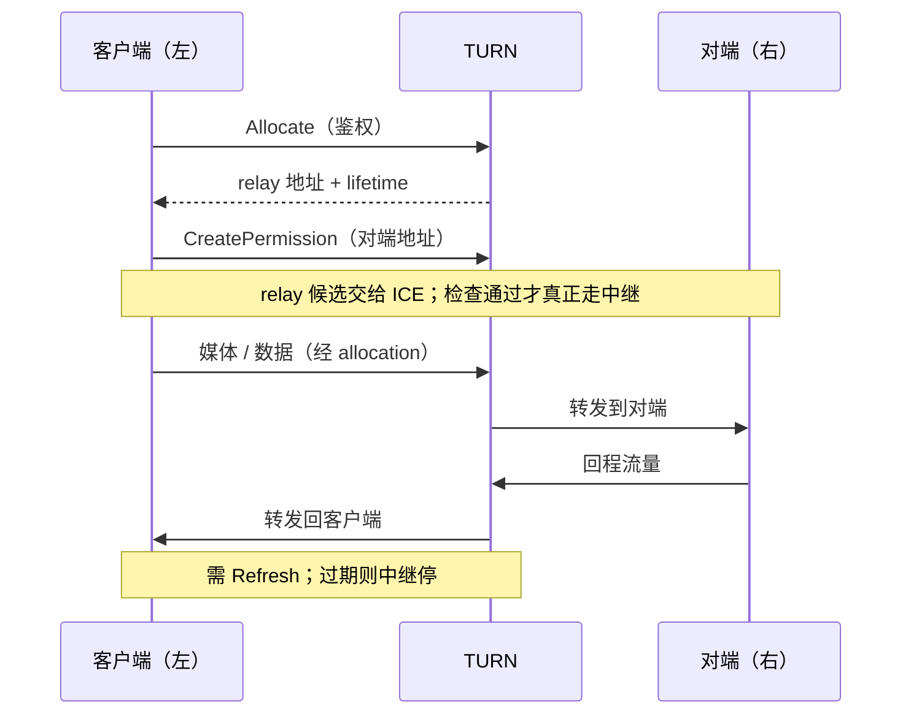
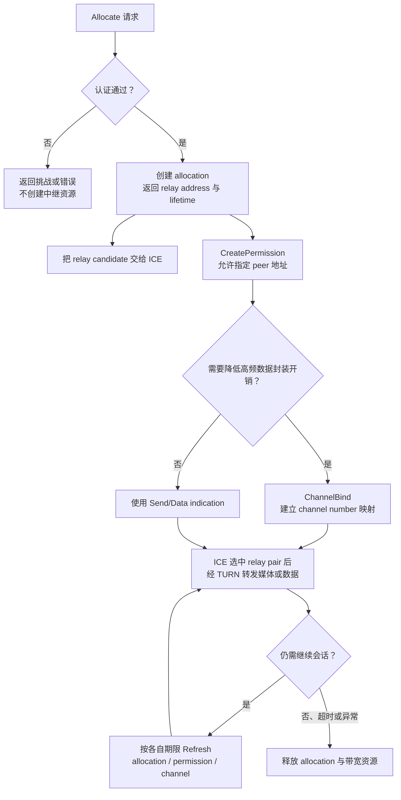

# TURN

> [!tip] 阅读提示
> **前置：** [[ICE]]、[[STUN]]。
> **初读：** 读到「初读到此为止」就停。弄清：TURN 是鉴权后的公网中继，保连通、费带宽。
> **深入：** Allocate/权限/生命周期与成本观测，部署排障时再读。

## 一句话说明

TURN（Traversal Using Relays around NAT）在端到端直连不可用或不稳定时，为客户端分配公网中继地址并转发数据。它提高受限网络下的连接成功率，但会增加服务器带宽、成本和通常的路径延迟；TURN 不是 SFU 或媒体业务服务器。

## 先记住这三句

1. TURN = 直连/打洞不行时，让服务器帮你**中继**媒体与数据；提高成功率，但更耗服务器带宽和钱。
2. 客户端先 Allocate 拿到中继地址，再作为 relay 候选交给 ICE；仍要检查选中后才会真正走中继。
3. 「配置了 TURN」≠「通话走了 TURN」；看 selected pair。UDP 受限时还可能落到 TCP/TLS 中继。

## 核心机制

- 客户端向 TURN Server 发起 Allocate，完成认证后获得 relay transport address；随后通过 CreatePermission 和可选的 ChannelBind 许可对端流量。
- 客户端把 relay candidate 交给 ICE。双方仍需交换并检查候选对，选中 relay pair 后媒体和数据才会沿中继传输。
- TURN 可承载 UDP，也可在 UDP 受限时使用 TCP 或 [[TLS]] 连接；端口、防火墙和 TLS 证书配置会影响回退路径。
- Allocation、permission、channel 和 credential 都有生命周期。Refresh、临时凭据和资源配额是长期运行服务的必要控制。

**图在说什么：** 左客户端向中间 TURN 申请中继地址并许可对端；ICE 选中 relay 后，媒体经 TURN 转到右对端（不是 TURN「替你编码」）。

## 示例场景

企业网络禁止对外 UDP，但允许 TLS 到 443。客户端先生成 relay UDP 候选失败，随后使用 TURN/TLS allocation；ICE 选中 TLS relay 后 DTLS 和 SRTP 建立，但端到端延迟上升，系统保持音频并降低视频层级。

---

> [!warning] 初读到此为止
> 上面这些已经够第一次阅读。下面是工程展开与排障细节（字段、指标、状态流），**第二轮或遇到具体问题时再读**；第一次直接点文末「第一次阅读下一站」即可。

## 工程要点

- 仅在服务端完成鉴权、配额、租期、realm、日志和滥用防护；禁止公开匿名中继，避免被耗尽带宽或用于反射攻击。
- 用 selected pair 统计 relay 使用比例、分配失败率、RTT、出站带宽和按地域的成本；不要用“配置了 TURN”推断实际走了中继。
- 优先测试 UDP relay，随后验证 TCP/TLS relay。强制 relay 是诊断和对照实验手段，不应默认覆盖所有网络。
- TURN 故障要与 ICE 候选交换、权限过期、服务端端口、防火墙和媒体层问题分别定位。

## 解决的问题

在端点之间无法直接建立或维持可用路径时，提供一个经过鉴权、可刷新和可计量的公网中继地址。

## 工作流程或状态流

1. 客户端向 TURN listener 发起 Allocate，并通过 realm/nonce/凭据完成认证。
2. 服务端创建 allocation，返回 relayed transport address 和 lifetime；客户端把它发布为 relay candidate。
3. 对端地址通过 CreatePermission 许可；高频媒体可用 ChannelBind/ChannelData 减少开销。
4. 双方把 relay candidate 交给 ICE 检查，selected relay pair 建立后媒体和数据经 allocation 转发。
5. 客户端周期 Refresh 延长 allocation 和权限；挂断、超时或异常时服务端回收资源。

**图在说什么：** Allocate 要先过认证才有中继地址与租期；之后还要 CreatePermission / ChannelBind，媒体才能经 relay 转发。

> [!note] 图的边界
> Allocation、permission 和 channel 是相关但不同的状态与寿命；图把它们画在一条主线上便于初读，并不表示三者必须同时创建或使用相同刷新周期。实际定时和报文字段应以所用 TURN 规范及实现版本为准。

## 关键对象、字段与报文

- Allocate Request/Response、realm、nonce、username、MESSAGE-INTEGRITY、lifetime 和 relayed/mapped address。
- Allocation 关联客户端传输五元组、relay 地址、租期、配额和统计；permission 关联允许的 peer address。
- ChannelBind 建立 channel number 与 peer address 映射；ChannelData 或 Send/Data 报文承载应用数据。
- transport 类型可为 UDP、TCP 或 TLS；listener 端口、证书、MTU 和服务器地域影响回退效果。

## 原理细节

TURN 不让对端直接访问内网地址，而是让双方主动与中继建立可达通道。服务器代替端点接收/发送数据，因此能绕过对等端入站过滤，但每个媒体包都消耗服务端网络和处理资源。Allocation、permission、channel 和凭据是不同生命周期，任一过期都可能造成“候选仍在但媒体静默”。

## 工程实现与取舍

- 采用短期凭据或等价的服务端鉴权，限制 allocation 数量、带宽、租期和可访问 peer，禁止匿名开放中继。
- 先优先 UDP relay，再为 UDP 受限网络提供 TCP/TLS；回退会增加封装、队头阻塞风险和延迟。
- 按地域和网络分布部署 relay，统计直连/relay 使用、峰值带宽、失败和成本；不要凭配置项估算实际使用率。
- 服务端日志关联 allocation、用户/会话、候选 generation 和释放原因，避免只看客户端 ICE failed。

## 常见误区与失败表现

- 有 relay candidate 就认为 TURN 可用：Allocate、permission、端口可达和 ICE 检查都可能失败。
- 只刷新 allocation 不刷新 permission/channel：对端数据仍会被服务端拒绝。
- 将 TURN 当成 SFU：TURN 原样转发单条连接流量，不管理发布/订阅或媒体层选择。
- 为所有用户强制 relay：成功率可能升高，但成本、RTT 和服务端容量压力也同步增加。

## 可观测指标与验证

- 记录 Allocate 成功率、认证错误、lifetime/refresh、permission/channel 过期、relay RTT、字节量和峰值并发。
- 关联 relay candidate、selected pair、ICE state、DTLS state、首包/首帧和媒体质量。
- 抓包分别查看 Allocate、Refresh、CreatePermission、ChannelBind/ChannelData，确认转发方向。
- 强制 relay、阻断 UDP、过期凭据、限制端口和重启 relay 节点，验证回退、重试和资源清理。

## 阅读导航

- **上一篇：** [[STUN]]
- **下一篇：** [[ICE]]
- **所属专题：** [[00-知识地图/专题说明/03 ICE、STUN、TURN 与传输安全|03 ICE、STUN、TURN 与传输安全]]
- **回看：** [[RTC 知识总览]] · [[00-知识地图/学习路线/学习进度模板|学习进度]] · [[00-知识地图/学习路线/RTC 工程师学习路线.canvas|阶段路线]]

- **第一次阅读下一站：** [[ICE]]

> 读完先回所属专题做练习/验收，再点下一篇。内部链接最多再追一层；不影响理解的陌生词先记下。

## 图谱关系

- 地址来源：[[NAT 映射与过滤行为]]解释何时需要绕过对等端入站限制。
- 候选类型：[[ICE 候选与候选对]]把 relay 地址纳入候选组合。
- 选路验证：[[ICE 连通性检查与选路]]检查并提名 TURN 路径。
- 直连工具：[[STUN]]适合发现和检查，不能替代 TURN 转发。
- 所属地图：[[连接与安全地图]]组织 TURN、ICE 和网络穿越知识。

## 参考资料

- 《WebRTC 权威指南》第 9 章“NAT 与防火墙穿越”：`90-参考资料/音视频与 WebRTC 书库/webrtc-authoritative-guide-zh/content/09-nat-firewall-traversal.md`
- 《WebRTC 教程》第 7 章“STUN、TURN 与 ICE”：`90-参考资料/音视频与 WebRTC 书库/webrtc-tutorial-zh/content/07-chapter-7.md`
- 《WebRTC Cookbook》第 2 章“安全支持”：`90-参考资料/音视频与 WebRTC 书库/webrtc-cookbook/translation/02-supporting-security.md`
- 《Learning WebRTC》第 3 章“创建基本的 WebRTC 应用”：`90-参考资料/音视频与 WebRTC 书库/learning-webrtc/translation/03-creating-a-basic-webrtc-application.md`
