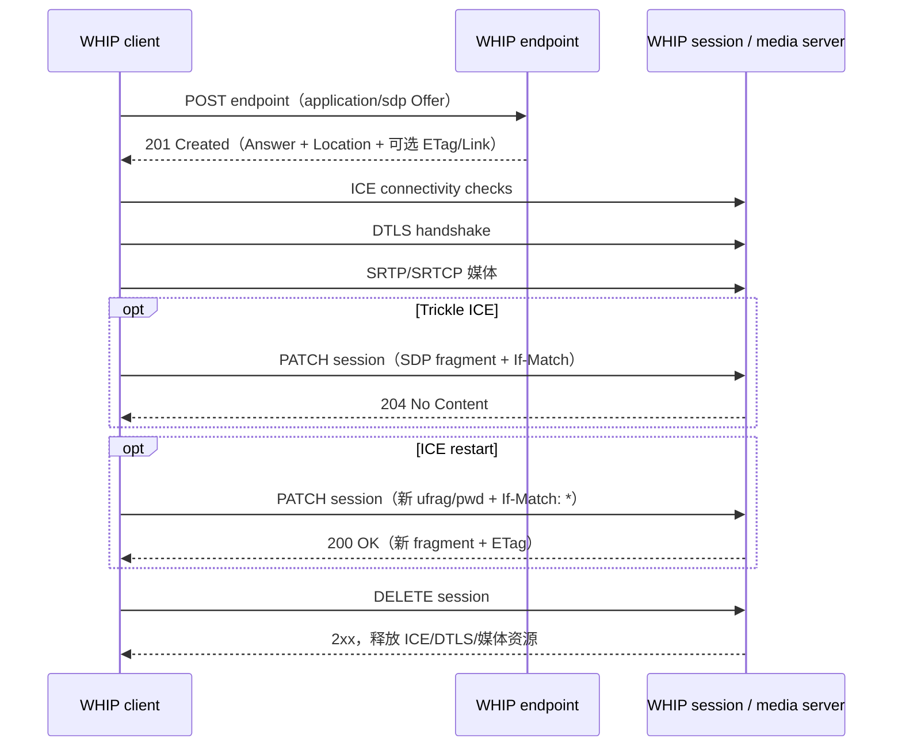

# WHIP 与 WHEP

> [!tip] 阅读提示
> **前置：** [[Offer Answer]]、[[SDP]]、[[ICE]]、[[DTLS]]、[[SRTP]]。
> **初读：** 先看“实际场景与角色”“两个 URL、两条平面”“WHIP 主流程”，回答：为什么 HTTP `201` 还不代表已经有媒体？
> **深入：** 实现接入时重点看 Trickle ICE、ICE restart、会话状态机、安全与故障注入；WHEP 行为必须核对草案版本。

> [!important] 标准状态（核对日期：2026-09-13）
> **WHIP 已不是草案。** 它在 2025 年 3 月发布为 IETF Standards Track **RFC 9725**。
> **WHEP 仍是工作草案。** 本篇固定讨论 `draft-ietf-wish-whep-04`（2026 年 6 月版本，标称 2026-12-24 到期）。部署前必须重新核对 Datatracker 和媒体服务器文档，不能把本篇的 WHEP 细节当成稳定 RFC。

## 一句话说明

WHIP（WebRTC-HTTP Ingestion Protocol）用一次 HTTP `POST` 完成发布端到媒体服务器的 SDP Offer/Answer，并用会话资源 URL 承载 ICE 更新和销毁；WHEP（WebRTC-HTTP Egress Protocol）面向播放端。二者标准化的是 **WebRTC 的 HTTP 控制面**，媒体仍通过 ICE、DTLS、SRTP、RTP/RTCP 传输。

## 实际场景与角色

主播用 OBS 或硬件编码器向直播平台发布音视频时，平台需要一种比完整房间信令更窄、更容易互通的入口：

```text
主播编码器 --HTTPS + SDP--> WHIP 接入点
主播编码器 <--ICE / DTLS / SRTP--> 媒体服务器
媒体服务器 --转发或处理--> SFU / 录制 / 转码 / 分发

观众播放器 --HTTPS + SDP--> WHEP 接入点
观众播放器 <--ICE / DTLS / SRTP-- 媒体服务器
```

WHIP client 是编码器或媒体生产者；WHIP endpoint 接收初始创建请求；media server 真正接收媒体；WHIP session 是服务端为这次推流分配的 HTTP 资源。这几个角色可以部署在同一进程，也可以经过网关和负载均衡后落到不同节点。

> [!example] 生活化理解
> endpoint URL 像“办证窗口”，用来申请新会话；`Location` 返回的 session URL 像“这次业务的受理单号”，只管理这一条会话。它不是媒体播放地址，也不能拿来代表业务流 ID。类比只解释资源关系；真实权限仍由 HTTP 鉴权、服务端状态和不可猜测的 URL 共同决定。

## 问题边界

- **WHIP/WHEP 负责：** 初始 SDP 交换、会话资源定位、可选的 Trickle ICE/ICE restart、会话销毁、HTTP 鉴权与部署入口。
- **不负责：** 采集、编码算法、RTP 打包、拥塞控制实现、房间成员管理、流目录、录制转码、观众权限和播放器 UI。
- **媒体不是走 HTTP：** HTTP 只传控制信息；实际音视频通常是 UDP 上的 SRTP，受限网络中也可能经 TURN 中继。
- **WHIP 不等于 RTMP/HTTP-FLV：** [[RTMP 推流与拉流|RTMP]] 和 [[HTTP-FLV 拉流服务|HTTP-FLV]] 使用不同封装与传输模型。
- **一次 WHIP 成功不等于端到端直播成功：** 发布会话、媒体入站、后端分发、WHEP/其他播放会话分别需要证据。
- **与房间信令可并存：** WHIP 可只负责导播或编码器的发布入口，入房、成员和订阅仍由业务信令处理。

## 两个 URL、两条平面

| 对象 | 谁创建/持有 | 用途 | 不能混同 |
| --- | --- | --- | --- |
| WHIP endpoint URL | 平台配置给客户端 | `POST` 创建新 ingest 会话 | 不是某次会话的固定句柄 |
| WHIP session URL | 服务端在 `Location` 返回，客户端保存 | `PATCH` ICE 信息、`DELETE` 结束会话 | 不是播放 URL、流 ID 或房间 ID |
| 业务 stream ID | 业务系统定义 | 绑定频道、主播、租户和策略 | RFC 9725 不定义其格式 |
| `ETag` | WHIP session 生成 | 标识 ICE generation，约束 `PATCH` | 不是 HTTP 缓存版本，也不是会话 ID |
| Bearer Token | 鉴权系统签发，客户端携带 | 授权访问 endpoint/session | 不应出现在日志、指标标签或跳转 URL |
| SDP Offer/Answer | 客户端/服务端各自产生 | 协商媒体、ICE、DTLS 参数 | SDP 本身不执行连通性检查 |
| SDP fragment | 客户端与 session 交换 | 仅更新 ICE 候选或 ICE 凭据 | 不是一般意义的重新协商 |

```text
控制面：POST / PATCH / DELETE
             |
             +--> 创建、修改或回收 session resource

媒体面：ICE checks -> selected pair -> DTLS -> SRTP/SRTCP -> RTP/RTCP
```

## WHIP 主流程



`201 Created` 只证明 HTTP 资源和 SDP Answer 已生成；之后还要完成 ICE、DTLS，并观察到有效 SRTP/RTP，才能说媒体真正进入服务器。

## 1. 创建会话：POST Offer，返回 Answer

### 请求与响应

WHIP client 对 **endpoint URL** 发送：

```http
POST /whip/live/camera-01 HTTP/1.1
Host: ingest.example.com
Authorization: Bearer <redacted>
Content-Type: application/sdp

v=0
o=- 123456 2 IN IP4 127.0.0.1
s=-
t=0 0
a=group:BUNDLE 0 1
m=audio 9 UDP/TLS/RTP/SAVPF 111
a=mid:0
a=sendonly
a=setup:actpass
a=ice-ufrag:local01
a=ice-pwd:<local-ice-password>
a=rtcp-mux
a=rtcp-mux-only
a=msid:stream1 audio1
m=video 0 UDP/TLS/RTP/SAVPF 96
a=mid:1
a=bundle-only
a=sendonly
a=rtcp-mux
a=rtcp-mux-only
a=msid:stream1 video1
```

成功响应的核心契约是：

```http
HTTP/1.1 201 Created
Content-Type: application/sdp
Location: https://ingest.example.com/whip/session/7f4a...
ETag: "ice-generation-0"
Link: <stun:stun.example.net>; rel="ice-server"

v=0
...
a=group:BUNDLE 0 1
a=ice-lite
a=setup:passive
a=recvonly
...
```

- 请求 Body 必须是 JSEP initial offer，`Content-Type` 必须为 `application/sdp`。
- 成功状态是 `201 Created`；Body 是 SDP Answer，响应 `Content-Type` 也是 `application/sdp`。
- `Location` 指向新建的 **WHIP session URL**；之后不要再对 endpoint URL 发会话级 `PATCH`/`DELETE`。
- 使用 Trickle ICE 或 ICE restart 时保存 `ETag`。它属于 ICE generation，而不是业务对象版本。
- `Link: ...; rel="ice-server"` 可下发 STUN/TURN URI；TURN 条目还可带 `username` 和 `credential`。

### SDP 方向与 WebRTC 约束

RFC 9725 为简化 ingest 实现收紧了普通 WebRTC 的自由度：

| 约束 | WHIP client Offer | WHIP endpoint Answer | 实现含义 |
| --- | --- | --- | --- |
| 媒体方向 | `sendonly` 是推荐值；允许 `sendrecv` | 必须 `recvonly` | Offer 不能使用 `inactive` 或 `recvonly` |
| BUNDLE | 支持 RFC 9143，使用 `max-bundle` | 同样支持 BUNDLE | 复用一套 ICE/DTLS 传输 |
| RTCP 复用 | bundled m-line 含 `rtcp-mux-only` | 同样要求 | 不为 RTP/RTCP 分配两套端口 |
| MediaStream | 所有 m-line 的 `msid` 使用同一 stream 标识 | 按协商接收 | 至少一条 Track；同一 media kind 不能有两条及以上 Track |
| 部分成功 | 不建议单独拒绝某个 m-line | 更适合整体拒绝 POST | 避免“有音频无视频”却被误报为发布成功 |
| DTLS role | `setup:actpass` 是推荐值；仅实现 DTLS client 时可用 `active` | 与 Offer 匹配，通常是 server/passive | 不支持 `active` Offer 时整体返回 400/422 |
| ICE 模式 | 必须实现并使用 full ICE | 通常应为 full ICE；公网地址对所有获授权 client 可达时可用 ICE-lite | ICE-lite 不是 client 的简化选项 |

> [!note] `sendrecv` 的准确边界
> RFC 9725 是“客户端 **SHOULD** 用 `sendonly`，但 **MAY** 用 `sendrecv`”；它明确禁止的是 Offer 中的 `inactive` 和 `recvonly`。工程上仍应固定生成 `sendonly`，因为服务器 Answer 必须是 `recvonly`，WHIP 也不提供反向媒体。

WHIP 只允许一个 MediaStream，并且每种 media kind 最多一条 Track。普通 WebRTC 中“同一 PC 推两路摄像头”不能直接假定在 WHIP 中成立。需要多路独立源时，通常创建多个 WHIP 会话，或先在编码器侧合成；服务器不支持数量时应整体返回 `422 Unprocessable Content` 或 `400 Bad Request`。

### 不支持一般 SDP 重新协商

初始 POST 完成后：

- 不能通过 WHIP 改 codec、增加/删除 m-line、改变 Track 数量或媒体方向；
- `PATCH` 只承载 ICE 相关信息；
- 换摄像头但保持同一已协商 Track/codec 是否可用，取决于 WebRTC 发送端实现，不等于发生 SDP renegotiation；
- 必须改变非 ICE SDP 时，应删除旧 session，再用新的 initial offer 创建新 session。

这与多人通话中的 `negotiationneeded`/re-offer 不同，不能照搬通用 PeerConnection 信令状态机。

## 2. Trickle ICE：PATCH 增量候选

### 为什么需要 PATCH

客户端可以等 ICE gathering 完成后把全部本地候选放进初始 Offer，也可以尽快 POST 一个只含少量甚至不含候选的 Offer，再通过 Trickle ICE 增量发送候选。后者缩短“开始请求”的等待时间。

WHIP 的不对称点是：

- client 可以在 `201` 后向 server trickle；
- endpoint 必须在返回 Answer 前收集完整的服务端候选；
- session 在 Answer 之后不能再向 client trickle 新候选。

client 在收到 `201` 前还不知道 `Location`，也可能不知道 `ETag`，所以这段时间产生的候选必须先缓冲。收到响应后宜合并成一次 PATCH，减少 HTTP 请求数。

### 正常候选 PATCH

```http
PATCH /whip/session/7f4a... HTTP/1.1
Host: ingest.example.com
Authorization: Bearer <redacted>
If-Match: "ice-generation-0"
Content-Type: application/trickle-ice-sdpfrag

a=group:BUNDLE 0 1
m=audio 9 UDP/TLS/RTP/SAVPF 111
a=mid:0
a=ice-ufrag:local01
a=ice-pwd:<local-ice-password>
a=candidate:1 1 UDP 2122260223 192.0.2.10 54321 typ host
a=end-of-candidates
```

```http
HTTP/1.1 204 No Content
```

关键规则：

1. Body 是 RFC 8840 SDP fragment，媒体类型必须为 `application/trickle-ice-sdpfrag`。
2. 普通候选 PATCH 的 `If-Match` 使用当前 ICE generation 的强 `ETag`。
3. `max-bundle` 下 fragment 只需携带 BUNDLE offerer-tagged m-line；标记为 `bundle-only` 的 m-line 不单独收集候选。
4. 成功返回 `204 No Content`，无 Body，并且 **不得返回新的 `ETag`**；客户端继续保留当前值。
5. 不支持的 candidate transport 或无法解析的地址由服务器静默丢弃，其余候选继续处理；不能因为收到 204 就假定每个候选都可用。
6. 已被成功 PATCH 确认的候选，后续 fragment 可以不再重复。

### ETag、并发与错误

同一 session 允许存在重叠的 PATCH，它们可能乱序到达。因此实现不能只靠“请求发送顺序”判断候选属于哪次 ICE：

| 请求情况 | 服务端响应 | 客户端处理 |
| --- | --- | --- |
| 当前 generation + 匹配 `If-Match` | `204` | 记为本批已接收，不更新 ETag |
| 缺少条件标签 | `428 Precondition Required` | 取回/确认当前会话状态，不能无条件重放 |
| 标签与当前 generation 不匹配 | `412 Precondition Failed` | 丢弃旧批次，按当前 generation 决定 restart 或结束 |
| PATCH 类型正确但对应操作不受支持 | `422 Unprocessable Content` | 不要把 candidate PATCH 与 restart PATCH 混为一类 |
| Content-Type 错或 SDP fragment 畸形 | 合适的 `4xx` | 修请求，不做无界重试 |

应用层不能把 `409 Conflict`、私有 JSON 错误码或 `Idempotency-Key` 说成 WHIP 标准要求；若产品使用它们，应在接口契约中单独标记。

## 3. ICE restart：仍用 PATCH，但切换 generation

网络从 Wi-Fi 切到蜂窝网、选中路径失效或持续连通性检查失败时，可能需要 [[ICE Restart]]。WHIP 不发新的完整 SDP Offer，而只交换新的 ICE 信息；之前协商的 codec、m-line、方向和 DTLS 相关非 ICE 信息继续有效。

### 请求与响应

restart 请求携带新的本地 `ice-ufrag`、`ice-pwd` 和新候选。与普通 candidate PATCH 不同，RFC 9725 要求：

```http
PATCH /whip/session/7f4a... HTTP/1.1
Host: ingest.example.com
Authorization: Bearer <redacted>
If-Match: *
Content-Type: application/trickle-ice-sdpfrag

a=ice-options:trickle ice2
a=group:BUNDLE 0 1
m=audio 9 UDP/TLS/RTP/SAVPF 111
a=mid:0
a=ice-ufrag:local02
a=ice-pwd:<new-local-ice-password>
a=candidate:2 1 UDP 2122260223 198.51.100.20 50000 typ host
```

成功时：

```http
HTTP/1.1 200 OK
ETag: "ice-generation-1"
Content-Type: application/trickle-ice-sdpfrag

a=ice-lite
a=ice-options:trickle ice2
a=group:BUNDLE 0 1
m=audio 9 UDP/TLS/RTP/SAVPF 111
a=mid:0
a=ice-ufrag:remote02
a=ice-pwd:<new-remote-ice-password>
a=candidate:10 1 UDP 2130706431 203.0.113.8 40000 typ host
a=end-of-candidates
```

必须把两类 PATCH 分清：

| 操作 | `If-Match` | 成功状态 | 响应 Body | ETag |
| --- | --- | --- | --- | --- |
| 增加当前 generation 候选 | 当前强 ETag，例如 `"ice-generation-0"` | `204` | 无 | 不返回、不改变 |
| 发起 ICE restart | `*` | `200` | 新远端 ICE fragment | 返回新的强 ETag |

### restart 状态处理

1. 生成新的本地 ICE credentials 和候选，发送 restart PATCH。
2. 一旦发出新的 restart，废弃先前本地 ICE credentials；旧 generation 的未决 PATCH 响应不能再应用。
3. 只应用“最后一次已发送 restart”对应响应中的 ICE 信息。
4. 成功后，用新集合 **替换** 旧的 remote candidates；不能简单追加，否则旧路径可能继续污染选路。
5. 保存响应中的新 `ETag`，之后的 candidate PATCH 使用它。
6. 新 generation 的候选在拿到 restart 响应与新 ETag 前先缓冲。
7. restart 失败时，服务器不应立刻销毁旧 ICE session；客户端可重试一次新的 restart 或 DELETE。若 consent 已过期，最终仍要终止会话。

如果乱序导致两端 ICE credentials 不一致，STUN 检查会因用户名/凭据无效而被丢弃。检测到这种状态时，客户端需要发起一次新的 restart，让双方收敛到同一 generation。

## 4. 会话生命周期与状态机

### 客户端状态

| 状态 | 进入条件 | 必须保存 | 离开条件/失败动作 |
| --- | --- | --- | --- |
| `IDLE` | 尚未创建 | endpoint、授权上下文、业务 stream ID | 生成 initial offer |
| `POST_PENDING` | POST 已发出 | request ID、Offer 摘要、待发候选缓冲 | 收到 201；超时进入“不确定创建” |
| `SESSION_CREATED` | 验证 201/Answer/Location | session URL、ETag、Answer 摘要 | 设置 remote description，开始 ICE |
| `CONNECTING` | ICE/DTLS 建连 | ICE generation、候选对、DTLS role | 媒体可用或连接失败 |
| `MEDIA_ACTIVE` | DTLS 成功且已有有效媒体发送/接收证据 | selected pair、入站统计、最后媒体时间 | restart、业务结束或故障 |
| `RESTARTING` | 发出 restart PATCH | restart 序号、新 credentials、未决请求集合 | 仅接受最后一次 restart 的 200 |
| `TERMINATING` | 业务结束或故障回收 | session URL、关闭原因 | DELETE 2xx 或本地超时 |
| `CLOSED` | 资源已回收/本地放弃 | 终止原因、最终指标 | 不再复用旧 Location/ETag |

### 服务端资源所有权

一次 POST 可能依次占用：

```text
HTTP session record
  -> ICE agent / candidate ports
  -> DTLS transport and SRTP contexts
  -> RTP receiver, jitter/feedback state
  -> stream registry / SFU publication
  -> recorder or transcoder bindings
```

服务端应让一个 session owner 统一驱动创建和销毁，保证失败回滚顺序与正常关闭一致。常见不变量：

- `Location` 唯一对应一个服务端会话资源；
- ICE generation 更新与 ETag 更新原子化；
- 媒体发布只有在鉴权、SDP 和传输条件满足后才进入业务可见状态；
- DELETE、consent failure、DTLS teardown、源断开和超时最终走到同一个幂等回收过程；
- 先停止新任务和回调，再解绑业务发布，最后释放传输/端口，避免回调访问已销毁对象。

### 非正常结束与超时

- full ICE 实现使用 consent freshness 检测非优雅断开；
- 任一侧的 DTLS teardown 也可触发会话终止；
- 媒体源进程崩溃、网络永久中断或客户端漏发 DELETE 时，服务端必须靠状态超时回收；
- RFC 9725 没有替产品规定一个通用的“建连超时/无媒体超时”秒数，部署应结合资源预算、RTT 和恢复策略明确配置并记录；
- 媒体服务器主动终止时应立即撤销 ICE consent，避免对已关闭端继续发送。

## 5. POST 重试与“丢失 201”问题

HTTP `POST` 不是幂等操作。最危险的情况不是明确收到 5xx，而是服务器已经创建会话并返回 `201 + Location`，响应却在网络中丢失：

```text
client              server
  | POST -------------->|
  |                      | 创建 session A
  |<--- 201/Location -X  | 响应丢失
  | POST retry --------->| 可能再创建 session B
```

客户端没有 session A 的 Location，就无法按标准对它 DELETE。工程策略必须由产品接口明确选择：

- 将短期、有作用域的 token/nonce 绑定一次创建，服务端检测重复；
- 使用业务侧 publication key 查询和回收孤儿会话；
- 若采用 `Idempotency-Key`，必须说明它是私有扩展，并定义保存窗口、相同 key 不同 body 的处理；
- 对超时 POST 做有限次数退避，不要无限重试；
- 服务端为“创建但从未完成 ICE/DTLS”的资源设置较短回收策略，并限制每 token、租户、IP 的并发创建数。

## 6. HTTP 状态、错误体与客户端策略

WHIP endpoint 与 session 没有由 RFC 9725 定义的 GET 表示；收到 GET 时应返回无内容的 2xx。不要依靠 GET session URL 查询“是否正在推流”，业务状态查询应由平台另行定义。

| 结果 | 语义 | 建议动作 |
| --- | --- | --- |
| `201 Created` | initial Offer 已接受，返回 Answer/Location | 验证头和 SDP，再进入 ICE；不是媒体成功 |
| `204 No Content` | 普通 Trickle ICE PATCH 已处理 | 保持当前 ETag，继续观察 ICE |
| `200 OK` + fragment + 新 ETag | ICE restart 成功 | 原子切换 generation 和远端候选集 |
| `400 Bad Request` / `422 Unprocessable Content` | SDP、约束或 PATCH 操作不被接受 | 修请求或能力；不能盲重试 |
| `401 Unauthorized` / `403 Forbidden` | 未认证或无权限 | 刷新/更换凭据；禁止高频循环 |
| `412 Precondition Failed` | `If-Match` 与当前 generation 不符 | 丢弃旧 PATCH，重新收敛 |
| `428 Precondition Required` | PATCH 缺少条件标签 | 补正确并发控制，不要用无条件 PATCH |
| `503 Service Unavailable` | 临时过载/维护 | 尊重 `Retry-After`，指数退避 |
| 其他 `4xx/5xx` | 按 HTTP 类别解释 | 客户端必须能按通用 n00 语义降级处理 |

服务端可使用 RFC 9457 Problem Details 提供机器可读错误原因，但客户端不能依赖一个未标准化的精确状态码来判断所有 WHIP 错误。`409`“流已占用”等属于具体产品契约，不是 RFC 9725 固定语义。

## 7. 部署、鉴权与安全

### HTTPS 与 Bearer

- RFC 9725 要求使用 HTTPS，以维持 WebRTC 安全模型。
- WHIP 各实体必须支持 HTTP authentication；客户端必须实现 Bearer Token 机制。
- 配置了 Bearer 后，除 CORS preflight OPTIONS 外，对 endpoint 和 session 的请求都应携带 `Authorization`。
- token 应限制租户、流、操作、时效和并发数；泄露后的权限不应扩展到其他流。
- 日志只能记录 token 哈希前缀或内部 credential ID，不能记录完整 Authorization、URL 中的 secret、ICE password、TURN credential 或 SRTP key material。
- session URL 要有足够随机性并做鉴权，防止 IDOR 猜测后批量 DELETE。

### 307 重定向与负载均衡

WHIP client 应支持 HTTP 重定向。为了保持 POST 方法和 SDP Body，入口负载均衡优先返回：

```http
HTTP/1.1 307 Temporary Redirect
Location: https://media-17.example.net/whip/live/camera-01
```

RFC 9725 明确不应以 `301`/`302` 承担这一流程，因为某些客户端可能把 POST 改成 GET。PATCH 和 DELETE 不要求支持重定向，所以初始响应返回的 session URL 应直接路由到能持有会话状态的节点。

跨 origin 跳转时，客户端必须按 HTTP/浏览器安全规则重新判断凭据范围；不要把 Bearer 无条件转发给任意 Location。生产环境宜校验 HTTPS、允许的 host/origin 和证书，再携带授权。这个 allowlist 是部署安全策略，不是 WHIP 新增的 HTTP 语义。

### STUN/TURN 下发

`201` 可以返回多条：

```http
Link: <stun:stun.example.net>; rel="ice-server"
Link: <turn:turn.example.net?transport=udp>; rel="ice-server"; username="u"; credential="<redacted>"
Link: <turns:turn.example.net?transport=tcp>; rel="ice-server"; username="u"; credential="<redacted>"
```

客户端应用这些配置的时机受 WebRTC 实现限制：有的实现需要在 `setLocalDescription` 前设置 `RTCConfiguration`，但 Link 直到 POST 响应才到达。可选策略是预配置 ICE servers、支持响应后更新并在必要时 restart，或通过非 CORS preflight 的 OPTIONS 提前获取；RFC 将最后一种方式标为不推荐，接入时应实测所用 WebRTC 版本。

### CORS 与浏览器

WHIP endpoint 必须支持 CORS OPTIONS，成功 OPTIONS 响应应包含 `Accept-Post: application/sdp`。浏览器部署还要正确配置：

- 允许实际使用的 `POST`、`PATCH`、`DELETE`；
- 允许 `Authorization`、`Content-Type`、`If-Match` 请求头；
- 暴露前端代码需要读取的 `Location`、`ETag`、`Link` 响应头；
- origin allowlist 与凭据策略匹配；
- 不在 preflight 响应中生成昂贵的临时 TURN credential。

### 资源耗尽防护

分别对 POST、PATCH、DELETE 限流：

- POST 会提前占用 SDP 解析、ICE 端口和 DTLS 状态，攻击者可以创建后不建连；
- PATCH flood 可反复触发候选处理或 restart；
- 可猜测的 session URL 加 DELETE flood 会终止合法推流；
- 限制 SDP 大小、m-line/候选数量、每 session 的 PATCH 速率、未连接 session 生命周期及每主体并发数；
- 过载返回 `503` 时可带 `Retry-After`，客户端必须有抖动退避。

## 8. Simulcast、SVC 与媒体服务器边界

- WHIP 可以通过 SDP 按 RFC 8853 协商 [[Simulcast]]；客户端想启用时必须在 Offer 中表达，服务器接受后按规范生成 Answer。
- SVC 可以使用，但没有一个通用 SDP 机制完整协商所有 SVC 行为；编码器要结合已协商 codec、使用场景和下游解码能力配置 [[SVC]]。
- WHIP session 只解决发布边缘，不规定 SFU 内部 SSRC/RID 改写、订阅选择、录制或转码。
- 一个 WHIP session 不应直接充当观众订阅资源。发布进入 [[SFU]] 后，观众可通过 WHEP、房间信令或其他播放协议建立独立出站会话。

## 9. WHEP：对称目标，不是完全镜像

> [!warning] WHEP 版本边界
> 以下行为来自 **`draft-ietf-wish-whep-04`**。Internet-Draft 可以更新、替换或废弃；媒体服务器也可能实现更早草案或厂商子集。上线前以双方明确支持的版本和互操作测试为准。

WHEP 面向 egress：播放器向服务器表达接收能力，服务器发送媒体。方向与 WHIP 相反，但 `-04` 允许两种初始 Offer/Answer 路径。

在 `-04` 中，player 可以先对候选 URL 发 HEAD；若收到 `200 OK` 且 `Content-Type: application/sdp`，可将其识别为 WHEP endpoint。这个发现方式仍属于草案行为，不应据此推断某个 WHIP URL 或厂商旧版 WHEP 实现也支持 HEAD。

### 路径 A：服务器接受客户端 Offer

```text
WHEP player  --POST application/sdp（Offer）--> endpoint
WHEP player <--201 application/sdp（Answer）-- endpoint
              + Location（session URL）
```

- player Offer 推荐 `recvonly`，允许 `sendrecv`；不得使用 `inactive` 或 `sendonly`；
- endpoint Answer 必须是 `sendonly`；
- `201 Created` 表示 WHEP session 已创建，可以继续 ICE/DTLS/媒体建连。

### 路径 B：服务器返回 counter-offer

```text
WHEP player  --POST application/sdp（Offer）--> endpoint
WHEP player <--406 application/sdp（counter-offer）+ Location--
WHEP player  --PATCH application/sdp（Answer）--> session URL
WHEP player <--204 No Content------------------- session
```

- `406 Not Acceptable` 只有同时包含 `Content-Type: application/sdp` 和语法有效的 SDP Offer 时，才能解释成 WHEP counter-offer；否则按普通 HTTP 错误处理。
- endpoint counter-offer 推荐 `sendonly`，允许 `sendrecv`；player Answer 必须 `recvonly`。
- `Content-Type` 可带 `valid-until`；`-04` 中未提供时，counter-offer 默认在响应发出后 30 秒失效。
- 这次 `PATCH application/sdp` 是回答 counter-offer，不是 ICE PATCH。ICE 仍使用 `application/trickle-ice-sdpfrag`，实现必须按 Content-Type 分派。
- WHEP `-04` 允许 Answer 通过将 m-line port 置 0 来部分拒绝媒体；这与 WHIP 倾向整体拒绝、避免部分 ingest 成功不同。

### WHIP/WHEP 快速对照

| 项目 | WHIP RFC 9725 | WHEP draft `-04` |
| --- | --- | --- |
| 用途 | 发布/摄入 | 播放/播出 |
| 初始发起 | client POST Offer | player POST Offer |
| 推荐 Offer 方向 | `sendonly` | `recvonly` |
| 正常 Answer 方向 | endpoint `recvonly` | endpoint `sendonly` |
| counter-offer | 不支持 | 草案允许 406 + SDP Offer |
| 一般重新协商 | 不支持 | initial exchange 后只允许草案定义的 ICE 更新 |
| 部分 m-line 接受 | WHIP 不建议 | `-04` 允许 |
| 稳定性 | Standards Track RFC | Work in Progress |

## 10. 可观测性：分层证明成功

一次会话至少拆成五层证据：

| 层级 | 成功证据 | 常见“假成功” |
| --- | --- | --- |
| HTTP 资源 | POST 201、Location 可解析；PATCH/DELETE 返回预期 2xx | 201 后 session 随即泄漏或无法路由 |
| SDP/JSEP | `setLocalDescription`/`setRemoteDescription` 成功，方向/codec/mid 正确 | Answer 可设置但目标 codec 不符合业务需求 |
| ICE | selected candidate pair、consent 有效、generation 一致 | `checking` 长期不收敛，或只收集到不可达 host candidate |
| DTLS/SRTP | DTLS connected，SRTP 上下文建立，无持续鉴权失败 | ICE connected 但 fingerprint/role 错导致 DTLS 失败 |
| 媒体/业务 | RTP 包数与字节增长、RTCP 正常、服务器发布状态与下游播放正常 | 有包但零有效帧、无关键帧、后端未登记为可订阅 |

### 建议关联字段

日志和 trace 应能关联但不能泄密：

```text
request_id
tenant_id / stream_id
endpoint_host
session_id（内部 ID，或 Location 的不可逆摘要）
peer_connection_id
ice_generation
etag_hash
selected_pair 类型（host/srflx/relay、udp/tcp）
dtls_role / negotiated_srtp_profile
codec / mid / rid / ssrc
first_rtp_ms / first_decodable_frame_ms
termination_reason
```

时间线至少记录：POST 开始、201 返回、remote description 设置、ICE selected、DTLS connected、首个 RTP、首个可解码帧、最后媒体、DELETE 开始/结束。用同一单调时钟计算耗时；不要把服务器墙钟差当成网络阶段耗时。

## 11. 故障注入与协议验收

| 用例 | 注入方法 | 预期结果 | 必看证据 |
| --- | --- | --- | --- |
| 基本 WHIP | 有效 sendonly Offer | 201 + Answer + Location，最终有入站 RTP | HTTP、SDP、ICE、DTLS、媒体五层 |
| 错误媒体类型 | POST 使用 `application/json` | 4xx，不创建可泄漏 session | 资源计数不增长 |
| 非法方向 | Offer 使用 `recvonly` | 整体拒绝 | Problem Details/SDP 校验日志 |
| 多同类 Track | 一个 stream 放两条 video Track | 400/422，不能部分创建 | m-line 与 session 计数 |
| 候选早到 | `201` 前产生多个 candidate | 缓冲，拿到 Location/ETag 后聚合 PATCH | 候选未丢、请求数受控 |
| 普通 trickle | 当前 ETag 发 candidate PATCH | 204，无响应 ETag | generation 保持不变 |
| 缺 ETag | 去掉 `If-Match` | 428 | session 仍存活 |
| 旧 ETag | restart 后重放旧 candidate PATCH | 412 | 旧候选未进入新集合 |
| PATCH 乱序 | 并发发送多批 candidate | 同 generation 安全处理 | request 序号与候选去重 |
| ICE restart | 切换网络并发新 credentials | 200 + 新 fragment + 新 ETag，替换远端候选 | generation、STUN username、selected pair |
| restart 响应乱序 | 连发两次 restart，延迟第一次响应 | 只应用最后一次请求的响应 | 旧响应被忽略计数 |
| 丢失 201 | 服务端创建后丢响应 | 不无限重复创建，孤儿会话按策略回收 | token/业务 key、orphan 指标 |
| 307 | endpoint 跳转到允许的 HTTPS host | POST 方法和 SDP Body 保留 | redirect chain、最终 endpoint |
| 鉴权过期 | POST/PATCH/DELETE 使用过期 token | 401/403，不泄露 token | 认证原因码、脱敏日志 |
| 仅 TURN 网络 | 阻断直连 UDP，保留 TURN | relay pair 建连或明确失败 | candidate pair、TURN 分配 |
| 漏发 DELETE | 强制杀死客户端 | consent/超时触发回收 | session 数回落、终止原因 |
| 媒体中断 | 建连后停止编码但不关 PC | 按业务 idle 策略告警/回收 | 最后 RTP、RTCP、consent 区分 |
| 浏览器 CORS | 不同 origin 发起完整流程 | preflight、响应头暴露正确 | 浏览器 Network/console |
| WHEP counter-offer | 服务端返回 406 + SDP Offer | player 在有效期内 PATCH SDP Answer | Content-Type 分派、204 |

验收时不要只看“播放器有画面”。至少保留一份脱敏 HTTP 交换、SDP 摘要、ICE candidate-pair 统计和服务端媒体计数，以便失败时知道卡在哪一层。

## 12. 实现检查清单

### 客户端

- [ ] 从受信任配置或业务 API 获得 endpoint 和 token；WHIP 本身不规定服务发现与 token 分发。
- [ ] 固定区分 endpoint URL、session URL 和业务 stream ID。
- [ ] 验证 `201`、`Content-Type`、Answer、Location；需要 PATCH 时保存 ETag。
- [ ] `201` 前缓冲 candidate，之后聚合发送。
- [ ] 普通 candidate PATCH 使用当前 ETag；restart 使用 `If-Match: *`。
- [ ] restart 后只接受最后一次请求的响应，并替换远端候选集合。
- [ ] 307 后保持 POST/Body，并限制授权可转发的目标。
- [ ] 每个终止路径尽力 DELETE，同时允许服务端超时兜底。
- [ ] 对未知 HTTP 状态按通用类别处理，有界退避。

### 服务端

- [ ] 先完成鉴权、限额和 SDP 约束校验，再发布业务流。
- [ ] 原子创建 session、Location、ICE generation 和强 ETag。
- [ ] Answer 前收齐服务端候选；不在 Answer 后反向 trickle。
- [ ] candidate PATCH 返回 204 且不带 ETag；restart 返回 200、新 fragment 和新 ETag。
- [ ] 区分缺失/失配 ETag，分别处理 428/412。
- [ ] DELETE、consent failure、DTLS teardown、建连超时和 idle 超时统一幂等回收。
- [ ] session URL 不可猜测；POST/PATCH/DELETE 分别限流。
- [ ] 指标不以 token、完整 Location 或高基数 SDP 内容作标签。

## 常见误区与故障表现

| 误区/现象 | 正确判断 |
| --- | --- |
| “WHIP/WHEP 都还是草案” | WHIP 已是 RFC 9725；WHEP 才是版本相关草案 |
| “201 就等于推流成功” | 201 只到 HTTP/SDP 层，还需 ICE、DTLS/SRTP 和 RTP 证据 |
| “Location 是播放 URL” | 它是本次 HTTP 会话资源 URL |
| “所有 PATCH 都返回 204” | candidate PATCH 是 204；成功 restart 是 200 + fragment + 新 ETag |
| “restart 用当前 ETag” | RFC 9725 的 restart 请求用 `If-Match: *`；普通 candidate PATCH 才用当前强 ETag |
| “WHIP 可随时重新协商 codec” | 不支持一般 SDP renegotiation；非 ICE 变化通常新建 session |
| “服务器也能在 201 后 trickle” | WHIP endpoint 必须先收齐服务端候选并放入 Answer |
| “ICE connected 就说明有媒体” | 还需 DTLS/SRTP 和 RTP/有效帧统计 |
| “409/Idempotency-Key 是协议规定” | 它们可以是产品扩展，但不是 RFC 9725 固定要求 |
| “WHEP 就是把方向反过来” | `-04` 还包含 406 counter-offer、SDP Answer PATCH 和部分 m-line 接受 |

## 阅读导航

- **上一篇：** [[SIP]]
- **下一篇：** [[00-知识地图/专题说明/03 ICE、STUN、TURN 与传输安全|03 ICE、STUN、TURN 与传输安全]]（本专题配套详解已读完，进入下一专题说明）
- **所属专题：** [[00-知识地图/专题说明/02 信令与 SDP 协商|02 信令与 SDP 协商]]
- **回看：** [[RTC 知识总览]] · [[00-知识地图/学习路线/学习进度模板|学习进度]] · [[00-知识地图/学习路线/RTC 工程师学习路线.canvas|阶段路线]]

> 读完先回所属专题做练习/验收，再点下一篇。内部链接最多再追一层；不影响理解的陌生词先记下。

## 图谱关系

- 主题：[[会话与信令地图]]、[[服务端架构地图]]
- 前置：[[Offer Answer]]、[[SDP]]、[[ICE]]、[[DTLS]]、[[SRTP]]
- 输入：媒体 Track、initial Offer、鉴权上下文、ICE candidate
- 输出：session URL、SDP Answer、ICE generation、可回收的媒体发布/播放会话
- 状态：[[WebRTC 会话生命周期]]、[[信令与 PeerConnection 状态机]]、[[ICE 状态机]]、[[ICE Restart]]
- 拓扑：[[WebRTC 拓扑选择]]、[[SFU]]、[[媒体服务器]]
- 对照：[[RTMP 推流与拉流]]、[[HTTP-FLV 拉流服务]]
- 观测：[[WebRTC Stats]]、[[webrtc-internals]]、[[抓包分析]]

## 参考资料

- RFC 9725, *WebRTC-HTTP Ingestion Protocol (WHIP)*, March 2025: https://www.rfc-editor.org/rfc/rfc9725
- `draft-ietf-wish-whep-04`, *WebRTC-HTTP Egress Protocol (WHEP)*, June 2026, Work in Progress: https://datatracker.ietf.org/doc/draft-ietf-wish-whep/
- RFC 8840：WHIP 使用其 SDP fragment 格式。
- RFC 9429：JSEP initial Offer/Answer 和 `max-bundle` 约束来源。
- RFC 8838 / RFC 8445：Trickle ICE 与 ICE。
- RFC 7675：consent freshness 与非优雅断开。
- RFC 9143 / RFC 8858：BUNDLE 与 `rtcp-mux-only`。
- RFC 6750 / RFC 9110 / RFC 9457：Bearer、HTTP 语义与 Problem Details。
