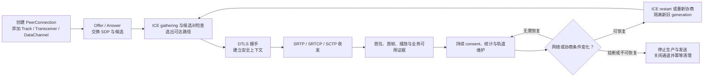

# WebRTC 会话生命周期

> [!tip] 阅读提示
> **前置：** 无强前置；可先从本篇一句话说明读起。
> **初读：** 先读「一句话说明」和「核心机制」，弄清 WebRTC 会话生命周期 解决什么问题、不负责什么。
> **深入：** 「工程要点」、「工作流程或状态流」、「工程实现与取舍」 在实现、联调或排障时再读。

## 一句话说明

WebRTC 会话生命周期描述一个 `RTCPeerConnection` 从创建、协商和连通，到媒体/数据收发、网络变化、失败恢复及关闭的完整状态演进。它把业务层的呼叫状态、信令状态、ICE 状态、DTLS 状态和媒体收发状态分开观察；任何一层成功，都不能单独证明用户已经可以正常通话。

## 核心机制

1. **准备**：应用创建连接，配置 STUN/TURN，添加 Track 或 Transceiver，并按需创建 DataChannel。
2. **协商**：发起方创建 Offer，设置本地描述；信令服务器转发描述和候选；对端设置远端描述、创建 Answer 并返回。候选可以随描述发送，也可以用 Trickle ICE 增量发送。
3. **连通与安全**：ICE 收集候选并检查候选对，选出可达路径；随后在该路径上完成 DTLS。媒体使用 SRTP，数据通道使用 SCTP over DTLS。
4. **收发与维护**：连接进入 connected/completed 后仍需处理同意性检查、统计采样、轨道变化和重新协商。网络切换或路径失效时，可能触发 ICE restart。
5. **结束**：业务挂断或不可恢复失败时停止轨道、关闭 DataChannel、关闭 PeerConnection，并清理定时器、信令订阅和服务端会话状态。

## 工程要点

- 分开记录业务状态、`signalingState`、`iceGatheringState`、`iceConnectionState`、`connectionState` 和媒体实际收发状态，避免把 `connected` 当成“画面已播放”。
- 处理描述和候选的异步到达顺序；候选应绑定 `sdpMid`/`mLineIndex` 和 ICE generation，不能用全局队列混用不同会话。
- 协商、重连和挂断消息应带会话版本或幂等键；同时发起 Offer 时处理 glare、回滚和重试，超时后释放旧会话。
- 关闭路径必须可重复执行：先停止业务发送，再解除事件和信令引用，最后释放连接对象，避免重连遗留回调。

## 解决的问题

把业务呼叫、协商、ICE、DTLS、媒体收发和关闭过程分层管理，使“连接已建立但不能播放”“重连后旧消息污染”等问题可以定位和恢复。

## 工作流程或状态流

1. **new**：创建 PeerConnection、配置 ICE server，添加 Track/Transceiver 或创建 DataChannel。
2. **signaling/gathering**：创建并设置 Offer，交换描述和候选；本地收集状态可与远端描述交错推进。
3. **checking**：候选对执行 STUN 检查，选定路径后进入 connected/completed；DTLS 同步推进。
4. **media/data**：SRTP/RTP、SRTCP 和 SCTP 开始收发，轨道、解码、渲染和 DataChannel 各自有可观测状态。
5. **disconnected/restart/failed/closed**：网络变化可触发 ICE restart；不可恢复时停止源、关闭通道和释放信令/计时器。

> [!note] 图的边界
> 箭头表示主要因果依赖，不表示所有步骤在时间上完全串行。候选收集可以与 SDP 交换交错，DTLS 与部分 ICE 状态也会重叠推进；“业务可用”仍要由首包、首帧、音频播放或 DataChannel 事件分别证明。

## 关键对象、字段与报文

- PeerConnection 的 signalingState、iceGatheringState、iceConnectionState 和 connectionState 是不同状态机。
- local/remote/pending description、candidate generation、selected pair、DTLS state 和 transceiver/mid 串起协商与传输。
- RTP/RTCP 的 SSRC/序列号/时间戳、Track 的 readyState、解码/渲染首帧和 DataChannel readyState 描述媒体可用性。
- 业务会话 ID、连接 ID、协商版本和关闭原因用于跨组件幂等与排障。

## 原理细节

状态机可能重叠而非严格串行：ICE gathering 可以在 Offer 设置后继续，DTLS 可在 ICE 选路后握手，媒体状态又受编码器和渲染线程影响。connectionState 反映连接聚合结果，不替代具体的轨道、首帧或音频播放状态。重连时新 generation 与旧描述/候选必须隔离。

## 工程实现与取舍

- 每个状态转换记录原因、版本和时间；用单一连接所有者协调协商、restart、挂断和资源清理。
- 控制消息幂等，候选按 session/mid/generation 缓存；重连后只回放仍属于当前连接的消息。
- 恢复期间保持音频和控制面优先，视频按带宽和队列逐步恢复；设定最大重试和关闭超时。
- close 路径可重复调用，停止采集/生产、关闭 DataChannel、解除回调和信令订阅后再释放 PeerConnection。

## 常见误区与失败表现

- signalingState stable 就认为媒体可用：可能没有 selected pair、DTLS 或首帧。
- ICE completed 就认为所有轨道正常：某个 m-line、codec 或渲染路径仍可能失败。
- 只监听 disconnected 不做退避：会发生 restart 风暴和 Offer 冲突。
- 挂断只调用 close：业务房间、远端订阅、定时器和本地采集可能泄漏。

## 可观测指标与验证

- 记录每个状态机的状态变更、持续时长、原因、版本和错误；将会话/连接/track/SSRC 关联。
- 记录候选收集、检查、DTLS 握手、首个 RTP/RTCP、首个解码帧、首帧渲染、DataChannel open/close。
- 通过 getStats、日志和抓包分层确认控制、路径、安全、媒体和播放是否分别成功。
- 测试正常挂断、信令断线、网络切换、旧 candidate 延迟、双方并发 Offer、设备停止和重复 close。

## 示例场景

用户看到“已连接”但远端黑屏。时间线显示 signaling/ICE/DTLS 都成功，RTP bytesReceived 增长，然而 decoder 无输出；进一步发现 Offer 中视频 codec 参数与解码器能力不匹配。连接生命周期日志避免把问题错误归因于 NAT。

## 阅读导航

- **上一篇：** [[MediaStream Track 与 Transceiver]]
- **下一篇：** [[信令与 PeerConnection 状态机]]
- **所属专题：** [[00-知识地图/专题说明/02 信令与 SDP 协商|02 信令与 SDP 协商]]
- **回看：** [[RTC 知识总览]] · [[00-知识地图/学习路线/学习进度模板|学习进度]] · [[00-知识地图/学习路线/RTC 工程师学习路线.canvas|阶段路线]]

> 读完先回所属专题做练习/验收，再点下一篇。内部链接最多再追一层；不影响理解的陌生词先记下。

## 图谱关系

- 业务入口：[[信令服务器]]负责路由会话和协商消息。
- 协商阶段：[[Offer Answer]]确定媒体、方向和安全参数。
- 网络阶段：[[ICE 连通性检查与选路]]选出实际可达路径。
- 媒体保护：[[DTLS]]导出密钥并支撑后续安全传输。
- 媒体承载：[[SRTP]]保护 RTP/RTCP 媒体报文。

## 参考资料

- 《Learning WebRTC》第 3 章“创建基本的 WebRTC 应用”：`90-参考资料/音视频与 WebRTC 书库/learning-webrtc/translation/03-creating-a-basic-webrtc-application.md`
- 《Learning WebRTC》第 5 章“连接客户端”：`90-参考资料/音视频与 WebRTC 书库/learning-webrtc/translation/05-connecting-clients-together.md`
- 《WebRTC 权威指南》第 6 章“对等连接与 Offer/Answer”：`90-参考资料/音视频与 WebRTC 书库/webrtc-authoritative-guide-zh/content/06-peer-connection-offer-answer.md`
- 《WebRTC 权威指南》第 9 章“NAT 与防火墙穿越”：`90-参考资料/音视频与 WebRTC 书库/webrtc-authoritative-guide-zh/content/09-nat-firewall-traversal.md`
