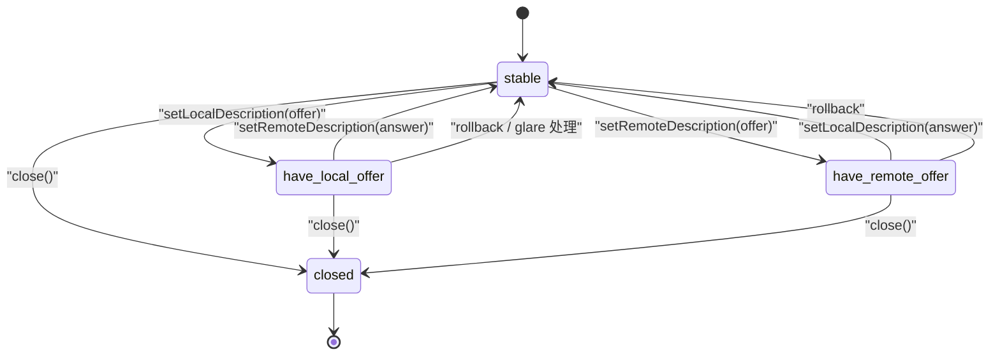

# 信令与 PeerConnection 状态机

> [!tip] 阅读提示
> **前置：** [[Offer Answer]]、[[SDP]]、[[WebRTC 会话生命周期]]。
> **初读：** 先读“一句话说明”“问题边界”“双状态机”和“非法转移”，弄清 signalingState 与 connectionState 各管什么。
> **深入：** 回滚、glare、ICE restart 与观测在排障时再读。

## 一句话说明

WebRTC 会话同时受 **信令状态机**（`signalingState` / Offer-Answer）与 **PeerConnection 连接状态机**（`connectionState` / ICE+DTLS 聚合）约束。前者描述 SDP 协商走到哪，后者描述传输是否真的可用；两者任一失败都可能导致“看起来进房了但没媒体”。

## 问题边界

- **上游：** 业务信令（进房、呼叫、重协商）、本地 transceiver/轨道变更、ICE restart 请求。
- **下游：** 可发送/接收的媒体方向、DTLS/SRTP 是否运行、数据通道是否可用。
- **易混淆：**
  - 业务“已进房”≠ `stable` 且 `connected`。
  - `have-local-offer` 时又创建新 Offer，需按实现排队或回滚。
  - `connectionState=connected` 仍可能单向无媒体（方向、收发器未协商、SFU 未订阅）。
  - `iceConnectionState` 与 `connectionState` 不同步时，以更细子状态排障。

## 核心机制

### 信令状态（Offer/Answer）

```text
stable
  -> have-local-offer   (createOffer + setLocalDescription)
  -> stable             (收到 Answer + setRemoteDescription)
stable
  -> have-remote-offer  (收到 Offer + setRemoteDescription)
  -> stable             (createAnswer + setLocalDescription)

glare: 双方同时 offer → 一方回滚或按规则成为 Answerer
closed: PC close 后信令不再前进
```



> [!note] 图的边界
> 图只画最常见的完整 Offer/Answer 与 rollback 路径，省略 `have-local-pranswer`、`have-remote-pranswer` 和实现特定的排队细节。它描述的是 `signalingState`，不是 ICE/DTLS 聚合得到的 `connectionState`，更不是业务“已进房”状态。

| signalingState | 允许的典型动作 |
| --- | --- |
| stable | createOffer；处理远端 Offer |
| have-local-offer | 等待 Answer；必要时 rollback |
| have-remote-offer | createAnswer |
| have-local-pranswer / have-remote-pranswer | 早期媒体等（若使用） |
| closed | 无 |

### 连接状态（聚合）

`connectionState` 通常聚合 ICE + DTLS（实现细节因版本而异）：

```text
new -> connecting -> connected -> disconnected -> connecting|failed
connected -> failed
任意 -> closed
```

它比 `iceConnectionState` 更“用户可感知”，但排障时仍要下钻 ICE/DTLS 子状态。对照 [[ICE 状态机]]。

## 非法转移与 glare

| 场景 | 风险 | 常见处理 |
| --- | --- | --- |
| `have-local-offer` 时再 `createOffer` | 覆盖未完成谈判 | 排队或合并 `negotiationneeded` |
| 本地已 offer，又收到远端 offer | glare / 抛错 | rollback 后作 Answerer，或产品定主从 |
| 未 `stable` 就加轨道并期望立刻生效 | direction 未协商 | 回 stable 再谈判 |
| `setRemoteDescription` 失败被吞 | 无音无画 | 必须记录错误名与 SDP type |

## 关键对象与数据

- 本地/远端 description 的 type（offer/answer/rollback）与 SDP 字节
- transceiver 列表、direction、mid、当前/待定方向
- 操作链：`createOffer` / `setLocal` / `setRemote` / `createAnswer` 的 Promise 排队
- 与 ICE 交叉：`restartIce()`、凭证 generation、候选 trickle
- 事件：`signalingstatechange`、`connectionstatechange`、`negotiationneeded`

## 工作流程

1. 业务触发谈判（进房、加轨道、换方向、ICE restart）。
2. PC 置 `negotiationneeded`（若实现合并多次触发，注意丢失更新）。
3. 按 Offer/Answer 规则推进 signalingState；SDP 经业务信令送达对端。
4. ICE/DTLS 并行推进；`connectionState` 进入 connected 后媒体面才可靠。
5. 重协商时在 stable 再次发起；冲突时 rollback 或按 glare 规则处理。
6. `close()` 后两套状态机进入 closed，计时器与发送停止。

```text
business intent -> negotiationneeded
  -> Offer/Answer (signalingState)
  -> ICE/DTLS (connectionState)
  -> media directions effective
```


## 与业务进房状态的对齐

建议业务层单独维护 `roomJoined` / `mediaWanted`，不要直接用 `signalingState` 当 UI“已接通”：

1. 信令 ACK：服务器承认进房。
2. `stable`：当前 Offer/Answer 轮次完成。
3. `connected`：传输聚合可用。
4. 首帧/首包：数据面真正开始。

四者任一缺失都应有可区分的错误码与重试策略；把它们揉成一个布尔值会导致误重进房或幽灵占位。

## 工程要点

- **串行化** setLocal/setRemote：并发调用是 glare/状态非法的高发源。
- 本地已 `have-local-offer` 时收到远端 Offer：明确策略（rollback / 拒绝 / 排队）。
- 把业务信令 ACK 与 PC 状态分开记账；信令到达不代表 description 已应用成功。
- 轨道变更后若未再协商，会出现“轨道存在但 direction 未生效”。
- 版本差异：Unified Plan 下 mid/transceiver 稳定，Plan B 遗留逻辑不要混用。
- `failed` 勿一律重进房：可能只需 ICE restart 或重协商方向。

## 常见误区与故障表现

| 误区 | 表现 |
| --- | --- |
| 只订阅 connectionstatechange | 卡在 have-local-offer，媒体永不来 |
| 忽略 setRemoteDescription 错误 | SDP 语义错误被吞，无音无画 |
| negotiationneeded 连打 | Offer 风暴、信令拥塞 |
| failed 一律重进房 | 本可 ICE restart，却制造幽灵用户 |
| 关闭不彻底 | PC closed 但房间仍占位 |

## 观测与验证

- 每次谈判记录：触发原因、signalingState 转移、SDP type、错误名、耗时。
- 对照 `connectionState`、`iceConnectionState`、`dtlsState`（若暴露）、transceiver.direction。
- 最小场景：正常进房；双方同时 mute/unmute 触发 glare；ICE restart；中途加屏共享轨道再协商。
- 工具：[[webrtc-internals]]、[[WebRTC 状态机诊断]]；业务日志用同一 session/pc id 关联。

## 具体例子

A 已 `have-local-offer`，B 同时发出 Offer。A 若直接 setRemoteDescription(B 的 Offer) 可能抛错。正确路径之一：A rollback 到 stable，再作为 Answerer 处理 B 的 Offer，或按产品规则让一方取消本地 Offer。另一例：`connectionState=connected` 但远端无画——查 transceiver.direction 是否 `recvonly`/`inactive`，以及 SFU 订阅是否生效，而不是先重谈整份 SDP。

## 阅读导航

- **上一篇：** [[WebRTC 会话生命周期]]
- **下一篇：** [[SIP]]
- **所属专题：** [[00-知识地图/专题说明/02 信令与 SDP 协商|02 信令与 SDP 协商]]
- **回看：** [[RTC 知识总览]] · [[00-知识地图/学习路线/学习进度模板|学习进度]] · [[00-知识地图/学习路线/RTC 工程师学习路线.canvas|阶段路线]]

> 读完先回所属专题做练习/验收，再点下一篇。内部链接最多再追一层；不影响理解的陌生词先记下。

## 图谱关系

- 主题：[[会话与信令地图]]
- 前置：[[Offer Answer]]、[[SDP]]、[[WebRTC 会话生命周期]]
- 交叉：[[ICE 状态机]]、[[MediaStream Track 与 Transceiver]]
- 观测：[[WebRTC 状态机诊断]]、[[webrtc-internals]]
- 相关：[[WHIP 与 WHEP]]

## 参考资料

- W3C WebRTC PeerConnection 状态与 RTCSignalingState 定义；以当前实现为准。
- 同库 [[Offer Answer]]、[[WebRTC 会话生命周期]]、[[WebRTC 状态机诊断]]。
