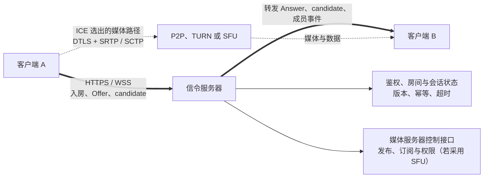

# 信令服务器

> [!tip] 阅读提示
> **前置：** 无强前置；可先从本篇一句话说明读起。
> **初读：** 先读「一句话说明」和「核心机制」，弄清 信令服务器 解决什么问题、不负责什么。
> **深入：** 「工程要点」、「工作流程或状态流」、「工程实现与取舍」 在实现、联调或排障时再读。

## 一句话说明

信令服务器是业务控制面组件，负责身份、房间、成员、呼叫状态和协商消息路由。WebRTC 规范不规定具体信令协议，工程上可使用 WebSocket、HTTP、SIP、XMPP 或自定义消息；服务器通常不承载点对点媒体。

## 核心机制

- 建立经过鉴权的业务会话，分配会话 ID 和参与者角色，处理加入、接受、拒绝、挂断、重连和超时。
- 在双方之间转发 Offer、Answer、ICE candidate、end-of-candidates、ICE restart 等控制消息，并保留媒体段、代次和版本上下文。
- 连接信令通道只代表控制面可达。媒体仍需通过 ICE、DTLS、SRTP 或 SCTP 独立建立和验证。
- 服务端应对重复消息、乱序消息、旧会话消息和离线重连做幂等处理，并在会话结束时清理成员与订阅。

## 工程要点

- 消息结构至少带会话 ID、发送者、目标、类型、序列号/版本和时间戳；服务端校验目标归属，避免任意转发候选或 SDP。
- 为 Offer/Answer 和候选设置生命周期与幂等键，断线重连后不要重放已经关闭或已升级代次的消息。
- 记录信令发送、接收、转发和超时的时间线，并与 ICE/DTLS/媒体统计使用同一会话标识。
- 信令使用 HTTPS/WSS 等安全传输并执行鉴权、限流和输入校验；不要把信令服务器误当成 TURN 或 SFU。

## 解决的问题

让参与者在不直接暴露彼此地址或实现细节的情况下，可靠交换加入、Offer/Answer、candidate、重连和挂断消息，并维持业务会话一致性。

## 工作流程或状态流

1. 客户端通过 HTTPS/WSS 或其他受保护通道认证，加入房间并获得会话/参与者标识。
2. 服务端建立成员关系和权限，路由呼叫、接受/拒绝和协商消息。
3. Offer、Answer、candidate、end-of-candidates 和 ICE restart 消息按目标和会话代次转发。
4. 客户端独立推进 ICE/DTLS/媒体；服务端记录控制面状态和超时，不把信令在线等同于媒体在线。
5. 挂断、离开、超时或服务端故障时广播状态、拒绝旧消息并清理会话与订阅。

> [!note] 图的边界
> 粗实线表示业务控制面，虚线表示 ICE 选出的数据面。两条路径可能落在同一组机器，也可能完全分离；即使都经过同一个域名或网关，信令连接成功仍不能证明 DTLS、SRTP、解码和播放已经成功。

## 关键对象、字段与报文

- 消息至少包含 session ID、room ID、sender、target、type、sequence/version、generation 和 timestamp。
- Offer/Answer 消息携带描述摘要或 SDP；candidate 消息带 sdpMid/mLineIndex、candidate 和 end-of-candidates 标志。
- 成员状态、角色、鉴权主体、连接 ID、幂等键、过期时间和关闭原因决定路由与清理。
- 服务端内部应区分房间状态、信令连接、PeerConnection 和媒体服务器连接，不能用一个连接数代替全部状态。

## 原理细节

WebRTC 不规定信令协议，信令服务器只是应用控制面的路由与状态组件。它可以使用 WebSocket、HTTP、SIP、XMPP 或自定义协议；媒体通常走 ICE 选出的点对点、TURN 或 SFU 路径。消息可能重复、乱序、延迟或在重连后到达，因此必须带版本和幂等语义。

## 工程实现与取舍

- 采用可靠但可水平扩展的会话存储/广播机制，明确房间主节点、消息顺序和故障转移策略。
- candidate 可按代次短暂缓存，远端描述未到达时由客户端或服务端有界暂存；过期和关闭后必须丢弃。
- 对信令连接启用认证、授权、限流、输入大小限制和日志脱敏；不要接受任意目标的 SDP/candidate 转发。
- 业务重连时恢复身份和会话版本，避免简单新建房间导致重复成员、重复计费或旧连接继续发送。

## 常见误区与失败表现

- WebSocket open 就显示“媒体已连接”：控制通道正常不代表 ICE/DTLS/RTP 成功。
- 只用消息到达顺序判断协商：多设备、重连和异步 candidate 会打乱顺序。
- 服务端无限缓存候选和 Offer：旧代次消息最终会污染新 PeerConnection。
- 不校验 sender/target：可能泄露公网候选、转发错误 SDP 或让未授权用户加入呼叫。

## 可观测指标与验证

- 记录认证、入会、成员变更、消息路由、重试、乱序、幂等命中、超时和清理耗时。
- 每条消息关联 session/room/connection/version/generation，并与客户端 signalingState、ICE/DTLS 状态对照。
- 抓取 WSS/WebSocket 帧验证 Offer、Answer、candidate 的目标、顺序、重复和关闭通知。
- 测试客户端重连、服务端节点切换、双方同时 Offer、candidate 乱序、离线成员、重复 BYE 和权限变更。

## 示例场景

主叫发 Offer 后网络短暂断开并重连。服务端根据 session/version 只保留当前连接的 Offer，拒绝旧连接迟到的 Answer；候选仍按 generation 路由。客户端收到当前 Answer 后继续 ICE，媒体层的恢复时间线与信令重连时间线可以分别观察。

## 阅读导航

- **上一篇：** [[00-知识地图/专题说明/02 信令与 SDP 协商|02 信令与 SDP 协商]]（回到本专题说明）
- **下一篇：** [[实时通信中的信令消息与业务消息]]
- **所属专题：** [[00-知识地图/专题说明/02 信令与 SDP 协商|02 信令与 SDP 协商]]
- **回看：** [[RTC 知识总览]] · [[00-知识地图/学习路线/学习进度模板|学习进度]] · [[00-知识地图/学习路线/RTC 工程师学习路线.canvas|阶段路线]]

> 读完先回所属专题做练习/验收，再点下一篇。内部链接最多再追一层；不影响理解的陌生词先记下。

## 图谱关系

- 协商消息：[[Offer Answer]]通过信令服务器交换描述和应答。
- 消息语义：[[实时通信中的信令消息与业务消息]]定义命令、事件、版本、幂等和业务成功证据。
- 常用承载：[[WebSocket]]提供双向消息通道，但不代替会话状态与媒体状态。
- 描述内容：[[SDP]]表达媒体、传输和安全协商参数。
- 候选转发：[[ICE 候选与候选对]]的候选消息需要保留媒体段和代次上下文。
- 生命周期：[[WebRTC 会话生命周期]]定义控制面与媒体面之间的阶段边界。
- 所属地图：[[会话与信令地图]]组织房间、信令和协商知识。

## 参考资料

- 《Learning WebRTC》第 4 章“创建信令服务器”：`90-参考资料/音视频与 WebRTC 书库/learning-webrtc/translation/04-creating-a-signaling-server.md`
- 《Learning WebRTC》第 5 章“连接客户端”：`90-参考资料/音视频与 WebRTC 书库/learning-webrtc/translation/05-connecting-clients-together.md`
- 《WebRTC 权威指南》第 4 章“信令”：`90-参考资料/音视频与 WebRTC 书库/webrtc-authoritative-guide-zh/content/04-signaling.md`
- 《WebRTC Cookbook》第 1 章“对等连接”：`90-参考资料/音视频与 WebRTC 书库/webrtc-cookbook/translation/01-peer-connections.md`
