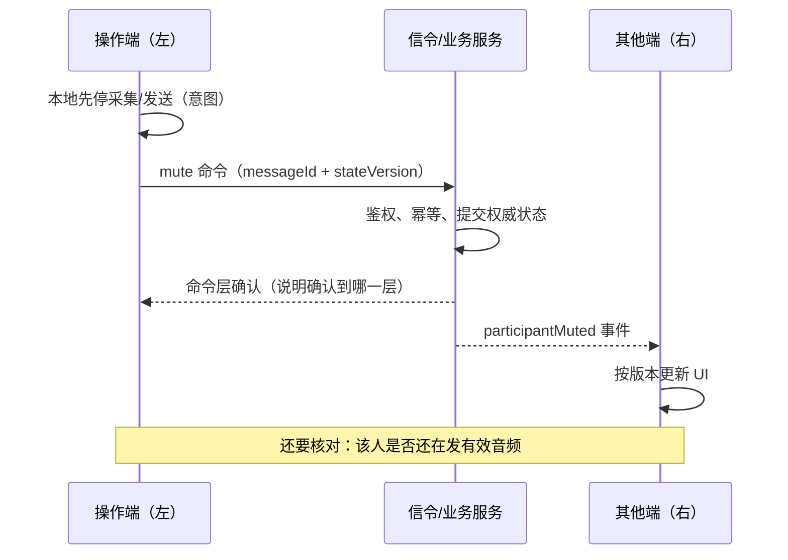
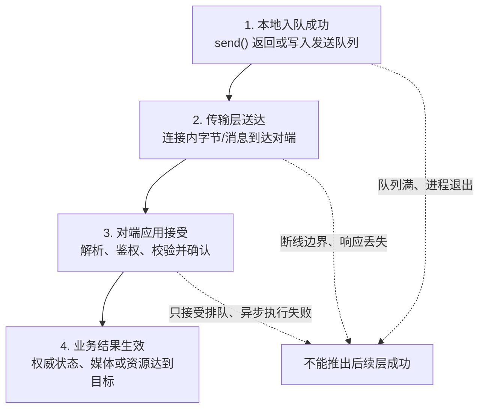

# 实时通信中的信令消息与业务消息

> [!tip] 阅读提示
> **前置：** [[数据面与控制面]]、[[信令服务器]]。
> **初读：** 读到「初读到此为止」就停。重点看消息分类表和「消息成功的四个层次」——弄清 WebSocket 发出去 ≠ 业务成功。
> **深入：** 信封、幂等、重连收敛、故障注入，做信令设计或排障时再读。

## 一句话说明

消息是应用定义的一个完整语义单元；信令消息负责建立、修改或结束通信关系，业务消息负责聊天、角色、互动和协作等产品行为。传输层只负责搬运字节或消息，不能自动保证业务动作只执行一次、状态一定最新或媒体已经可用。

## 先记住这三句

1. **信令消息**管建连/改会话/挂断；**业务消息**管聊天、角色、互动——先按语义分，别按「是不是 WebSocket」分。
2. 传输层只保证「字节/帧搬走了」；不保证业务只执行一次、状态最新、或媒体已经可用。
3. RTCP/媒体反馈别跟业务挂断信令混成一类；成功证据要分层次核对。

## 用一句话说清

实时系统里消息分两摊：

1. **信令消息**：为了把通话建起来 / 改起来 / 拆掉（Offer、Answer、候选、挂断）
2. **业务消息**：通话过程中的应用数据（聊天、投票、白板笔画、权限变更）

**第一次关键：** 信令失败，媒体往往起不来；业务消息失败，通常只影响那个功能，不一定断媒体。

（分类表、成功层级、和 DataChannel 边界在折叠线后。）



---

> [!warning] 初读到此为止
> 上面这些已经够第一次阅读。下面先是「原初读区深文」（可跳过），再是工程细节；**第一次直接点文末「第一次阅读下一站」即可。**


## 初读展开（原初读区深文，第二轮再读）

> 下面是本篇原先堆在初读区的展开内容，已整体后移，避免第一次阅读过载。

## 消息分类：先按语义分，不按通道名分

| 类别 | 典型内容 | 时效与可靠性 | 常见承载 |
| --- | --- | --- | --- |
| 会话信令 | 呼叫、接听、拒绝、挂断、入房、离房 | 通常要求可靠、可去重、可确认 | HTTPS、WSS、SIP |
| WebRTC 协商消息 | Offer、Answer、ICE candidate、ICE restart | 绑定会话与协商代次；旧消息必须过期 | WSS、HTTPS、自定义信令 |
| 业务命令 | 静音某成员、改变角色、订阅某路、开始录制 | 需要鉴权、幂等和明确成功/失败结果 | WSS、HTTPS、DataChannel |
| 业务事件 | 成员加入、角色已变化、订阅已生效 | 表达已发生事实；消费者要处理重复和断档 | WSS、消息系统、DataChannel |
| 协作数据 | 聊天、白板操作、鼠标位置、字幕 | 可靠性因语义而异；鼠标位置可过期，聊天通常不可丢 | [[RTCDataChannel 与 SCTP]]、WSS |
| 媒体控制与反馈 | RTCP SR/RR、NACK、PLI、TWCC | 与媒体时间线紧密，通常不走业务信令通道 | [[RTCP]] |
| 媒体数据 | Opus、H.264 等编码数据 | 受播放截止时间约束，晚到可能比丢失更差 | RTP/SRTP，也可由自定义 WebSocket 承载 |
| 传输保活 | WebSocket Ping/Pong、应用心跳 | 证明某一层仍可响应，不证明业务或媒体健康 | 具体传输协议 |

“控制消息”这个说法仍需继续拆分。挂断属于业务信令，PLI 属于媒体反馈，WebSocket Close 属于传输控制；它们的状态所有者、重试规则和成功证据不同。

## 命令、事件与状态快照

- **命令（command）：** 请求某个所有者执行动作，例如 `muteParticipant`。它可能被接受、拒绝或超时。
- **事件（event）：** 陈述已经发生的事实，例如 `participantMuted`。事件不应被接收方重新解释成未经授权的命令。
- **状态快照（snapshot）：** 描述某个版本下房间或成员的完整状态，用于首次加入或重连对账。

只发送增量事件时，客户端断线期间会出现空洞；只发送全量快照时，带宽和处理成本又会增加。常见做法是“有序增量事件 + 可按版本拉取快照”：发现版本不连续就停止盲目应用增量，重新同步当前状态。

## 消息成功的四个层次

**图在说什么：** 消息成功要分层看：入队 ≠ 送到 ≠ 对端接受 ≠ 业务真正生效；前一层成功推不出后一层。



> [!note] 图的边界
> 箭头表示要继续取得下一层证据，不表示底层协议会自动驱动业务完成。不同命令可以把第 3 层定义成“已接收”或“已提交”，但必须在接口契约中写清楚，不能都压缩成含糊的 `ok: true`。

例如用户发送“订阅高层视频”：

- WebSocket `send()` 返回，只说明数据进入本地发送流程；
- TCP 确认，只说明对端网络栈收到了字节；
- 服务端返回 `accepted`，可能只说明命令合法且已排队；
- 只有 SFU 已切层、收到新层关键帧并在客户端完成解码，才算用户可见结果生效。

因此确认消息必须说明确认的是哪一层。不要用一个含糊的 `ok: true` 同时代表“已接收”“已执行”和“用户已经看到”。

## 示例：一次“关闭麦克风”为什么不是一条消息就结束

**图在说什么：** 左客户端发静音命令；中间服务端鉴权并广播事件；右端更新 UI——但还要媒体侧证据，WebSocket 发出去 ≠ 静音成功。


> （本图已上移到初读区，此处不重复。）


步骤版同一故事：

1. 用户点击静音，客户端立即更新本地意图并调用采集/发送控制。
2. 客户端向服务端发送带 `messageId` 和 `stateVersion` 的静音命令。
3. 服务端鉴权、幂等执行并提交权威成员状态。
4. 服务端广播 `participantMuted` 事件，其他客户端按版本更新 UI。
5. 媒体侧验证该参与者不再发送有效音频，或按产品设计发送静音/舒适噪声状态。

命令确认、房间事件和媒体实际停止是三个证据。任何一个缺失，都不应笼统记录为“静音成功”。


---

## 问题边界

- **本篇讨论：** RTC 应用中控制信息如何分类、封装、排序、重试、去重、过期和观测。
- **本篇不讨论：** RTP 音视频负载的逐包格式、编解码算法或 WebSocket 帧的逐位解析；分别见 [[RTP]]、[[实时媒体链路]]、[[WebSocket]]。
- **容易混淆：** “消息”是上层语义，“WebSocket message”是某种传输提供的边界，“信令”是消息承担的一类职责；三者不是同义词。
## 通用消息信封

下面是应用层示例，不是 WebRTC 或 WebSocket 标准格式：

```json
{
  "schemaVersion": 2,
  "type": "room.join",
  "messageId": "01J...",
  "correlationId": "01J...",
  "sessionId": "session-7",
  "roomId": "room-42",
  "senderId": "user-a",
  "targetId": "room-42",
  "sequence": 108,
  "stateVersion": 31,
  "generation": 4,
  "sentAt": "2026-09-13T10:00:00Z",
  "expiresAt": "2026-09-13T10:00:10Z",
  "payload": {}
}
```

关键字段各自回答不同问题：

| 字段 | 作用 | 不能替代什么 |
| --- | --- | --- |
| `type` | 选择解析和处理逻辑 | 不能代替权限校验 |
| `schemaVersion` | 决定字段兼容规则 | 不能代替会话状态版本 |
| `messageId` | 追踪与去重单次消息 | 不能天然实现 exactly-once |
| `correlationId` | 关联请求、结果和异步事件 | 不能作为全局顺序号 |
| `sequence` | 表达某个发送者或会话内的顺序 | 必须明确作用域和回绕/重置规则 |
| `stateVersion` | 拒绝旧状态覆盖新状态 | 不能表示 ICE generation |
| `generation` | 绑定某次协商、连接或资源代次 | 必须定义何时递增和清理 |
| `expiresAt` | 阻止过期动作继续生效 | 依赖接收侧可信时钟或相对 TTL 设计 |

消息体必须有最大长度、字段数量、嵌套深度和解析耗时限制。未知 `type`、不支持的版本、越权目标和超限负载应产生明确错误，不能进入业务状态机。

## 可靠、顺序、幂等和“只执行一次”

### 可靠传输不等于可靠业务

TCP/WebSocket 能提供连接内可靠有序字节传输，但断线边界仍存在不确定性：服务端可能已经执行命令，而响应尚未到达客户端。客户端重连后重发，就可能重复扣费、重复入房或重复开始录制。

### 幂等键解决重复执行

对不可重复的命令，服务端用稳定的幂等键记录“是否处理过”和原结果。相同键、相同请求可返回原结果；相同键、不同负载应拒绝。记录保留时间要覆盖客户端可能重试的窗口。

### 顺序必须声明作用域

“WebSocket 内有序”只覆盖同一条存活连接。多设备、服务端多节点、重连和异步任务会打破全局到达顺序。工程上通常只承诺某个 `sessionId`、成员或资源内的版本单调，而不是承诺全系统只有一个顺序。

### Exactly-once 通常是业务协议效果

网络重试一般只能得到 at-most-once 或 at-least-once 的投递特征。所谓“业务只生效一次”通常依赖持久幂等记录、事务边界和结果重放，不是 WebSocket、TCP 或消息 ID 单独提供的保证。

## 不同消息如何选择通道

| 需求 | 更合适的常见选择 | 原因与边界 |
| --- | --- | --- |
| 登录、创建房间、短请求/响应 | HTTPS | 易于鉴权、超时和独立重试 |
| 房间事件、Offer/Answer、candidate | WSS | 服务端可主动推送，连接内有序；仍要处理重连与旧代次 |
| 点对点聊天和协作数据 | [[RTCDataChannel 与 SCTP]] | 可选择有序/无序、可靠/部分可靠；依赖 PeerConnection 已建立 |
| RTCP 反馈 | RTCP/SRTCP | 与 RTP 源、序号和媒体时钟绑定，不应绕到业务 WebSocket |
| 实时音视频 | RTP/SRTP | 提供媒体序号、时间戳、反馈与恢复生态；也可自定义承载，但成本更高 |

通道选择不是永久身份。同一个“切换摄像头”动作可以先经 WSS 发业务命令，再触发 WebRTC `replaceTrack` 或重新协商；最终视频帧仍走媒体通道。

## 信令状态与媒体状态必须分轴

```text
业务会话：Idle → Joining → Joined → Leaving → Closed
信令连接：Disconnected → Connecting → Open → Reconnecting → Closed
协商状态：Stable → HaveLocalOffer/HaveRemoteOffer → Stable
媒体路径：New → Checking → Connected → Receiving → Failed
```

这些状态互相关联但不互相包含：

- WSS `Open` 不证明 ICE、DTLS 或 RTP 正常；
- ICE `Connected` 不证明用户仍有房间权限；
- 收到“远端已静音”事件不证明本地立刻停止渲染旧缓冲音频；
- 业务会话关闭后，应主动停止采集和发送，不要只等待一条挂断消息自然清空资源。

## 重连与状态收敛

1. 传输断开后，先冻结需要强一致的写操作，并记录最后确认的会话版本。
2. 重连时重新认证连接身份；不要把旧连接 ID 当永久用户身份。
3. 客户端发送当前 session、generation、lastAppliedVersion 和待确认命令摘要。
4. 服务端返回增量事件或完整快照，并明确哪些旧命令已处理、过期或拒绝。
5. 客户端按版本应用状态，再恢复允许发送的动作；旧 Offer、candidate 和订阅命令不得污染新代次。

离线期间是否允许媒体继续，是产品和架构策略，不是 WebSocket 自动决定的。无论选择什么策略，都要给信令断线、媒体在线和用户可见状态分别设置超时与观测。

## 队列、优先级与背压

- 给发送队列设置字节数、消息数和最老消息年龄上限，同时记录高水位。
- 挂断、权限撤销等关键控制不能被聊天大消息阻塞；必要时使用独立连接/通道或有界优先队列。
- 可覆盖状态（鼠标位置、音量预览）保留最新值即可；不可覆盖事件（聊天、计费动作）需要持久序号或结果确认。
- 大文件不要占据信令通道；分离上传路径或使用受控 DataChannel，并验证对媒体 QoE 的影响。
- 队列满时必须选择拒绝、合并、丢弃过期消息或断开，不能无限增长内存。

## 工程实现与安全边界

- 先鉴别连接身份，再逐条鉴权 `sender/target/room`；“已经连上 WSS”不是永久授权。
- JSON、Protobuf 等只是序列化格式。格式之外仍要定义 schema 版本、最大长度、未知字段和兼容策略。
- 日志记录消息类型、大小、版本、结果码和耗时；SDP、candidate、聊天正文、token 等敏感内容要脱敏或摘要化。
- 服务端广播前先提交权威状态，再发送带新版本的事件；避免客户端看到尚未落地、故障后又回滚的“成功”。
- 超时后仍可能收到迟到结果。调用方必须用 correlation、generation 和当前状态决定接受还是丢弃。

## 常见误区与故障表现

| 误区或现象 | 更可能的问题 |
| --- | --- |
| `send()` 没报错，所以对方已经处理 | 只完成本地入队，需应用确认或状态事件 |
| WebSocket 自动重连后直接重放全部消息 | 旧协商代次、重复命令或过期状态污染当前会话 |
| 所有消息都要求可靠有序 | 过期鼠标位置和统计会阻塞关键控制消息 |
| 收到静音事件就认为媒体已停止 | 业务状态与采集、编码、发送状态没有联合验证 |
| TCP 不丢字节，所以不需要消息版本 | 多连接、重连、节点切换仍会产生重复和乱序语义 |
| 心跳正常，所以通话正常 | 只证明心跳所在路径可响应，媒体和解码仍可能失败 |

## 观测与验证

### 建议指标

- 按 `type/result` 统计发送、接收、拒绝、超时、重试、去重和过期数量。
- 记录发送队列字节数、消息数、最老消息年龄、入队等待和端到端业务生效耗时。
- 记录每个 session 的最后发送/应用版本、版本缺口、快照次数和重连收敛耗时。
- 将 message/correlation/session/generation 与 ICE、DTLS、RTP、SFU subscription 标识关联，但不要用其中一个代替全部状态。

### 可复现故障注入

| 注入 | 预期行为 |
| --- | --- |
| 同一 `messageId` 重复发送三次 | 幂等命令只生效一次，重复请求返回一致结果 |
| 先发送 version 12，再发送 version 11 | 旧状态被拒绝或忽略，并记录 stale 计数 |
| 服务端执行后立即断开、响应丢失 | 客户端重试后得到原结果，不重复执行副作用 |
| 断线期间产生 100 个房间事件 | 重连发现版本缺口，通过增量或快照收敛 |
| 用 10 MB 聊天消息占满队列 | 输入限制生效，关键挂断/权限消息仍可处理 |
| 让鼠标位置消息延迟 2 秒 | 过期状态被覆盖或丢弃，不回放旧轨迹 |

## 阅读导航

- **上一篇：** [[信令服务器]]
- **下一篇：** [[WebSocket]]
- **所属专题：** [[00-知识地图/专题说明/02 信令与 SDP 协商|02 信令与 SDP 协商]]
- **回看：** [[RTC 知识总览]] · [[00-知识地图/学习路线/学习进度模板|学习进度]] · [[00-知识地图/学习路线/RTC 工程师学习路线.canvas|阶段路线]]

- **第一次阅读下一站：** [[WebSocket]]

> 读完先回所属专题做练习/验收，再点下一篇。内部链接最多再追一层；不影响理解的陌生词先记下。

## 图谱关系

- 主题：[[会话与信令地图]]
- 分层前置：[[数据面与控制面]]
- 服务端所有者：[[信令服务器]]
- 常用承载：[[WebSocket]]、[[RTCDataChannel 与 SCTP]]
- 协商消息：[[Offer Answer]]、[[SDP]]、[[ICE 候选与候选对]]
- 媒体反馈边界：[[RTCP]]
- 生命周期：[[WebRTC 会话生命周期]]、[[信令与 PeerConnection 状态机]]

## 参考资料

- IETF RFC 6455, *The WebSocket Protocol*：WebSocket 消息、帧和连接语义；不定义 RTC 业务消息格式。
- IETF RFC 8831, *WebRTC Data Channels*：DataChannel 的消息、多流和可靠性模型。
- IETF RFC 8832, *WebRTC Data Channel Establishment Protocol*：DCEP OPEN/ACK 与通道参数。
- W3C, *WebRTC 1.0: Real-Time Communication Between Browsers*：`RTCDataChannel` API 状态、发送缓冲与事件。
- 同库 [[信令服务器]]、[[数据面与控制面]]、[[RTCDataChannel 与 SCTP]]。
