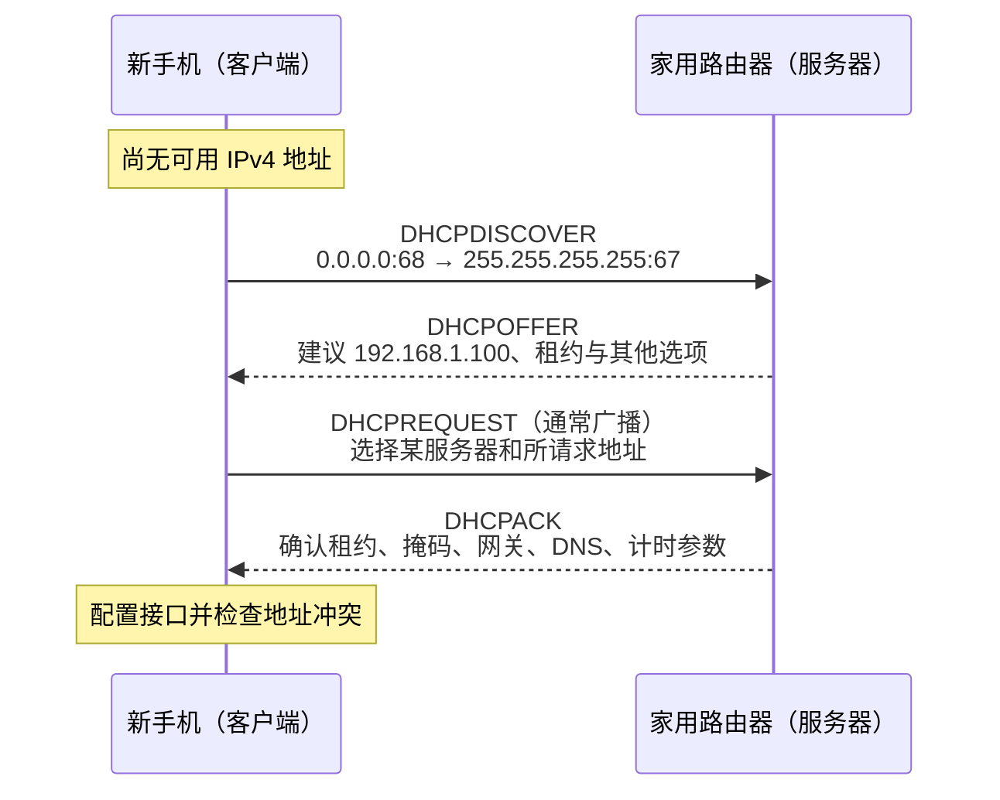
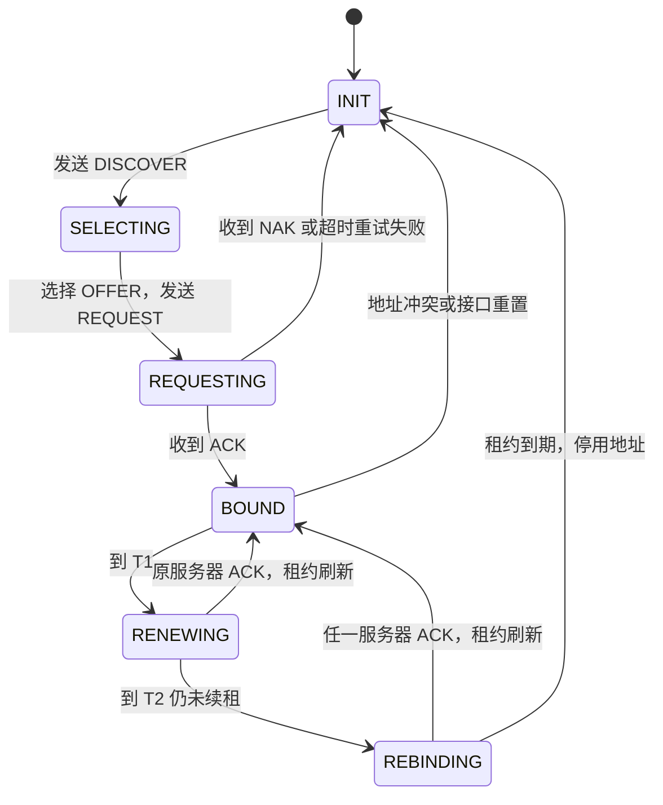
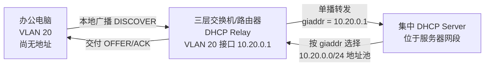

---
aliases:
  - 动态主机配置协议
  - DHCP 与 DHCPv6
tags:
  - rtc/concept
  - rtc/transport
  - rtc/network
type: concept
status: stable
---
# DHCP

> [!tip] 阅读提示
> **前置：** [[从 RTP 到网卡、路由器与物理链路]] 初读区（IP/网关从哪来）。
> **初读：** 读到「初读到此为止」就停。弄清：DHCP 分配什么、DORA 四步、租约会过期，以及它和 RTC 连通性的关系。
> **深入：** 选项字段、中继、故障定位、DHCPv6 与抓包命令，连不上网或候选异常时再读。


## 一句话说明

**DHCP（Dynamic Host Configuration Protocol，动态主机配置协议）让一台刚接入网络、还不知道该怎样配置自己的设备，自动取得 IP 地址、子网掩码或前缀、默认网关、DNS 服务器以及这些配置的有效期。**

它像网络的“入网配置发放处”，但这个类比只说明配置由谁发给谁：DHCP 不负责传送后续网页或音视频，不替代 ARP、DNS、路由、NAT，也不保证互联网一定可用。

## 先记住这三句

1. DHCP 帮主机自动拿到 **IPv4 地址、前缀、默认网关、DNS** 等；不负责 ICE/媒体连通本身。
2. 第一次拿地址经典四步 **Discover → Offer → Request → Ack（DORA）**；租约到期前还要续租，不是「领一次永久有效」。
3. 和 RTC：本机地址/网关/DNS 错了，后面 STUN/TURN/信令会先挂——排障时常先看 DHCP 是否给到预期局域网参数。

## 用一句话说清

你的手机连上 Wi-Fi 时，还没有 IP。它会问局域网：「谁能给我地址？」路由器（或公司里的 DHCP 服务器）回答：「用这个 IP、网关、DNS，租多久。」这就是 DHCP。

**第一次只需记住：** 它解决的是「本机如何自动拿到能上网的配置」，不是音视频协议本身。RTC 里它常出现在「设备刚入网 / 换网络」的排障故事里。

## 家里连 Wi-Fi 时发生了什么（DORA）

1. 手机广播：**有没有人能分配地址？**（Discover）
2. 路由器提议：**你可以用 192.168.x.x**（Offer）
3. 手机选定：**我要这个**（Request）
4. 路由器确认：**租约生效**（ACK）

**图在说什么：** 左新客户端还没地址，对右路由器做 DORA 四步；`ACK` 之后才真正装上租约配置。



---

> [!warning] 初读到此为止
> 上面这些已经够第一次阅读。下面先是「原初读区深文」（可跳过），再是工程细节；**第一次直接点文末「第一次阅读下一站」即可。**


## 初读展开（原初读区深文，第二轮再读）

> 下面是本篇原先堆在初读区的展开内容，已整体后移，避免第一次阅读过载。

## 新手机连上家里 Wi-Fi 后发生了什么

假设你把一部新手机连到家里的 Wi-Fi `Home-WiFi`，无线路由器 LAN 地址是 `192.168.1.1/24`，其 DHCP 地址池是 `192.168.1.100` 到 `192.168.1.199`。

手机要经历的典型过程是：

1. **发现并关联 Wi-Fi。** 手机与无线 AP 完成 802.11 层面的认证、关联以及可能的 WPA2/WPA3 密钥建立。此时它已经能在本地无线链路上传送帧，但还不一定有可用的 IP 配置。
2. **通过 DHCP 取得 IPv4 配置。** 手机和 DHCP 服务器交换 Discover、Offer、Request、ACK，得到例如 `192.168.1.100/24`、默认网关 `192.168.1.1`、DNS `192.168.1.1` 和 24 小时租约。
3. **按路由表选择下一跳。** 访问同一子网设备时，手机直接解析目标的 MAC；访问互联网时，手机把当前链路的帧交给默认网关。
4. **需要时解析名称。** 打开 `example.com` 时，DNS 把名称解析成 IP 地址。
5. **路由器继续转发。** 家用路由器通常还执行路由、防火墙和 NAT，再把流量送往运营商网络。

```text
手机
  │ ① Wi-Fi 关联：先获得本地链路能力
  │ ② DHCP：获得 192.168.1.100/24、网关、DNS、租约
  ▼
家用无线路由器
  │ ③ 路由/NAT：把跨网流量转到运营商
  ▼
互联网服务
```

> [!example] 把“进楼”拆成几件事
> 连上 Wi-Fi 像进入一栋办公楼；DHCP 像前台给访客发房间号、楼层范围、出口位置和通讯录查询处。拿到这些说明后，访客才知道同楼找谁、出楼走哪里、名字怎样查。
>
> 类比边界：真实网络配置是协议字段和路由项，不是一张实体门卡；连上 Wi-Fi、通过 DHCP、解析 DNS、经网关访问互联网是相互衔接但彼此独立的步骤。

由此要严格区分：

| 说法 | 实际意味着什么 | 是否足以证明能上互联网 |
| --- | --- | --- |
| “Wi-Fi 已连接” | 无线链路通常已关联 | 否 |
| “DHCP 成功” | 获得了一组网络配置 | 否 |
| “能 ping 默认网关” | 本地链路、地址解析和网关 LAN 侧基本可达 | 否 |
| “DNS 能解析” | 名称解析服务可用 | 仍不充分 |
| “目标业务成功” | 还需目标路由、传输连接、TLS 和应用服务都正常 | 是更高层证据 |

## DHCP 到底分配什么

口语中常说“DHCP 分配 IP”，但 DHCP 实际交付的是一组配置。常见内容包括：

| 配置 | 家庭示例 | 客户端怎样使用 |
| --- | --- | --- |
| IPv4 地址 | `192.168.1.100` | 作为该接口在租约期内使用的地址 |
| 子网掩码 | `255.255.255.0`，即 `/24` | 形成直连前缀 `192.168.1.0/24` |
| 默认网关 | `192.168.1.1` | 没有更具体路由时采用的下一跳 |
| DNS 服务器 | `192.168.1.1` 或运营商/公共 DNS | 把域名解析成 IP 地址 |
| 租约时间 | 例如 24 小时 | 决定地址何时续租、重绑定和到期 |
| 其他选项 | 域搜索后缀、静态路由、NTP 等 | 取决于服务器配置和客户端支持 |

服务器通常从一个 **scope/pool（作用域或地址池）** 中选择可用地址，并为客户端建立租约记录。客户端身份可能来自 DHCP Client Identifier（Option 61）；未提供时，服务器常回退到链路层地址等信息。于是“DHCP 永远只按 MAC 认设备”并不准确。

DHCP 是动态配置协议，不意味着地址每次都必然变化。服务器常尽量重用仍可用的旧租约；管理员还可以设置 DHCP reservation，让特定客户端身份总是获得指定地址。

## DORA：第一次获取地址的四步

DORA 是四类消息英文首字母的组合：**Discover、Offer、Request、ACK**。这是 DHCPv4 新客户端首次获取租约时最典型的流程，不是 DHCPv6 的消息名称。

**图在说什么：** 左新客户端还没地址，对右路由器做 DORA 四步（Discover→Offer→Request→ACK）；`ACK` 之后才真正装上租约配置。


> （本图已上移到初读区，此处不重复。）


### 1. DHCPDISCOVER：这里有没有服务器

新客户端还没有可用 IPv4 地址，也不知道 DHCP 服务器地址，因此典型报文使用：

```text
源 IP：       0.0.0.0
目的 IP：     255.255.255.255
源 UDP 端口：68（客户端）
目的 UDP 端口：67（服务器）
以太网目的： FF:FF:FF:FF:FF:FF（常见广播场景）
```

客户端生成一个 32 位 `xid`（transaction ID，事务标识），用它把后续应答与本次请求对应起来。Discover 中还可以携带客户端身份、希望复用的地址、可接受的最大消息大小和 Parameter Request List，说明自己希望服务器返回哪些选项。

**它能在没有 IP 时发送，不是因为绕过了 IP。** 报文仍是 DHCP over UDP over IPv4，只是使用代表“本机尚未指定地址”的 `0.0.0.0` 和受限广播 `255.255.255.255`，再由本地链路广播找到服务器或 Relay。

### 2. DHCPOFFER：我可以给你这组配置

一个或多个服务器可以返回 Offer。Offer 常包含：

- `yiaddr`：建议给客户端的 IPv4 地址，例如 `192.168.1.100`；
- DHCP Server Identifier（Option 54）：是哪台服务器提出租约；
- Lease Time（Option 51）：地址可使用多久；
- 子网掩码、路由器、DNS 等配置选项。

Offer 并不等于客户端已经最终取得地址。客户端可能收到多个 Offer，按实现策略选择其中一个；没有协议保证它一定选择最先、租期最长或地址最漂亮的那个。

Offer 和 ACK 究竟用二层/三层广播还是单播，要看客户端当前状态、`flags` 中的 Broadcast 位、服务器与 Relay 的能力，不能背成“服务器应答永远广播”。

### 3. DHCPREQUEST：我选择这一个

客户端在 SELECTING 状态选中 Offer 后，通常广播 DHCPREQUEST，其中明确包含：

- Requested IP Address（Option 50）：选中的地址；
- Server Identifier（Option 54）：选中的服务器。

这条消息有两个作用：

1. 告诉被选服务器“我接受你的 Offer”；
2. 让其他提出 Offer 的服务器知道自己未被选择，可以收回暂留资源。

**DHCPREQUEST 不只用于 DORA 第三步。** 客户端续租、重绑定、重启后确认旧地址时也发送 DHCPREQUEST，但 `ciaddr`、Option 50、Option 54 以及单播/广播用法会随状态变化。抓包时不能只看消息名字判断所处阶段。

### 4. DHCPACK：租约正式成立

服务器用 DHCPACK 确认地址和最终配置。客户端据此安装接口地址、直连路由、默认路由和 DNS 配置，并开始计算租约计时。

客户端在正式使用地址前或使用初期，通常还会执行 IPv4 Address Conflict Detection，例如发送 ARP Probe 检查地址是否已被别人占用。若发现冲突，可发送 DHCPDECLINE 通知服务器，并重新开始获取过程。**DHCP 分配记录与链路上真实是否冲突不是同一份证据。**

如果服务器拒绝客户端所请求的地址，例如地址已无效或客户端换到了另一个子网，可以发送 DHCPNAK。客户端收到有效 NAK 后应停止使用该地址并重新进入初始化流程。

## 租约不是“永久领到一个 IP”

DHCP 分配的是 **lease（租约）**。地址只在约定时间内有效，客户端要在到期前尝试延长它。

**图在说什么：** 租约状态从 DISCOVER/OFFER/REQUEST 到 BOUND，再到 T1 续租、T2 重绑定；到期或 NAK 就回到初始化。



### BOUND、T1、T2 与到期

假设租约为 8 小时，并且服务器没有单独提供 T1/T2：

| 时刻 | 默认比例 | 状态与动作 |
| --- | --- | --- |
| `0h` | 获得租约 | BOUND，正常使用地址 |
| `4h` | T1，租期的 50% | 进入 RENEWING，通常单播 DHCPREQUEST 给原服务器 |
| `7h` | T2，租期的 87.5% | 仍无 ACK 时进入 REBINDING，广播请求任意可用服务器确认 |
| `8h` | 租约到期 | 仍未续上时必须停止使用租赁地址，重新获取 |

T1 和 T2 可以由 Option 58、59 明确给出；若未给出，RFC 2131 的默认值分别是租期的 `0.5` 和 `0.875`。实现还会安排重试与随机扰动，不能把表中时刻误解成只发一个包。

续租成功后，计时以新的 ACK 和租约参数重新开始。短暂没看到服务器不代表 IP 会立即失效：从 T1 到租约到期仍有恢复窗口。

### 为什么续租时抓包与首次 DORA 不一样

客户端已经在 BOUND/RENEWING 状态使用地址时，通常把当前地址放在 `ciaddr`，并向原服务器单播 DHCPREQUEST；此时不应再把 Requested IP Address 和 Server Identifier 当作 SELECTING 阶段那样填写。进入 REBINDING 后，因为原服务器可能不可达，客户端再向本地网络广播请求。

所以抓包只看到 `DHCPREQUEST → DHCPACK`，并不一定漏了 Discover 和 Offer；它可能只是正常续租。

### 重启、主动释放与只取参数

- **INIT-REBOOT：** 设备重启后记得以前的地址，可以广播 DHCPREQUEST 请求确认，而不是必然重新走完整 DORA。服务器 ACK 表示仍可使用，NAK 表示必须重新获取。
- **DHCPRELEASE：** 客户端主动放弃租约时可向服务器发送。关机、掉电或离开 Wi-Fi 时不保证一定发出，因此服务器仍需依靠租约到期回收地址。
- **DHCPINFORM：** 已通过手工方式拥有地址的客户端，可以只请求 DNS 等本地参数，不向服务器租地址。

## DHCP、ARP、DNS、路由和 NAT 不要混成一件事

| 机制 | 输入的问题 | 输出或动作 | 家庭例子 |
| --- | --- | --- | --- |
| DHCP | “我该使用什么网络配置？” | 地址、掩码、网关、DNS、租约等 | 手机获得 `192.168.1.100/24` |
| ARP | “当前 IPv4 下一跳的 MAC 是什么？” | IPv4 邻居 IP 到 MAC 的映射 | 查出 `192.168.1.1` 的 MAC |
| DNS | “这个域名对应什么 IP？” | 名称解析结果 | `example.com → 93.184.216.34`，地址仅为示意 |
| 路由 | “这个目的 IP 应走哪个接口和下一跳？” | 最长前缀匹配后的路由选择 | 外网流量交给 `192.168.1.1` |
| NAT | “跨边界转发时是否改写地址/端口？” | 建立映射并改写报文 | 私网源地址转换为 WAN 侧地址 |

一条访问互联网的典型因果链是：

```text
DHCP 提供配置
  → DNS 解析业务名称（若使用域名）
  → 路由表选择下一跳
  → ARP 解析本地 IPv4 下一跳的 MAC
  → 路由器可能执行 NAT 并继续转发
  → TCP/UDP/TLS/应用协议完成真正业务
```

ARP 是“已知同链路下一跳 IP，找它的 MAC”；DHCP 是“连自己的 IP 和网关等配置都还不知道，先申请一套配置”。两者都可能出现广播，但目的、字段和状态完全不同。

## DHCP 与 RTC 有什么关系

DHCP 不承载 RTP、RTCP、WebRTC 信令或媒体，但它决定了 RTC 端点最初使用哪一个接口地址、默认路由和 DNS：

- DHCP 失败时，终端可能无法解析或连接信令、STUN、TURN 和媒体服务器；
- 错误掩码或路由会让 ICE candidate 虽被收集，却无法在真实路径上连通；
- 错误 DNS 可能让信令或 TURN 域名失败，但直接访问已知 IP 仍正常；
- 租约续租通常不会打断流量，但地址、路由、接口或网络发生实质变化时，现有 Socket 与 ICE 路径可能失效，需要重新探测，某些会话还需要 ICE Restart；
- Captive Portal 可能允许 DHCP/DNS，却拦截媒体和信令，因此“DHCP 正常”不能替代端到端连通性检查。

排查 RTC 首次入会失败时，可以把证据分层：

```text
链路关联
  → DHCP/RA 后的地址与路由
  → DNS
  → STUN/TURN/ICE 连通性
  → DTLS/SRTP 或 TLS
  → RTP/RTCP 到达、解码与渲染
```

这样不会把底层网络配置失败误报成编解码问题，也不会把一次 DHCPACK 误报成业务已经可用。

---

## 报文在网络栈中的位置

经典 DHCPv4 使用 UDP：服务器监听 67，客户端监听 68。

```text
以太网或其他链路层
└─ IPv4
   └─ UDP：客户端 68 ↔ 服务器 67
      └─ DHCP/BOOTP 固定字段
         └─ Magic Cookie
            └─ DHCP Options
```

DHCP 沿用了 BOOTP 报文布局，因此字段名称带有早期无盘启动语义。报文头不是“从 D 开头的四种完全不同结构”；消息类型主要由 Option 53 区分。

## 固定字段逐项理解

| 字段 | 大小 | 直观作用与边界 |
| --- | ---: | --- |
| `op` | 1 字节 | `1` 表示 BOOTREQUEST，`2` 表示 BOOTREPLY；Discover/Request 都属于请求方向 |
| `htype` | 1 字节 | 硬件地址类型；以太网常为 `1` |
| `hlen` | 1 字节 | 硬件地址长度；以太网 MAC 常为 `6` |
| `hops` | 1 字节 | 客户端置 0，Relay 转发时使用，帮助限制或判断中继路径 |
| `xid` | 4 字节 | 客户端选择的事务标识，用来关联一次获取过程 |
| `secs` | 2 字节 | 客户端尝试获取或续租地址以来经过的秒数，供服务器策略参考 |
| `flags` | 2 字节 | 最高位是 Broadcast 标志；提示回复是否需要广播，其他位保留 |
| `ciaddr` | 4 字节 | client IP address；客户端已配置且能使用当前地址时填写 |
| `yiaddr` | 4 字节 | “your IP address”；服务器提供给客户端的地址 |
| `siaddr` | 4 字节 | 某些启动流程中的 next server 地址；**不等于** DHCP Server Identifier |
| `giaddr` | 4 字节 | Relay Agent IP Address；服务器据此识别客户端来自哪个子网并选择地址池 |
| `chaddr` | 16 字节 | 客户端硬件地址区域；有效长度由 `hlen` 指示，不应把 16 字节全当 MAC |
| `sname` | 64 字节 | 可选服务器主机名；现代配置也可能通过选项承载其他定义内容 |
| `file` | 128 字节 | 可选启动文件名；可按 option overload 规则承载扩展选项 |

固定 BOOTP 区之后是 4 字节 Magic Cookie `0x63825363`，十进制字节为 `99, 130, 83, 99`。它标记后面采用 DHCP Options 格式。

两个特别容易混淆的字段：

- `siaddr` 是固定头字段，历史上用于指出启动流程的下一服务器；
- Server Identifier 是 **Option 54**，标识参与本次 DHCP 事务的服务器。

二者在某些部署里可能碰巧是同一个地址，但语义不同，解析器和排障不能互换。

## 常见 DHCP Options

Options 使用 Type-Length-Value 风格编码；Pad（0）和 End（255）是例外。客户端通过 Parameter Request List（Option 55）表达希望获得的选项，但服务器不一定全部返回。

| 编号 | 名称 | 解决什么问题 |
| ---: | --- | --- |
| 1 | Subnet Mask | IPv4 子网掩码 |
| 3 | Router | 一个或多个默认网关候选 |
| 6 | Domain Name Server | DNS 服务器地址列表 |
| 50 | Requested IP Address | 客户端请求的 IPv4 地址 |
| 51 | IP Address Lease Time | 租约秒数 |
| 53 | DHCP Message Type | Discover、Offer、Request、ACK、NAK 等消息类型 |
| 54 | Server Identifier | DHCP 服务器标识 |
| 55 | Parameter Request List | 客户端希望服务器返回哪些选项 |
| 58 | Renewal Time Value | T1，进入续租的时间 |
| 59 | Rebinding Time Value | T2，进入重绑定的时间 |
| 61 | Client Identifier | 客户端身份；不保证就是 MAC 地址 |
| 82 | Relay Agent Information | Relay 加入的接入位置/线路信息，依子选项解释 |
| 121 | Classless Static Route | 下发无类别静态路由，包含目的前缀与下一跳 |
| 255 | End | 选项结束标志 |

RFC 3442 规定客户端若收到 Classless Static Route Option，应按其规则安装路由并忽略同时出现的 Router Option；但真实终端的支持程度和平台策略需要实测。Option 121 因此可能解释“DHCP 明明给了网关，系统路由表却不是我预期的样子”。

## DHCP Relay：服务器不在同一子网怎么办

客户端最初依赖本地广播，而普通路由器不会把 IPv4 广播原样转发到其他子网。如果企业每个 VLAN 都必须部署一台 DHCP 服务器，运维成本会很高，因此常使用 **DHCP Relay Agent（DHCP 中继代理）**。

**图在说什么：** 跨网段时客户端广播到本地 Relay，由 Relay 单播转到集中 DHCP 服务器——giaddr 标明客户端所在子网。



Relay 接收客户端所在广播域的 DHCP 报文，填写 `giaddr`，再把报文转发给集中服务器。服务器根据 `giaddr` 判断请求来自哪个三层接口/子网，从对应地址池选择地址；回复也经 Relay 返回。

Option 82 可以由受信任 Relay 添加 Circuit ID、Remote ID 等子选项，让服务器按交换机端口、VLAN 或接入线路执行策略。它描述的是 **Relay 观察到的接入位置**，不是客户端自己可信地声明的身份。

这形成了明确的信任边界：接入交换机应区分可信 DHCP 服务器/Relay 端口和普通客户端端口，不能无条件相信客户端伪造的 Option 82，也不能允许普通接入口发送服务器响应。

## DHCP 保留地址与手工静态 IP

两种“固定 IP”常被混淆：

### DHCP reservation（地址保留）

管理员在 DHCP 服务器中建立“某 Client Identifier 或 MAC → 某地址”的固定映射。终端仍运行 DHCP，仍能统一取得掩码、网关、DNS 和租约。

优点是集中管理、减少终端配置差异；地址池和保留规则仍需避免互相冲突。若终端启用 Wi-Fi 私有/随机 MAC，服务器看到的身份变化可能导致保留规则失效。

### 手工静态地址

管理员直接在终端配置 IP、前缀、网关和 DNS，终端不依赖 DHCP 租这个地址。

手工地址必须位于正确子网，不能与 DHCP 地址池或其他主机冲突，网关和 DNS 也要分别正确。只填一个 IP 而漏掉掩码、路由或 DNS，不算完整配置。

## 常见故障怎样沿流程定位

### 1. Discover 发出但没有 Offer

可能原因：

- 客户端根本没有真正进入对应 VLAN 或无线网络；
- DHCP 服务器未运行、地址池耗尽或策略拒绝；
- 广播被 AP 隔离、交换机安全策略或防火墙拦截；
- 跨网段场景没有配置 Relay，或 Relay 指向错误服务器；
- 抓包位置不对，只在服务器另一侧寻找本地广播。

先确认链路、VLAN、客户端是否实际发出 Discover，再沿广播域、Relay 和服务器日志逐段找断点。

### 2. 有 Offer，也发了 Request，但没有 ACK

可能是 Request 没有到达被选服务器、服务器状态丢失、Relay 回程错误、地址池/策略在过程中变化，或 ACK 被客户端链路拦截。核对相同 `xid`、Option 50、Option 54、`giaddr` 和服务器租约日志，避免把另一台客户端的包拼到同一流程里。

### 3. 收到 DHCPNAK

常见于客户端请求的旧地址不属于当前子网、租约已失效或服务器不能确认该地址。客户端不应继续强占旧地址，而应停用并重新获取。

### 4. 出现地址冲突或 DHCPDECLINE

可能有人手工配置了地址池中的 IP、两台 DHCP 服务器的地址池重叠、服务器租约数据库不同步，或旧设备仍在使用已回收地址。要同时查 DHCP 租约、ARP/交换机表和冲突检测包，不能只删除客户端缓存了事。

### 5. 得到 `169.254.x.x`

`169.254.0.0/16` 是 IPv4 Link-Local 范围。Windows 常把这种自配置现象称为 APIPA；其他系统也可能实现 IPv4 Link-Local。它通常表明没有及时获得正常 DHCP 租约，但不应只凭一个地址就断言根因一定在服务器。

链路本地地址只用于本地链路，不会被普通路由器转发到互联网。继续检查 Discover/Offer、VLAN、Relay 和地址池，而不是把 `169.254.x.x` 当成可用的家庭私网地址。

### 6. 有正常 IP，但仍不能上网

按范围逐步验证：

1. 掩码是否正确，路由表是否生成预期的直连路由；
2. 默认网关是否同链路可达，ARP 是否能解析；
3. 能否访问一个已知 IP，以区分路由问题与 DNS 问题；
4. DNS 服务器是否可达且能返回正确结果；
5. 路由器 WAN、NAT、防火墙、运营商和目标服务是否正常；
6. 是否存在 Captive Portal，需要网页认证后才放行外网。

DHCPACK 只是“配置已发放”的证据，不是“配置一定正确”或“互联网业务成功”的证据。错误的 `/16` 掩码可能让客户端误以为远端地址就在本地，反复 ARP 而不交给网关；错误 DNS 则常表现为“能访问 IP，打不开域名”。

## 安全边界

传统 DHCPv4 在常见部署中没有普遍启用的强身份认证，客户端很难仅凭协议确认 Offer 一定来自合法服务器。

### Rogue DHCP Server

攻击者或误接入的家用路由器可能抢先返回 Offer，下发恶意/错误网关与 DNS。结果可能是流量中断、被导向错误解析服务，或经过攻击者控制的路径。

### DHCP starvation

攻击者伪造大量客户端身份申请租约，耗尽地址池，使正常设备得不到地址。仅扩大地址池不能消除攻击面。

### DHCP snooping

支持该功能的交换机可以：

- 只允许受信任上联端口发送 DHCP Offer/ACK 等服务器方向报文；
- 检查客户端和服务器报文的方向及部分字段；
- 建立 IP、MAC、VLAN、端口、租约的绑定表；
- 为 Dynamic ARP Inspection、IP Source Guard 等机制提供依据。

它不是 DHCP 报文加密，也不能替代端到端 TLS、接入认证和完整的交换机安全配置。启用前要正确标记服务器/Relay 上联，否则会把合法 DHCP 一并阻断。

## DHCPv6 与 SLAAC

IPv6 没有把 DHCPv4 原样改成 128 位地址。DHCPv6 是独立协议，使用不同端口、消息和身份体系：

| DHCPv4 | DHCPv6 |
| --- | --- |
| UDP server 67 / client 68 | UDP server/relay 547 / client 546 |
| Discover、Offer、Request、ACK | Solicit、Advertise、Request、Reply |
| 常以广播开始 | 使用 IPv6 组播与单播，没有 IPv4 式广播 |
| `xid` 为 32 位字段 | transaction-id 为 24 位 |
| 常用 Client Identifier/MAC 关联 | 使用 DUID 标识客户端/服务器，IAID 标识客户端接口中的 Identity Association |
| 可由 Router Option 给出默认网关 | **DHCPv6 不下发 IPv6 默认路由；默认路由通常来自 RA** |

典型 DHCPv6 四步是：

```text
Client                         DHCPv6 Server
  |--- Solicit --------------------->|
  |<-- Advertise --------------------|
  |--- Request --------------------->|
  |<-- Reply ------------------------|
```

支持 Rapid Commit 且双方同意时，也可能由 Solicit/Reply 两步完成。客户端常向链路范围组播地址 `ff02::1:2` 寻找 DHCPv6 Server/Relay。

关键对象包括：

- **DUID：** 标识 DHCPv6 客户端或服务器，不应简单等同于接口 MAC；
- **IAID：** 在一个客户端内部区分不同接口/Identity Association；
- **IA_NA：** 请求或承载普通的非临时 IPv6 地址；
- **IA_PD：** Prefix Delegation，把一段 IPv6 前缀委派给下游路由器，家庭路由器可再把它通告给 LAN；
- **T1/T2：** 位于 Identity Association 中，控制 Renew/Rebind 时机，具体值由服务器提供并受 RFC 8415 规则约束，不直接套用 DHCPv4 的默认比例。

### RA、SLAAC 与 DHCPv6 怎样分工

Router Advertisement（RA，路由器通告）属于 IPv6 Neighbor Discovery。它可以告诉主机默认路由器、链路前缀、MTU 等；SLAAC（Stateless Address Autoconfiguration）允许主机依据 RA 的前缀自动生成地址。

常见组合有：

1. **SLAAC：** 地址和默认路由主要来自 RA，DNS 可来自 RA 的 RDNSS 选项或其他配置；
2. **Stateless DHCPv6：** 地址仍由 SLAAC 生成，DHCPv6 补充 DNS 等参数；
3. **Stateful DHCPv6：** DHCPv6 分配地址，RA 仍负责发现默认路由；
4. **SLAAC 与 DHCPv6 并存：** 一个接口可以同时拥有多种来源的多个 IPv6 地址。

RA 中的 M/O 标志为客户端提供是否使用 DHCPv6 的提示，但实际操作系统策略和网络配置存在差异。排障时要分别查看 RA、SLAAC 地址、DHCPv6 租约和默认路由，不能把“有 IPv6 地址”直接等同于“DHCPv6 成功”。

## 观测与验证

> [!warning] 远程机器操作提醒
> 不要在只能通过当前网络远程控制的生产机、云主机或无带外管理设备上随意执行 release/renew。释放地址或改路由可能立即切断当前连接。优先查看现状或在本地测试机、虚拟机、隔离 VLAN 中实验。

### Windows 查看配置

```powershell
ipconfig /all
Get-NetIPConfiguration
Get-NetIPAddress -AddressFamily IPv4
Get-NetRoute -AddressFamily IPv4
```

重点看：DHCP 是否启用、IPv4 地址、前缀/掩码、Default Gateway、DHCP Server、DNS Servers、Lease Obtained 和 Lease Expires。

在确认不会切断关键连接的测试环境中，可以触发：

```powershell
ipconfig /release
ipconfig /renew
```

### Linux 查看配置

```bash
ip address
ip route
resolvectl status
```

具体 DHCP 客户端日志取决于发行版使用 NetworkManager、systemd-networkd、dhclient 或其他组件，命令和日志单元应按当前系统确认。

### Wireshark 过滤 DHCPv4

```text
udp.port == 67 || udp.port == 68
```

某些 Wireshark 版本也支持显示过滤器 `dhcp`；旧版本可能使用 `bootp` 命名。为了跨版本稳定，端口过滤更直观，但也可能包含 BOOTP 流量。

建议逐包核对：

1. 四个包的 `xid` 是否一致；
2. Option 53 是否依次为 Discover、Offer、Request、ACK；
3. Offer/ACK 的 `yiaddr` 是什么；
4. Request 的 Option 50 和 54 选择了谁；
5. ACK 的掩码、网关、DNS、租约、T1、T2 是否符合预期；
6. Relay 场景的 `giaddr` 和 Option 82 是否正确；
7. ACK 后客户端是否出现 ARP 冲突检测、NAK 或重复获取循环。

### 一个可重复的最小实验

在不会影响远程连接的测试电脑或虚拟机中：

1. 先用 `ipconfig /all` 或 `ip address`、`ip route` 记录当前配置；
2. 开始抓包并使用 DHCPv4 端口过滤器；
3. 断开再连接测试 Wi-Fi，或在安全前提下执行 renew；
4. 找到同一 `xid` 的事务，画出消息、地址、端口和选项表；
5. 比较操作系统最终安装的地址、路由、DNS与 ACK 内容；
6. 分别验证网关 IP、外网 IP、域名和实际 RTC 服务，记录首次失败层次。

若只触发续租，看到 Request/ACK 而非完整 DORA 是正常结果；要观察首次获取，可在隔离环境清除租约或换一个新虚拟网卡，而不是在关键机器上反复破坏网络。

## 常见误区

- **误区：DHCP 就是把 IP 和 MAC 做映射。** 这是把 DHCP 和 ARP 混淆了。DHCP 发放配置；ARP 在当前 IPv4 链路上解析下一跳 IP 对应的 MAC。
- **误区：连上 Wi-Fi 就已经拿到 IP。** Wi-Fi 关联和 DHCP 是不同阶段；链路成功后 DHCP 仍可能失败。
- **误区：DORA 四个包永远全部广播。** 客户端初始发现依赖广播或 Relay，但 Offer/ACK 的交付方式受状态和 Broadcast 标志等影响；续租通常可以单播。
- **误区：看到 DHCPREQUEST 就一定是 DORA 第三步。** 续租、重绑定和 INIT-REBOOT 都使用 DHCPREQUEST，要结合 `ciaddr`、Options 50/54 和方向判断。
- **误区：地址租给了某个 MAC，所以 MAC 是唯一永久身份。** Option 61、随机 MAC、虚拟网卡和设备重装都会改变服务器观察到的身份关系。
- **误区：DHCPACK 证明网络可用。** 它只证明服务器确认了一组配置；错误 DNS、错误路由、上游中断和业务服务故障仍可发生。
- **误区：DHCPv6 负责 IPv6 默认网关。** IPv6 默认路由通常来自 RA；DHCPv6 与 SLAAC/RA 必须分开观察。
- **误区：手工静态 IP 一定比 DHCP 稳定。** 静态配置可以绕过租约，但更容易因地址冲突、错误掩码、网关或 DNS 而形成长期隐患。

## 工程检查清单

- 服务端地址池、排除范围、保留地址和手工静态地址互不重叠。
- 租约时长与终端数量、漫游频率、离线回收需求匹配，不通过极短租约制造无谓广播和控制面压力。
- Relay 的 `giaddr`、服务器地址和回程路由正确，每个 VLAN 对应预期地址池。
- Option 82 只由可信接入设备插入或更新，服务器策略不盲信客户端输入。
- 终端把 DHCP 获得的地址、路由、DNS 和有效期作为同一配置事务应用，失败时不留下半套旧状态。
- 地址变化、接口切换和租约到期能通知 Socket、DNS 缓存、ICE 与会话恢复逻辑。
- 监控地址池利用率、Discover 无 Offer、NAK、Decline、续租失败、Relay 丢弃和 Rogue Server 告警。
- 抓包与日志保留接口/VLAN、时间、`xid`、客户端身份、Server Identifier、`giaddr` 和租约结果，但避免公开真实内网拓扑与设备标识。

## 阅读导航

- **上一篇：** [[从 RTP 到网卡、路由器与物理链路]]
- **下一篇：** [[UDP IP Socket 与 MTU]]
- **所属专题：** [[00-知识地图/专题说明/09 RTP 打包、解析与传输|09 RTP 打包、解析与传输]]
- **回看：** [[RTC 知识总览]] · [[00-知识地图/学习路线/学习进度模板|学习进度]] · [[00-知识地图/学习路线/RTC 工程师学习路线.canvas|阶段路线]]

- **第一次阅读下一站：** [[UDP IP Socket 与 MTU]]

> 读完先回所属专题做练习/验收，再点下一篇。内部链接最多再追一层；不影响理解的陌生词先记下。

## 图谱关系

- 主题：[[媒体传输地图]]
- 前置：[[从 RTP 到网卡、路由器与物理链路]]
- 输出：接口地址、直连路由、默认网关、DNS 与租约状态
- 后续传输：[[UDP IP Socket 与 MTU]]、[[TCP]]
- 路径建立：[[ICE]]、[[STUN]]、[[TURN]]、[[NAT 映射与过滤行为]]
- 观测：[[抓包分析]]、[[ICE 与 TURN 诊断]]

## 参考资料

- RFC 2131：Dynamic Host Configuration Protocol，DHCPv4 流程、报文与租约状态。
- RFC 2132：DHCP Options and BOOTP Vendor Extensions，常见 DHCPv4 选项。
- RFC 3046：DHCP Relay Agent Information Option，Option 82。
- RFC 3442：Classless Static Route Option for DHCPv4，Option 121。
- RFC 3927：Dynamic Configuration of IPv4 Link-Local Addresses，`169.254.0.0/16`。
- RFC 5227：IPv4 Address Conflict Detection，ARP Probe/Announcement 与冲突处理。
- RFC 8415：Dynamic Host Configuration Protocol for IPv6，当前 DHCPv6 主规范。
- RFC 4861：Neighbor Discovery for IP version 6，RA、默认路由器和 NDP。
- RFC 4862：IPv6 Stateless Address Autoconfiguration，SLAAC。
- RFC 8106：IPv6 Router Advertisement Options for DNS Configuration，RDNSS/DNSSL。
