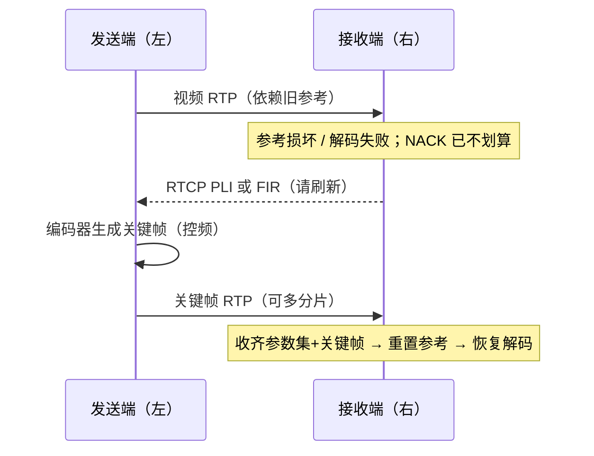

# PLI 与 FIR

> [!tip] 阅读提示
> **前置：** [[NACK]]、[[RTCP]]；视频参考依赖有直觉即可。
> **初读：** 读到「初读到此为止」就停。弄清：PLI/FIR 是「请刷新关键帧」的请求，不是按序号重传。
> **深入：** 抑制频率、SFU 放大、观测验收，弱网排障时再读。

## 一句话说明

PLI（Picture Loss Indication）和 FIR（Full Intra Request）都是 RTCP 反馈，用于请求视频发送端刷新解码参考。它们是恢复请求，不是对某个已丢 RTP 包的重传；找回指定丢包应走 [[NACK]] / [[RTX]]。

## 先记住这三句

1. PLI / FIR = 告诉视频发送端：「参考链坏了，请给一个可独立解码的新起点（关键帧一类）」。
2. 它们 **不是** NACK：不说「重传第几个 RTP 包」，而是要刷新画面。
3. 请求到了 ≠ 立刻砸一个超大关键帧；要限频，还要等关键帧发全、解出来，用户才算恢复。

## 核心机制

**图在说什么：** 右接收端发现参考链坏了，用 RTCP 请左发送端刷新；左侧回关键帧（独立解码起点），不是按序号重传某个旧包。



文字版同一条链路：

```text
参考损坏 / 关键缺失 / 解码失败
  -> 先评估 NACK/RTX 是否仍有意义
  -> 否 -> PLI 或 FIR（带抑制窗口）
  -> 发送端/SFU：刷新范围、帧类型、发送时刻
  -> 编码独立起点 -> 分片 -> Pacer/拥塞控制
  -> 收端：参数集 + 关键帧完整 -> 重置参考 -> 正常解码
```

1. 接收端检测到参考帧损坏、关键图片缺失或解码器无法继续，先确认单包重传是否仍有意义。  
2. 若无法通过 NACK/RTX 在播放截止前修复，则产生 PLI 或 FIR，并按抑制窗口合并重复请求。  
3. 发送端或 SFU 决定刷新范围、关键帧类型与发送时间，编码器生成新的独立解码起点。  
4. 新帧经分片、Pacer 发送；收端收到参数集与关键帧后重置参考状态，恢复正常解码。

### 语义对比

| | PLI | FIR |
| --- | --- | --- |
| 语义强度 | 当前图片/参考链不可用 | 更强，明确要求完整刷新 |
| 序号 | 通常无命令序号 | 带请求序号，抑制重复处理 |
| 发送端自由度 | 可按编码状态安排合适刷新 | 仍须控频与控队列，不能无视速率 |
| 共同点 | 都不找回指定 RTP 序号；都走 RTCP | |

接收端应维护最近请求时间、请求来源、当前解码参考、等待的关键帧与恢复超时。关键帧及其参数集的 RTP 时间戳、SSRC 与协商编码须与原媒体线一致，或由转发层显式建立新映射。

## 数值与取舍示例

若一个关键帧约 300 KB，目标发送速率约 10 Mbit/s，单纯串行发送所需时间约为 `300 × 1024 × 8 / 10,000,000 ≈ 246 ms`，还未计入其他流量与排队。因此刷新请求可能短时挤占音频或推高 Pacer 队列，不能在每个下游都立刻触发全量关键帧。

可选缓解：受限刷新、intra refresh 分摊、等待更合适的编码边界、为关键帧预留峰值预算并与 probing 错开。细节发送压力讨论见拥塞/Pacing 相关笔记，本篇不展开公式。


---

> [!warning] 初读到此为止
> 上面这些已经够第一次阅读。下面是工程展开与排障细节（字段、指标、状态流），**第二轮或遇到具体问题时再读**；第一次直接点文末「第一次阅读下一站」即可。


## 问题边界

- **上游：** 解码参考损坏、关键图片缺失、解码器错误、加入新层/新订阅；以及「单包重传是否仍赶得上」的判断（[[播放截止时间]]）。
- **下游：** 编码器生成独立解码起点（关键帧/受限刷新）、经分片与 Pacer 发送；收端重置参考后恢复播放。
- **易混淆：**
  - PLI/FIR ≠ NACK：不携带「重传哪个 RTP 序号」。
  - 收到请求 ≠ 立刻发超大关键帧；须抑制频率并考虑队列与多订阅者。
  - 「发送端生成了关键帧」≠「用户已恢复可解码播放」；还要参数集、分片完整、解码参考重置。
  - 下游一个 PLI ≠ 全房间全局刷新（SFU 必须聚合）。
  - 关键帧码率尖峰 ≠ 稳态目标；勿与探测叠加打爆路径（见 [[带宽分配]]）。
## 工程要点

- **先诊断再升级：** 请求应带原因（参考缺失、解码错误、加入新层），并确认单包恢复已来不及，避免把可重传缺口误升关键帧。
- **最小间隔与退避：** 同一故障不能被每个下游包重复放大；连续 PLI/FIR 必须合并或限流。
- **成本进预算：** 关键帧成本交给 [[带宽分配]] 与 Pacer；必要时采用受限刷新或逐步 intra refresh。
- **SFU 聚合：** 按发布流、订阅层与下游状态聚合；单个下游请求不应无条件广播给所有观看者。
- **恢复闭环：** 关键帧到达后检查 SPS/PPS（或等价参数）、帧组装完整、解码器是否真正恢复；日志记录产生端/聚合端/执行端的请求 ID 与节流结果。
- **成功标准：** 恢复可解码播放，而不是仅看到发送端生成了一个关键帧。

## 常见误区与故障表现

| 误区 | 故障表现 / 排查 |
| --- | --- |
| 把 PLI/FIR 当 NACK | 指定丢包仍在，画面不回；查是否该走 RTX |
| 一收到就发超大关键帧 | 关键帧风暴、新丢包、音频被挤 |
| PLI/FIR 频繁循环 | 关键帧不完整、参数集丢、参考未重置 |
| 关键帧已发仍黑屏 | PT/SSRC/RID、分片重组、解码错误、参数集时序 |
| SFU 无条件放大 | 一人花屏拖垮房间码率 |

## 观测与验证

**一起看：** PLI/FIR 计数、请求间隔、请求原因、关键帧大小、发送耗时、Pacer 排队、恢复首帧时间、刷新后冻结率。

**三场景：**

1. 单个接收端参考帧丢失  
2. 多个订阅端同时请求  
3. 带宽骤降期间的刷新  

验证限流与聚合：同故障连续触发应合并；多订阅测试中单下游不放大为全流刷新。

**最小验收：**

- 能区分参考包缺失、解码器错误、加入新层三类原因。  
- 连续触发时请求合并或受限，不成反馈风暴。  
- 关键帧后验证参数集、完整帧、解码参考与首帧时间。  
- 刷新后仍黑屏时能区分参数集、分片、参考链与渲染故障。


## 请求升级决策（摘要）

```text
缺口可定位且截止内 RTX 仍可能 -> NACK/RTX
参考链断 / 解码器不可用 / 新订阅无起点 -> PLI 或 FIR
同故障重复到达 -> 合并进抑制窗口，记录节流
```

把「可修包」误升为关键帧，会制造不必要的码率尖峰；把「已不可修」一直留在 NACK 循环，则画面长期花屏。两者都要在同一条诊断链上用请求原因与恢复首帧时间验证。

## 阅读导航

- **上一篇：** [[NACK]]
- **下一篇：** [[TWCC]]
- **所属专题：** [[00-知识地图/专题说明/10 RTCP 与质量反馈|10 RTCP 与质量反馈]]
- **回看：** [[RTC 知识总览]] · [[00-知识地图/学习路线/学习进度模板|学习进度]] · [[00-知识地图/学习路线/RTC 工程师学习路线.canvas|阶段路线]]

- **第一次阅读下一站：** [[TWCC]]

> 读完先回所属专题做练习/验收，再点下一篇。内部链接最多再追一层；不影响理解的陌生词先记下。

## 图谱关系

- 承载：[[RTCP]]
- 输入：[[丢包恢复策略]]
- 前置：[[视频编解码]]
- 预算约束：[[带宽分配]]
- 相关：[[NACK]]、[[RTX]]、[[播放截止时间]]

## 参考资料

- 《WebRTC 的拥塞控制和带宽策略》第 2 节“pacer”和第 3.3 节“NACK 与丢包重传”对关键帧/发送压力的讨论，`90-参考资料/音视频与 WebRTC 书库/livevideostack-webrtc-congestion-control-zh/content/00-webrtc-congestion-control.md`
- 《WebRTC 权威指南（原书第 3 版）》第 10.2.3 节“RTP 协议和 SRTP 协议”，`90-参考资料/音视频与 WebRTC 书库/webrtc-authoritative-guide-zh/content/10-protocols.md`；第 12 章 RTP/RTCP RFC 资料，`90-参考资料/音视频与 WebRTC 书库/webrtc-authoritative-guide-zh/content/12-ietf-rfc-documents.md`
