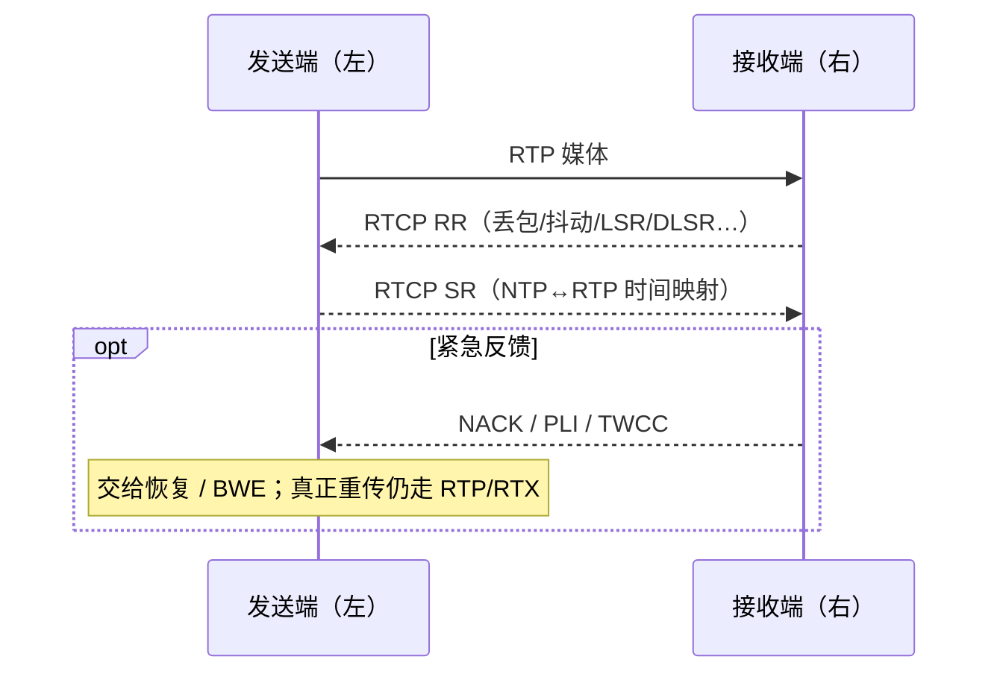

# RTCP

> [!tip] 阅读提示
> **前置：** [[RTP]]。
> **初读：** 读到「初读到此为止」就停。弄清：RTCP 是观测与请求闭环，不是重传媒体通道。
> **深入：** 复合包、RTT 单位、限流与 Stats 对账，联调时再读。

## 一句话说明

RTCP（RTP Control Protocol）与 RTP 配套，交换收发统计、时间映射、源描述和反馈消息，为媒体传输提供观测与控制闭环。它不是媒体重传通道；具体反馈语义由对应的 RTCP 报文类型和协商能力决定（如 [[NACK]]、[[PLI 与 FIR]]、[[TWCC]]）。

## 先记住这三句

1. RTCP 和 RTP 配套：交换统计、时间映射、反馈（丢了多少、要不要重传/刷关键帧等）。
2. RTCP **不运媒体**；真正重传仍走 RTP/RTX 等路径。
3. 看到反馈 ≠ 发送端已经改策略；RR 丢包率也 ≠ 用户感知卡顿，口径要分开。

## 用一句话说清

RTCP 是 RTP 的「质检员通道」：不传画面本身，而传**统计与反馈**——谁在发、丢了多少、要不要重传/关键帧、带宽感觉如何。

**第一次分两类：**

1. **周期报告**：SR/RR（发/收质量报表）
2. **紧急反馈**：NACK、PLI、TWCC 等（有事马上说）

两者挤在有限的 RTCP 带宽预算里。

（报文类型表与调度状态机在折叠线后。）



---

> [!warning] 初读到此为止
> 上面这些已经够第一次阅读。下面先是「原初读区深文」（可跳过），再是工程细节；**第一次直接点文末「第一次阅读下一站」即可。**


## 初读展开（原初读区深文，第二轮再读）

> 下面是本篇原先堆在初读区的展开内容，已整体后移，避免第一次阅读过载。

## 核心机制

**图在说什么：** 左右两端互发 RTP；RTCP 用虚线回报 SR/RR 与紧急反馈（NACK/PLI/TWCC）——它不运媒体，看到反馈 ≠ 对端已改策略。


> （本图已上移到初读区，此处不重复。）


文字版同一条闭环：

```text
RTP 收发 -> 维护丢失/最高扩展序号/抖动/速率/传输反馈状态
  -> 调度器按周期 + 紧急度 + RTCP 预算组复合包
  -> （rtcp-mux 时与 RTP 解复用协同）
  -> 对端解析 SR/RR/反馈
  -> 更新同步、RTT、丢包、带宽观测
  -> 交给恢复 / BWE / 拥塞控制
```

1. 收发两端按会话约定周期性生成 SR/RR，并在需要时生成反馈类 RTCP。  
2. 接收端从 RTP 维护丢失、最高扩展序号、到达间隔抖动、接收速率与传输反馈状态。  
3. 调度器按报告周期、反馈紧急程度与 RTCP 带宽预算组合报文。  
4. 发送端解析后更新同步映射、RTT、丢包与带宽观测，再交给下游控制器。

### 关键报文与状态

| 类型 | 主要作用 |
| --- | --- |
| SR | 发送者 SSRC、NTP、RTP 时间、发包/字节；建立媒体时钟到参考时间映射 |
| RR | fraction lost、累计丢包、最高扩展序号、interarrival jitter、LSR、DLSR |
| NACK | 缺包序号请求（见 [[NACK]]） |
| PLI/FIR | 图像/完整帧刷新请求（见 [[PLI 与 FIR]]） |
| TWCC | 传输范围内到达观测（见 [[TWCC]]） |

发送状态至少保存本地发送时间、包/传输序号、报告时间与对应 SSRC，否则 RTT 或带宽趋势无法正确配对。NACK/PLI/FIR 与 TWCC 语义不能互相替代。

## 计算关系

RTT 常用报告时间关系估算：在收到 RR 的时刻减去 SR 中的 LSR 和 RR 中的 DLSR，得到发送方到接收方再返回的报告往返时间。实现必须统一 NTP 中间格式、单位和回绕处理，不能把 RTP 时间戳直接当作墙上时间。音画同步侧如何用 SR 映射见 [[音视频同步]]、[[时钟与时间戳]]。

```text
RTT ≈ arrival_of_RR - LSR - DLSR   （单位与回绕处理必须一致）
```

RTCP 发送开销也属于线路预算。反馈越频繁，带宽估计响应越快，但控制流量与 CPU 越高；反馈过稀则估计滞后，可能在网络已恶化后仍继续按旧目标发送。


---

## 问题边界

- **上游：** RTP 收发状态（序号、到达时间、字节/包计数）、会话协商（`rtcp-mux`、反馈能力）、RTCP 带宽预算与调度。
- **下游：** 同步映射、RTT、丢包/抖动观测；交给恢复、[[带宽估计]] / 拥塞控制与 [[WebRTC Stats]] 的输入。
- **易混淆：**
  - RTCP ≠ 重传通道；实际重传仍走 RTP/[[RTX]]。
  - RR 的 fraction lost ≠ 用户感知丢包；有窗口与口径，需结合恢复/晚到。
  - RTP 时间戳 ≠ 墙上时间；SR 的 NTP/RTP 对才用于映射。
  - 单个 RTCP 字段 ≠ QoE；累计值、区间值、网络丢失、恢复后丢失、晚到丢弃必须分开。
  - 反馈到达 ≠ 策略已执行；是否重传/降码/刷新由发送端策略决定。
## 工程要点

- **非阻塞：** 报告生成不应阻塞媒体解码线程；先按 SSRC/序号/到达时间更新状态再组装。
- **健壮解析：** 校验版本、长度、复合包边界、反馈类型与 SSRC；未知扩展安全跳过，防止后续块错位。
- **`rtcp-mux` / 加密：** 保留报文边界；在正确的 SRTP/SRTCP 层之后解析。
- **生命周期：** 关闭、重连、SSRC 切换时清理旧报告状态，避免旧丢包或时间映射污染新会话。
- **策略分离：** RTCP 只提供观测或请求；重传、降码、刷新与预算分配由发送策略执行，并受同一带宽约束。
- **对账：** 抓包中的报告应能重算 Stats 区间指标与 RTT（见 [[WebRTC Stats]]）。

## 常见误区与故障表现

| 误区 | 故障表现 / 排查 |
| --- | --- |
| 把 RTCP 当重传通道 | 找不到「RTCP 里的媒体」；查 RTP/RTX 路径 |
| fraction lost = 体验丢包 | 观感与数字不符；分网络丢失/恢复/晚到 |
| RTT 为负或突然极大 | LSR/DLSR 单位、回绕、跨会话状态 |
| BWE 抖动剧烈 | 反馈覆盖、发送时间记录、乱序、RTCP 被排队 |
| 复合包解析错位 | 未知块后长度处理错误；构造含未知块用例 |

## 观测与验证

**一起看：** RTP、RTCP、STUN/DTLS 的方向与时间；按 SSRC 关联 SR/RR；报告周期与反馈紧急包是否挤占预算。

**构造用例：** 正常报告、反馈丢失、乱序、序号回绕、SSRC 重启、复合包含未知块；比较解析结果与 WebRTC Stats 的累计/区间指标。

**最小验收：**

- 能解析合法与截断的复合 RTCP，并在未知反馈块后继续定位边界。  
- 人工构造 SR/RR 验证 RTT、丢包、jitter 的单位、回绕与窗口。  
- 反馈丢失或延迟时，控制器保持可解释状态，不拿过期样本盲目增速。  
- 会话关闭与 SSRC 切换后，旧报告不污染新会话。

复盘：每个报告字段的时间基、单位、窗口与 SSRC 关联是否明确？控制反馈是否受 RTCP 带宽预算与调度延迟约束？


## 复合包与调度直觉

一个复合 RTCP 往往按「必须先有的接收报告 + 紧急反馈 + 源描述」拼接。紧急 NACK/PLI 可以缩短间隔，但仍应受 RTCP 带宽份额与最小间隔约束，否则控制面自己制造拥塞。`rtcp-mux` 下，解复用错误会把 RTCP 当 RTP 或反之——抓包时先确认 PT/格式再谈统计口径。

反馈丢失时的正确态度是**保持上一可信状态并标记样本年龄**，而不是用猜测填补加速控制器；这与 [[带宽估计]] 的「过期反馈不可当新鲜样本」一致。

## 阅读导航

- **上一篇：** [[PTS DTS 与时间基]]
- **下一篇：** [[音视频同步]]
- **所属专题：** [[00-知识地图/专题说明/06 时间系统与音画同步|06 时间系统与音画同步]]
- **回看：** [[RTC 知识总览]] · [[00-知识地图/学习路线/学习进度模板|学习进度]] · [[00-知识地图/学习路线/RTC 工程师学习路线.canvas|阶段路线]]

- **第一次阅读下一站：** [[音视频同步]]

> 读完先回所属专题做练习/验收，再点下一篇。内部链接最多再追一层；不影响理解的陌生词先记下。

## 图谱关系

- 输入：[[RTP]]
- 观测：[[TWCC]]
- 反馈：[[NACK]]、[[PLI 与 FIR]]
- 输出：[[WebRTC Stats]]
- 相关：[[音视频同步]]、[[带宽估计]]

## 参考资料

- 《WebRTC 权威指南（原书第 3 版）》第 10.2.3 节“RTP 协议和 SRTP 协议”，`90-参考资料/音视频与 WebRTC 书库/webrtc-authoritative-guide-zh/content/10-protocols.md`；第 12.1 节“实时传输协议”，`90-参考资料/音视频与 WebRTC 书库/webrtc-authoritative-guide-zh/content/12-ietf-rfc-documents.md`
- 《WebRTC 的拥塞控制和带宽策略》第 5 节“feedback”，`90-参考资料/音视频与 WebRTC 书库/livevideostack-webrtc-congestion-control-zh/content/00-webrtc-congestion-control.md`
