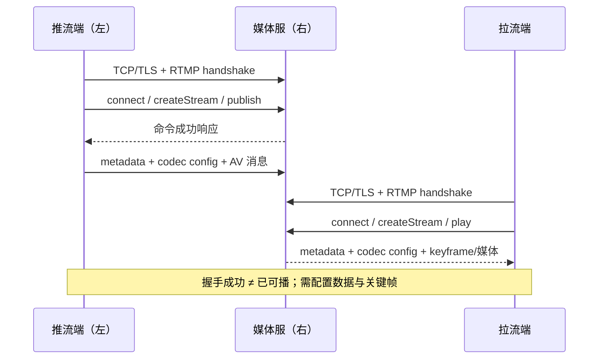

# RTMP 推流与拉流

> [!tip] 阅读提示
> **前置：** [[TCP]] 初读区（字节流、队头阻塞）；知道直播「推上去 / 拉下来」即可。
> **初读：** 读到「初读到此为止」就停。弄清：RTMP 在干什么、推/拉流程长什么样，以及它和 WebRTC 媒体路径的差别。
> **深入：** Chunk 组包、握手字段、音视频配置 Tag、背压与抓包，做直播接入或排障时再读。

## 一句话说明

RTMP（Real-Time Messaging Protocol）是在一条长连接上复用命令、数据、音频和视频消息的应用层协议。直播中，推流端用 `connect → createStream → publish` 把编码媒体送入服务器，拉流端用 `connect → createStream → play` 订阅服务器输出；它负责会话命令、消息分帧与传输，但不负责摄像头采集、音视频编码、内容分发策略，也不保证固定低延迟。

## 先记住这三句

1. RTMP 是跑在 **TCP** 上的直播应用协议：把音视频消息切成 **Chunk** 在字节流上复用；应用要自己恢复消息边界。
2. 常见分工：**推流**（主播 → 源站）+ **拉流**（观众 → CDN/源站）；和 WebRTC 的 P2P/SFU 实时通话不是同一条产品路径。
3. 延迟来自编码 GOP、TCP 队头阻塞、服务端/播放器缓冲等；「连上 RTMP」≠「已经低延迟可播」。

## 用一句话说清

RTMP 是直播里常见的「推流/拉流」老协议：推流端把音视频送给媒体服务器，播放端再拉下来看。它和 WebRTC 不是同一条设计路线——RTMP 更偏直播分发，WebRTC 更偏双向实时。

**第一次只需分清：**

1. **推流**：编码器/OBS → 媒体服（发布）
2. **拉流**：播放器 ← 媒体服（观看）
3. 先握手连上，再传音视频消息；**连上 ≠ 画面已经稳定可播**

## 一条直播链路（直觉）

摄像头/桌面 → 推流软件 → RTMP 服务器 →（可能转码/分发）→ 播放器



---

> [!warning] 初读到此为止
> 上面这些已经够第一次阅读。下面先是「原初读区深文」（可跳过），再是工程细节；**第一次直接点文末「第一次阅读下一站」即可。**


## 初读展开（原初读区深文，第二轮再读）

> 下面是本篇原先堆在初读区的展开内容，已整体后移，避免第一次阅读过载。

## 从一次真实开播看懂 RTMP

先不看协议字段，想象你用 OBS 在电脑上开播，再拿手机进入直播间观看：

1. 你在 OBS 填入直播服务器地址和 stream key，点击“开始直播”。
2. OBS 先连到平台服务器，确认双方都能说 RTMP，再提交“我要在这个直播间发布”的请求。
3. 平台验证 stream key 后给 OBS 分配一条逻辑流；OBS 先说明视频是 H.264、音频是 AAC，再持续发送画面和声音。
4. 平台收到主播流后，可以转封装、转码、录制并分发到各地节点。
5. 观众打开直播间，播放器向服务器订阅这路流；拿到解码配置和一个完整关键帧后，才真正看到画面。

上面五步对应本文后面的专业概念：

| 生活中的动作 | RTMP/媒体术语 | 为什么要分开看 |
| --- | --- | --- |
| OBS 拨通服务器 | [[TCP]]/[[TLS]] 连接、RTMP handshake | 电话接通不等于平台允许开播 |
| 平台验证直播间和密钥 | `connect`、鉴权 | 登录成功不等于已经占用发布流 |
| OBS 点击开始发布 | `createStream`、`publish` | 发布成功后还可能没有媒体数据 |
| 先告诉播放器“怎么解码” | AVC/AAC sequence header | 没有配置，收到压缩数据也未必能解释 |
| 观众等到第一幅完整画面 | keyframe、首帧时间 | 中途加入时不能只靠后续差分帧还原画面 |
| 网络变慢后画面越来越落后 | TCP 重传、发送队列、播放器缓冲 | 数据最终送到不等于仍赶得上直播时间 |

> [!important] 类比边界
> 这些例子帮助建立直觉，真正实现和排障仍要回到协议状态、字段、时间戳与日志证据。特别是“主播用 RTMP 推流”不表示观众也一定通过 RTMP 观看。

## 问题边界

### 先用主播和观众理解

> [!note] 最直观的直播理解
> **推流端通常就是主播端，拉流端通常就是观看主播的观众端。**主播把摄像头和麦克风产生的音视频发送给直播服务器，观众从服务器取得这路音视频并播放。

```text
主播端（手机直播 App、OBS、导播机）
        |
        | 推流：发布音视频
        v
直播服务器 / CDN
        |
        | 拉流：订阅音视频
        v
观众端（播放器、直播 App）
```

这个理解适合建立第一印象，但工程上要把“数据方向”和“人的身份”分开：

| 协议角色 | 通俗直播角色 | 还可能是谁 |
| --- | --- | --- |
| 推流端（Publisher） | 主播端 | 摄像机、编码器、OBS、导播软件、转码或转推服务器 |
| 拉流端（Player/Subscriber） | 观众端 | 录制服务、转码服务、下级 CDN、内容审核或监控程序 |

- **推流/拉流描述数据相对端点的方向，不描述这个端点是不是人。**服务器从上游拉取一路流后，也可以再向下游发布或转推。
- **主播和观众不必使用同一种协议。**常见链路是主播用 RTMP 推到服务器，观众再通过 HTTP-FLV、HLS 或 WebRTC 拉流；此时只有主播到服务器这一段是 RTMP。
- 在本文的 RTMP 命令里，推流端通过 `publish` 成为发布者，拉流端通过 `play` 成为订阅者。

### RTMP 位于哪一层

```text
推流端                                   拉流端
采集 -> 编码 -> RTMP 消息                 RTMP 消息 -> 解码 -> 播放
                 |                              ^
                 v                              |
              TCP/TLS -> RTMP 服务器/CDN -> TCP/TLS
                            |
                 鉴权、转封装、转码、录制、分发
```

- **上游输入：** 已编码的音视频访问单元、DTS/PTS、codec configuration、脚本元数据、直播流标识和鉴权信息。
- **下游输出：** 服务端可识别的发布流，或播放器可解码、可按时间线调度的订阅流。
- **RTMP 自己负责：** 握手、连接与流命令、Chunk 分片与复用、协议控制、媒体消息承载。
- **RTMP 不负责：** 编码质量、服务端是否转码、CDN 调度、播放器抖动缓冲策略、端到端内容权限体系。

### 容易混淆的“推流/拉流”协议

| 方案 | 媒体承载与连接 | 会话建立 | 典型特点 |
| --- | --- | --- | --- |
| RTMP/RTMPS | RTMP over TCP；RTMPS 再加 [[TLS]] | AMF 命令 `connect/publish/play` | 直播采集入口成熟，TCP 队头阻塞，浏览器通常不能原生播放 |
| [[WHIP 与 WHEP|WHIP/WHEP]] | WebRTC 媒体，通常为 ICE/DTLS/SRTP | HTTP + SDP | 面向低延迟 WebRTC 摄入/播出，有 RTP/RTCP 与拥塞反馈 |
| HTTP-FLV | HTTP 响应体持续输出 FLV Tag | HTTP 请求 | 常用于拉流，不等于 RTMP；没有 RTMP 握手和命令状态机 |
| HLS/LL-HLS | HTTP 分片与播放列表 | HTTP 请求 | CDN 与浏览器生态好；延迟取决于分片、播放列表和播放器策略 |

“推流”描述发布方向，“拉流”描述订阅方向，不等于指定某一种协议。RTMP 与 HTTP-FLV 可以携带相似的 FLV 音视频负载语义，但线上的连接、控制和分帧方式不同。

## 一条 RTMP 直播链路

```text
Publisher                Origin/Media Server                 Player
    | TCP/TLS + RTMP handshake |                                |
    | connect/createStream     |                                |
    | publish(stream key)      |                                |
    | metadata + codec config  |                                |
    | audio/video messages --->|                                |
    |                          |<-- TCP/TLS + RTMP handshake ----|
    |                          |<-- connect/createStream/play ---|
    |                          |--- metadata + codec config ---->|
    |                          |--- keyframe + media ----------->|
```

这里至少有三条彼此独立的成功条件：

1. **传输成功：** DNS、TCP、可选 TLS 和 RTMP 握手完成。
2. **会话成功：** `connect`、`createStream`、`publish` 或 `play` 得到成功响应。
3. **媒体成功：** 配置数据与可解码关键帧到达，时间戳连续，播放器真正开始渲染。

只记录“端口已连接”会把后两层故障全部隐藏。

> [!example] 生活化理解：进入电影院
> TCP/RTMP 握手成功，只相当于你已经走进电影院大厅；`connect/publish/play` 成功，相当于验票并找到正确影厅；屏幕真正出现连续画面，才相当于媒体可播。人在大厅、票也有效，都不能单独证明电影已经正常放映。


**图在说什么：** 左推流端与右媒体服先握手并连接/发布，再推音视频消息；拉流是对称订阅路径。


> （本图已上移到初读区，此处不重复。）

## 核心对象与复用层次

RTMP 在一条 TCP 连接中复用多个逻辑对象。实现时不要把这些 ID 混成一个“流 ID”。

| 对象 | 作用 | 生命周期与所有权 |
| --- | --- | --- |
| TCP connection | 可靠、有序字节流 | 由 socket 两端维护；断开后旧连接内的协议状态全部失效 |
| NetConnection | 应用级连接与 `app`、鉴权、能力协商 | `connect` 成功后建立；通常对应一个 RTMP 连接会话 |
| Message Stream | 承载一次 `publish` 或 `play` 的逻辑媒体流 | `createStream` 返回数值 ID；同连接可有多个，服务器支持范围需实测 |
| Chunk Stream | 交错传输消息片段并压缩消息头 | 由 Chunk Stream ID（CSID）区分；每个 CSID 独立保存上一条头部状态 |
| RTMP Message | 命令、协议控制、音频、视频或数据 | 有 timestamp、length、type id、message stream id |
| 业务 stream name/key | 应用路由与授权使用的流名 | 由服务端定义，不能直接等同于 Message Stream ID |

`Message Stream ID` 说明消息属于哪条逻辑流；`Chunk Stream ID` 说明分片通过哪个头部上下文传输。二者数值空间和职责不同。

> [!example] 生活化理解：电视台里的传送系统
> 可以把一条 TCP connection 想成通往电视台的一条封闭传送带，NetConnection 是你在这座电视台办好的业务账户，Message Stream 是其中某个节目频道。音频、视频和控制信息是不同货物；货物拆成小箱子后，箱子上的 CSID 标签告诉分拣员应使用哪套组装记录。业务 stream name/key 则更像节目名称和开播凭证，它不是传送带内部使用的箱子编号。

---

## 建连与握手

### URL 与下层连接

常见 URL 形态为：

```text
rtmp://host[:port]/app/streamName
rtmps://host[:port]/app/streamName
```

TCP `1935` 是 RTMP 的传统端口，RTMPS 部署也常复用 `443` 穿越企业网络，但端口和 URL 拆分规则最终由服务器配置决定，不能写死在协议解析器中。查询参数常被用于 token，日志、代理和监控必须脱敏。

### 简单握手

RTMP 1.0 规范中的基本握手由固定大小块组成：

```text
Client                                             Server
  | --- C0(version, 1 byte) + C1(1536 bytes) -----> |
  | <--- S0(version) + S1(1536) + S2(1536) -------- |
  | --- C2(1536) ----------------------------------> |
```

- 常见版本字节为 `3`。
- `C1/S1` 包含时间字段、零字段和随机数据；`C2/S2` 用于回显/确认对端握手数据。
- 完成握手只说明双方能进入 RTMP 消息阶段，不说明 `connect` 鉴权、发布或播放成功。
- 历史产品存在带摘要校验的复杂握手等扩展；是否需要支持应按目标服务器互操作验证，不能把厂商行为当成 RTMP 1.0 基线。

> [!example] 生活化理解：先确认“听得懂”，再办理业务
> 握手像两个人接通电话后先互相说“我使用普通话，你能听见吗”；`connect` 才像报上账号并进入具体营业厅，`publish/play` 则是办理开播或观看业务。握手结束只能证明通信格式基本对得上。

## Chunk：在 TCP 字节流上恢复消息边界

TCP 不保留 `send()` 边界，因此 RTMP 必须自己定义 Chunk。一个 RTMP Message 可以拆成多个 Chunk，不同 CSID 的 Chunk 还能在同一连接上交错，以免大视频消息长期挡住较小的控制或音频消息。

> [!example] 生活化理解：大件货物拆箱运输
> 一幅较大的视频数据像一件装不上传送带的大家具，必须拆成多个带编号的小箱子；接收端收齐后再组装回完整消息。音频或控制消息的小箱子可以插在两个视频箱子之间运输，所以 Chunk 能改善不同消息的交错机会；但如果传送带前方本身堵住，后面的所有箱子仍要等待，这就是 TCP 队头阻塞的边界。

```text
TCP byte stream
  -> Basic Header: fmt + csid
  -> Message Header: timestamp/delta, length, type, message stream id
  -> Extended Timestamp（条件存在）
  -> Chunk Data（不超过当前 chunk size）
```

### Basic Header

- `fmt` 占 2 bit，决定本 Chunk 使用哪种 Message Header。
- CSID 使用 1、2 或 3 字节编码；Basic Header 的低 6 bit 为 `0` 或 `1` 时表示后面还有扩展 CSID 字节。
- 解析器必须逐 CSID 维护上一个消息头、当前消息累计长度和剩余字节，不能用一个全局“上一头部”。

### 四种 Message Header

| `fmt` | 头部长度 | 本次显式携带 | 典型用途 |
| ---: | ---: | --- | --- |
| 0 | 11 字节 | 绝对时间戳、消息长度、类型、Message Stream ID | 新流或上下文不能继承时完整声明 |
| 1 | 7 字节 | 时间戳增量、消息长度、类型 | 同一 Message Stream 上长度/类型可能变化 |
| 2 | 3 字节 | 时间戳增量 | 长度、类型和 Message Stream ID 沿用 |
| 3 | 0 字节 | 全部继承 | 同一消息的后续 Chunk，或满足继承规则的新消息 |

注意两个线格式细节：

- 绝大多数多字节整数按网络字节序解释，但 Message Header 中的 `Message Stream ID` 是 4 字节小端序；这很容易写错。
- 3 字节 timestamp 或 delta 等于 `0xFFFFFF` 时，头后还要读取 4 字节 Extended Timestamp。`fmt=3` 对扩展时间戳的继承也必须遵循当前消息上下文，不能简单认为“无头就无时间字段”。

### Chunk Size 与组包状态

连接开始时默认最大 Chunk Data 为 **128 字节**。任一端可以用 `Set Chunk Size` 消息修改自己随后发送方向的上限；两个方向的值独立。

```text
NeedBasicHeader
  -> NeedMessageHeader(fmt, csid)
  -> NeedExtendedTimestamp?
  -> NeedChunkData(min(chunk_size, message_remaining))
       ├─ message_remaining > 0 -> 保存 csid 上下文 -> NeedBasicHeader
       └─ message 完整 -> 按 type 分派 -> NeedBasicHeader
```

解析器必须处理任意 TCP 拆分/合并读取、Chunk 交错和消息跨多个读取缓冲区。消息长度要设置上限；在长度未验证前按对端声明分配内存，会留下拒绝服务风险。

## RTMP 消息与控制

### 协议控制消息

协议控制消息使用 Message Stream ID `0`，并有固定类型。常见类型如下：

| Type ID | 名称 | 核心作用 |
| ---: | --- | --- |
| 1 | Set Chunk Size | 修改发送方后续输出的 Chunk Data 上限 |
| 2 | Abort Message | 中止指定 CSID 上正在组装的消息 |
| 3 | Acknowledgement | 报告截至目前已接收的字节序号 |
| 4 | User Control Message | Stream Begin/EOF、Ping Request/Response、缓冲长度等事件 |
| 5 | Window Acknowledgement Size | 告诉对端累计接收多少字节后发送 ACK |
| 6 | Set Peer Bandwidth | 通告对端输出带宽窗口及 Hard/Soft/Dynamic 限制类型 |

RTMP `Acknowledgement` 是协议层接收字节计数反馈，不等于 TCP ACK，更不表示消息已解码或画面已渲染。TCP ACK 由内核确认字节交付，RTMP ACK 位于其上的 RTMP 状态机中。

### 命令与数据消息

| Type ID | 常见内容 |
| ---: | --- |
| 8 | Audio Message |
| 9 | Video Message |
| 15 / 18 | AMF3 / AMF0 Data Message，如 `onMetaData` |
| 17 / 20 | AMF3 / AMF0 Command Message，如 `connect`、`publish`、`play` |
| 22 | Aggregate Message，封装多个子消息；支持程度需按实现验证 |

AMF（Action Message Format）用于编码命令名、transaction ID、command object 和参数。客户端用 transaction ID 把 `_result`/`_error` 与请求关联；`onStatus` 等事件不一定对应同一个请求-响应模型，因此需要按命令和事件语义驱动状态，而不是只判断 transaction ID 是否非零。

## 推流状态机

### 主流程

```text
Disconnected
  -> TCPConnecting
  -> TLSHandshaking（RTMPS）
  -> RTMPHandshaking
  -> NetConnecting       -- connect(app, tcUrl, capabilities...)
  -> StreamCreating      -- createStream
  -> Publishing          -- publish(streamName, "live")
  -> SendingConfig       -- metadata + audio/video sequence header
  -> Streaming           -- timestamped audio/video messages
  -> Closing / Reconnecting / Failed
```

典型命令顺序：

1. `connect`：指定 `app`、`tcUrl`、编码版本和客户端能力；服务器以 `_result` 或 `_error` 回应。
2. 可选的 `releaseStream`、`FCPublish`：历史 Flash Media Encoder 兼容流程，现代服务器是否需要取决于实现。
3. `createStream`：服务器返回 Message Stream ID。
4. `publish(streamName, "live")`：请求占用业务流名；成功通常通过 `onStatus` 类事件确认。
5. 发送 `onMetaData`、AAC/AVC 配置和媒体消息。
6. 停止时发送相应命令并关闭；异常断线后重新握手、重新鉴权并创建新流。

### 发布成功的不变量

- 发布状态必须绑定当前 connection generation；旧连接晚到的回调不能把新连接改成失败或成功。
- 业务流名冲突、鉴权失败和资源不足要与网络断开分开记录。
- 编码参数改变时，应在依赖新参数的媒体帧前发送新的 codec configuration，并让服务端/下游从可解码起点恢复。
- 用户态发送队列必须有字节数和等待时长上限；慢网络下无限缓存只会把“丢帧”变成越来越大的直播延迟。

## 拉流状态机

### 主流程

```text
Disconnected
  -> TCP/TLS/RTMPHandshaking
  -> NetConnecting       -- connect
  -> StreamCreating      -- createStream
  -> Playing             -- play(streamName)
  -> WaitingConfig       -- metadata + codec configuration
  -> WaitingKeyframe     -- 视频需要可解码随机访问点
  -> Buffering
  -> Rendering
  -> Rebuffering / Reconnecting / Ended / Failed
```

典型流程：

1. `connect` 与 `createStream` 建立应用连接和 Message Stream。
2. `play` 指定流名；直播通常从当前实时位置开始，点播的 start/duration/seek 语义由服务器和内容类型决定。
3. 服务器发送 Stream Begin、`onStatus`、元数据、codec configuration 和媒体消息。
4. 播放器完成解复用与解码器初始化；视频等待关键帧，音视频按时间戳进入各自队列。
5. 缓冲达到启动条件后选择主时钟渲染；网络抖动或 TCP 重传导致数据中断时进入 rebuffering。

新观众加入时，服务端常缓存最近的元数据、codec configuration 和 GOP 起点。如果只转发“此刻刚收到的 P/B 帧”，播放器即使持续收到字节也可能在下一个关键帧前保持黑屏。

> [!example] 生活化理解：先拿到完整底图
> 关键帧像一张完整照片，后续 P/B 帧更像“把人物向左移动两格、把灯光调暗”这样的修改说明。观众中途进入直播间，如果只拿到修改说明却没有完整底图，就无法还原正确画面；因此播放器要等待关键帧，服务端也常缓存最近一个 GOP 的可解码起点。

## 音视频负载与配置数据

经典 RTMP 直播通常沿用 FLV Tag 的音频、视频和脚本数据语义，但 **RTMP Message 不是完整 FLV 文件**：线上没有要求先传 FLV 文件头，也不能把 TCP 上的任意 RTMP Chunk 直接当作一个 FLV Tag。

### H.264/AVC

经典 FLV/RTMP 的 AVC 视频负载常见结构为：

```text
FrameType + CodecID
AVCPacketType
CompositionTime (signed 24-bit, milliseconds)
AVC payload
```

| `AVCPacketType` | 含义 | 处理要点 |
| ---: | --- | --- |
| 0 | AVC sequence header | 携带 AVCDecoderConfigurationRecord，如 profile、NAL 长度字段宽度、SPS/PPS |
| 1 | 一个或多个 AVC NALU | 通常为长度前缀格式，不是 Annex B 起始码格式 |
| 2 | AVC end of sequence | 实时链路不应依赖它作为唯一结束证据 |

视频 RTMP timestamp 对应解码时间轴，`CompositionTime` 表示 PTS 相对 DTS 的偏移。含 B 帧时不能假设 `PTS == DTS`；偏移还必须按有符号 24 位值解析。

### AAC

经典 AAC 音频负载在音频头后使用：

| `AACPacketType` | 含义 |
| ---: | --- |
| 0 | AAC sequence header，通常携带 AudioSpecificConfig |
| 1 | AAC raw access unit |

播放器要先取得采样率、声道和对象类型等配置，再解释 raw AAC。不要把带 ADTS 头的文件字节未经转换直接当作 RTMP AAC raw payload。

> [!example] 生活化理解：配置是说明书，媒体包是零件
> AVC/AAC sequence header 像组装说明书，后续压缩音视频数据像一箱箱零件。只把零件运到播放器，却不告诉它 NAL 长度、SPS/PPS、采样率或声道等配置，播放器可能“收到了货”却不知道怎样组装。配置发生变化时，也要在依赖新配置的数据之前发送新版说明书。

### 元数据与现代扩展

`onMetaData` 常包含宽高、帧率、音视频码率和 codec 标识，但它是声明，不是事实的唯一来源。实际负载、sequence header 和解码结果必须互相校验。

经典 RTMP/FLV 的互操作基线长期集中在 H.264/AVC 与 AAC 等格式。AV1、HEVC、VP9、Opus 等现代编码的携带方式属于 Enhanced RTMP 等扩展生态；上线前必须固定扩展版本并用推流端、服务器、录制/转封装和播放器做端到端互操作，不能只看某一端“支持该 codec”。

## 时间戳与播放时间线

- RTMP 消息 timestamp 的单位是毫秒；它不是采样计数，也不是 RTP 的媒体时钟频率。
- 基础头只留 24 bit，超过阈值时用 Extended Timestamp 承载 32 bit 值。
- 32 bit 毫秒时间戳约 `49.7` 天回绕一次；长连接的差值计算要使用模运算或扩展时间线。
- 同一条媒体流内，时间戳应保持可解释的推进。编码器重启、网络重连或源切换若让时间戳回退，服务端必须选择重基准、开启新 discontinuity，或明确拒绝。
- 音画同步不能只比较“最新到达包”的 RTMP timestamp；应经过解码、缓冲和主时钟调度，详见 [[音视频同步]] 与 [[播放器队列与主时钟]]。

### 一个时间戳例子

假设某 H.264 视频消息：

```text
RTMP timestamp (DTS) = 10 000 ms
CompositionTime      =     67 ms
PTS                  = 10 067 ms
```

解码器按 DTS 顺序接收，播放器按 PTS 选择呈现时间。若错误地把 RTMP timestamp 当 PTS，含重排序帧的视频会出现抖动、倒序或音画偏移。

> [!example] 生活化理解：后厨加工顺序与上菜时间
> DTS 像后厨必须按什么顺序加工菜品，PTS 像每道菜计划什么时候端上桌。为了提高效率，后厨加工顺序可能与上菜顺序不同；`CompositionTime` 就是两者之间的时间差。解码器关心前者，播放器渲染关心后者。

## 流控、背压与实时性

### 两层流控不能混为一谈

- **TCP 层：** `rwnd` 防止压垮接收端，`cwnd` 响应网络拥塞；丢失字节必须重传并按序交付。
- **RTMP 层：** Window Acknowledgement Size、Acknowledgement 和 Set Peer Bandwidth 管理协议级收发窗口。
- **应用层：** 编码器、复用器、发送队列、服务端转发队列和播放器缓冲决定过载时丢什么、等多久。

RTMP 没有 WebRTC 中 RTCP/TWCC 那样面向实时媒体的逐流反馈闭环。只靠 TCP 最终把旧字节补齐，可能恢复完整性，却已经错过直播播放截止时间。

### 队头阻塞

同一 TCP 连接中一个 segment 丢失时，即使后续音频或关键控制消息已到达内核，也不能越过缺口交给 RTMP 解析器。这会造成音视频一起短暂停顿，恢复后又突发到达。

RTMP 的 Chunk 交错能避免**应用消息级**的大视频消息独占输出，但不能绕过 **TCP 字节级**的队头阻塞。

> [!example] 生活化理解：收银台前的单队列
> TCP 像只有一个出口的收银队列。前面一位顾客的付款出了问题，即使后面的顾客已经准备好，也不能越过缺口完成结账。网络恢复后，积压的数据会一起到达；如果播放器把它们全部照常播放，直播就会越来越落后，所以发送队列和播放缓冲都必须有上限与追赶策略。

### 直播延迟从哪里来

```text
采集/编码
  + 推流发送队列
  + TCP/TLS/公网传输与重传
  + 服务端接入、转封装/转码、GOP 缓存
  + 下行 TCP 传输
  + 拉流端探测、关键帧等待、播放缓冲与渲染
```

RTMP 直播延迟不是协议名决定的常数。降低播放器缓冲可以减小稳态延迟，却会增加弱网下卡顿；缩短 GOP 可减少新观众等待关键帧的时间，却会提高码率或降低同码率画质。

例如 30 fps、固定每 60 帧一个关键帧时，GOP 约 2 秒。若服务端没有可用的 GOP cache，新观众仅关键帧等待就可能接近 0 到 2 秒；这还没计算网络、解码和播放器缓冲。

## 服务端接入与协议转换

```text
RTMP ingest
  -> 握手/鉴权/命令状态
  -> Chunk 解析与消息重组
  -> FLV 风格音视频负载解析
  -> 统一内部 Track/Frame/Packet 时间线
       ├─ RTMP/HTTP-FLV 输出
       ├─ HLS/录制（重封装或转码）
       └─ WebRTC 输出（RTP 打包、反馈、可能转码）
```

“协议转换”并不总等于“转码”：

- H.264 可能只需从 AVC length-prefixed NALU 转换为 [[H264 RTP 负载格式|RTP H.264]] 分片，并重建时间戳与参数集；像素内容不必改变。
- AAC 通常不能直接作为浏览器 WebRTC 的通用音频轨道，常需转成 Opus；这属于解码再编码。
- RTMP 没有 RTP sequence、SSRC、RTCP 和 TWCC。转成 WebRTC 时，网关必须创建新的 RTP 状态、拥塞反馈和安全传输上下文。
- 如果输入 profile、分辨率或关键帧结构不满足下游，仍可能需要视频转码。

因此，RTMP 接入成功不能证明 WHEP/WebRTC 出口已可用。应分别观测 ingress、内部轨道、转码/重封装和 egress。

> [!example] 生活化理解：换包装与翻译内容
> 把 H.264 从 RTMP/FLV 风格负载改装成 RTP 包，像把同一件商品从纸箱换进周转箱，内容本身没有改变，这更接近重封装。把 AAC 变成 Opus，则像先听懂一句话再翻译成另一种语言，需要解码和重新编码，成本、延迟和质量损失都更高。

## 工程实现要点

### 解析器与状态所有权

- TCP 接收缓冲只保存尚未消费的字节；每个 CSID 独立保存头部继承和消息重组状态。
- Message Stream 状态必须绑定当前 NetConnection，连接断开后不可跨重连复用数值 ID。
- 为消息长度、AMF 递归深度、字符串长度、对象属性数、Chunk Size 和并发流数设置上限。
- `Set Chunk Size` 生效点、Abort Message 和连接关闭时的残帧清理要有测试。
- 未知但长度合法的消息类型按策略跳过或拒绝；不能在未验证长度时进入具体 payload 解析。

### 推流发送队列

- 记录采集时间、编码完成时间、入队时间、发出时间和当前队列时长。
- 过载时优先保持可恢复边界：视频可按依赖关系丢到下一个关键帧；音频策略应与产品连续性目标一致。
- 不能只看 socket 可写就继续生产无限媒体。编码目标码率、发送队列和网络实际吞吐必须形成背压或降级闭环。
- 重连后先恢复 metadata/configuration，再从可解码关键帧开始；不要把旧连接的半个 Chunk 接到新连接。

### 拉流缓冲与恢复

- 把 `Playing`、`WaitingConfig`、`WaitingKeyframe`、`Buffering`、`Rendering` 分开打点。
- 配置变化时安全重建解码器；旧帧和新参数的代次不能混用。
- 断流检测应综合最后字节、最后完整消息、最后音频/视频时间戳和最后渲染时间，不能只用一个 TCP keepalive。
- 音频持续但视频冻结时，先看视频配置、关键帧和时间戳，而不是直接判定整条 RTMP 连接失败。

### 安全与鉴权

- 明文 `rtmp://` 不提供机密性、服务端身份认证或防篡改；公网生产环境优先使用正确验证证书的 RTMPS 或受控专网。
- stream key/token 绑定 app、stream name、动作（publish/play）、有效期和可选客户端约束，并支持轮换与吊销。
- token 放在 URL 查询参数时会经过历史记录、代理和访问日志；必须脱敏，能放 header/握手字段与否取决于客户端和服务器实现。
- 防止重复发布抢占、暴力枚举流名、超长 AMF/消息、连接洪泛和慢速发送占用资源。

## 常见误区与故障表现

| 误区或现象 | 更准确的解释与检查方向 |
| --- | --- |
| TCP 已连接，所以推流成功 | 继续检查 RTMP 握手、`connect`、`createStream`、`publish` 和服务端入站码率 |
| `publish` 成功，所以观众立即有画 | 还需 metadata/config、关键帧、服务端分发和拉流端解码渲染 |
| RTMP Message 就是 FLV Tag | 媒体负载语义相近，但 RTMP 还有 Chunk、消息头、命令和控制；线上不等于 FLV 文件 |
| 增大 Chunk Size 一定降低延迟 | 它减少头部开销，但可能改变交错粒度；TCP 排队、GOP 和播放器缓冲常更关键 |
| TCP 可靠，所以不会卡顿 | 重传保证顺序完整，也会造成队头阻塞；实时价值可能在补齐前已过期 |
| 有视频码率但黑屏 | 检查 sequence header、SPS/PPS、AVC NAL 长度格式、关键帧与时间戳 |
| 只有音频没有视频 | 视频未发布、关键帧未到、配置错误、profile 不兼容或服务端转码失败 |
| 周期性延迟跳高后快速追帧 | 查 TCP 重传、发送队列、服务端队列、GC/事件循环暂停和播放器追赶策略 |
| 推流重连后画面花屏 | 新代次未先发配置/关键帧，或旧队列、旧时间线混入新连接 |
| RTMPS 抓包看不到命令 | TLS 正常加密了 RTMP；需客户端/服务端阶段日志或受控环境的会话密钥 |

## 观测与验证

### 分阶段指标

| 阶段 | 建议记录的证据 |
| --- | --- |
| DNS/TCP/TLS | 解析耗时、connect 耗时、TLS 版本/证书结果、失败层级 |
| RTMP handshake | C0/C1 发出、S0/S1/S2 收到、C2 完成、耗时与版本 |
| NetConnection | `connect` transaction ID、`_result/_error`、app、server code |
| publish/play | Message Stream ID、流名哈希、`onStatus` code、首媒体等待时间 |
| 推流媒体 | 音视频 message/s、bitrate、最新 DTS/PTS、发送队列毫秒数、关键帧间隔 |
| 服务端 | ingress/egress bitrate、连接/流代次、GOP cache、转码队列、订阅数 |
| 拉流体验 | 首配置、首关键帧、首音频、首画面、缓冲时长、卡顿次数与总时长 |

关键日志用同一个低基数链路标识串起来：

```text
connection_generation -> net_connection -> message_stream_id
  -> app/stream_name_hash -> media_track -> downstream_session
```

### 抓包与工具

- 明文 RTMP 可在受控环境用 Wireshark 过滤 `rtmp` 或 `tcp.port == 1935`，核对握手、Chunk Size、命令顺序、消息类型和时间戳。
- RTMPS 下抓包主要观察 TCP/TLS 建连、重传、窗口和时序；命令与媒体内容需结合端点日志。
- 用 FFmpeg 实验时记录完整版本与 build configuration；不同版本支持的协议选项、Enhanced RTMP 和 codec 范围可能不同。

在输入已经是目标服务器可接受的编码与封装参数时，可先做不转码推流基线：

```bash
ffmpeg -re -i input.mp4 -map 0:v:0 -map 0:a:0? -c copy -f flv \
  "rtmp://127.0.0.1/live/test"
```

`-re` 用输入时间戳节流文件读取；`-c copy` 只做转封装，不会修正不兼容的 codec、profile、GOP 或损坏时间戳。若服务端要求 H.264/AAC，应显式编码并按输入帧率计算 GOP，例如 30 fps 下 `-g 60` 约为 2 秒：

```bash
ffmpeg -re -i input.mp4 \
  -c:v libx264 -preset veryfast -tune zerolatency \
  -g 60 -keyint_min 60 -sc_threshold 0 \
  -c:a aac -f flv "rtmp://127.0.0.1/live/test"
```

拉流侧先用日志和流信息确认服务端实际输出：

```bash
ffprobe -v info -show_streams -show_format \
  "rtmp://127.0.0.1/live/test"
```

这些命令只证明所用 FFmpeg 与目标服务器的当前组合；不能替代浏览器、硬件编码器或生产播放器的互操作验证。

## 可复现故障注入

| 注入条件 | 预期协议/媒体现象 | 应验证的恢复行为 |
| --- | --- | --- |
| 错误 app、stream key 或过期 token | `connect`/`publish`/`play` 被拒绝 | 保留服务端 code，不误报 TCP 故障，不无限重试 |
| 握手完成后不发 `connect` | 连接占用但无业务流 | 服务端握手后空闲超时和资源回收 |
| 将一条 Chunk 每 1 字节喂给解析器 | 多次 partial read | 状态机不越界、不丢上下文，最终只产出一条完整消息 |
| 交错两个 CSID 的多 Chunk 消息 | 每个 CSID 头部与组包独立 | 不串 message length、timestamp 或 payload |
| 宣告超大 message length/AMF 字符串 | 内存攻击尝试 | 在分配前拒绝并记录协议错误 |
| 推流 2% 丢包或突发断网 | TCP 重传、队头阻塞、发送队列增长 | 有界队列、明确降级；重连建立新代次 |
| 重连后时间戳从 0 开始 | 时间线 discontinuity | 服务端重基准或新流处理，不与旧时间线错误拼接 |
| 丢弃 AVC/AAC sequence header | 收到媒体但解码器缺配置 | 拉流端保持 WaitingConfig 并请求/等待恢复，而非崩溃 |
| 长 GOP 且观众中途加入 | WaitingKeyframe 首帧变慢 | 服务端 GOP cache 或关键帧请求/编码策略生效 |
| 拉流端暂停读取 | TCP/RTMP 窗口和服务端发送队列收缩/增长 | 慢订阅者隔离，不拖垮同源其他订阅者 |

## 最小验收清单

- 能画出 TCP/TLS、RTMP handshake、NetConnection、Message Stream 和媒体解码五层状态，并为每层指出独立成功证据。
- 能解释 Chunk Stream ID 与 Message Stream ID 的区别，并用交错 Chunk 测试解析器的逐 CSID 状态。
- 能解析 `fmt=0/1/2/3`、Extended Timestamp、Set Chunk Size、partial read 和非法消息长度。
- 能写出 `connect → createStream → publish` 与 `connect → createStream → play` 的正常、拒绝、断线和重连路径。
- 能说明 AVC sequence header、AAC sequence header、关键帧、DTS/PTS/CompositionTime 的依赖关系。
- 能区分 RTMP、RTMPS、HTTP-FLV、HLS 与 WHIP/WHEP 的会话和媒体边界。
- 能用端点日志、服务端指标和抓包区分“连接成功、发布成功、收到媒体、下游可播、实际渲染”。

## 复盘问题

- 当前系统把 stream key、Message Stream ID、Chunk Stream ID 和内部 track ID 分开记录了吗？
- 推流速度高于实际 TCP 吞吐时，第一处有界队列在哪里，丢弃/降码率/断开的策略是什么？
- 新观众加入时，metadata、codec configuration 和可解码关键帧从哪里取得？
- 从 RTMP 转 WebRTC 时，哪些步骤只是重封装，哪些 codec 或反馈差异迫使转码/重建状态？
- RTMPS 线上无法解密抓包时，阶段日志是否足以区分 TLS、AMF 命令、Chunk 解析和媒体时间线故障？

## 阅读导航

- **上一篇：** [[TCP]]
- **下一篇：** [[HTTP-FLV 拉流服务]]
- **所属专题：** [[00-知识地图/专题说明/09 RTP 打包、解析与传输|09 RTP 打包、解析与传输]]
- **回看：** [[RTC 知识总览]] · [[00-知识地图/学习路线/学习进度模板|学习进度]] · [[00-知识地图/学习路线/RTC 工程师学习路线.canvas|阶段路线]]

- **第一次阅读下一站：** [[HTTP-FLV 拉流服务]]

> 读完先回所属专题做练习/验收，再点下一篇。内部链接最多再追一层；不影响理解的陌生词先记下。

## 图谱关系

- 主题：[[媒体传输地图]]
- 传输前置：[[TCP]]
- 传输安全：[[TLS]]保护 RTMPS 中的 RTMP 命令、Chunk 和媒体字节。
- 媒体输入：[[码流与容器]]、[[H264]]、[[AAC]]
- HTTP 拉流输出：[[HTTP-FLV 拉流服务]]复用 FLV 负载语义，但使用持续 HTTP 响应而非 RTMP 握手、命令和 Chunk。
- 时间：[[PTS DTS 与时间基]]、[[音视频同步]]
- 服务端消费：[[媒体服务器]]
- WebRTC 推拉流对照：[[WHIP 与 WHEP]]
- RTP 打包对照：[[RTP]]、[[H264 RTP 负载格式]]
- 实时性边界：[[端到端延迟]]、[[播放截止时间]]
- 排障：[[抓包分析]]、[[网络仿真]]

## 参考资料

- Adobe, *Real-Time Messaging Protocol (RTMP) Specification*, Version 1.0（2012-12-21）：握手、Chunk Stream、Message、协议控制与命令流程。
- Adobe, *Video File Format Specification*, Version 10.1：FLV Tag、AAC/AVC packet type、AVCDecoderConfigurationRecord 与 CompositionTime。
- FFmpeg 官方文档：Protocols（`rtmp`/`rtmps`）与 Formats（FLV muxer/demuxer）；具体选项以实验所用 FFmpeg 版本为准。
- Veovera Software Organization, *Enhanced RTMP* 规范：现代视频/音频 codec 扩展；属于扩展生态，须固定版本并做端到端互操作验证。
- 同库 [[TCP]]、[[码流与容器]]、[[PTS DTS 与时间基]]、[[WHIP 与 WHEP]]、[[媒体服务器]]。
