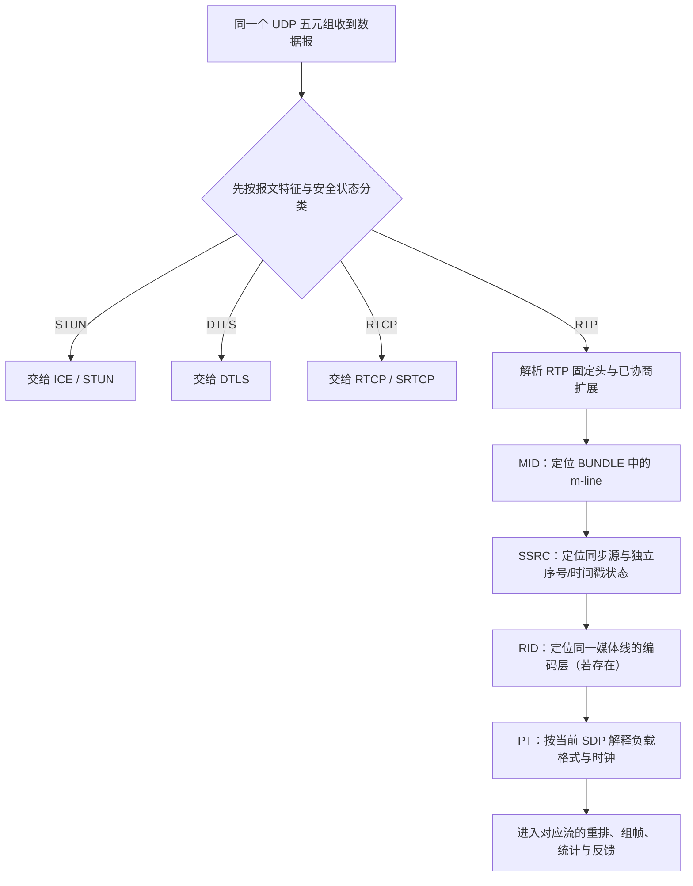

# RTP 流标识与复用

> [!tip] 阅读提示
> **前置：** [[RTP]]；有 [[SDP]]、[[RTP 头扩展]] 更好。
> **初读：** 读到「初读到此为止」就停。弄清：多路媒体共用一个传输时，**不能只看 PT**；要用 MID / SSRC / RID 分层解复用。
> **深入：** 字段细节、SFU 映射、验收清单在联调或排障时再读。

## 一句话说明

RTP 头部的字段分别解决「这是什么格式」「来自哪个同步源」和「属于哪条协商媒体线」的问题。多路媒体共用一个传输时，接收端必须按协商状态和包头标识解复用，不能只看 Payload Type。

## 先记住这三句

1. **PT** = 负载格式/时钟；**SSRC** = 同步源；**MID** = 哪条 m-line；**RID** = 同一线上哪一层（Simulcast）。
2. BUNDLE / rtcp-mux 只是少开端口，**不会**让「归属」消失——还得靠这些标识拆流。
3. SSRC 会因重启/冲突变化，**不是**永久用户 ID；用户身份在信令或映射层。

## 标识层次（初读）

| 标识 | 回答什么 | 边界 |
| --- | --- | --- |
| SSRC | 哪个同步源 | 可能变；要清旧状态 |
| CSRC | 混音贡献了谁 | 不是新传输连接 |
| PT | 什么编码/时钟 | 不能单独标识一条流 |
| MID | BUNDLE 哪条媒体线 | 头扩展，靠 SDP 谈 ID |
| RID | 同一媒体线哪一层 | 头扩展；常用于 Simulcast |

## 解复用直觉

**图在说什么：** 同一 UDP 五元组上先按类型分给 STUN/DTLS/RTCP/RTP；RTP 再靠扩展与协商字段归属到具体流。

> [!example] 小场景
> 音频 SSRC `0x1001`、视频 `0x2001` 共用一个 UDP 五元组：序号、抖动、组帧必须分两套状态。视频低/中/高三层可共享媒体线但不同 RID；切层时不能把新层序号接到旧层统计上。

核心不变量：**不能只凭 PT 把包归给某个用户或某条流。**

---

> [!warning] 初读到此为止
> 上面这些已经够第一次阅读。下面是工程展开与排障细节（字段、指标、状态流），**第二轮或遇到具体问题时再读**；第一次直接点文末「第一次阅读下一站」即可。

## 复用与接收状态

1. 先按传输层协议和安全状态识别 RTP/RTCP，再按 `MID`、`SSRC` 和协商的 PT/RID 校验媒体归属。
2. 接收状态至少应绑定媒体线与 SSRC，例如 `(MID, SSRC)`；其中要保存序号、时间戳、抖动和解码依赖等跨包状态。
3. 发生 SSRC 重启、冲突或 RID 切换时，更新映射并保留可解释的观测记录；不要把不同源的序号空间合并。

## 工程边界

RTP/RTCP 复用或 BUNDLE 只减少传输通道数量，不会消除媒体归属信息。SFU 转发、Simulcast 层切换和统计聚合都必须保留或重建这些映射；PT 相同的两个源仍可能是两条不同媒体流。

## 端到端解复用流程

1. 接收器先按传输层和安全层识别 RTP、RTCP、DTLS 或 STUN，不能把同一 UDP 端口上的所有数据都当 RTP。
2. 对 RTP 包读取版本、PT、SSRC、CSRC、扩展和序号，按会话协商的 MID/RID 映射到媒体线和编码层。
3. 为 `(MID, SSRC, RID)` 或等价键创建独立的序号、抖动、组帧和统计状态；PT 只用于解释负载格式。
4. 源切换、SSRC 冲突或 RID 层变化时，更新映射并按策略重置受影响的解码状态，同时保留旧状态的结束原因。

已有 SSRC 绑定、MID/RID 是否每包发送、RTP/RTCP 解复用规则和协商版本都会影响实际路径。

## 关键字段与状态

- `SSRC` 是 RTP 会话内的同步源标识，通常由发送端选择。它可能因源重启或冲突而改变，不能当作稳定用户标识。
- `CSRC` 列出混音器或合成器贡献的同步源；它表达贡献关系，不代表每个贡献源都建立了独立传输。
- `Payload Type` 关联编码器、时钟和 fmtp 参数。相同 PT 可能被多个 SSRC 使用，PT 不足以完成路由。
- `MID` 关联 BUNDLE 中的媒体线，`RID` 关联同一媒体线上的发送编码层；它们来自协商的 RTP 头扩展，缺失时要依赖已有映射或安全拒绝。

## 发送侧与接收侧实现

- 发送侧为每个同步源维护序号和时间戳空间，编码层切换时更新 RID/SSRC 映射，并确保扩展与 SDP 协商一致。
- 接收侧先验证扩展长度、MID/RID 的编码和允许值，再查找会话映射；未知或冲突的组合应记录并丢弃，不能静默归入默认流。
- SFU 转发时可保持原 SSRC，也可分配新的下游 SSRC；无论采用哪种方式，都必须维护上游到下游的序号、时间戳和反馈关联。
- 统计系统要以流/源为粒度聚合，避免把音频和视频的包速率、丢包和码率相加后误解为单条媒体流。

## 常见误区与故障表现

- 误区：看到 PT 就知道是哪位用户。PT 是负载格式，不是源标识。
- 误区：SSRC 永远稳定。源重启和冲突会改变 SSRC，应用层用户 ID 应由信令或映射层提供。
- 故障：音频偶尔被视频解码器消费，检查 PT 映射、MID 缺失和默认路由。
- 故障：Simulcast 切换后画面冻结，检查 RID 层映射、参数集、序号空间和参考帧状态。

## 观测与实验

抓包导出每个 RTP 包的 SSRC、PT、序号、时间戳、MID、RID 和到达方向，按映射重建流列表。实验覆盖同端口多流、SSRC 重启、SSRC 冲突、RID 层切换、BUNDLE/rtcp-mux 和未知扩展，检查每个状态机是否独立收敛。

## 最小验收清单

- 用相同 PT 的两个 SSRC 验证流状态不会串线。
- 用同一媒体线的多个 RID 验证层切换和序号状态独立。
- 用 BUNDLE/rtcp-mux 抓包验证 RTP、RTCP 与其他协议不会误解复用。
- 记录 SSRC 冲突、重启和映射清理的原因。

## 阅读导航

- **上一篇：** [[HTTP-FLV 拉流服务]]
- **下一篇：** [[H264 RTP 负载格式]]
- **所属专题：** [[00-知识地图/专题说明/09 RTP 打包、解析与传输|09 RTP 打包、解析与传输]]
- **回看：** [[RTC 知识总览]] · [[00-知识地图/学习路线/学习进度模板|学习进度]] · [[00-知识地图/学习路线/RTC 工程师学习路线.canvas|阶段路线]]
- **第一次阅读下一站：** [[RTP 头扩展]]（MID/RID 怎么装进扩展）或 [[H264 RTP 负载格式]]（归属定了之后怎么拆负载）

> 读完先回所属专题做练习/验收，再点下一篇。内部链接最多再追一层；不影响理解的陌生词先记下。

## 图谱关系

- 输入：[[RTP]]
- 反馈：[[RTCP]]
- 前置：[[SDP]]
- 扩展：[[RTP 头扩展]]
- 实现：[[Simulcast]]

## 参考资料

- 《WebRTC 权威指南（原书第 3 版）》第 10.2.3 节“RTP 协议和 SRTP 协议”，`90-参考资料/音视频与 WebRTC 书库/webrtc-authoritative-guide-zh/content/10-protocols.md`
- 《WebRTC 权威指南（原书第 3 版）》第 10 章协议中的 RTP 头部扩展表，`90-参考资料/音视频与 WebRTC 书库/webrtc-authoritative-guide-zh/content/10-protocols.md`
- 《WebRTC 的拥塞控制和带宽策略》第 3.1 节“RTP 扩展”，`90-参考资料/音视频与 WebRTC 书库/livevideostack-webrtc-congestion-control-zh/content/00-webrtc-congestion-control.md`
