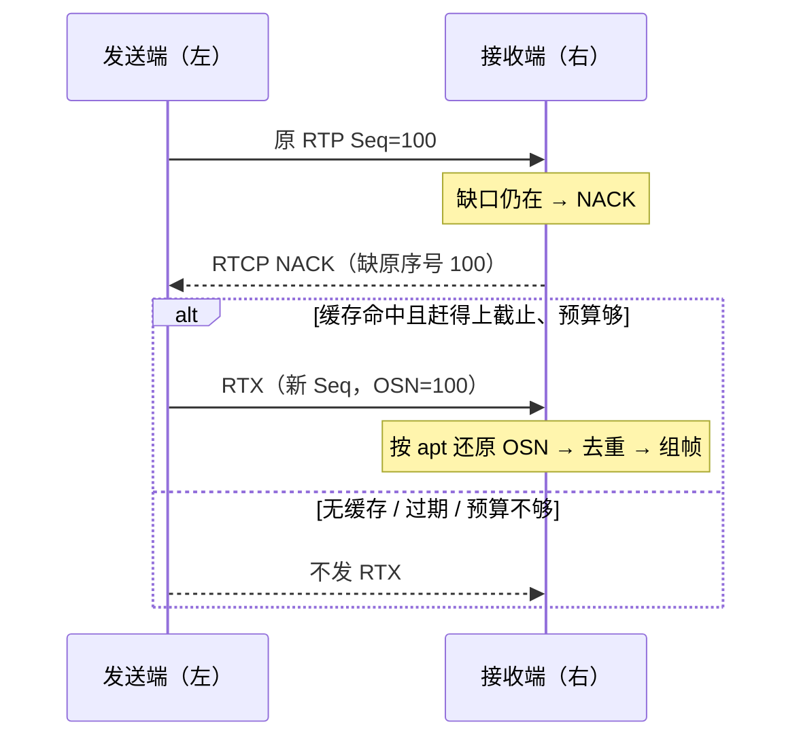

# RTX

> [!tip] 阅读提示
> **前置：** [[RTP]]、[[NACK]]。
> **初读：** 读到「初读到此为止」就停。弄清：RTX 是重传怎么封装关联，不负责「该不该重传」。
> **深入：** 缓存预算、SFU 边界、观测，联调时再读。

## 一句话说明

RTX（RTP Retransmission）把原始 RTP 包放进重传负载中，并用关联的负载类型和通常独立的 SSRC 让接收端区分原始发送与重传发送。它解决的是重传封装和关联，不负责决定每个缺包是否值得重传——那由 [[NACK]]、播放截止与 [[带宽分配]] 共同决定。

## 先记住这三句

1. RTX = 把原来的 RTP 包再封装发出去的重传格式（常有独立 PT/SSRC），方便接收端认出「这是重传」。
2. RTX 自己的序号 ≠ 原包序号；原序号一般在负载里的 OSN（Original Sequence Number）。
3. NACK 来了也不一定发 RTX：缓存没有、已过截止、带宽预算不够都可以不发。

## 核心机制

**图在说什么：** 右接收端用 NACK 报缺包；左发送端若缓存命中且赶得上截止，就用 RTX 封装把原包再发出去（RTX 序号 ≠ 原序号，靠 OSN 关联）。



文字版同一条链路：

```text
原包入发送缓存 (seq, ts, SSRC, PT, payload)
  -> 收端 NACK 报告原始序号缺口
  -> 发送端：缓存命中？截止内？预算够？
  -> 用 RTX PT/SSRC 封装，负载带 OSN
  -> 同一 Pacer / 拥塞控制发送
  -> 收端按 apt 映射恢复 OSN，去重后组帧
```

1. 发送端在原包进入发送路径时保存序号、时间戳、SSRC、PT 与有效负载。  
2. 接收端经乱序等待后仍缺包，通过 [[NACK]] 报告原始序号。  
3. 发送端命中缓存且预计能赶上播放截止、且预算允许时，生成 RTX 包。  
4. 接收端按协商关系找到原始 PT/SSRC，恢复 OSN，去重后重新进入 RTP 组帧。

### OSN 与 apt

| 字段/关系 | 作用 |
| --- | --- |
| `apt` | SDP fmtp 把 RTX PT 映射到原始媒体 PT |
| RTX 序号 | 重传流自己的 RTP sequence，与原流独立计数 |
| OSN | 关联原包序号，收端还原到原序号空间 |
| RTX SSRC | 可独立，也可能按实现复用；必须以协商处理 |
| 时间戳 | 通常保留原媒体时间戳语义，便于插入原时间线 |

接收端要保存 RTX→原始源映射、已恢复序号集合与重复判定，避免原包与 RTX 被解码两次。无法匹配 `apt` 的包应进异常统计，而不是静默当普通 RTP。

## 时序与成本示例

原包序号 100 在 40 ms 发出，收端 65 ms 发现缺失并发 NACK；发送端 75 ms 收到反馈，生成 RTX 序号 400、OSN=100。若剩余播放预算只有 10 ms，即使缓存命中也应放弃；若预算足够，RTX 到达后恢复 OSN 100 才能正确插入原时间线。

重传还会增加 RTP/RTX/SRTP 封装与 Pacer 排队成本。估算收益应看「每个有效恢复包的额外线上字节」和「是否挤压后续新媒体」，而不是只看原始负载大小。截止判断见 [[播放截止时间]]，预算见 [[带宽分配]]；与前向纠错的取舍对比见 [[FEC]]。

```text
有效恢复代价 ≈ (RTX 线上字节 + 排队挤占) / 截止内成功恢复包数
```


---

> [!warning] 初读到此为止
> 上面这些已经够第一次阅读。下面是工程展开与排障细节（字段、指标、状态流），**第二轮或遇到具体问题时再读**；第一次直接点文末「第一次阅读下一站」即可。


## 问题边界

- **上游：** SDP 协商的 RTX PT/`apt`/SSRC、发送侧有限重传缓存、NACK 报告的原始序号缺口、Pacer 与重传预算。
- **下游：** 还原到原始序号空间后的组帧、去重、解码；统计上的 RTX 字节、命中率、过期请求。
- **易混淆：**
  - RTX ≠ 新媒体编码；原始负载与解码语义不变。
  - RTX 自己的 RTP 序号 ≠ 原包序号；原序号在负载 OSN（Original Sequence Number）中。
  - NACK 到达 ≠ 必须发 RTX；缓存 miss、截止过期、预算不足都应拒绝或过期。
  - 仅按 PT 数值猜映射不可靠，必须以协商的 `apt` 与 SSRC 关系为准。
  - 「发了很多 RTX」≠「恢复成功」；要看截止内是否插入原时间线并只解码一次。
## 工程要点

- **缓存寿命：** 至少覆盖 RTT + 播放等待的一部分；包刚发完就释放会导致 NACK 永远 miss。缓存键用 `(SSRC, sequence)` 或等价键，并设时间/包数/字节上限；淘汰策略要可观测。
- **统一发送路径：** RTX 必须进同一 Pacer 与拥塞控制，不能绕过限流直接写 socket。高丢包时无限重传会反过来加重拥塞。
- **接收校验：** 先验证 RTX PT/SSRC/`apt`，再恢复 OSN；无法匹配的 RTX 计入异常。
- **去重四序：** 原包先到、RTX 先到、两者都到、两者都重复——只送解码器一次，并正确处理序号回绕。
- **SFU 边界：** 区分上游 NACK、下游 NACK 与自身重传缓存；不能把一个下游请求无条件广播到所有上游。多订阅时优先保护仍有播放价值的包。
- **与关键帧分工：** 参考链已断且单包恢复赶不上时，应评估 [[PLI 与 FIR]]，而不是堆叠过期 RTX。

## 常见误区与故障表现

| 误区 | 故障表现 / 排查 |
| --- | --- |
| 把 RTX 当新编码 | 解码器按错误 PT 解；查 apt / SDP |
| 以为 RTX 用原序号 | 序号空间错乱、重复或空洞；查 OSN 还原 |
| RTX 到达当新帧 | 花屏/重复帧；查 SSRC 映射与去重集合 |
| NACK 多但恢复率低 | 缓存寿命、反馈 RTT、Pacer 排队、播放截止 |
| 高丢包仍无限 RTX | 队列推高、拥塞加重；查重传限流与统一预算 |
| SFU 无条件转发 NACK | 上游被放大成 RTX 风暴；查聚合与缓存归属 |

## 观测与验证

**一起看：** 原始 RTP 与 RTX 的 PT、SSRC、序号、OSN、时间戳；发送端缓存命中/未命中、RTX 字节、重传排队、过期请求原因码；对照 [[WebRTC Stats]] 的重传相关计数。

**实验矩阵：**

1. 单包丢失 vs 连续突发丢包  
2. RTX 重复到达、原包晚到  
3. 序号回绕与 SSRC 切换  
4. 人为缩短缓存寿命 / 压低重传预算  
5. SFU 单下游请求是否放大到全上游  

**最小验收：**

- 用 SDP `apt` 验证原始 PT、RTX PT 与 SSRC 关系。  
- 四种到达顺序各测一遍，OSN 还原后只送解码器一次。  
- 缓存淘汰、反馈延迟、预算不足、过期重传都有可观测原因。  

补充核对：任何无法还原 OSN 或无法匹配 `apt` 的 RTX 都应进入异常统计，不应静默当作普通 RTP。


## 与 FEC / 关键帧的分工（摘要）

RTX 适合「个别缺口、RTT 仍赶得上截止」的修复；突发丢包或 RTT 过大时，优先评估 [[FEC]] 保护窗口或 [[PLI 与 FIR]] 刷新，而不是把同一缺口反复 NACK/RTX。三者共用发送预算，详见 [[丢包恢复策略]] 与 [[带宽分配]]，本篇不展开具体分配算法。

## 阅读导航

- **上一篇：** [[NACK]]
- **下一篇：** [[FEC]]
- **所属专题：** [[00-知识地图/专题说明/12 丢包恢复、带宽估计与拥塞控制|12 丢包恢复、带宽估计与拥塞控制]]
- **回看：** [[RTC 知识总览]] · [[00-知识地图/学习路线/学习进度模板|学习进度]] · [[00-知识地图/学习路线/RTC 工程师学习路线.canvas|阶段路线]]

- **第一次阅读下一站：** [[FEC]]

> 读完先回所属专题做练习/验收，再点下一篇。内部链接最多再追一层；不影响理解的陌生词先记下。

## 图谱关系

- 输入：[[NACK]]
- 前置：[[RTP]]、[[SDP]]
- 实现：[[丢包恢复策略]]
- 预算约束：[[带宽分配]]
- 相关：[[播放截止时间]]、[[FEC]]、[[PLI 与 FIR]]

## 参考资料

- 《WebRTC 的拥塞控制和带宽策略》第 3.2 节“NACK 与丢包重传”及第 3.4 节“FEC 与码率分配”，`90-参考资料/音视频与 WebRTC 书库/livevideostack-webrtc-congestion-control-zh/content/00-webrtc-congestion-control.md`
- 《WebRTC 教程》第 6 章“协议”，`90-参考资料/音视频与 WebRTC 书库/webrtc-tutorial-zh/content/06-chapter-6.md`
