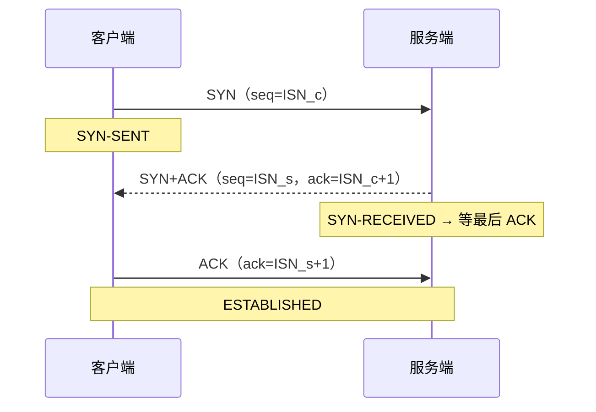
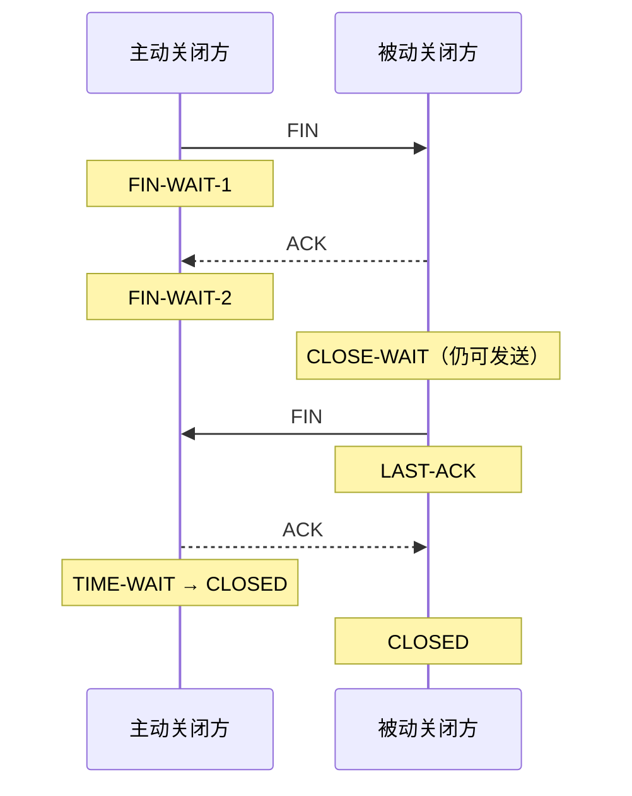

# TCP：可靠字节流、状态机与 RTC 工程边界

> [!tip] 阅读提示
> **前置：** [[UDP IP Socket 与 MTU]] 初读区；知道 RTC 媒体主路径多是 UDP 即可。
> **初读：** 读到「初读到此为止」就停。弄清：TCP 是可靠**字节流**（不是消息）、提供/不提供什么，以及为什么实时媒体常常不用 TCP 扛媒体。
> **深入：** 握手/关闭状态机、SACK/拥塞、Socket 背压、TLS 叠加与抓包清单，做信令/TURN-TCP/排障时再读。

## 一句话说明

TCP（Transmission Control Protocol）是在 IP 之上提供**面向连接、可靠、有序、全双工字节流**的传输层协议。它负责连接状态、按字节编号、确认、重传、接收端流量控制和发送端拥塞控制，但不保留应用消息边界，不保证固定延迟，也不证明对端业务已经处理数据。

## 先记住这三句

1. TCP 提供的是 **有序、可靠的字节流**：粘包/半包要应用自己分帧；它不自带「一个应用消息」边界。
2. TCP **保证交付与不重复（在连接语义内）**，但不保证「按时到达」；重传与队头阻塞会把延迟拉长，这是实时媒体常躲 TCP 的原因。
3. RTC 里 TCP 仍常见于 **信令、TURN/TCP、部分兜底传输**；媒体主路径仍以 UDP 为主，二者职责不要混谈。

## 用一句话说清

TCP 提供的是**可靠、有序的字节流**：像打电话前先拨通，说的话按顺序送达，丢了会重传。它**不保证**「按时到达」，也不自带「一条消息」的边界。

**为什么实时媒体常不拿 TCP 扛视频？**  
中间丢了一个旧包，后面的新画面也可能被堵住等重传——对话会卡。所以 WebRTC 媒体主路径多是 UDP；TCP 仍常见于**信令、HTTPS、TURN/TCP 回退**。

## 三次握手（只要直觉）

客户端说「我想连」→ 服务器说「好，也确认你」→ 客户端再说「收到」→ 双方进入可传数据状态。

（握手/挥手时序图、状态机、SACK、拥塞细节在折叠线后。）

---

> [!warning] 初读到此为止
> 上面这些已经够第一次阅读。下面先是「原初读区深文」（可跳过），再是工程细节；**第一次直接点文末「第一次阅读下一站」即可。**


## 初读展开（原初读区深文，第二轮再读）

> 下面是本篇原先堆在初读区的展开内容，已整体后移，避免第一次阅读过载。

## 问题边界

### TCP 提供什么

- **面向连接：** 通信前建立双方状态，四元组加传输协议标识一条连接；双方分别维护发送和接收方向。
- **可靠交付：** 校验失败、丢失或未确认的数据会按算法重传；重复字节会被去重。
- **有序字节流：** 应用最终按发送顺序读取连续字节；先到的后续数据可能暂存在接收端，等待前面的缺口。
- **流量控制：** 接收端通告窗口 `rwnd`，避免发送速度长期超过接收缓冲能力。
- **拥塞控制：** 发送端根据确认、丢包、ECN 和计时器等信号约束在途数据，避免无节制占用网络。
- **全双工：** 两个方向有独立的序列空间、确认、窗口和关闭过程；一侧可以停止发送但继续接收。

### TCP 不提供什么

- **不提供消息边界：** 一次 `send()` 不对应一次 `recv()`；“粘包”不是 TCP 出错，而是应用没有定义或正确解析消息帧。
- **不提供交付时限：** TCP 会尽力补齐旧数据，即使它对实时播放已经过期。
- **不保证低延迟或固定吞吐：** RTT、丢包、拥塞窗口、接收窗口、队列和应用调度都会改变完成时间。
- **不表示业务处理成功：** TCP ACK 通常只说明相应字节已进入对端 TCP 接收路径，不表示对端应用已读取、解析、持久化或执行。
- **不提供加密和身份认证：** 需要 [[TLS]] 等安全层；TCP 校验和主要用于发现传输中的意外损坏，不是防篡改机制。
- **不自动恢复进程级会话：** 连接断开后，重连、身份恢复、请求去重和业务状态同步仍由应用负责。

## 在协议栈与 RTC 中的位置

```text
应用消息 / HTTP / WebSocket / 自定义信令
  ↓ 应用分帧与业务语义
TLS（可选，提供加密、认证与完整性）
  ↓ 加密后的字节流
TCP（可靠、有序字节流）
  ↓ TCP segment
IP（跨网络寻址与路由）
  ↓ IP packet
以太网 / Wi-Fi / 蜂窝 / VPN / 其他链路
```

RTC 系统中常见的 TCP 用途是 HTTPS/WSS 信令、鉴权、房间控制、日志上传，以及 UDP 受限时客户端到 TURN 服务器的 TCP/TLS 回退。常规 WebRTC 实时媒体优先走 UDP，因为媒体更关心截止时间，允许放弃过期数据；TCP 则必须先补齐缺失字节，可能产生队头阻塞。

需要区分几个容易混淆的路径：

| 名称 | 实际含义 | 关键边界 |
| --- | --- | --- |
| HTTPS/WSS 信令 | HTTP 或 WebSocket 常运行在 TLS/TCP 上 | 信令连接可靠不代表媒体路径可用 |
| TURN/TCP | 客户端到 TURN 服务器的一跳使用 TCP | 常见 WebRTC 场景下，TURN 到 peer 的中继侧仍可使用 UDP；不能说端到端全是 TCP |
| TURN/TLS | 客户端到 TURN 服务器的一跳使用 TLS，通常承载在 TCP 上 | 能穿过只允许 TLS 出站的网络，但多一层排队和队头阻塞 |
| TCP relay allocation | RFC 6062 定义 TURN 对 TCP 连接的中继 | 与“用 TCP 连接 TURN 服务器来中继 UDP allocation”不是同一个概念 |
| ICE-TCP | ICE 为 TCP 候选定义的连接检查与角色机制 | 支持情况和部署路径需按具体实现验证 |
| RTP over TCP | 需要额外的帧边界，例如 RFC 4571 的长度前缀 | 不是普通 RTP/UDP，也不是浏览器 WebRTC 媒体的默认路径 |
| RTCDataChannel | SCTP over DTLS over ICE 选中的路径 | 不是 TCP；可提供多流、消息边界和部分可靠性 |

## 字节流不是消息

假设应用依次调用：

```text
send("ABC")
send("DEFG")
```

接收端可能看到：

```text
recv() -> "ABCDEFG"
```

也可能看到：

```text
recv() -> "A"
recv() -> "BCDE"
recv() -> "FG"
```

两种结果都正确。TCP 只保证最终字节序列仍是 `ABCDEFG`，不承诺保留两次写入的边界。IP 分片、TCP 分段、网卡卸载、接收缓冲、事件循环和读取缓冲大小都可能改变一次读取返回多少字节。

### 应用必须定义分帧

常见方法如下：

| 分帧方式 | 适合场景 | 必须防范的问题 |
| --- | --- | --- |
| 固定长度 | 字段始终等长 | 版本扩展困难，仍需处理不完整读取 |
| 长度前缀 | 二进制协议、RPC | 长度上限、整数溢出、字节序、恶意超长帧 |
| 分隔符 | 文本行协议 | 转义、编码、超长行、分隔符出现在内容中 |
| 自描述格式 | HTTP 等成熟协议 | 必须完整遵循其语法、长度和状态规则 |

以 4 字节网络字节序长度前缀为例，接收器至少维护以下状态：

```text
NeedHeader(4 bytes)
  → 解析 length
      ├─ length > MAX_FRAME → ProtocolError → Close
      └─ 合法 → NeedBody(length bytes)
                    ├─ 数据不足 → 保留缓冲并等待
                    └─ 数据完整 → DeliverOneFrame → NeedHeader
```

解析器不能假设一次 `recv()` 恰好返回 4 字节头或一条完整消息；也不能在未设最大帧长时按对端声明直接分配内存。

## TCP 为什么不总适合实时媒体

实时媒体的核心问题不是“每个字节最终是否到达”，而是“它能否在 [[播放截止时间]] 前到达”。TCP 的可靠有序语义会产生以下冲突：

1. 一个 segment 丢失后，后续字节即使已经到达，也不能越过缺口交给应用。
2. 重传需要至少一个反馈与恢复过程；RTO 路径可能更慢。
3. 旧视频帧已过播放截止时，TCP 仍必须恢复它，后续较新的帧也被阻塞。
4. 应用难以告诉内核“这段旧字节可以放弃，但后面继续交付”，因为普通 TCP 字节流没有部分可靠语义。
5. 多路音频、视频和控制复用在一条 TCP 连接时，一个缺口可能同时阻塞所有上层数据。

因此常见 RTC 媒体在 UDP 上由 RTP/RTCP、NACK/RTX、FEC、抖动缓冲和拥塞控制共同实现“按截止时间选择性恢复”。当网络只允许 TCP/TLS 时，TURN 回退可以优先保证“能通”，但应预期更高尾延迟，并监测音频卡顿、视频冻结、重传和发送队列。

这不表示 TCP 永远不能承载实时数据。低丢包、低 RTT、连接隔离、码率受控的网络中，TCP 可能表现良好；可靠的信令、聊天、文件和配置同步也很适合 TCP。选择依据应是数据语义与故障目标，而不是“TCP 一定慢、UDP 一定快”。

## TCP 与 UDP 对照

| 维度 | TCP | UDP |
| --- | --- | --- |
| 抽象 | 有序字节流 | 有边界的数据报 |
| 建连 | 有协议连接状态与握手 | 无传输层握手；UDP `connect()` 也不会建立 TCP 式连接 |
| 丢失恢复 | TCP 栈确认、重传并按序交付 | UDP 不负责；由 RTP/应用决定是否恢复 |
| 乱序 | TCP 重组后才交付连续字节 | 应用可能直接看到不同数据报的到达顺序 |
| 流量控制 | 接收窗口 `rwnd` | 无内建接收窗口反馈 |
| 拥塞控制 | TCP 栈内建 | UDP 应用必须使用适合协议的拥塞控制 |
| 消息边界 | 不保留 | 每个 datagram 有边界 |
| 过期数据 | 普通 TCP 不能跳过旧字节 | 应用可丢弃过期媒体包 |
| 典型 RTC 用途 | 信令、HTTPS/WSS、TURN TCP/TLS 回退 | RTP/RTCP、STUN、DTLS/SRTP 的常见承载 |

---

## TCP 首部与关键字段

一个 TCP segment 由 TCP 首部和该段携带的数据组成。基础首部为 20 字节；选项会增大首部，`Data Offset` 指出数据从哪里开始。

| 字段 | 位数 | 作用与工程含义 |
| --- | ---: | --- |
| Source Port / Destination Port | 各 16 | 标识两端传输端点；端口不是进程身份，也不是安全身份 |
| Sequence Number | 32 | 本段第一个数据字节的序号；SYN 存在时表示初始序列号 |
| Acknowledgment Number | 32 | ACK 有效时，表示接收方下一步期望的序号，即此前连续字节已确认 |
| Data Offset | 4 | TCP 首部以 32 位字为单位的长度，决定 payload 起点 |
| Control flags | 多个 1 bit | `SYN`、`ACK`、`FIN`、`RST`、`PSH`、`URG`、`ECE`、`CWR` 等状态和控制信号 |
| Window | 16 | 接收窗口通告值；若握手协商 Window Scale，实际窗口需按比例解释 |
| Checksum | 16 | 覆盖伪首部、TCP 首部和数据；IPv4/IPv6 的校验要求见对应规范 |
| Urgent Pointer | 16 | 与 `URG` 相关，现代通用应用较少使用，语义有历史兼容边界 |
| Options | 可变 | MSS、Window Scale、SACK Permitted、Timestamp 等通常在握手或数据段中出现 |

### 常用标志位

- `SYN`：同步初始序列号并建立连接状态；会占用一个序号。
- `ACK`：确认号有效；连接建立后绝大多数 segment 都会设置。
- `FIN`：本方向没有更多字节要发送；也会占用一个序号，但不影响反方向继续发送。
- `RST`：立即拒绝或异常终止连接；未读取数据和具体错误表现受触发方式、平台与时序影响。
- `PSH`：提示接收侧尽快把已有数据交给应用，但它不是可靠的应用消息边界，也不是“立即送达”保证。
- `ECE/CWR`：配合 ECN 表达拥塞经历与发送端响应；是否生效取决于端点和路径协商。

### 常用选项

- `MSS`：本端愿意接收的最大 TCP payload 大小，只在 SYN 中通告；两个方向可以不同。
- `Window Scale`：扩展 16 位 Window 字段可表达的接收窗口，必须在握手时协商。
- `SACK Permitted` / `SACK`：允许接收端报告不连续到达的数据块，帮助发送端只补真正缺失的范围。
- `Timestamp`：可用于 RTT 测量和防止旧重复序号混淆；具体使用与实现策略以端点协议栈为准。

## 序列号、确认与重传

TCP 为每个方向建立独立的 32 位序列空间。序列号按**字节**递增，而不是按 segment 或应用消息递增；比较时还必须正确处理 32 位回绕。

### 一个简化握手与传输例子

假设客户端初始序列号为 1000，服务器为 7000；忽略 TCP options：

```text
Client                                             Server
  | --- SYN, seq=1000 ----------------------------> |
  | <--- SYN+ACK, seq=7000, ack=1001 -------------- |
  | --- ACK, seq=1001, ack=7001 ------------------> |
  |                                                 |
  | --- 500 bytes, seq=1001, ack=7001 ------------> |
  | <--- ACK, seq=7001, ack=1501 ------------------ |
```

`ack=1501` 表示服务器已经连续收到客户端序号 1001 到 1500 的字节，并期望下一个字节从 1501 开始。这个 ACK 不表示服务器业务已经处理这 500 字节。

### 累积确认与 SACK

基础 ACK 是累积的：如果接收端已经连续收到 1 到 1000，即使 1001 缺失而 1002 到 2000 已到，它仍只能把累计确认停在 1001。若双方协商 SACK，接收端可以额外告诉发送端“1002 到 2000 已经收到”，减少不必要的重复传输。

乱序到达不一定代表丢包。接收端通常先缓存乱序字节；发送端根据 ACK/SACK、计时器和所用丢失检测算法判断是否重传。现代实现可能使用传统重复 ACK 启发式、RTO，以及 RACK 等基于时间的恢复机制，不能把某一个算法当作所有操作系统的固定行为。

### RTT、RTO 与重传

- RTT 样本来自发送与确认的时间关系，但延迟确认、ACK 合并、重传歧义和时间戳选项会影响采样。
- RTO（Retransmission Timeout）依据平滑 RTT 和 RTT 波动计算；超时后通常指数退避，避免故障路径上持续加压。
- 快速重传/恢复尝试在 RTO 到期前识别缺口，但触发阈值和恢复细节会随算法与实现演进。
- 重传成功只恢复字节完整性，不会恢复它的实时价值；等待期间同一连接后续字节不能越过缺口交给应用。

## 连接建立状态机

主动打开方调用非阻塞 `connect()` 后，连接不一定已经建立；它可能先返回“进行中”，随后通过可写事件和 socket 错误状态得知成功或失败。

```text
主动打开方：CLOSED → SYN-SENT → ESTABLISHED
被动打开方：CLOSED → LISTEN → SYN-RECEIVED → ESTABLISHED
```

**图在说什么：** 左客户端发 `SYN`，右服务端回 `SYN+ACK`，左再 `ACK`；三次之后双方进入 `ESTABLISHED`，才开始传字节流。



三次握手完成以下工作：

1. 双方确认彼此路径在当时可双向通信。
2. 双方交换各自的初始序列号。
3. 双方协商仅能在 SYN 阶段确定的能力，例如 MSS、Window Scale 和 SACK Permitted。
4. 内核创建或确认连接状态、定时器、发送/接收缓冲和路由关联。

握手成功不证明后续长连接永远可用。NAT/防火墙空闲超时、网络切换、路由变化、进程暂停和中间代理都可能让已有连接变成半开或不可达状态。

### 同时打开与 SYN 重传

双方同时主动打开在协议上有定义，但业务应用很少依赖它。SYN 丢失时会重传并退避；“连接超时”可能包含多次 SYN 尝试。DNS 解析、代理连接和 TLS 握手通常是其上方的独立阶段，日志不能全部压成一个 `connect failed`。

## 连接关闭、半关闭与 TIME_WAIT

TCP 两个方向分别关闭，因此正常结束通常需要双方各发送一个 FIN 并确认。主动关闭方的简化路径是：

```text
ESTABLISHED
  → FIN-WAIT-1
  → FIN-WAIT-2
  → TIME-WAIT
  → CLOSED
```

被动收到 FIN 的一方可能进入：

```text
ESTABLISHED
  → CLOSE-WAIT
  → LAST-ACK
  → CLOSED
```

**图在说什么：** 左主动关闭方先 `FIN`，右先 `ACK`（半关闭：右还可继续发）；右发完后再 `FIN`，左再 `ACK`；主动方最后进 `TIME-WAIT`。



关键语义：

- `recv()` 返回 0 表示对端已经有序关闭发送方向，之前接收的字节仍应先处理完；它不等于本地发送方向也已关闭。
- `shutdown(SHUT_WR)` 可表达“本端不再发送，但仍继续接收”，适合请求发送完后等待响应的协议。
- 长期停留 `CLOSE-WAIT` 常表示本地应用收到 EOF 后没有及时关闭；长期 `FIN-WAIT-2` 可能表示对端没有完成关闭或本地资源策略需要检查。
- `TIME-WAIT` 由执行主动关闭的一侧承担，用于让旧 segment 过期并能重发最后 ACK。规范模型按 2MSL 讨论，实际时长与端口复用策略由操作系统实现决定。
- RST 是异常或拒绝路径，不等价于正常 FIN。应用需要区分正常 EOF、连接重置、本地取消和超时。

## 流量控制：保护接收端

接收端通过通告窗口 `rwnd` 告诉发送端自己还能接收多少字节。发送端未确认的在途数据不能超过对端允许的窗口。

```text
可发送上限 ≈ min(rwnd, cwnd) - 当前在途字节
```

其中 `rwnd` 保护接收端，`cwnd` 保护网络，两者不是一回事。

### 接收窗口为何变小

```text
网络到达 → 内核 TCP 接收缓冲 → 应用 recv/read → 应用解析/处理队列
```

如果应用读取或处理太慢，内核接收缓冲逐渐占满，`rwnd` 会缩小，甚至通告 Zero Window。发送端随后只保留有限的窗口探测；连接没断，但业务吞吐可能近乎停止。

调大 `SO_RCVBUF` 可以容纳更多未读字节，却也可能把应用卡顿隐藏成更长排队和更高内存占用。正确诊断必须同时观察接收窗口、应用读取间隔、解析队列和业务处理耗时。

## 拥塞控制：保护网络

TCP 发送端维护拥塞窗口 `cwnd`，并通过 ACK 时钟、丢包、ECN 和超时等信号估计网络当前允许的在途量。典型阶段包括：

```text
连接开始 / 长时间空闲后恢复
  → Slow Start（快速探测可用容量）
  → Congestion Avoidance（较谨慎增长）
  → 检测丢失或 ECN
      ├─ Fast Recovery（仍有 ACK 流动时恢复）
      └─ RTO（反馈停滞，退避并重传）
```

`cwnd` 的具体增长、降低和恢复由拥塞控制算法决定。Reno、CUBIC、BBR 等模型不同；操作系统默认算法也会随平台和版本变化，因此不能把某个公式写成“TCP 固定算法”。

### 带宽时延积

若瓶颈带宽为 20 Mbit/s，RTT 为 50 ms，则路径带宽时延积约为：

```text
20,000,000 bit/s × 0.05 s ÷ 8 ≈ 125,000 bytes
```

想填满这条路径，在途数据通常需要达到约 125 KB；若 `rwnd` 或 `cwnd` 明显更小，吞吐受窗口限制。反过来，缓冲和在途数据过多会增加排队延迟，RTC 控制面即使只发很小的消息，也可能排在大量旧数据后面。

## MSS、MTU、分段与卸载

MSS 是单个 TCP segment 中 TCP payload 的上限概念，MTU 是链路可承载的 IP packet 大小。无 IP/TCP options 时，常见 1500 字节 MTU 的简化计算是：

```text
IPv4: 1500 - 20 byte IPv4 header - 20 byte TCP header = 1460 byte payload
IPv6: 1500 - 40 byte IPv6 header - 20 byte TCP header = 1440 byte payload
```

TCP options、隧道、VPN 和更小的路径 MTU 会改变实际分段。发送端应结合 MSS 与 PMTU 选择 segment 大小；PMTU 黑洞可能表现为握手成功、小数据可用、大数据卡住。

应用一次写入 64 KB 不表示线上出现一个 64 KB TCP segment。内核会分段，网卡还可能使用 TSO/GSO；接收端可能用 GRO/LRO 合并后再交给协议栈或抓包工具。因此主机抓包里看到的“超大 segment”可能是卸载视图，不一定是线缆上的实际帧；发送侧抓包显示 TCP checksum 错误，也可能是校验和将在网卡上补算。判断 MTU 或校验和问题时应结合抓包位置、接口卸载状态和对端证据。

## Socket、缓冲与背压

### 发送路径

```text
业务对象
  → 序列化 / 应用分帧
  → TLS 缓冲（如使用）
  → 应用待发送队列
  → TCP socket 发送缓冲
  → 拥塞控制 / 重传队列 / IP / 网卡
```

非阻塞 `send()` 可能只接受部分字节，也可能因缓冲暂满返回 `EAGAIN/EWOULDBLOCK`。应用必须保存“尚未提交的偏移”，等待下次可写，而不是从头重复整条消息。`send()` 成功仍只说明内核接受了这些字节。

应用发送队列必须设置字节数、消息数和时间上限，并定义背压策略。对 RTC 信令而言，ICE candidate、状态快照和离开房间等消息的语义不同：有些必须可靠排队，有些旧状态可被新状态覆盖。不能因为底层 TCP 可靠，就允许用户态队列无限增长。

### 接收路径

```text
网卡 / IP
  → TCP 乱序与重组队列
  → socket 接收缓冲
  → 非阻塞 read/recv 循环
  → 应用分帧缓冲
  → 解析与业务处理
```

一次可读事件不等于一条消息到达。事件驱动程序通常读到 `EAGAIN` 或达到本轮公平性预算，再把完整帧交给业务层；解析与耗时业务不应长期阻塞网络线程。

### Nagle、延迟 ACK 与小消息

Nagle 算法会在已有未确认小数据时合并新的小写入，减少 tiny segments；接收端又可能采用 delayed ACK。两者在某些小型请求/响应模式中会增加等待，但具体行为取决于协议栈和通信模式。

- `TCP_NODELAY` 通常用于关闭 Nagle，不等于“关闭所有缓冲”或“每次 write 立即上网”。
- Linux 的 `TCP_CORK` 等选项具有平台特性，不能写成跨平台行为。
- 优先减少不必要的小写入、明确应用批量边界，再用目标平台实验决定 socket 选项。
- 低延迟与线路效率要一起观察；把每个几字节字段单独发送可能增加包率、头部开销和调度压力。

### Keepalive 与应用心跳

TCP keepalive 用于在长时间空闲后探测失效连接，默认启用状态、空闲时间、间隔和次数都具有平台差异，通常不适合直接承担秒级在线状态判断。RTC 信令常需要应用层 heartbeat，携带会话代次、时间或业务状态，并定义超时、重连和幂等恢复。

应用心跳不能阻止所有 NAT/代理空闲回收，也不能把“TCP 仍未报错”当作服务器业务健康。应分别观测最近一次写入、ACK 进展、应用响应和媒体状态。

## TLS 叠加后的边界

[[TLS]] 在 TCP 字节流之上提供加密、完整性与对端认证，但应用仍要处理：

- TCP 建连、TLS 握手和应用鉴权是不同阶段，应分别计时和报错。
- TLS record 边界不是通用应用消息边界；一次应用写入和一次 TLS record/TCP segment/接收读取之间都没有稳定的一一对应关系。
- 证书验证、SNI、ALPN、会话恢复和协议版本属于 TLS/上层配置，不应被归因于 TCP。
- 单条 TCP 连接上的丢包仍会阻塞其后所有 TLS 字节。HTTP/2 虽能在应用层复用多条 stream，底层 TCP 缺口仍可能暂时阻塞整条连接的可见数据。

QUIC 通常运行在 UDP 上，在一个连接内为不同 stream 提供独立有序交付，可减少跨 stream 的传输层队头阻塞；但单条 QUIC stream 内仍有顺序约束。它不是“没有拥塞控制的 UDP”。

## 常见误区与故障表现

| 误区或现象 | 正确解释与检查方向 |
| --- | --- |
| “一次 send 对应一次 recv” | TCP 是字节流；检查应用分帧、部分读取和缓冲状态 |
| “出现粘包是 TCP 有问题” | 多次写入被一次读取是合法行为；修复协议帧解析 |
| “send 成功说明服务器收到了” | 只证明本地内核接受字节；需要应用响应或业务确认 |
| “收到 ACK 说明请求执行成功” | ACK 是传输层确认；业务成功需要带请求 ID 的响应与幂等语义 |
| “TCP 可靠，所以应用不需要去重” | 断线重连后请求可能重放，响应可能丢在连接断开点；业务仍需幂等 |
| “连接是 ESTABLISHED，所以链路健康” | 半开连接可能暂未被内核发现；检查 ACK 进展、心跳、应用响应和超时 |
| 小消息延迟偶发升高 | 检查 Nagle、delayed ACK、应用缓冲、TLS、代理和线程调度，不要只改 `TCP_NODELAY` |
| 吞吐低但无丢包 | 检查 `rwnd`、`cwnd`、RTT、应用读取、窗口缩放、限速和 CPU |
| 大消息卡住，小消息正常 | 检查 PMTU 黑洞、MSS、VPN/隧道和防火墙 ICMP 处理 |
| 大量 `CLOSE-WAIT` | 对端已关闭发送方向，本地应用没有完成资源关闭 |
| 大量 `TIME-WAIT` | 先确认主动关闭角色、连接复用和请求模型；不要直接把协议保护状态当泄漏删除 |
| `Connection reset by peer` | 对端或中间设备发送 RST；结合前序字节、超时和服务端日志定位原因 |
| TURN/TLS 可连但通话卡顿 | TCP 重传/队头阻塞、额外 RTT、媒体队列和路径 MTU 都需对照 UDP 路径 |

## 观测与抓包

### 应用日志至少记录

- 连接 ID、本地/远端 IP 与端口、地址族、角色和网络接口。
- DNS、TCP connect、TLS handshake、鉴权和首个业务响应的分阶段耗时。
- 每条应用消息的类型、请求 ID、长度、入队时间、首次/最后一次写入时间和业务确认时间。
- 应用发送队列字节数、socket 待发送字节、解析缓冲长度和业务处理队列。
- 正常 EOF、RST、超时、本地取消、重连原因与连接代次。
- RTC 回退时的 candidate/relay 类型、TURN 传输、媒体首包、RTT、冻结和音频卡顿指标。

### 系统只读检查

Windows PowerShell 可查看 TCP 连接状态：

```powershell
Get-NetTCPConnection | Sort-Object State, RemoteAddress, RemotePort
```

Linux 可查看连接及协议栈统计；具体字段随内核与 `iproute2` 版本变化：

```bash
ss -tin
```

抓取指定端点流量时先替换成实际接口、地址和端口：

```bash
tcpdump -ni eth0 'tcp and host 203.0.113.20 and port 443'
```

### Wireshark 常用显示过滤器

```text
tcp.stream eq 7
tcp.flags.syn == 1 && tcp.flags.ack == 0
tcp.flags.reset == 1
tcp.analysis.retransmission
tcp.analysis.fast_retransmission
tcp.analysis.duplicate_ack
tcp.analysis.zero_window
tcp.analysis.window_full
tcp.analysis.bytes_in_flight
tcp.analysis.ack_rtt
```

`tcp.analysis.*` 多数是 Wireshark 根据所见流量推导的分析结果，不是线上 TCP 首部字段。抓包从连接中途开始、丢包、网卡卸载、镜像口过载或单方向缺失时，分析可能不完整或误判，必须结合端点日志和双端证据。

### 抓包阅读顺序

1. 用四元组和 `tcp.stream` 锁定连接，确认抓包是否覆盖三次握手。
2. 检查 SYN/SYN-ACK 中的 MSS、Window Scale、SACK Permitted 和 Timestamp。
3. 沿序列号、ACK、SACK 和 segment length 找到第一个缺口，不要只数“重传”标签。
4. 比较 advertised window、bytes in flight、RTT 和重传时序，区分接收端慢与网络拥塞。
5. 检查 FIN/RST、最后一条应用消息和连接双方日志，确定正常关闭还是异常中断。
6. 若承载 TLS，只能从握手、record 长度和时序观察传输；没有密钥时不能推断加密业务内容。

## 最小故障注入矩阵

| 注入条件 | 预期 TCP 现象 | 应验证的应用行为 |
| --- | --- | --- |
| 1% 随机丢包 | ACK/SACK、重传、`cwnd` 变化和尾延迟上升 | 请求超时分层、媒体回退体验与队列上限 |
| 突发丢失多个 segment | 连续字节交付暂停，恢复后突发交付 | 不能把一次大 read 当成一条消息 |
| 增加 100 ms RTT | 握手、窗口增长和重传反馈变慢 | connect/TLS/业务超时不能共用一个模糊阈值 |
| 暂停接收应用线程 | advertised window 缩小，可能 Zero Window | 有界缓冲、处理线程告警和恢复后限速 |
| 强制把应用消息拆成 1 字节读取 | TCP 仍保持正确字节序 | 分帧器能跨任意读取边界工作 |
| 一次合并发送多条消息 | 接收端可能一次读到多帧 | 循环解析全部完整帧并保留残帧 |
| 对端正常半关闭 | 收到 EOF，但本方向仍可按协议完成发送 | 正确处理 half-close，不误报 RST |
| 对端异常退出或主动 RST | 连接重置，未完成消息状态不确定 | 通过请求 ID、幂等键和重连恢复判定结果 |
| 空闲超过 NAT/代理期限 | 旧连接可能成为半开或被重置 | 心跳、超时、退避重连与会话代次隔离 |
| 直连 UDP 与 TURN/TLS 对照 | TCP 路径可能有更高重传和队头延迟 | 记录 selected path、首包、RTT、卡顿和冻结差异 |

## 工程实现清单

- 明确定义应用帧格式、最大帧长、字节序、版本和错误关闭策略。
- 所有 `send`/`recv` 都处理 partial write、partial read、`EAGAIN`、EOF 和 RST；不要假定一次完成。
- 非阻塞 `connect` 在事件通知后读取 socket error，不能只凭“可写”判定成功。
- 用户态发送队列按字节、消息数和等待时间有界，并按业务语义合并、拒绝或断开慢连接。
- 区分传输 ACK 与业务 ACK；关键操作使用 request ID、幂等键和明确响应。
- 将 DNS、TCP、TLS、鉴权和首业务响应分别计时；错误码保留原始层级。
- 不在网络线程执行长时间解析、磁盘写入、编码或回调；跨线程对象要有清晰生命周期。
- 根据目标平台验证 `TCP_NODELAY`、keepalive、缓冲区和拥塞控制算法，不把某一系统默认值写进跨平台协议。
- 关闭时明确 graceful close、half-close、超时强制 close 与 abort/RST 的语义。
- 在 IPv4/IPv6、代理、VPN、网络切换、慢接收端、丢包和乱序条件下做回归。
- TURN/TCP/TLS 回退必须和 UDP 基线对照端到端延迟、媒体截止、冻结、音频卡顿和资源成本。
- 日志不得把“TCP 连接成功”升级为“信令鉴权成功”或“媒体已通”；各层使用独立证据。

## 阅读导航

- **上一篇：** [[UDP IP Socket 与 MTU]]
- **下一篇：** [[RTMP 推流与拉流]]
- **所属专题：** [[00-知识地图/专题说明/09 RTP 打包、解析与传输|09 RTP 打包、解析与传输]]
- **回看：** [[RTC 知识总览]] · [[00-知识地图/学习路线/学习进度模板|学习进度]] · [[00-知识地图/学习路线/RTC 工程师学习路线.canvas|阶段路线]]

- **第一次阅读下一站：** [[RTMP 推流与拉流]]

> 读完先回所属专题做练习/验收，再点下一篇。内部链接最多再追一层；不影响理解的陌生词先记下。

## 图谱关系

- 所属地图：[[媒体传输地图]]
- 分层与地址：[[从 RTP 到网卡、路由器与物理链路]]
- 对照协议：[[UDP IP Socket 与 MTU]]
- 安全层：[[TLS]]
- RTC 回退路径：[[TURN]]、[[ICE 候选与候选对]]、[[ICE 与 TURN 诊断]]
- 实时性边界：[[播放截止时间]]、[[端到端延迟]]、[[拥塞控制]]
- 数据通道对照：[[RTCDataChannel 与 SCTP]]
- 排障观测：[[抓包分析]]、[[网络仿真]]

## 最小验收清单

- 能解释 TCP 为什么是字节流，并写出能处理拆分、合并和恶意长度的应用分帧器。
- 能根据 SYN、SYN-ACK、ACK 中的序列号说明三次握手，并解释 SYN/FIN 为什么占用序号。
- 能区分累计 ACK、SACK、RTO、快速恢复、`rwnd` 和 `cwnd` 各自解决的问题。
- 能从 `ESTABLISHED`、`CLOSE-WAIT`、`FIN-WAIT-2`、`TIME-WAIT` 和 RST 推断下一步排查方向。
- 能说明 ACK、`send()` 成功、应用读取和业务执行成功为什么是四个不同证据层级。
- 能说明 TURN/TCP、TURN/TLS、TCP relay allocation、ICE-TCP 与 DataChannel 的区别。
- 能用应用日志、系统 socket 状态和抓包区分网络丢失、接收端慢、应用队列堵塞和正常关闭。

## 复盘问题

- 当前协议是否显式定义消息边界和最大消息长度，任意拆分/合并读取都能正确解析吗？
- 关键请求在“服务端已执行但响应前断线”时，重试是否会产生重复副作用？
- 发送队列、socket 缓冲、在途数据和接收窗口分别能否被观测，背压会在哪里生效？
- 连接状态显示 `ESTABLISHED` 但无业务响应时，能否区分半开连接、TLS/代理、线程阻塞和服务端故障？
- UDP 受限改走 TURN/TLS 后，系统是只证明“连接成功”，还是验证了媒体截止和真实 QoE？

## 参考资料

- RFC 9293：Transmission Control Protocol（当前 TCP 基础规范，取代 RFC 793 的核心规范地位）
- RFC 5681：TCP Congestion Control
- RFC 6298：Computing TCP's Retransmission Timer
- RFC 2018：TCP Selective Acknowledgment Options
- RFC 7323：TCP Extensions for High Performance（Window Scale 与 Timestamp）
- RFC 3168：The Addition of Explicit Congestion Notification (ECN) to IP
- RFC 8985：The RACK-TLP Loss Detection Algorithm for TCP
- RFC 7413：TCP Fast Open（部署与安全边界需结合实现验证）
- RFC 4571：Framing Real-time Transport Protocol (RTP) and RTP Control Protocol (RTCP) Packets over Connection-Oriented Transport
- RFC 6062：Traversal Using Relays around NAT (TURN) Extensions for TCP Allocations
- RFC 6544：TCP Candidates with Interactive Connectivity Establishment (ICE)
- RFC 8831：WebRTC Data Channels（SCTP/DTLS 与 TCP 语义对照）
