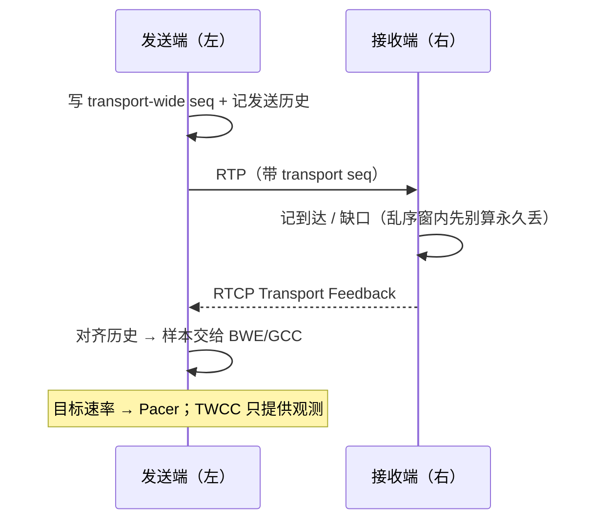
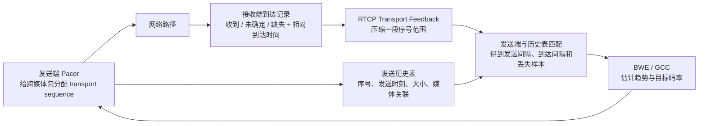

# TWCC

> [!tip] 阅读提示
> **前置：** [[RTP]] / [[RTCP]]；有 [[RTP 流标识与复用]] 更好。
> **初读：** 读到「初读到此为止」就停。弄清：TWCC 是「跨媒体包的发送/到达观测」，不是带宽估计算法本身。
> **深入：** 字段状态、与 CCFB/REMB/GCC 细边界、收发实现在联调或 BWE 排障时再读。

## 一句话说明

TWCC（Transport-wide Congestion Control）是一套以传输范围序号和接收时序反馈为核心的观测机制。发送端给每个待观测的 RTP 包写入单调递增的 transport-wide sequence number，接收端在 RTCP 反馈中报告这些序号的到达状态和相对到达时间。

## 先记住这三句

1. TWCC 给跨媒体的包打 **传输序号**，收端用 RTCP 回报「到了没、相对什么时候到」——它是 **观测**，不直接吐出最终发送码率。
2. transport-wide 序号 ≠ RTP 媒体序号；解码、排序、NACK 仍看媒体侧状态。
3. 「反馈里暂时没看见」≠「永久丢了」；还要等乱序窗、反馈窗口和超时。真正控码率的是吃这些样本的 [[GCC]] / [[带宽估计]]。

## 它提供什么

- 发送端可把「发过哪些包」与「接收端何时看到」对齐，从而看区间丢失、到达速率、排队时延变化和反馈延迟。
- 反馈用状态块和时间增量压缩多包结果；未收到的包不能简单等同于永久丢失。
- transport-wide 序号跨媒体观察传输路径，但不取代 RTP 的媒体序号、SSRC、PT、MID 或 RID。

## 不要混淆的三个概念

| 名称 | 角色 | 边界 |
| --- | --- | --- |
| TWCC | 传输观测与反馈机制 | 给包级发送/到达样本，不直接给最终发送码率 |
| CCFB | RTCP 拥塞控制反馈格式 | 反馈载体/标准化格式，不等于完整控制算法，也不与 TWCC 线格式互换 |
| REMB | 接收端估计的最大码率提示 | 较粗的速率上限信号，不能替代逐包到达时序 |

GCC 可以消费 TWCC、丢包和其他观测，算趋势、过载和目标码率；因此「TWCC 就是 GCC」是层次混淆。

## 端到端流程（初读版）

1. 发送端给待观测 RTP 包写入 transport-wide sequence number，并在历史表记下发送时间、大小、媒体关联。
2. 接收端按传输序号记收到 / 丢失 / 未确定，以及相对到达时间；乱序窗内的缺口先别算永久丢。
3. 接收端把一段状态压进 RTCP Transport Feedback，按字节预算和响应需求调度发送。
4. 发送端解析反馈，把到达间隔、接收速率、丢包、反馈延迟交给 BWE/GCC；控制器出目标速率，Pacer 执行。

**图在说什么：** 左发送端给包打上 transport 序号发出去；右接收端用 RTCP Transport Feedback 回报达情况；发送端再喂给 BWE/GCC（TWCC ≠ 估计算法本身）。

单端部件关系见下图。

**图在说什么：** 发送端打 transport 序号并记账，接收端回报到达/缺失，反馈再喂给 BWE/GCC 估带宽。

> [!example] 时序小例子
> 发送端在 10 ms、20 ms 发出 transport 序号 1001、1002；接收端在 40 ms、65 ms 到达。发送间隔 10 ms，到达间隔 25 ms，差值大约多了 15 ms，提示路径排队可能在涨——但还要更多包组、滤波和过载确认，不能两包就猛降码率。

---

> [!warning] 初读到此为止
> 上面这些已经够第一次阅读。下面是工程展开与排障细节（字段、指标、状态流），**第二轮或遇到具体问题时再读**；第一次直接点文末「第一次阅读下一站」即可。

## 工程边界

扩展协商、序号分配、反馈节流和发送历史表必须属于同一套会话状态。跨重启复用旧序号、错误地把不同传输关联混在一起，或在反馈尚未覆盖乱序窗口时立刻报永久丢包，都会污染带宽估计。

## 字段与状态

- transport-wide 序号与 RTP 媒体序号是两套空间：前者用于跨媒体观察传输，后者用于单个 SSRC 的排序和恢复。
- 发送历史表至少需要序号、发送时刻、包大小、SSRC/媒体线和是否为重传/探测；历史条目应按反馈覆盖和时间窗淘汰。
- 接收反馈需要基准序号、状态块、收到包的时间增量和反馈生成时刻；时间增量的单位和量化精度由具体反馈格式约定。
- 反馈缺少某个包不一定等于丢失，可能是包尚未到达、反馈窗口未覆盖或状态被淘汰。

## TWCC、CCFB、REMB、GCC 的细边界

- TWCC 在 WebRTC 语境中通常指 transport-wide 序号扩展与对应传输反馈机制，输出逐包到达样本，不直接输出最终码率。
- RTCP feedback 是承载反馈语义的协议家族；NACK、PLI/FIR、TWCC 反馈都属于不同反馈用途，不能把「RTCP feedback」当成单一算法。
- CCFB（Congestion Control Feedback）是标准化拥塞控制反馈格式/模型之一，和具体的 TWCC 扩展线格式、状态编码不应混称。
- REMB 是接收端估计的最大码率提示，粒度较粗，历史实现中常用于兼容；它不提供 TWCC 那样的逐包到达时间序列。
- GCC 是消费这些观测并执行速率控制的实现体系。TWCC、CCFB 或 REMB 都不是 GCC 的同义词。

## 发送侧与接收侧实现

- 序号分配应绑定传输会话，重连或新会话不能无条件复用旧历史；多路媒体可以共享传输观测，但媒体映射要可追溯。
- 接收端对重复、乱序、回绕和反馈窗口截断要有明确状态；丢包统计不能把反馈未覆盖当成确定丢失。
- 反馈调度既不能每包发送，也不能长时间不发；需要按照线路预算和控制响应需求合并状态。
- 发送端清理历史表时要等反馈覆盖或超时，避免将迟到反馈误配到新包。

## 常见误区与故障表现

- 误区：TWCC 就是 GCC。前者是观测/反馈，后者是控制闭环。
- 误区：收到一个缺口就把包算丢失。必须考虑乱序窗口和反馈时间。
- 故障：BWE 突然降到极低，检查 transport 序号是否跨会话重复、发送历史是否错配、时间单位是否错误。
- 故障：反馈包很多但控制滞后，检查反馈覆盖窗口、压缩解析、RTCP 调度和队列排队。

## 观测与实验

抓包关联 RTP 扩展、RTCP Transport Feedback 和发送日志，逐项核对序号、发送时刻、到达时刻、状态块和反馈时间。用无丢包、随机丢包、突发丢包、乱序、反馈丢失和会话重启实验，分别观察 BWE、GCC 状态、Pacer 队列和体验指标。

## 阅读导航

- **上一篇：** [[PLI 与 FIR]]
- **下一篇：** [[QoS 与 QoE]]
- **所属专题：** [[00-知识地图/专题说明/10 RTCP 与质量反馈|10 RTCP 与质量反馈]]
- **回看：** [[RTC 知识总览]] · [[00-知识地图/学习路线/学习进度模板|学习进度]] · [[00-知识地图/学习路线/RTC 工程师学习路线.canvas|阶段路线]]
- **第一次阅读下一站：** [[RTCP]]（反馈怎么装进控制面）或 [[丢包恢复策略]]（观测之外怎么修）

> 读完先回所属专题做练习/验收，再点下一篇。内部链接最多再追一层；不影响理解的陌生词先记下。

## 图谱关系

- 输入：[[RTP]]
- 承载：[[RTCP]]
- 前置：[[RTP 流标识与复用]]
- 输出：[[带宽估计]]
- 输出：[[GCC]]

## 参考资料

- 《WebRTC 的拥塞控制和带宽策略》第 3.1 节“RTP 扩展”和第 5 节“feedback”，`90-参考资料/音视频与 WebRTC 书库/livevideostack-webrtc-congestion-control-zh/content/00-webrtc-congestion-control.md`
- 《WebRTC 权威指南（原书第 3 版）》第 10.2.3 节“RTP 协议和 SRTP 协议”及 RTP 扩展表，`90-参考资料/音视频与 WebRTC 书库/webrtc-authoritative-guide-zh/content/10-protocols.md`
