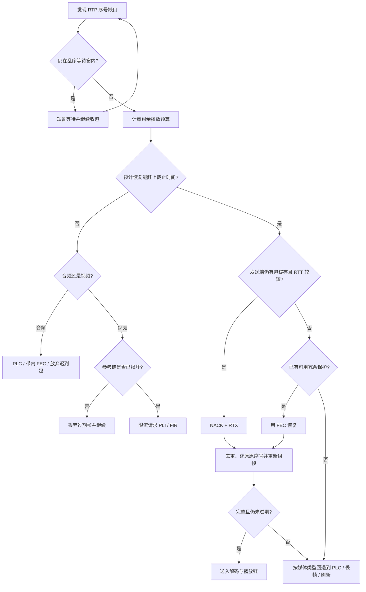

# 丢包恢复策略

> [!tip] 阅读提示
> **前置：** [[NACK]]。
> **初读：** 先读「一句话说明」和「决策顺序」，弄清 丢包恢复策略 解决什么问题、不负责什么。
> **深入：** 「状态与判断量」、「发送侧与接收侧实现」、「常见误区与故障表现」 在实现、联调或排障时再读。

## 一句话说明

实时媒体的目标不是让每个字节最终到达，而是在播放截止时间前尽可能交付可解码的媒体。一次恢复决策至少要同时看缺失包所属媒体、剩余播放预算、预计恢复耗时、参考依赖和额外流量成本。

## 决策顺序

1. 先确认缺口：根据 RTP 序号、乱序窗口和组帧状态判断是暂时未到、重复包还是确定缺失。
2. 估算可用时间：用当前接收时刻、预计 RTT/处理/排队时间和抖动缓冲的播放截止点估计重传是否还能使用。预计到达已经晚于截止点时，不应无限发送 NACK。
3. 选择恢复手段：短 RTT 且发送端仍有包缓存时用 NACK + RTX；高 RTT、突发丢包或需要一次覆盖多个缺口时考虑 FEC；语音可由 PLC 生成替代输出；视频参考链断裂时请求 PLI/FIR。
4. 设定预算：重传、FEC、关键帧、反馈和探测都要占用发送预算。拥塞期间盲目重传可能继续增加队列和丢包，应允许放弃过期包并把资源留给后续媒体。

> [!example] 怎样读这张图
> 例如语音包还剩 55 ms 播放预算，估算一次反馈、重传、排队和处理共需 25 ms，而且发送端缓存仍在，就可以尝试 NACK + RTX。若只剩 15 ms，重传即使最终到达也已失去播放价值，应转为 PLC 或放弃。图中的 RTT、缓存和 FEC 不是互斥的固定开关，真实实现还要用 `repair_budget` 限制额外流量。

## 音视频差异

- 音频通常按小帧连续播放，晚到包对当前输出的价值迅速下降；PLC 或带内 FEC 可以用连续性换取少量失真。
- 视频丢失关键参考包可能使后续帧不可解码，此时单包重传的收益取决于参考链和截止时间；无法及时修复时，受限的关键帧刷新比堆积过期重传更可控。
- 恢复后的包还要去重、还原原始序号空间并按媒体时间组帧，不能把“收到重传包”直接当作“已经恢复一帧”。

## 端到端决策流程

1. 接收端按 SSRC/媒体线维护序号、组帧和播放时间线，先区分乱序、重复、缺失和已经过期的包。
2. 计算缺失媒体单元的剩余播放时间，估算反馈往返、发送排队、解码和安全余量。
3. 选择 NACK/RTX、FEC、PLC、帧丢弃或 PLI/FIR；选择结果要同时考虑参考依赖和当前额外流量预算。
4. 执行恢复并去重，恢复成功后重新组帧和解码；恢复失败或过期则记录原因，不能无限重试。

## 状态与判断量

- `missing_since`：第一次确定缺口的本地时间；`playout_deadline`：媒体单元仍可使用的截止时间。
- `expected_recovery`：反馈 RTT、发送排队、处理和安全余量的估计；它不是一次固定常数，应随网络观测变化。
- `dependency`：视频参考帧/关键帧依赖或音频连续性约束；同一个缺包在不同依赖下价值不同。
- `repair_budget`：当前时间窗允许用于 RTX、FEC、关键帧和反馈的额外字节，必须与原始媒体共享线路预算。

## 数值场景

接收端在 45 ms 发现 101 号包缺失，播放截止是 100 ms，处理余量 5 ms。RTT 20 ms 时预计恢复在 70 ms，有限 RTX 仍有价值；RTT 80 ms 时预计在 130 ms，应优先 PLC/丢弃或刷新。若 Pacer 已排队 40 ms，前一个估算还要再加队列延迟。

对视频，假设一帧由 8 个包组成且缺少 1 个关键参考包：即使其余 7 个包都收到，整帧也可能不能解码。此时应先判断 RTX 是否能赶上截止，否则等待更多重复包没有收益；对非参考帧则可能直接丢帧并保持后续参考链。

## 发送侧与接收侧实现

- 接收侧要把 NACK、FEC、PLC 和刷新请求放在同一个恢复状态机，明确每个动作的最大次数、时间窗和优先级。
- 发送侧重传缓存、FEC 保护块、Pacer 队列和编码器关键帧请求要共享预算视图，避免每个模块都认为自己拥有全部容量。
- 恢复后先校验序号、时间戳、SSRC、帧边界和解码依赖，再送解码器；任何包只能消费一次。
- 过期包应被标记为 late/drop，并保留“超过截止、缓存 miss、预算不足、依赖不可用”等原因。

## 策略取舍

- NACK/RTX：带宽按需消耗，适合 RTT 小且包仍有价值；反馈和往返会增加时延。
- FEC：提前付出冗余，适合反馈不及时或突发丢失；没有丢包时也会占用预算。
- PLC/丢帧：不恢复原始字节，但可在截止时间后保持连续输出；可能降低音质或画面完整度。
- PLI/FIR：重新建立视频参考，代价是关键帧突发；需要限流和多订阅聚合。

## 常见误区与故障表现

- 误区：最终收到就算恢复成功。实时媒体关心的是是否在播放截止前可用。
- 误区：每个模块单独优化就会更好。RTX、FEC、反馈和关键帧可能共同把线路推入过载。
- 故障：恢复率提高但卡顿变多，检查恢复包挤压新媒体、Pacer 排队和过期重传。
- 故障：视频恢复后长期黑屏，检查参考依赖、关键帧刷新、参数集和恢复包去重。

## 观测与实验

记录缺口发现时间、截止时间、动作选择、预计/实际恢复时间、恢复成功率、late/drop 原因、修复字节和播放冻结。使用 RTT 20/80 ms、随机/突发丢包、带宽骤降和参考包丢失四组场景，比较无恢复、有限 RTX、FEC、PLC 和组合策略。

## 阅读导航

- **上一篇：** [[00-知识地图/专题说明/12 丢包恢复、带宽估计与拥塞控制|12 丢包恢复、带宽估计与拥塞控制]]（回到本专题说明）
- **下一篇：** [[NACK]]
- **所属专题：** [[00-知识地图/专题说明/12 丢包恢复、带宽估计与拥塞控制|12 丢包恢复、带宽估计与拥塞控制]]
- **回看：** [[RTC 知识总览]] · [[00-知识地图/学习路线/学习进度模板|学习进度]] · [[00-知识地图/学习路线/RTC 工程师学习路线.canvas|阶段路线]]

> 读完先回所属专题做练习/验收，再点下一篇。内部链接最多再追一层；不影响理解的陌生词先记下。

## 图谱关系

- 输入：[[NACK]]
- 实现：[[RTX]]
- 实现：[[FEC]]
- 约束：[[抖动缓冲]]
- 预算约束：[[带宽分配]]

## 参考资料

- 《WebRTC 的拥塞控制和带宽策略》第 3.2—3.4 节“NACK 与丢包重传、FEC 与码率分配”，`90-参考资料/音视频与 WebRTC 书库/livevideostack-webrtc-congestion-control-zh/content/00-webrtc-congestion-control.md`
- 《WebRTC 权威指南（原书第 3 版）》第 10.2.3 节“RTP 协议和 SRTP 协议”，`90-参考资料/音视频与 WebRTC 书库/webrtc-authoritative-guide-zh/content/10-protocols.md`；第 12 章 RTP/RTCP RFC 资料，`90-参考资料/音视频与 WebRTC 书库/webrtc-authoritative-guide-zh/content/12-ietf-rfc-documents.md`
- 《WebRTC 中文专题参考资料》NetEQ 论文第 2.2—2.3 节，`90-参考资料/音视频与 WebRTC 书库/webrtc-reference-zh/content/07-neteq-chapter-2.md`
