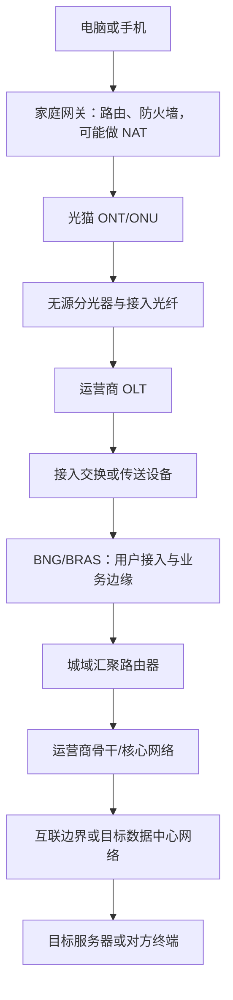

---
aliases:
  - RTC 网络分层与硬件路径
  - MAC 地址与下一跳
tags:
  - rtc/concept
  - rtc/transport
  - rtc/network
type: concept
status: growing
---
# 从 RTP 到网卡、路由器与物理链路

> [!tip] 阅读提示
> **前置：** 知道 [[实时媒体链路]] 里「编码 → 打包 → 发送」即可。
> **初读：** 读到「初读到此为止」就停。弄清：分层各管什么、IP/端口/MAC 差别，并跟着「跨家庭逐跳例子」走完一包。
> **深入：** 光猫/BNG、ARP、Wi-Fi、队列、MTU 与抓包命令，第二轮或排障时再读；字段细节可对照 [[UDP IP Socket 与 MTU]]。

## 一句话说明

这篇围绕一个问题展开：**你的程序已经拿到 Opus 音频数据，电脑怎样把它送到另一台设备的程序里？** 主线采用常见的 RTP/SRTP over UDP；TURN/TCP、VPN、蜂窝网络的差异会单独说明。

## 先记住这三句

1. **程序只交到 UDP/SRTP 这一层附近**；IP、以太网/Wi-Fi 头多半由操作系统和网卡补上——你很少自己拼以太网帧。
2. **IP 管跨网送到哪台主机，端口管交给哪个 Socket，MAC 只管当前链路上的下一跳**；远端 MAC 你通常不知道也不需要知道。
3. 跨家庭通话时，局域网里帧的目的 MAC 往往是 **网关**，IP 目的仍是远端公网地址；中间路由器换的是「这一跳的 MAC」，不是「A 网卡一路贴到 B 网卡」。

## 用一句话说清

RTP 包离开你的程序后，并不是「直接飞到对方手机」。它要经过：本机协议栈 → 网卡 → 家里路由器（可能 NAT）→ 运营商接入网 → 互联网上的一串路由器 → 对方网络 → 对方程序。

**第一次只需建立空间感：** 每一跳都可能排队、限速、丢掉；所以 RTC 延迟不全是「编码慢」，也包括「路上堵」。

## 家里出门的常见路径（示意）

`电脑/手机 → 家用网关 → 光猫 → 运营商设备 → 更远的网络`

中间每一跳都可能排队、限速、丢包。折叠线后有更细的设备名与链路展开，第一次不必背。

## 读时抓住一个问题

抓包或排障时问自己：**卡在本机、卡在家宽出口，还是卡在公网/对端？** 不同位置，办法完全不同。

（运营商设备名、分光、BNG 等展开在折叠线后，第一次不必记全称。）

---

> [!warning] 初读到此为止
> 上面这些已经够第一次阅读。下面先是「原初读区深文」（可跳过），再是工程细节；**第一次直接点文末「第一次阅读下一站」即可。**


## 初读展开（原初读区深文，第二轮再读）

> 下面是本篇原先堆在初读区的展开内容，已整体后移，避免第一次阅读过载。

## 先认识每一层负责什么

网络分层表示职责，不表示每一层都对应一台硬件。操作系统协议栈、驱动、网卡与网络设备共同完成这些工作。

| 层次或机制 | 主要任务 | 关心的信息 | 数据单位 |
| --- | --- | --- | --- |
| Opus 编码 | 把 PCM 压缩成音频数据 | 采样率、媒体时长、码率 | Opus packet；它还不是网络包 |
| RTP | 为编码媒体添加排序、时间与来源信息 | 序列号、时间戳、SSRC、Payload Type | RTP 包 |
| SRTP | 保护 RTP 媒体内容，提供认证与抗重放等能力 | 密钥、包索引、认证信息 | 受保护的 RTP 包 |
| UDP，传输层 | 在主机之间承载有边界的数据报，并按端口交给相应 Socket | 源/目的端口、长度、校验和 | UDP 数据报 |
| IPv4/IPv6，网络层 | 为跨网络传递提供地址和逐跳转发依据 | 源/目的 IP、TTL/Hop Limit | IP 包或 IP 数据报 |
| 以太网、Wi-Fi 等，数据链路层 | 在当前链路上传送帧，定义寻址、介质访问和差错处理规则 | MAC 地址、帧类型、FCS；具体字段依链路而异 | 链路层帧 |
| 物理层 | 将比特编码、调制成能在介质上传播的信号，再恢复出来 | 电平、光信号、频段、符号、信噪比 | 比特流、符号与物理信号 |

RTP 常被归入应用层媒体协议；SRTP 是 RTP 的安全扩展，不能简单理解成在 RTP 外面再包一份完整的“SRTP 头”。通常媒体负载被加密，路由和分流所需的部分 RTP 头字段仍可见；具体保护范围由所用 profile 和头扩展加密配置决定。

Socket 是应用访问协议栈的接口，不是额外一层网络报文。网卡是硬件，也不是协议层名称。

## 封装：每层往数据外面加什么

下面用无 VLAN 的以太网、IPv4、UDP、最小 RTP 头示意，省略选项、扩展、填充和部分硬件细节：

```text
以太网头：目的 MAC、源 MAC、EtherType
└─ IPv4 头：源 IP、目的 IP、TTL、上层协议等
   └─ UDP 头：源端口、目的端口、长度、校验和
      └─ RTP 头：序列号、时间戳、SSRC、PT 等
         └─ 受 SRTP 保护的 Opus 负载及所选 profile 的认证信息
以太网帧尾：FCS 差错检测
```

发送侧逐层封装，接收侧识别并去除相应封装。程序通常只提交受保护的 RTP 数据，UDP/IP/链路头由操作系统和网卡协作生成；普通 WebRTC 应用不需要自己拼以太网帧。

**不同层的“帧”和“包”不能混用。** 一个音频处理块、一个编码帧、一个 RTP 包、一个 IP 包、一个 Wi-Fi 帧不是同一个概念。IP 分片、链路聚合、网卡卸载等机制也会改变它们的数量对应关系。

## IP 地址、端口与 MAC 地址的区别

| 标识 | 回答的问题 | 范围与限制 |
| --- | --- | --- |
| IP 地址 | 这个 IP 包要送往哪个网络端点？ | 路由转发使用它；可能是私网或公网地址，NAT 可改写，不能等同于一个人的永久身份 |
| UDP 端口 | 包到达这台主机后，应该交给哪个传输端点？ | 内核结合协议、本地地址和可能的对端约束分流到 Socket；端口不是硬件插口，也不是全球唯一应用编号 |
| MAC 地址 | 在当前以太网等链路上，把帧交给哪个接口？ | 一般不会作为原始以太网头跨普通 IP 路由传播；可随机化或由软件配置，不是永远不变的设备身份证 |
| SSRC、MID、RID | 这份数据属于哪路 RTP 媒体？ | 一个 UDP 端口可复用多路媒体，收到 UDP 包后还要继续分流 |
| DNS 名称 | 某个服务名称对应哪些地址？ | 用于名称解析，不能代替 IP 路由、ARP/NDP 或 ICE 检查 |

跨网段发送时，**IP 目的地址可以是远端的公网地址，而本地以太网帧的目的 MAC 通常是下一跳网关的 MAC**。你的电脑一般不需要知道远端电脑的 MAC。

常见以太网 MAC 是 48 位，写成六组十六进制数，例如 `02:00:00:00:00:0A`；该例属于本地管理地址。`FF:FF:FF:FF:FF:FF` 是以太网广播目的地址，组播还有对应的地址规则。网卡可能使用厂商分配的地址，也可能使用系统随机化或管理员设置的地址，因此不能假定它绝对唯一或永久不变。

IPv4 地址是 32 位，例如 `192.168.1.10`；IPv6 地址是 128 位，例如文档示例 `2001:db8::10`；UDP 端口是 16 位数值。一台设备可以同时拥有多个接口、IP 和 MAC，Wi-Fi MAC、以太网 MAC 与业务用户账号也不是同一个身份。

在以太网 II 帧中，EtherType 帮助接收方识别所承载协议，例如 `0x0800` 表示 IPv4，`0x86DD` 表示 IPv6，`0x0806` 表示 ARP。它与 IP 头里的上层协议号、UDP 端口、RTP Payload Type 分别位于不同层，不能互相替代。

“每一跳都会改变 MAC”需要限定：普通三层路由器转发到另一条以太网链路时，会重新封装该链路的 MAC 头；同一 VLAN 内的普通二层交换机转发以太网帧时，通常保持端点源/目的 MAC 不变。遇到 Wi-Fi、点对点链路或运营商隧道，链路封装还可能不同。

## 一次跨家庭网络通话的逐跳例子

假设 A 和 B 都在 IPv4 家庭 NAT 后，ICE 已经验证下列直连候选可用。这里的公网地址来自文档示例地址段，不用于真实实验；NAT 端口和映射只是示例，不表示 NAT 一定允许打洞。

| 位置 | 示例地址 |
| --- | --- |
| A 的局域网 Socket | `192.168.1.10:50000` |
| A 网关的局域网地址 | `192.168.1.1` |
| A 网关对该流的公网映射 | `198.51.100.10:62000` |
| B 网关对该流的公网映射 | `203.0.113.20:63000` |
| B 的局域网 Socket | `192.168.50.20:51000` |

1. **A 查路由。** 目的 IP 是 `203.0.113.20`，不在 A 的直连子网内，因此选择网关 `192.168.1.1`。若邻居缓存没有记录，先用 ARP 找到网关 MAC。
2. **A 在本地以太网上发送。** IP 目的地址仍为 `203.0.113.20`，UDP 目的端口为 `63000`；但以太网目的 MAC 是 A 网关的局域网 MAC。中间交换机通常据此转发，不会把 IP 目的地址换成网关 IP。
3. **A 网关做 NAT 和转发。** 按已有映射，把源 `192.168.1.10:50000` 改为 `198.51.100.10:62000`，更新需要改变的校验信息；再按出口链路重新封装。NAT 与路由是不同功能，普通路由器不必做 NAT。
4. **运营商逐跳转发。** 每台普通三层路由器独立查目的 IP 的转发表，递减 TTL，选择出口。若没有 NAT 或额外封装，源/目的 IP 通常保持不变；以太网出口使用该链路的源 MAC 和下一跳 MAC。互联网中间段不保证都是以太网。
5. **B 网关按映射交付。** 报文符合 NAT/防火墙状态时，目的 `203.0.113.20:63000` 被转换为 `192.168.50.20:51000`。B 网关查找 B 的邻居地址，在 B 的局域网里发送给 B。
6. **B 接收。** 经过链路和 IP/UDP 处理，数据交给对应 Socket，再进入 SRTP、RTP 和音频接收处理。

| 抓包位置 | 源 IP:端口 | 目的 IP:端口 | 以太网 MAC 的典型含义 |
| --- | --- | --- | --- |
| A 的局域网出口 | `192.168.1.10:50000` | `203.0.113.20:63000` | A 网卡 → A 网关 LAN 接口 |
| A NAT 后的公网侧 | `198.51.100.10:62000` | `203.0.113.20:63000` | 若为以太网，则是该出口接口 → 该链路下一跳 |
| B 的局域网入口 | `198.51.100.10:62000` | `192.168.50.20:51000` | B 网关 LAN 接口 → B 网卡 |

**MAC 不会一路保持为“A 网卡 → B 网卡”。** 它服务于当前链路，和 IP 的跨网寻址职责不同。普通 NAT 改写 IP/UDP 信息时不需要解开 SRTP 音频内容。

若 A、B 在同一可直达局域网且选用了 host candidate，A 可以解析 B 的邻居地址并直接交付，不一定经过路由/NAT。若存在双重 NAT 或运营商 CGNAT，会增加映射与过滤层次，不能仅凭公网地址就断言直连成功。IPv6 可能不需要地址转换，但仍有路由、防火墙和可达性限制。

---

## 发送前：地址、网关和名称从哪里来

### 本机网络配置

设备需要合适的 IP 地址、前缀长度、路由和名称解析配置。IPv4 常通过 DHCP 获取，也可以静态设置；IPv6 可通过路由器通告和 SLAAC 配置地址，也可能配合 DHCPv6。IPv6 默认路由通常来自路由器通告，而不是 DHCPv6。

例如 `192.168.1.10/24` 中，`/24` 是网络前缀长度。主机依据路由表判断目的地址是否在直连网络上，或是否应交给默认网关；不能只凭地址看起来相似就认为双方在同一子网。

### 家庭网络完整示例：先判断本地直达还是交给网关

先看一个常见的家庭网络。这里把 Wi-Fi AP、二层交换机、路由器、DHCP、NAT 和防火墙画成同一个“无线路由器”盒子，是因为家用设备经常集成这些功能；这些名称表示不同职责，并不表示工程上必须是同一块硬件。

![[assets/images/network-hardware/home-router-linksys-wrt54g.jpg|560]]

> [!example] 家用“路由器盒子”通常集成多种职责
> 图中是一台较早期的家用无线路由器。外部看起来只有一个盒子，内部却可能同时运行 Wi-Fi AP、以太网交换、IP 路由、DHCP、NAT 和防火墙；这些是不同职责，不应因为集成在同一机箱中就混成同一个网络层概念。现代设备的天线、速率和接口布局会不同。
>
> 图片来源：[Wikimedia Commons：Linksys-Wireless-G-Router.jpg](https://commons.wikimedia.org/wiki/File:Linksys-Wireless-G-Router.jpg)，Evan-Amos，Public domain。

```text
笔记本电脑                         手机
IP：192.168.1.10/24                IP：192.168.1.20/24
MAC：02:00:00:00:00:0A             MAC：02:00:00:00:00:14
          \                         /
           \—— 家用无线路由器 ——/
               LAN IP：192.168.1.1/24
               LAN MAC：02:00:00:00:00:01
               WAN：连接运营商和互联网
```

为聚焦子网与下一跳，本节用“源设备 MAC → 目的设备或网关 MAC”的以太网式二地址视角表示链路交付。有线以太网可以直接按这个结构观察；真实 Wi-Fi 基础设施帧可能同时区分接收者、发送者、源和目的等多个地址，并由 AP 桥接转发，详见后文“Wi-Fi：有信号不等于有稳定低延迟”。这不会改变操作系统先查路由、再解析链路下一跳的主线。

笔记本通过 DHCP 或静态配置得到的常见信息是：

| 配置项 | 本例的值 | 表示什么 |
| --- | --- | --- |
| 本机 IP | `192.168.1.10` | 这个网络接口使用的 IPv4 地址 |
| 子网掩码 | `255.255.255.0` | 哪些位是网络前缀；等价写法是 `/24` |
| 直连子网 | `192.168.1.0/24` | 从这个接口可以尝试直接到达的一组地址 |
| 默认网关 | `192.168.1.1` | 没有更具体路由时，交付外部目的地所使用的下一跳 |

**默认网关的 IP 不叫“本地子网”。** `192.168.1.1` 是路由器 LAN 接口在本地子网中的一个地址；`192.168.1.0/24` 才是这个例子里的子网。路由器的 WAN 接口还会有另一个地址，连接运营商一侧。一个路由器也可以连接多个子网，因此“使用同一台路由器”和“处于同一子网”不能直接画等号。

![[assets/images/network-hardware/ethernet-switch-5-port.jpg|560]]

> [!example] 独立交换机主要扩展同一链路网络的端口
> 图中是五口以太网交换机，能直观看到多个 RJ45 端口。它通常根据 MAC 转发表在 VLAN 内转发以太网帧，不会自动成为默认网关，也不会因为有多个网口就执行 NAT。家用路由器常把类似的交换功能集成在机身内；照片只展示一种独立设备外形。
>
> 图片来源：[Wikimedia Commons：Ethernet switch Atlantis A02-F5P 5 ports backend.jpg](https://commons.wikimedia.org/wiki/File:Ethernet_switch_Atlantis_A02-F5P_5_ports_backend.jpg)，Sub，Public domain。

> [!example] 生活化理解
> 可以暂时把本地子网看作同一小区，把默认网关看作小区通往外部道路的出口。同一小区内送东西，可以直接找对应住户；目的地在外面时，先交给出口继续转送。
>
> 这个类比只解释“本地直达或交给下一跳”的选择。真实系统依据路由表做最长前缀匹配；VPN、多网卡、策略路由和专用路由可能让流量使用其他出口，并非所有外部流量都固定经过一个默认网关。

#### “在本地子网内”怎样计算

IPv4 地址和子网掩码都是 32 位。把本机 IP 与子网掩码逐位执行 AND（按位与）运算，可以得到该地址在这个掩码下的网络地址：只有两个输入位都为 `1`，结果位才是 `1`。

```text
本机 IP：       192.168.1.10
子网掩码：     255.255.255.0
按位与结果：   192.168.1.0
```

用二进制展开，可以看到 `/24` 保留前 24 位，并把最后 8 位清零：

```text
本机 IP：    11000000.10101000.00000001.00001010
子网掩码：  11111111.11111111.11111111.00000000
按位与：    11000000.10101000.00000001.00000000
十进制：    192     .168     .1       .0
```

再使用同一个掩码计算目标地址，并比较网络地址：

```text
本机：192.168.1.10 & 255.255.255.0 = 192.168.1.0
手机：192.168.1.20 & 255.255.255.0 = 192.168.1.0  → 相同，本地直连
服务器：203.0.113.20 & 255.255.255.0 = 203.0.113.0 → 不同，不属于该直连子网
```

因此，在这个简化例子中，“目标位于本地子网内”表示：**目标 IP 与本机直连路由 `192.168.1.0/24` 匹配，可以把目标设备本身当作链路层下一跳。** 对常见 `/24` 而言，`192.168.1.0` 是网络地址，`192.168.1.255` 是广播地址，通常不会分配给普通主机；常用主机地址是 `192.168.1.1` 到 `192.168.1.254`。其他前缀长度的边界不同，不能永远按最后一段判断。

按位与是理解前缀的直观计算方法。操作系统实际发送时会查询已经保存好的路由表，并在候选路由中优先匹配更长、更具体的前缀，而不是每次只拿一个固定掩码做一次二选一计算。例如直连路由 `192.168.1.0/24` 比默认路由 `0.0.0.0/0` 更具体，所以发往 `192.168.1.20` 时选择直连路由。

#### 情况一：笔记本向同一子网的手机发送

应用仍然以手机的 **IP 地址** 为目的地址，并不是完全绕过 IP、只靠 MAC 通信：

1. 笔记本查询路由表，发现 `192.168.1.20` 匹配直连路由 `192.168.1.0/24`。
2. 下一跳就是手机本身。笔记本查询邻居缓存；若没有记录，就用 ARP 询问“谁拥有 `192.168.1.20`”。
3. 得到手机的 MAC 后，笔记本组织链路帧。IP 头的目的地址是手机 IP，以太网目的 MAC 是手机 MAC。
4. 家用路由器中的 Wi-Fi AP 或交换功能根据链路层信息把帧交给手机；正常情况下不需要路由功能把它转到另一个 IP 子网。

```text
IP 目的地址：       192.168.1.20       手机的 IP
以太网目的 MAC：   02:00:00:00:00:14  手机的 MAC
是否经过三层网关： 否
```

因此，“局域网内设备互发信息通过 MAC 即可”需要修正为：**在常见的 IP over Ethernet/Wi-Fi 通信中，应用和 IP 层仍使用目标 IP；当前链路上的帧再使用目标设备的 MAC 完成交付。** 交换机主要根据 MAC 转发帧，主机则通过 ARP 维护 IPv4 邻居 IP 到 MAC 的映射，两者查询的不是同一张表。

#### 情况二：笔记本向互联网服务器发送

假设应用向文档示例服务器 `203.0.113.20` 发送数据：

1. 目标不匹配直连路由 `192.168.1.0/24`，系统继续查路由表，最终匹配默认路由 `0.0.0.0/0 via 192.168.1.1`。
2. 此时 IP 包的最终目的地址仍是服务器 `203.0.113.20`，但当前链路的下一跳是默认网关 `192.168.1.1`。
3. 笔记本用 ARP 查询的是网关 `192.168.1.1` 的 MAC，而不是互联网服务器的 MAC。
4. 笔记本把帧交给网关。网关去除收到的链路层封装，根据目的 IP 查询自己的路由表，必要时执行 NAT，再为出口链路生成新的链路层封装。

```text
IP 目的地址：       203.0.113.20        最终服务器的 IP
以太网目的 MAC：   02:00:00:00:00:01  当前下一跳网关的 MAC
是否经过三层网关： 是
```

两种情况可以压缩成一张判断表：

| 判断结果 | IP 目的地址 | 当前链路的目的 MAC | 谁负责本段转发 |
| --- | --- | --- | --- |
| 目标匹配直连子网 | 最终目标设备 IP | 最终目标设备 MAC | AP 或二层交换机等链路设备 |
| 目标需要跨网段 | 最终目标设备 IP | 所选下一跳路由器接口的 MAC | 先由 AP/交换机交给网关，再由路由器按 IP 继续转发 |

“同一子网”描述的是 IP 前缀和直连路由关系，“同一 VLAN/广播域”描述的是链路层范围，“使用同一个默认网关”描述的是路由配置；三者在简单家庭网络中经常重合，但不是同一个定义。即使两个地址按掩码计算属于同一前缀，访客 Wi-Fi 隔离、不同 VLAN、防火墙或错误配置也可能阻止实际通信，因此最终还要用路由表、ARP/邻居状态和抓包验证。

### DNS 与会话协商

应用访问域名形式的信令服务器、STUN/TURN 服务时，可能先查询 DNS。WebRTC 的 host candidate 还可能使用 mDNS 名称隐藏局域网 IP；mDNS 的本地链路解析与公网 DNS 不是一回事。

之后信令交换描述和候选，[[ICE]] 用连通性检查选择可用候选对，可能采用直连或中继。**ICE 不会列出并指定沿途每一台路由器，也不会为每个 RTP 包重新查询 DNS。** 选定的目的地址仍要交给操作系统和路由网络逐跳处理。

### 路由表如何决定下一跳

在选定的路由表内，一般先匹配最具体的目的前缀，即最长前缀匹配；再按路由属性、开销等规则选择合适项。策略路由、VPN、多网卡和绑定接口会影响使用哪张表及哪条路由。

如果目的地在直连链路上，下一跳可以是目的设备；如果需要跨网段，下一跳通常是某个路由器接口。默认路由是没有更具体路由时的兜底，不表示所有流量都必然经过同一个网关。

## ARP 与 NDP：怎样知道下一跳的 MAC

知道下一跳 IP 后，在需要 MAC 寻址的链路上，还要找到对应链路层地址。

**IPv4 常用 ARP。** 假设下一跳是 `192.168.1.1`，电脑先查邻居缓存；没有可用记录时，会在当前广播域发出 ARP 请求，大意是“谁拥有 192.168.1.1？请告诉我你的 MAC”。得到应答后缓存映射，再发送数据。ARP 请求通常不会被普通 IP 路由器转发到互联网，也不会向全网寻找朋友的 MAC。

**IPv6 使用 NDP。** 它基于 ICMPv6，通过邻居请求/通告等消息完成邻居发现，还支持可达性检测；相关消息常使用链路范围组播，IPv6 没有 IPv4 式广播。NDP 不是把 ARP 报文换一个名字。

缓存命中时不需要每包都发一次 ARP/NDP。邻居解析等待、地址冲突、缓存失效、网关不可达和错误的 VLAN 配置，可能表现为“首包很慢”或“完全发不出去”。交换机的 MAC 转发表与主机的 ARP/NDP 缓存是不同的表：前者查 MAC 到交换端口，后者查 IP 到链路邻居地址。

## 从程序到网线或无线信号

一个常见发送流程如下，具体任务分工和加密、调度顺序以实现为准：

1. **应用处理媒体。** 编码器产生 Opus 数据，RTP 模块补充序号和时间信息；发送控制按预算安排媒体、重传和探测数据，SRTP 在交给不可信网络前完成保护。
2. **提交 Socket。** 用户态通过 `sendto`、`sendmsg` 或平台异步接口提交数据。调用成功通常只表示本机接受了发送请求，不能当作对方已经收到。
3. **内核协议栈处理。** 生成或校验 UDP/IP 信息，进行路由、源地址选择、邻居解析及适用的本机过滤、流量控制等处理。这里的顺序可能受平台、隧道和卸载方式影响。
4. **驱动与网卡协作。** 驱动准备发送描述符，网卡常通过 DMA 读取内存中的数据；DMA 可以减少 CPU 搬运，但仍需要管理缓冲寿命与完成通知。网卡也可能参与校验和计算和分段等卸载。
5. **链路层组织帧。** 以太网发送 MAC 帧；Wi-Fi 要按无线链路规则封装、竞争介质并可能等待确认或重试。不要假定两种链路的帧头和发送行为相同。
6. **物理层发送。** PHY 将比特编码成电、光或无线信号，经网线、光纤或空气传播；接收硬件同步、解调和解码后恢复数据。

接收侧大致反向进行：物理信号 → 链路帧检查 → 网卡接收缓冲/DMA → 驱动与内核处理 → IP/UDP 分流 → 应用读取 → SRTP 验证/解密 → RTP 分流、重排与媒体处理。网卡常结合中断、批量通知或轮询，不能假设每到一个包 CPU 都立即执行一次应用回调。

![[assets/images/network-hardware/ethernet-nic-100mbit-pci.jpg|640]]

> [!example] 网卡是主机与链路之间的硬件接口
> 图中是较早期的 PCI 以太网卡：金手指连接主板总线，RJ45 口连接网线，板上芯片执行部分 MAC/PHY 与收发工作。现代主板集成网卡、USB 网卡、手机 Wi-Fi 芯片和高速服务器 NIC 外形不同，但都要与驱动、内存队列和链路介质协作；网卡本身不是“IP 层”或“物理层”的同义词。
>
> 图片来源：[Wikimedia Commons：Ethernet NIC 100Mbit PCI.jpg](https://commons.wikimedia.org/wiki/File:Ethernet_NIC_100Mbit_PCI.jpg)，afrank99，许可 [CC BY-SA 2.0](https://creativecommons.org/licenses/by-sa/2.0/)。

## 从源到目的地，会经过哪些硬件

下面是一条可能的光纤入户路径。现实中某些角色会合在同一台设备里，也可能省略、增加或采用其他接入技术；箭头表示业务数据前进的逻辑方向，不保证每一项都是独立机箱或一个可见的 IP 路由跳点。

**图在说什么：** 家里一跳跳出去：主机 → 网关 NAT → 光猫 → 接入网 → 运营商边缘，再进城域/骨干——每一跳都可能排队。



| 设备或角色 | 主要工作 | 对 RTC 可能产生的影响 |
| --- | --- | --- |
| 终端网卡 NIC | 与驱动交换数据，收发链路帧；包含或连接 MAC/PHY 功能 | 队列、驱动调度、省电、丢包与卸载行为 |
| 二层交换机 | 通常学习源 MAC 与入端口的关系，在 VLAN 内按目的 MAC 转发 | 出口排队、拥塞丢弃、VLAN 隔离；未知单播可能在 VLAN 内泛洪 |
| 无线接入点 AP | 连接无线终端，协调无线接入，常桥接至有线网络 | 信道竞争、无线重试、漫游、信号弱和干扰 |
| 三层路由器 | 查 IP 转发表，选择下一跳与出口，递减 TTL/Hop Limit | 路径变化、出口拥塞、排队、MTU 和过滤 |
| 家庭网关/CPE | 常集成路由、NAT、防火墙、DHCP、交换机和 AP | UDP 映射超时、端口改写、带宽瓶颈；“一个盒子”可能承担多层职责 |
| 光猫 ONT/ONU | 终结用户侧 PON 光链路，向家庭提供以太网等接口；桥接或路由模式决定上层职责 | 光功率异常、上行共享调度、设备队列；光猫不一定是 NAT 或默认网关 |
| 无源分光器 | 不用供电地分配/合并光信号，让多户共享一套 PON 接入 | 分光带来光功率损耗；它不查 IP、MAC 或 RTP |
| 运营商 OLT | 在局端终结多条 PON，管理 ONT/ONU、业务映射和上行发送机会 | 共享接入容量、动态带宽分配与排队可能影响上行时延 |
| BNG/BRAS | 汇接宽带用户会话，执行认证、地址与业务策略，并把用户流量接入运营商 IP 网络 | 限速、策略、会话故障、地址或 CGNAT 位置会影响连通性和质量 |
| 汇聚路由器 | 汇集多个接入节点，以高容量链路送往城域核心或骨干 | 汇聚口拥塞、排队、路径切换与 MTU/策略问题 |
| 骨干/核心路由器 | 在运营商的大范围高容量网络中按 IP/MPLS 等信息转发 | 长距离传播、核心链路故障切换、跨区域路径变化 |
| 互联/边界路由器 | 连接其他运营商、云厂商、内容网络或数据中心 | 对等互联拥塞、跨网绕行、路径不对称 |
| 防火墙/安全网关 | 按规则与连接状态允许或丢弃流量 | UDP 被限制、会话超时、ICMP 被过滤；允许 TCP 不代表允许 UDP |
| TURN 服务器 | 作为中继接收客户端封装的数据并转交指定 peer | 多一段网络路径、中继预算与可能的 TCP/TLS 回退 |
| SFU 媒体服务器 | 按发布订阅关系转发媒体，为不同接收端选层或调整媒体映射 | 服务器网卡与 CPU、逐订阅端队列、出口带宽与质量策略 |

> [!example] 先用生活路径建立直觉
> 可以把接入层理解成小区道路，把汇聚层理解成城市主干道，把骨干层理解成连接城市的高速网络：越往上汇集的用户越多，单条链路容量通常也越大。光猫负责把家庭设备接到光纤接入系统，OLT 汇集一组 PON 用户，BNG 像用户进入运营商 IP 网络前的业务办理与检查点。
>
> 这个类比只解释位置和汇集关系。真实设备不会按“包裹内容”理解媒体：二层设备看链路字段，路由器看 IP/MPLS 等转发信息，普通设备既不会解码 Opus，也不会根据 RTP 时间戳选择城市道路。

### 光猫 ONT/ONU、分光器与 OLT

家庭所说的“光猫”通常是 `ONT`（Optical Network Terminal，光网络终端）或 `ONU`（Optical Network Unit，光网络单元）。ONU 是较宽泛的名称，ONT 常指放在最终用户场所、直接给家庭提供以太网或电话等接口的一类 ONU；实际产品和文档的称呼可能混用。

![[assets/images/network-hardware/ftth-onu-l-archi.jpg|640]]

> [!example] 先认设备，再认职责
> 图中是打开外壳的早期壁挂式 FTTH ONU：左侧绿色接头连接光纤，设备再向用户侧提供以太网等接口。它能帮助辨认“光纤在用户侧终结并转换为家庭可用接口”这项职责，但**不代表现在所有家用光猫的外形和端口布局**；现代设备可能更小，也可能集成 Wi-Fi、路由、电话或 IPTV 功能。
>
> 图片来源：[Wikimedia Commons：FTTH ONU.JPG](https://commons.wikimedia.org/wiki/File:FTTH_ONU.JPG)，作者信息为 Modesto Alexandre，原上传者 L archi，许可 [CC BY 1.0](https://creativecommons.org/licenses/by/1.0/)。本地副本及校验信息见 `assets/images/network-hardware/README.md`。

在常见 PON（Passive Optical Network，无源光网络）中，用户侧与运营商局端之间不是“一户一根光纤直达一台路由器”，而是多户通过无源光分配网络共享 OLT 的一个 PON 端口：

```text
家庭 A 的 ONT ─┐
家庭 B 的 ONT ─┼→ 无源分光器 → 运营商机房 OLT
家庭 C 的 ONT ─┘
```

- **ONT/ONU：** 把家庭侧的以太网等业务承载到 PON，并按 OLT 的控制在允许的时间发送上行数据。
- **无源分光器：** 在光路上分配下行光信号并合并多户上行光路，不需要供电，也不运行 IP 路由、ARP 或 RTP 解析。
- **OLT：** 位于运营商局端，终结 PON 协议，发现和管理 ONT/ONU，完成业务/VLAN 等映射，并协调共享上行容量。不同 PON 制式和版本的调度、封装及速率不同。

![[assets/images/network-hardware/fiber-splitter.jpg|600]]

> [!example] 无源分光器是光路器件，不是小型路由器
> 图中是 1×8 光纤耦合/分光器实物：一侧光路被分配到多个输出。它没有需要登录的 IP 转发表，也不解析 MAC、RTP 或 Opus；“无源”表示正常分光过程不依赖有源电子转发，但分光会带来光功率损耗。实际 PON 工程中的封装、连接器和分光级联方式可以不同。
>
> 图片来源：[Wikimedia Commons：FibreSplitter.jpg](https://commons.wikimedia.org/wiki/File:FibreSplitter.jpg)，User:Satbuff，Public domain。

![[assets/images/network-hardware/olt-nokia-7360-isam-fx16.webp|520]]

> [!example] OLT 是运营商局端设备，不是放在每户家里的“更大光猫”
> 图中是机框式 GPON OLT 的一个具体型号，能看到多块业务板卡和大量光接口。它面向一组 PON 用户，负责发现和管理 ONT/ONU、终结 PON 并协调共享上行；真实运营商设备可采用不同机框、板卡、端口密度和制式，照片不表示所有 OLT 都长这样。
>
> 图片来源：[Wikimedia Commons：Photo 7360-ISAM-FX-16 ANSI GPON.webp](https://commons.wikimedia.org/wiki/File:Photo_7360-ISAM-FX-16_ANSI_GPON.webp)，Mehdi Fourali，许可 [CC BY-SA 4.0](https://creativecommons.org/licenses/by-sa/4.0/)。

下行方向由 OLT 面向一组 ONU/ONT 发送，上行则必须避免多户同时发送造成冲突，因此 OLT 会分配上行发送机会并可进行动态带宽分配。对 RTC 而言，即使家庭上行套餐仍有平均带宽，接入调度、突发排队或其他用户共享资源也可能增加抖动；不能仅凭“光纤”二字断言时延恒定。

ONT/OLT 可能处理 PON 封装、业务流映射和 VLAN，但在常见桥接部署中，它们不会像普通三层路由器那样对每个用户 IP 包执行一次跨网路由，也通常不会改变其中的 RTP/SRTP 内容。

### 光猫桥接模式与路由模式

同一个光猫盒子可能只完成接入和桥接，也可能同时承担路由器功能。判断它是不是默认网关，不能只看设备名称，要看部署模式：

| 模式 | 光猫通常负责 | 家庭路由器通常负责 | 常见结果 |
| --- | --- | --- | --- |
| 桥接模式 | PON 接入、链路/业务桥接，将用户侧流量交给运营商 | PPPoE 或 IPoE 接入、LAN 路由、DHCP、防火墙和 NAT | 家庭路由器是内网设备的默认网关，并获得运营商侧地址或会话 |
| 路由模式 | 除 PON 接入外，还可能完成运营商接入、路由、DHCP、防火墙和 NAT | 可只作为 AP/交换机，也可能继续作为第二层路由/NAT | 光猫可能是默认网关；若后接路由器也做 NAT，可能形成双重 NAT |

运营商侧分配给用户设备的地址不保证是真正公网地址，也可能是私网地址或 `100.64.0.0/10` 共享地址，之后再经过 CGNAT。桥接模式也不表示“没有任何网关”，只是把家庭侧三层网关和接入会话等职责更多交给后接路由器。

### “运营商接入设备”为什么不是一种固定设备

接入层是离用户较近、负责把大量用户线路纳入运营商网络的一组系统。采用不同接入介质时，设备会不同：光纤接入常见 OLT，以太网接入可能有接入交换机，DSL 网络可能有 DSLAM，有线电视网络则可能采用 CMTS/CCAP。本文的家庭示例以 PON 为主，不能把 OLT 当成所有宽带接入的统一名称。

接入层之后还可能经过二层汇聚交换机、传送网设备或隧道封装，才到达用户业务边缘。它们可能透明承载用户 IP 包，所以“物理上经过一台设备”和“发生一次 IP 路由跳转”不是一回事。

### BNG/BRAS：把接入线路变成可管理的宽带用户

`BNG`（Broadband Network Gateway）与 `BRAS`（Broadband Remote Access Server）是职责相近且存在演进关系的名称，具体产品边界依运营商架构而异。它们通常位于宽带接入网与运营商 IP 网络的业务边缘，可能承担：

- 终结或管理 PPPoE、IPoE/DHCP 等用户接入方式；不是所有网络都使用 PPPoE。
- 配合 AAA/RADIUS 等系统完成认证、授权和计费记录。
- 分配、确认或绑定用户地址和会话，并下发带宽套餐、QoS、访问控制等策略。
- 将用户流量送入运营商的路由、VPN 或业务网络；某些网络还会在此处或更上游部署 CGNAT。

BNG/BRAS 不等于普通家庭路由器。家庭路由器管理一户内部的设备和私网地址；BNG 面向大量宽带用户或接入会话，是运营商侧的业务网关。一次认证成功只说明用户接入会话建立，不保证通往某个 RTC 服务器的后续路由、UDP 策略和拥塞状况都正常。

### 接入、汇聚、骨干和互联边界的层级

| 层级 | 下游通常连接什么 | 上游通常连接什么 | 主要关注点 |
| --- | --- | --- | --- |
| 接入层 | 家庭、楼宇、小区或基站等用户接入 | BNG、汇聚层或传送网络 | 接入认证、共享介质、用户隔离和最后一公里容量 |
| 汇聚层 | 多个 OLT、BNG 或接入机房 | 城域核心、骨干或区域核心 | 汇集大量流量、冗余、QoS、路径与高容量上联 |
| 骨干/核心层 | 多个城市、区域或业务边缘 | 其他核心节点和互联边界 | 大范围高速转发、故障收敛、流量工程和跨区域承载 |
| 互联边界 | 本运营商内部网络 | 其他运营商、云、CDN、互联网交换中心或目标数据中心 | BGP 路由、对等互联、出口选择和跨网容量 |

这些名称表达网络层次和职责，不代表固定数量。小型网络可能把接入、BNG 和汇聚功能合在少数设备上；大型网络可能在接入与骨干之间增加多级汇聚、城域核心、MPLS 或其他承载层。骨干核心中的设备也不一定都直接运行面向用户的认证或保存每个家庭的会话状态。

### 一次从家庭到 RTC 服务器的完整设备路径

假设笔记本 `192.168.1.10` 通过家庭路由器访问 RTC 服务器 `203.0.113.20`，光猫工作在桥接模式。以下地址使用文档示例地址，不表示真实公网分配：

1. **笔记本查路由。** 服务器不在 `192.168.1.0/24` 中，因此笔记本把 IP 包交给默认网关 `192.168.1.1`；当前局域网目的 MAC 是家庭路由器的 MAC。
2. **家庭路由器转发。** 它查询路由表，通常对源私网地址执行 NAT，并把流量交给 WAN 侧接入会话。IP 包的最终目的仍是 RTC 服务器。
3. **ONT 与分光器承载。** 桥接 ONT 把家庭侧业务映射到 PON 承载；分光器只处理光路；两者通常不构成新的 IP 路由跳点。
4. **OLT 汇集用户。** OLT 接收该 ONU/ONT 获得发送机会后送来的上行数据，完成 PON 终结和业务映射，再交给接入/传送网络。
5. **BNG 接入运营商 IP 网络。** BNG 根据用户会话和业务策略接收流量，执行相应的地址、限速、QoS 或路由处理。若部署 CGNAT，还可能在 BNG 附近或更上层再次改写地址和端口。
6. **汇聚与骨干逐级转发。** 各三层或 MPLS 节点根据自己的转发表选择下一跳；普通 IP 路由会递减 TTL，遇到拥塞时数据可能在出口队列等待或被丢弃。
7. **互联边界选择出口。** 若服务器不在本运营商网络中，边界路由器把流量交给对等运营商、云厂商、互联网交换中心或其他上游网络。
8. **数据中心交付服务器。** 数据中心边界、交换与可能的负载均衡/防火墙继续处理，最终由服务器网卡、内核和对应 Socket 接收；之后应用才会进行 SRTP、RTP 和媒体处理。

```text
局域网可见：192.168.1.10 → 203.0.113.20，当前帧先交给 192.168.1.1 的 MAC
运营商路径：接入 → 用户业务边缘 → 汇聚 → 骨干/互联
媒体含义：沿途普通接入和路由设备通常只转发受保护的字节，不解码 Opus/H.264
```

反向媒体不保证严格沿原路返回。BGP、ECMP、策略路由、CGNAT 和服务端调度都可能造成路径不对称，因此上行正常不能自动证明下行也经过相同设备或具有相同拥塞情况。

### 为什么这些设备不一定出现在 tracert 中

`tracert`/`traceroute` 主要利用逐渐增加的 IP TTL/Hop Limit，并观察三层设备返回的超时报文。因此它看到的是愿意响应的 **IP 路由跳点**，不是完整物理设备清单：

- 分光器只处理光信号，不读取 IP，自然不会显示。
- 桥接模式的 ONT、OLT、二层交换机和许多传送设备可以透明承载同一个 IP 包，通常不递减它的 TTL，因此不会各占一行。
- 路由器或防火墙可能不返回、限速返回或过滤 ICMP；一行 `* * *` 不等于该设备没有继续转发业务流量。
- MPLS、隧道、负载均衡和运营商配置可能隐藏、合并或改变可见跳点；同一行也不能简单等同于唯一物理机箱。
- 探测报文与实际 UDP 媒体可能因哈希、策略或地址族不同而走不同路径。

所以抓到“家庭网关之后直接出现某个公网路由器”，不能证明中间没有光猫、OLT、交换或传送设备。反过来，traceroute 跳数很多也不能单独证明 RTC 延迟一定很高；还要结合 RTT 分布、丢包、抖动、所选 ICE 路径和各侧抓包判断。

服务器也有 CPU、内存、网卡，并经过数据中心交换机和路由器；云上的虚拟网卡、虚拟交换机及 overlay 还可能增加逻辑转发层。并非每次通话都会经过上述所有设备，设备数量也不能单独决定延迟。

## 路由器、TURN 与 SFU 的“转发”有什么不同

| 转发类型 | 查看和处理的主要内容 | 对路径的影响 |
| --- | --- | --- |
| 普通 IP 路由 | 目的 IP、TTL/Hop Limit、转发表及策略 | 为一个 IP 包选择下一跳，不负责会议订阅或 Opus 解码 |
| NAT | IP、端口与映射/过滤状态 | 改变网络侧地址或端口；并不天然提供媒体中继服务 |
| TURN | TURN 分配、权限、通道或指示封装、peer 地址 | 客户端到 TURN 与 TURN 到 peer 是不同网络段，TURN 转交承载的媒体字节，通常不终止媒体的 SRTP 加密 |
| SFU | 会话、RTP 媒体标识、订阅、反馈与选层策略 | 作为媒体端点接收并发送，通常分别终止各端的 DTLS-SRTP 传输，可能改写 RTP 映射；额外媒体 E2EE 的可见性取决于设计 |

TURN 到服务器本身的路径也需要 UDP/TCP、IP、链路与物理层。使用 TURN/UDP ChannelData 时，客户端外层 UDP 中承载 TURN 通道信息和媒体数据，不能把它当作直接以 SRTP 开头的 UDP 负载。客户端经 TURN/TCP 或 TURN/TLS 时，这一段外层传输是 TCP 或 TLS over TCP，不能说全程都是 UDP。

SFU 场景下，A 的媒体通常先以 SFU 为网络端点，再由 SFU 发往 B；它不是沿途普通路由器的别名。MCU 还可能解码、混音或合成后重新编码。TURN 和 SFU 也可能同时存在，例如 A 通过 TURN 接入 SFU。

## 链路层和物理层会怎样影响实时通话

### 以太网、VLAN 与差错检测

以太网帧包含源/目的 MAC、类型等信息及 FCS。FCS 用于检测传输错误，不提供防篡改认证，也不会保证重新传一次；普通以太网 MAC 不提供 Wi-Fi 式逐帧确认重传。VLAN 划分二层广播域，跨 VLAN 通常需要三层转发。

全双工交换式以太网通常不依赖共享介质上的碰撞竞争。看到排队和丢包时，优先检查出口带宽、队列、链路错误与接口配置，不能把所有有线问题都叫作“碰撞”。

### Wi-Fi：有信号不等于有稳定低延迟

Wi-Fi 使用自己的 802.11 MAC 帧，基础设施网络中可能包含多个地址字段，分别表示接收者、发送者、源/目的等角色，不能直接套用只有两个 MAC 的以太网示意。AP 桥接到以太网时需要进行相应链路封装转换。

无线终端共享信道，需要竞争空口时间；干扰、弱信号、隐藏节点、速率变化、省电和漫游都可能增加等待。Wi-Fi 单播通常有链路确认和有限重试，可能将一次无线错误修复成“较晚才到”，也可能最终丢弃。

因此，“UDP 不重传”不表示下面的 Wi-Fi 不会重试。链路重试增加的时延可能与 RTP 的 NACK/RTX 交互：即使包最终到达，也可能已超过播放截止。Wi-Fi 优先级机制能影响局部排队，但不能保证整个互联网路径的低延迟。

### 物理信号、带宽与传播时间

铜缆传电信号，光纤传光信号，无线通过电磁波传播。PHY 要处理线路编码或调制、同步、误码及适用的纠错。某些物理标准有 FEC，它与 RTC 的媒体 FEC 处于不同层，不能混为一个开关。

需要区分三个量：

- **链路速率：** 比特被送上链路的速率；它不等于应用可用吞吐，协议开销、共享介质和竞争会占用资源。
- **串行化时延：** 把一份数据逐比特送上链路所需时间，约为“比特数 ÷ 链路速率”。
- **传播时延：** 信号沿实际介质传播所需时间，约为“距离 ÷ 传播速度”；提高带宽不能把跨洲传播时间降为零。

光纤中的传播速度大约为每秒 20 万公里，1000 km 的纯传播约 5 ms；实际路径可能绕行，还要加接入、排队和处理时间。标称“千兆宽带”不能直接推导通话时延。

### 蜂窝网络的额外环节

手机使用 4G/5G 时，路径可包括无线调制解调器、基站、承载网与移动核心网；5G 用户面常经过 UPF，4G 则有相应网关角色。无线资源调度、HARQ/RLC 等机制、移动切换、节能及隧道都会影响时延与吞吐；不是所有无线承载都使用相同重传配置。

这条路径不能画成“手机用 ARP 找到互联网服务器的 MAC”。蜂窝接入有自己的链路与承载机制，应用仍通过上层 IP 接口使用它。

## 队列、丢包、乱序和拥塞发生在哪里

一段网络路径的时间可以拆成：

```text
本机排队与处理
+ 每段链路的发送等待、串行化与传播
+ 各设备的接收、转发处理与出口排队
+ 对端排队与处理
```

再加上采集、编码、抖动缓冲和播放，才是完整的 [[端到端延迟]]。

| 位置 | 常见等待或失败 | 对 RTC 的表现 |
| --- | --- | --- |
| 应用发送调度 | 编码突发、pacer 等待、CPU 抢占 | 发包延后、积压旧媒体 |
| 内核和网卡 | 出口队列、邻居解析、驱动延迟 | `send` 已成功但尚未真正发上链路 |
| 家庭上行/AP | 上传占满、Wi-Fi 竞争与重试 | RTT 和抖动增大、音频断续 |
| 路由器与中继服务器 | 出口拥塞、深缓冲、限速、资源不足 | bufferbloat、突发丢包、恢复成本上升 |
| 对端内核与应用 | 接收缓冲溢出、线程没及时读取 | 网络可能已交付，应用仍丢包或迟处理 |

丢包不只来自物理误码，还可能来自队列溢出、策略过滤、TTL 耗尽、MTU 问题、无线重试耗尽或资源不足。乱序可能来自路径变化、不同队列/多路径与下层重试等，UDP 不替应用恢复顺序。

网络中的交换机或路由器可能利用 ASIC 快速转发，控制面则维护路由与策略。互联网域间路由常涉及 BGP，网络内部也可能使用 OSPF、IS-IS 等；这些协议帮助形成转发表，RTC 应用不能靠修改 RTP 字段来指定全网路由。

往返方向可能走不同路径；ECMP、策略和隧道还会影响观测。不能把 RTT 一律除以二就当成准确单向时延，也不能把 traceroute 的每一行都等同于一台可见物理盒子。

## MTU、帧长与真实线上开销

以常见无 VLAN 以太网为例，**1500 字节 MTU 通常指可承载的最大 IP 包长度**，不包含以太网基本头 14 字节和 FCS 4 字节。一个承载 1500 字节 IP 包的帧通常为 1518 字节；前导码/SFD 和帧间间隔还占用链路时间，不能全部算进 IP MTU。

用一个更小的音频包算一遍：假设 Opus 数据 60 字节、RTP 头 12 字节、所用 SRTP profile 的认证标签 10 字节，没有其他扩展与填充。

| 计算层次 | 字节数 |
| --- | ---: |
| 受保护 RTP 数据 | `60 + 12 + 10 = 82` |
| 加 UDP 头 | `82 + 8 = 90` |
| 加 IPv4 基础头 | `90 + 20 = 110` |
| 加以太网基本头与 FCS | `110 + 14 + 4 = 128` |
| 再计常见前导码/SFD 与帧间间隔的时间开销 | `128 + 8 + 12 = 148` 字节对应的链路时间 |

帧间间隔是空闲时间，不是帧内传输的 12 字节数据。若每 20 ms 发一个这样的包，每秒 50 包，仅 Opus 数据码率为 24 kbit/s，而按这个以太网示例计入相关占用约为 59.2 kbit/s；尚未计 RTCP、探测和修复流量。换成 IPv6、VLAN、Wi-Fi、TURN 或其他 SRTP profile，需要重算，不能照搬此值。

路径上的 MTU 取决于各段链路和隧道约束。IPv4 在条件允许时可由源或路由器分片；IPv6 路由器不进行分片，会通过 Packet Too Big 等机制反馈。RTC 通常在媒体包化阶段限制大小，例如 H.264 FU-A，避免依赖 IP 分片。详见 [[UDP IP Socket 与 MTU]]。

## 怎样观察这些层，而不是只背概念

### Windows 本机只读检查

下面的命令用于查看网络配置和计数，不修改配置。多网卡、VPN 与虚拟网卡环境下，先确定通话实际使用的接口。

```powershell
Get-NetIPConfiguration
Get-NetRoute -AddressFamily IPv4
Get-NetRoute -AddressFamily IPv6
Get-NetNeighbor
Get-NetAdapterStatistics
```

分别观察本机 IP/前缀与网关、路由与接口、邻居 IP/MAC 状态和接口计数。默认路由不是只看一条最低数字就能断定：前缀匹配、接口开销、策略与地址族都可能影响选择。

路径探测示例：将地址换成你要观察的网关或允许探测的目标。

```powershell
ping -n 4 192.168.1.1
tracert -d 1.1.1.1
```

`ping` 观察的是 ICMP 应答，`tracert` 利用逐步增加的 TTL/Hop Limit 和中间设备反馈。ICMP 可能被限制或过滤；探测包与实际媒体可能不走同样的路径。探测失败不能单独证明 RTC 不通，某一跳不回包也不等于在那里丢弃了所有转发流量。

### Linux 对照命令

```bash
ip -br addr
ip route
ip -6 route
ip neigh
ip -s link
ss -u -n -m
```

需要抓包时，选择实际接口与实际媒体端口；例如以下 `eth0`、`50000` 必须替换为你的环境值，通常还需要抓包权限：

```bash
tcpdump -ni eth0 -e 'udp port 50000'
```

### Wireshark 从外到内看

选中实际媒体接口上的一个包，依次展开链路层、IP、UDP、可识别的上层协议。下面是显示过滤器示例，端口需要按实际通话替换：

```text
arp
icmp || icmpv6
udp.port == 50000
stun || dtls
```

先从 [[WebRTC Stats]] 或 [[webrtc-internals]] 确认 selected candidate pair、地址族、直连/中继及相关地址，再与抓包对应。若本机位于 NAT 后，本机抓包通常看不到网关外侧实际使用的源地址与端口，不能只凭一侧抓包复原全部转换。

注意这些观测边界：

- 普通本机抓包不一定包含以太网 FCS，也不一定展示真实无线 MAC/PHY 信息；Wi-Fi 的重试和信号信息往往需要支持的设备、驱动与监控模式。
- 校验和卸载可能让发送侧抓包显示“校验和错误”，但网卡会在实际发送时补齐；分段/聚合卸载也可能改变抓包中的包大小或数量。
- SRTP 加密后不能直接读出 Opus 音频内容；Wireshark 是否显示 RTP 还依赖解码识别和会话上下文。可见 MAC、IP 或部分 RTP 头不表示媒体未加密。
- 端点通常无法直接读取运营商路由器的队列；需要结合本机、网关、服务器和对端的证据缩小范围。

## 初学者自测与后续知识点

第一轮学完应能回答：

1. 发往外网时，为什么 IP 目的地址是远端，而以太网目的 MAC 可以是本地网关？
2. 交换机的 MAC 表、主机的邻居表、路由器的 IP 转发表分别查什么？
3. 路由、NAT、TURN 和 SFU 分别会改变什么信息？
4. UDP 不负责重传，为什么 Wi-Fi 仍可能重试并增加延迟？
5. 为什么 `send` 成功、能 ping 通、网卡标称千兆，都不能证明音频已及时播放？
6. 为什么 1500 字节 MTU 不等于 1500 字节可用 Opus/H.264 数据？
7. 光猫、分光器、OLT、BNG、汇聚路由器和骨干路由器分别位于哪里，哪些通常不会显示为一个 `tracert` 跳点？

第二轮围绕真实问题选读：

| 想解释的现象 | 继续学习 |
| --- | --- |
| 局域网能通，跨网不通 | 子网与路由、ARP/NDP、[[NAT 映射与过滤行为]]、[[ICE 与 TURN 诊断]] |
| 上传一开，通话延迟陡增 | 家庭上行队列、bufferbloat、[[拥塞控制]]、[[Pacing]] |
| Wi-Fi 信号满格仍卡顿 | 空口竞争、重试、漫游、干扰、[[网络仿真]]与延迟分布 |
| 小包正常，大包失败 | PMTUD、ICMP、VPN/隧道开销、[[H264 RTP 负载格式]] |
| 多网卡或切网后断流 | 策略路由、源地址选择、[[ICE Restart]]、Socket 与设备生命周期 |
| 服务器转发时延升高 | 网卡多队列、RSS、中断/CPU 分配、Socket 缓冲、SFU 订阅与出口预算 |
| 需要扩大网络知识面 | VLAN、IPv6、BGP/IGP、ECMP、QoS/AQM、无线和蜂窝承载；按问题深入，无需先实现全套网络协议 |

## 阅读导航

- **上一篇：** [[00-知识地图/专题说明/09 RTP 打包、解析与传输|09 RTP 打包、解析与传输]]（回到本专题说明）
- **下一篇：** [[DHCP]]
- **所属专题：** [[00-知识地图/专题说明/09 RTP 打包、解析与传输|09 RTP 打包、解析与传输]]
- **回看：** [[RTC 知识总览]] · [[00-知识地图/学习路线/学习进度模板|学习进度]] · [[00-知识地图/学习路线/RTC 工程师学习路线.canvas|阶段路线]]

- **第一次阅读下一站：** [[DHCP]]

> 读完先回所属专题做练习/验收，再点下一篇。内部链接最多再追一层；不影响理解的陌生词先记下。

## 图谱关系

- 主链路：[[实时媒体链路]]
- 入网配置：[[DHCP]]
- 报文字段与队列：[[UDP IP Socket 与 MTU]]、[[RTP]]、[[SRTP]]
- 连接路径：[[ICE]]、[[STUN]]、[[TURN]]、[[NAT 映射与过滤行为]]
- 服务端：[[SFU]]、[[MCU]]
- 时间与反馈：[[端到端延迟]]、[[拥塞控制]]、[[RTCP]]
- 观测：[[抓包分析]]、[[WebRTC Stats]]、[[媒体传输地图]]

## 参考资料

- RFC 768：UDP；RFC 791：IPv4；RFC 8200：IPv6。
- RFC 826：ARP；RFC 4861：IPv6 Neighbor Discovery；RFC 4862：IPv6 Stateless Address Autoconfiguration。
- RFC 2131：DHCP；RFC 1034、RFC 1035：DNS；RFC 6762：Multicast DNS。
- RFC 792：ICMP；RFC 4443：ICMPv6；RFC 1191、RFC 8201：路径 MTU 发现。
- RFC 3550：RTP；RFC 3711：SRTP；RFC 8445：ICE；RFC 8656：TURN。
- RFC 8085：UDP Usage Guidelines；RFC 4271：BGP-4。
- IEEE 802.3（以太网）、IEEE 802.11（无线局域网）、IEEE 802.1Q（桥接与 VLAN）；以实际链路采用的标准版本为准。
- 3GPP 对应版本的无线接入与核心网规范；以实际 4G/5G 制式、部署和承载配置核对行为。
