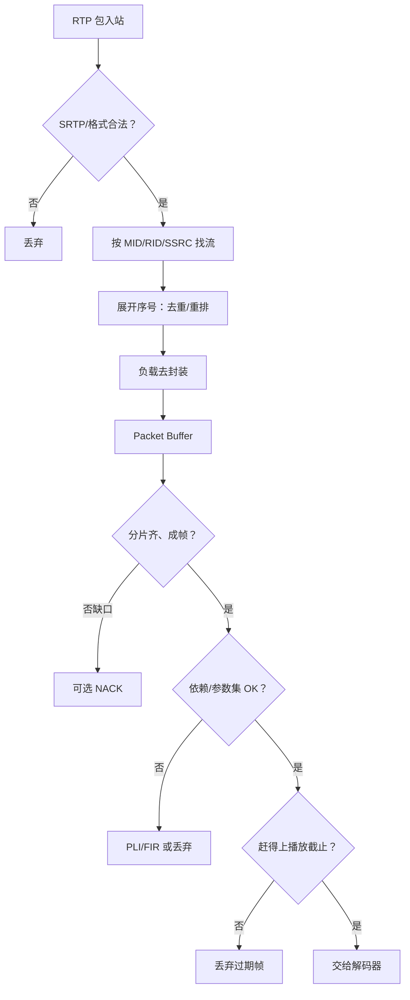

# 视频 RTP 接收与组帧状态机

> [!tip] 阅读提示
> **前置：** [[RTP]]；有 [[H264 RTP 负载格式]] 更好。
> **初读：** 读到「初读到此为止」就停。弄清：「收到一个 RTP 包」≠「收到一帧」；中间要经过去重、去封装、组帧和截止判断。
> **深入：** 包/帧状态机细节、窗口与线程、故障注入在实现或排障时再读。

## 一句话说明

视频接收端不能把「收到一个 RTP 包」直接等同于「收到一帧」。它必须依次完成安全校验、流归属、序号展开、去重与重排、负载去封装、NALU/编码帧重组、参考依赖判断，最后才能把赶得上截止时间的完整帧交给解码器。

## 先记住这三句

1. 对象要分清：**Packet → 分片/NALU → 访问单元 → 可解码帧**；「完整到齐」≠「一定能解」。
2. Marker / 同 timestamp 只是边界**提示**，不能单独证明分片都齐、依赖都满足。
3. 赶不上 [[播放截止时间]] 就丢弃；参考链断了才考虑 [[PLI 与 FIR]]，NACK 修的是「还能赶上的缺片」。

## 输入和输出边界

- 输入是通过 SRTP 校验和解密后的 RTP 包，至少带 SSRC、扩展序号、RTP 时间戳、Payload Type、Marker、MID/RID 和本地到达时间。
- 中间对象应区分 `Packet`、负载分片、NALU、编码访问单元和可解码帧。这五种对象不能共用一个「frame」名称。
- 输出是带完整性、帧类型、依赖关系、捕获/接收时间和播放截止时间的编码帧；「完整」不自动表示「可解码」，还要满足参数集和参考帧依赖。

## 收包总流程（初读版）

1. SRTP 认证与解密，拒绝短包、未知会话和认证失败。
2. 按 MID / RID / SSRC / PT 找到接收流，每流独立状态。
3. 展开 16 位序号：去重、过旧、超前、异常跳变。
4. 按负载格式去封装（Single / STAP / FU…）。
5. 放进有界 Packet Buffer；窗口内缺口可触发 NACK。
6. 边界与分片齐了 → 组编码帧 → 查依赖 → 解码就绪队列。
7. 等恢复会超过截止 → 丢弃；参考链断 → 请求刷新点。

```text
包进来 → 合法？→ 哪条流？→ 去重重排 → 去封装
      → 凑齐一帧？→ 依赖 OK？→ 还赶得上播放？→ 解码
                              └ 否 → 丢弃 / NACK / PLI
```

**图在说什么：** 一个 RTP 包要过安全、归属、去重、去封装、组帧、依赖和截止判断，才能进解码；缺片可 NACK，参考链断才 PLI。



> [!example] 一眼误区
> 看到 Marker=1 就交给解码器：前面 FU-A 中间片可能还没到。看到序号连续就认为能播：可能还缺 SPS/PPS，或引用的参考帧已经丢了。

---

> [!warning] 初读到此为止
> 上面这些已经够第一次阅读。下面是工程展开与排障细节（字段、指标、状态流），**第二轮或遇到具体问题时再读**；第一次直接点文末「第一次阅读下一站」即可。

## 包级状态机

```text
未知
  ├─ 校验失败 ──────────────> 丢弃
  ├─ 已收过/过旧 ───────────> 重复或晚到丢弃
  └─ 合法新包 ──────────────> 已缓存
                                  ├─ 前方有缺口 -> 等待乱序 / 发送 NACK
                                  ├─ 分片齐全 -> 已去封装
                                  └─ 超过截止 -> 过期丢弃
```

每个包只能从缓存交付一次。RTX 恢复包在还原原始序号和负载关系后，应回到相同去重入口，不能绕过重复检测直接注入解码器。

## 帧级状态机

```text
收集分片
  ├─ 边界未知 ----------------------> 继续收集，但受窗口和时间上限约束
  ├─ 分片缺失且可恢复 --------------> 等待 NACK/RTX/FEC
  ├─ 分片缺失且已过期 --------------> 丢弃帧
  └─ 分片完整 ----------------------> 检查参数集和参考依赖
                                           ├─ 依赖满足 -> 解码就绪
                                           ├─ 等待前置帧仍有时间 -> 暂存
                                           └─ 依赖不可恢复 -> 丢弃并考虑 PLI
```

Marker 位只按相应 RTP 负载规范辅助表达访问单元边界，不能在所有编码格式中单独作为完整帧证明。时间戳相同也不必然代表所有包都已到达。

## 序号、时间戳和窗口

- RTP 序号只有 16 位。使用扩展序号时要处理回绕，并对异常大跳变设置重新同步策略；普通有符号整数比较会在 `65535 -> 0` 时失效。
- RTP 时间戳用于聚合同一媒体时刻的包，但还需要负载头的 Start/End、Marker 和编码依赖描述确定边界。
- Packet Buffer 应同时限制包数、字节数、序号跨度和媒体时长。只限制包数会让大分辨率或超大关键帧占用不可控内存。
- 缓存淘汰要记录原因：过旧、超窗口、内存压力、流重启、负载错误或播放过期，不能全部计为网络丢包。

## H.264 去封装示例

- Single NALU：一个 RTP payload 对应一个 NALU，仍要等待访问单元其他 NALU。
- STAP-A：读取每个 16 位网络字节序长度，再逐个提取 NALU；任何长度越界都应拒绝整包。
- FU-A：首片恢复原 NAL 头，中间片只追加负载，尾片结束 NAL；Start/End 组合非法、类型不一致或缺任一片时不能交付不完整 NAL。
- SPS/PPS 和 IDR 的可用性要按解码器代次跟踪。新订阅、解码器重建或层切换后，旧参数集不能无条件复用。

细节见 [[H264 RTP 负载格式]]。

## 参考依赖和恢复决策

包完整性、帧完整性和解码依赖是三层不同判断。完整收到一个 P 帧，如果它引用的前置帧已经丢失，仍可能无法正确解码。接收端应保存可解码连续点、最近刷新帧和每帧依赖摘要。

恢复决策至少考虑：剩余播放时间、往返时延、重传命中概率、帧是否为关键参考、后继帧依赖范围和当前发送预算。NACK 适合仍来得及的具体包；PLI/FIR 请求未来刷新点，不能修复当前缺失分片。

## 线程、队列与所有权

- 网络线程只做有界解析和投递，避免被视频解码或锁等待阻塞，从而拖累音频收包。
- 组帧状态通常按接收流串行访问；若跨线程，包缓冲应使用不可变载荷或明确的引用所有权。
- 解码队列必须有最大等待时间。网络恢复后仍把积压旧帧全部解码，会造成高延迟追赶而不是实时恢复。
- 硬件解码器异步返回的 surface 生命周期不能由 Packet Buffer 管理；编码数据、解码任务和输出表面属于不同所有者。

## 可观测指标

- 每流记录收到、重复、乱序、晚到、认证失败和未知 PT/SSRC 的包数。
- 记录帧的首包/末包到达时间、分片总数、缺片数、组帧等待、恢复来源和完整性结果。
- 记录进入解码、成功输出、依赖缺失、参数集缺失、解码错误和过期丢帧。
- 将原始序号、RTX 序号、帧 ID、RTP 时间戳、SSRC/RID 和解码帧编号串在同一 trace 中。

## 故障注入与验收

1. 注入乱序、重复、序号回绕和超窗口晚到包，确认只交付一次且状态不串流。
2. 对 H.264 分别删除 FU-A 首片、中片和尾片，确认不会生成损坏 NALU。
3. 丢失普通非参考帧、参考帧、SPS/PPS 和 IDR，比较 NACK、丢帧与 PLI 路径。
4. 让 RTX 在截止前和截止后到达，确认前者可恢复、后者不挤占实时队列。
5. 在 SSRC/RID 切换和解码器重建时确认旧 Packet Buffer、参数集和依赖状态按代次清理。

## 常见误区

- 「Marker=1 就是一帧完整」：Marker 不能证明此前所有分片都已收到。
- 「序号连续就能解码」：还可能缺参数集、参考帧或负载协商错误。
- 「请求了 PLI 当前画面就能恢复」：必须等待发送端产生并传完新的刷新帧。
- 「组帧失败都是网络丢包」：解析错误、错误 PT、SFU 改写错误和本地淘汰也会造成缺片。

## 阅读导航

- **上一篇：** [[RTP 头扩展]]
- **下一篇：** [[00-知识地图/专题说明/10 RTCP 与质量反馈|10 RTCP 与质量反馈]]（本专题配套详解已读完，进入下一专题说明）
- **所属专题：** [[00-知识地图/专题说明/09 RTP 打包、解析与传输|09 RTP 打包、解析与传输]]
- **回看：** [[RTC 知识总览]] · [[00-知识地图/学习路线/学习进度模板|学习进度]] · [[00-知识地图/学习路线/RTC 工程师学习路线.canvas|阶段路线]]
- **第一次阅读下一站：** [[H264 RTP 负载格式]]（若还没读过包化）或回 [[丢包恢复策略]]（组帧失败后怎么选恢复手段）


> 读完先回所属专题做练习/验收，再点下一篇。内部链接最多再追一层；不影响理解的陌生词先记下。

## 图谱关系

- 输入：[[RTP]]、[[RTP 头扩展]]
- 负载：[[H264 RTP 负载格式]]
- 恢复：[[NACK]]、[[RTX]]、[[FEC]]、[[PLI 与 FIR]]
- 时间约束：[[播放截止时间]]、[[抖动缓冲]]
- 输出：[[H264]]

## 参考资料

- RFC 3550，RTP: A Transport Protocol for Real-Time Applications。
- RFC 6184，RTP Payload Format for H.264 Video。
- 所用 WebRTC 版本的 RTP video receiver、packet buffer 和 frame reference finder 源码；类名与具体状态应固定提交后核对。
