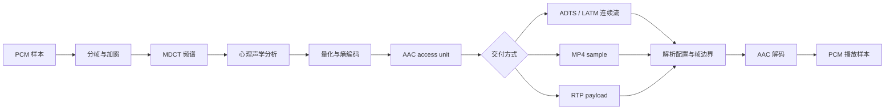

# AAC

> [!tip] 阅读提示
> **前置：** [[音频编解码]]、[[心理声学与 MDCT]] 初读更好。
> **初读：** 读到「初读到此为止」就停。弄清：AAC 常见于直播/点播封装，和 Opus 在 RTC 里的分工不同。
> **深入：** Profile（LC/HE 等）、ADTS/ASC、与容器关系，做转码或混流转发时再读。

## 一句话说明

AAC（Advanced Audio Coding）是 MPEG 系列的有损音频编码家族。它把 PCM 音频分帧、加窗并进行 MDCT，依据心理声学模型对频谱系数进行量化和熵编码，再把配置、比例因子和谱数据组织成 AAC 访问单元。AAC 不是容器；ADTS、LATM 或 MP4 中的音频轨道只是它的不同封装方式。

## 先记住这三句

1. AAC 是广泛使用的感知音频压缩，直播拉流、MP4/FLV 里很常见；**不是** WebRTC 语音默认编解码。
2. 压缩靠 **心理声学 + 变换（MDCT 等）**：扔掉人耳不易察觉的细节来换码率。
3. 工程上要分清 **Profile**（如 LC）和 **封装**（裸 ADTS vs 容器里的 ASC）；只说「AAC」不够对接。

## 核心机制

- AAC-LC 常用每帧 1024 个采样，编码器也可能使用 960 样本配置；短窗用于瞬态，长窗提供更好的频率分辨率。解码输出的 PCM 样本数和 priming/delay 必须按具体配置确认。
- 编码器按比例因子带估计掩蔽阈值，反复调整量化步长以满足目标码率，再用 Huffman 等熵编码压缩谱数据。
- TNS、预测、强度立体声和中侧（MS）立体声等工具改善特定内容的率失真；并非所有 profile、采样率和工具组合都可互操作。
- HE-AAC 在 AAC-LC 基础上增加 SBR，HE-AAC v2 还可增加参数立体声。低码率场景要把 profile、采样率和实际解码支持一起协商。

**图在说什么：** PCM 经分帧、MDCT、心理声学与量化熵编码变成 AAC 单元，再按 ADTS/LATM 或装进 MP4 交付。

> [!example] 生活化理解
> AAC access unit 是已经压缩好的“内容”，ADTS、MP4 和 RTP 是把它送到不同场景的“包装与目录”。更换包装通常不等于重新编码内容，但收件方仍必须从包装或额外配置中得知 profile、采样率和声道等解码条件。这个类比不表示三种封装可以直接逐字节互换，转换时仍要遵守各自格式。

## 具体例子

一个 AAC-LC 1024 样本访问单元在 48 kHz 下约 21.3 ms。若将它每帧单独放进实时传输，网络丢失会直接影响一个较长的音频块；若额外积累多帧再发送，包头开销下降但交互延迟和丢失代价上升。选择必须由业务的截止时间和终端兼容性决定。

---

> [!warning] 初读到此为止
> 上面这些已经够第一次阅读。下面是工程展开与排障细节（字段、参数、误区与观测），**第二轮或遇到具体问题时再读**；第一次直接点文末「第一次阅读下一站」即可。

## 工程要点

- 交互 RTC 更常优先选择 Opus；AAC 常见于文件、直播和已有硬件生态。使用 AAC 做实时传输时，要明确帧长、编码延迟、RTP/容器封装和浏览器/硬件兼容性。
- 解码器初始化需要 AudioSpecificConfig 或等价参数。只拿到裸 AAC 帧而缺少 profile、采样率索引和声道配置时，不能可靠创建解码器。
- ADTS 头适合逐帧流式传输，但增加头部开销；MP4 中通常保存 extradata 和样本表。封装转换时不要把 ADTS 头当成编码帧内容重复写入。
- 对齐 AAC 访问单元、PTS 和解码器 priming 是做首帧及音画同步的关键；比较文件时应区分编码延迟与播放器额外缓存。

## 问题边界

- AAC 是编码标准家族，不等于某个库、文件后缀或单一 profile。AAC-LC、HE-AAC 等 profile 的工具、采样率和解码能力不同。
- AAC 访问单元、ADTS 帧、LATM/LOAS 单元和 MP4 sample 是不同层次的边界；RTP 负载还要遵循自己的 payload 格式。
- 码率、采样率和 profile 只能说明配置，不能直接保证实时延迟、音质或终端互通，必须在目标设备上验证。

## 数据结构与语法

解码器至少需要 AudioSpecificConfig 中的 object type、sampling frequency index/显式采样率、channel configuration 等信息。ADTS 头还会携带 profile、采样率索引、声道配置、帧长度和同步字；MP4 通常把配置放在 `esds`/extradata，并在 sample table 中保存每个样本的偏移和时长。

| 层次 | 主要职责 | 典型边界 |
| --- | --- | --- |
| PCM | 未压缩样本 | 每声道样本数、采样格式 |
| AAC access unit | 可独立送入解码器的编码单元 | 长窗/短窗语法及配置 |
| ADTS | 给连续 AAC 帧添加自描述头 | 同步字、帧长度、CRC 可选 |
| MP4 sample | 容器中的样本索引项 | offset、size、DTS/CTS |

## 编码与解码步骤

1. 采集 PCM，按目标采样率、声道和帧长送入编码器。
2. 编码器选择窗序列，计算掩蔽阈值，量化比例因子和频谱系数。
3. 通过 profile 规定的语法元素和熵编码生成一个访问单元。
4. 根据目标传输选择 ADTS、LATM/LOAS、MP4 sample 或 RTP 负载封装。
5. 接收端解析配置和访问单元，解码到 PCM，再处理 priming、时间戳和播放缓冲。

## 时间与缓冲关系

AAC-LC 的常见 1024 样本帧在 48 kHz 下约为 21.33 ms；实际端到端延迟还要加窗重叠、lookahead、编码器缓存、RTP/容器缓冲和播放缓冲。960 样本配置、HE-AAC 的 SBR 输出以及解码器 priming 会改变“输入样本数”和“输出可听时间”的对应关系，不能只按文件帧数乘以固定毫秒数。

## 关键参数与取舍

- profile/object type：决定工具集合和终端兼容范围。
- 采样率与声道：影响可表示频带、带宽和解码成本。
- 码率/质量模式：平均码率越低，量化噪声和预回声风险通常越高。
- 传输封装：ADTS 易于连续扫描但增加头部；MP4 便于索引但需要样本表和可能的尾部元数据。
- frame size 与 lookahead：影响每包开销、恢复粒度和交互延迟。

## 常见误区与故障

- 只把 `.aac` 扩展名传给解码器：扩展名不能提供 profile、采样率和声道配置。
- 把 ADTS 头也当作裸访问单元送入 MP4 或 RTP，导致重复头部或解析失败。
- 将 HE-AAC 的 SBR 输出采样率误当作核心 AAC 解码采样率，造成播放速度或时间戳错误。
- 文件能播放不代表实时互通；播放器可能容忍缺少配置或自动探测，RTC 对协商和首帧时序更严格。

## 可观测与验证

- 用 `ffprobe` 记录 codec name、profile、sample rate、channel layout、extradata、每帧 PTS/DTS 和 duration。
- 对同一 PCM 输入分别输出 ADTS 和 MP4，比较首帧可解码时间、样本数、priming、总时长和转封装后 bit-exact/可解码性。
- 在目标终端测试静音、瞬态、采样率切换、丢包、重复包和配置缺失，记录解码错误、PLC/静音替代、A/V diff 与 CPU。

## 阅读导航

- **上一篇：** [[音频编解码]]
- **下一篇：** [[Opus]]
- **所属专题：** [[00-知识地图/专题说明/07 音频处理与 Opus|07 音频处理与 Opus]]
- **回看：** [[RTC 知识总览]] · [[00-知识地图/学习路线/学习进度模板|学习进度]] · [[00-知识地图/学习路线/RTC 工程师学习路线.canvas|阶段路线]]

- **第一次阅读下一站：** [[Opus]]

> 读完先回所属专题做练习/验收，再点下一篇。内部链接最多再追一层；不影响理解的陌生词先记下。

## 图谱关系

- 主题：[[音频技术地图]]
- 原理：[[心理声学与 MDCT]]
- 输入：[[PCM 与采样]]
- 封装：[[码流与容器]]
- 上位：[[音频编解码]]

## 参考资料

- 《AAC 音频解码原理》，完整解码流程与语法元素，`90-参考资料\音视频与 WebRTC 书库\aac-decoding-principles-zh\content\00-aac-decoding-principles.md`。
- 《音频编码讲义》，第 4、6 章 AAC/HE-AAC，`90-参考资料\音视频与 WebRTC 书库\audio-encoding-lecture-zh\content\04-aac.md`、`90-参考资料\音视频与 WebRTC 书库\audio-encoding-lecture-zh\content\06-he-aac.md`。
- 《FFmpeg Basics》，第 16 章数字音频，`90-参考资料\音视频与 WebRTC 书库\ffmpeg-basics\translation\17-digital-audio.md`。
