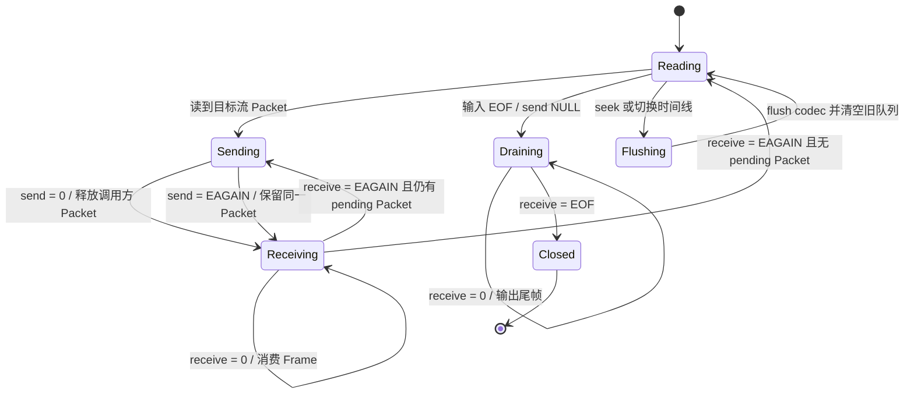

# FFmpeg 解码状态机

> [!tip] 阅读提示
> **前置：** [[AVPacket 与 AVFrame]] 初读区。
> **初读：** 读到「初读到此为止」就停。弄清：现代 FFmpeg 用 send/receive，EAGAIN 与排空是正常状态，不是「API 坏了」。
> **深入：** 冲刷、多线程、错误码与所有权，写解码循环时再读。

## 一句话说明

现代 FFmpeg 解码接口把输入压缩包和输出媒体帧解耦为显式状态机：通过 `avcodec_send_packet()` 提交一个 `AVPacket`，再循环调用 `avcodec_receive_frame()` 取出所有当前可用的 `AVFrame`。一次 send 可能对应零个、一个或多个 receive，不能假设“一包一帧”或“一次调用必有输出”。

## 先记住这三句

1. 典型循环：`send_packet` 喂压缩包 → `receive_frame` 取原始帧；编码则是 `send_frame` / `receive_packet`。
2. **`EAGAIN`** 常表示「这次还不能收/发，稍后再试」——要按状态机重试，不是直接放弃。
3. 结束时要 **flush/drain**：继续 receive 直到 EOF，否则尾帧会丢。

## 用一句话说清

现代 FFmpeg 解码不是「丢进一个函数就出画面」，而是 **send / receive 循环**：你先 `send` 压缩包，再 `receive` 解出的帧；遇到 `EAGAIN` 表示「这一侧先停一下，去另一侧收/送」，不是 API 坏了。

**第一次只需记住：**

1. 送进压缩数据 ≠ 立刻拿到一帧
2. `EAGAIN` = 状态提示，按环继续转
3. 文件/流结束进入 **drain**（排空）：不再送新包，只把剩余帧收完

（状态图与错误码对照在折叠线后。）



---

> [!warning] 初读到此为止
> 上面这些已经够第一次阅读。下面先是「原初读区深文」（可跳过），再是工程细节；**第一次直接点文末「第一次阅读下一站」即可。**


## 初读展开（原初读区深文，第二轮再读）

> 下面是本篇原先堆在初读区的展开内容，已整体后移，避免第一次阅读过载。

## 核心机制

1. 由 [[复用与解复用]]取得流参数，使用 `avcodec_parameters_to_context()` 配置 `AVCodecContext`，打开正确的解码器。
2. 读取 packet，按 `stream_index` 送入对应解码器；一次 send 可能产生零个、一个或多个 frame。
3. `receive_frame` 返回 `AVERROR(EAGAIN)` 表示当前没有更多输出；在 `send_packet` 返回 EAGAIN 时，输入 packet 没有被接受，必须先 receive，再重试同一个 packet。
4. 输入结束时向 send 传入 `NULL` 进入 drain，只 receive 到 `AVERROR_EOF`，期间不能再发送普通 packet；seek、切流或错误恢复时按上下文要求 flush。

**图在说什么：** 现代 FFmpeg 解码是 send/receive 状态环：`EAGAIN` 表示「先收/再送」，不是 API 坏了；EOF 后进入 drain 排空。


> （本图已上移到初读区，此处不重复。）


这里要同时观察两件事：解码器当前能否接收输入，以及调用方是否仍持有一个未被接受的 pending packet。只用“正在读包/正在解码”两个状态无法正确表达 `EAGAIN`。

```c
static int receive_available(AVCodecContext *dec, AVFrame *frame,
                             int *produced) {
    *produced = 0;
    for (;;) {
        int ret = avcodec_receive_frame(dec, frame);
        if (ret == AVERROR(EAGAIN) || ret == AVERROR_EOF) {
            return ret;
        }
        if (ret < 0) {
            return ret;
        }
        consume_frame(frame);       // ref/clone here if queued asynchronously
        av_frame_unref(frame);      // caller-owned container is reusable
        ++*produced;
    }
}

bool pending = false;
for (;;) {
    if (!pending) {
        int ret = av_read_frame(fmt, packet);
        if (ret == AVERROR_EOF) break;
        if (ret < 0) goto fail;
        if (packet->stream_index != video_index) {
            av_packet_unref(packet);
            continue;
        }
        pending = true;
    }

    for (;;) {
        int ret = avcodec_send_packet(dec, packet);
        if (ret == 0) {
            av_packet_unref(packet); // accepted; decoder owns any needed ref
            pending = false;
            break;
        }
        if (ret == AVERROR(EAGAIN)) {
            // The packet was not accepted. Keep it unchanged, receive output,
            // then retry this same packet instead of reading a new one.
            int produced = 0;
            ret = receive_available(dec, frame, &produced);
            if (ret < 0 && ret != AVERROR(EAGAIN)) goto fail;
            if (produced == 0) goto fail; // violates send/receive progress rule
            continue;
        }
        if (ret == AVERROR_EOF) goto fail;
        goto fail;
    }

    int produced = 0;
    int ret = receive_available(dec, frame, &produced);
    if (ret < 0 && ret != AVERROR(EAGAIN)) goto fail;
}

// Drain after input EOF. Do not send another normal packet in this mode.
for (;;) {
    int ret = avcodec_send_packet(dec, NULL);
    if (ret == 0 || ret == AVERROR_EOF) break;
    if (ret == AVERROR(EAGAIN)) {
        int produced = 0;
        ret = receive_available(dec, frame, &produced);
        if (ret == AVERROR_EOF) break;
        if (ret != AVERROR(EAGAIN) || produced == 0) goto fail;
        // Output made progress. Retry the same NULL drain signal.
        continue;
    }
    goto fail;
}
for (;;) {
    int ret = avcodec_receive_frame(dec, frame);
    if (ret == AVERROR_EOF) break;
    if (ret == AVERROR(EAGAIN)) goto fail; // unexpected after accepted drain
    if (ret < 0) goto fail;
    consume_frame(frame);
    av_frame_unref(frame);
}
```

## 具体例子

若 send 第 101 个 packet 返回 EAGAIN，正确流程是保持第 101 个 packet 不动，receive 并处理当前已排队的 frame，然后再次 send 第 101 个 packet；不能 unref 第 101 个再读取第 102 个。输入 EOF 后，send NULL 进入 drain，直到 receive 返回 EOF 才能销毁 codec context。

---

## 工程要点

- `avcodec_send_packet()` 返回 0 后，调用方可以 unref/reuse 自己的 packet，解码器会保留需要的底层引用；若返回 EAGAIN，packet 未被接受，必须原样保留并在 receive 后重试，不能读取下一个 packet 覆盖它。
- `AVFrame` 是 caller 提供的可复用容器；receive 后若要异步使用，应 `av_frame_ref`/`av_frame_clone` 保存对底层 buffer 的引用，再让解码线程 unref/复用临时 frame。
- 解码线程应把错误、EAGAIN、EOF、flush 和取消分别记录。无包可读不等于 EOF，网络输入还要区分暂时等待与连接关闭。
- PTS/DTS 由输入 packet、解码器重排序和输出 frame 共同决定，交给 [[PTS DTS 与时间基]]处理；播放器不要根据 receive 次数推算时间。
- 现代接口替代了 `avcodec_decode_video2()`、`avcodec_decode_audio4()` 等历史调用。旧资料可帮助理解概念，但新代码不能把旧函数的返回值语义直接套到 send/receive。

## 问题边界

- 该状态机只描述压缩包到解码帧的 FFmpeg codec 层；流选择、容器读取、RTP 重排、jitter buffer、滤镜和设备播放仍由上层负责。
- EAGAIN 有两个方向：send 返回 EAGAIN 表示输入未被接受，需要先 receive；receive 返回 EAGAIN 表示暂时没有输出，需要继续 send。不能用一个统一的“忽略 EAGAIN”处理。
- EOF、flush 和 drain 不是同一件事。输入 EOF 后 drain 释放 codec 内部缓存；seek/切流的 flush 则丢弃旧时间线和参考状态。

## 数据结构、状态和所有权

| 状态 | 允许的动作 | 退出条件 |
| --- | --- | --- |
| 输入 | send packet | send 返回 0，或 EAGAIN 后 receive 再重试 |
| 输出 | receive frame | EAGAIN（继续输入）或错误/EOF |
| 排空 | send NULL 一次并 receive | receive 返回 EOF |
| 刷新 | `avcodec_flush_buffers` | 清理队列后重新输入新时间线 |
| 关闭 | 停止线程、unref packet/frame、free context | 无回调再访问 context |

packet 的 pending 状态必须独立于读取循环。send 返回 EAGAIN 时，读取线程不能因为“已经调用过 send”就 unref packet；该 packet 仍是下一次 send 的输入。frame 进入异步队列前也要保存引用，否则下一次 receive 可能覆盖它。

## 正常处理步骤

1. 创建并初始化 packet/frame 容器，打开输入和 codec context。
2. 从 demuxer 读取目标流，保存当前 pending packet。
3. 尝试 send；接受后释放 caller packet，拒绝则先 receive 并重试原 packet。
4. 循环 receive，逐个处理 frame，直到 EAGAIN；对 EOF/其他错误分别记录。
5. 输入 EOF 后 send NULL，循环 receive 到 EOF，不再发送普通 packet。
6. seek/切流时停止消费旧 frame，flush codec，清空旧队列和时间基，再建立新时间线。

## 时间与缓冲关系

send/receive 的次数不代表帧率；B 帧、音频内部缓存和解码器线程可能造成输出延迟。解码线程应把 frame PTS 交给时间调度层，同时对 packet queue 和 frame queue设置容量与媒体时长上限。drain 期间产生的尾帧仍要按原 PTS 排队，不能因为输入 EOF 就立即显示或丢弃。

## 关键参数与取舍

- packet/frame queue 上限：限制内存和延迟，但过小会导致解码器/设备欠载。
- thread type/count：提高吞吐可能增加重排序和关闭复杂度，需测量 P99 延迟。
- error recognition/skip policy：严格模式更早暴露坏码流，容错模式可能掩盖数据损坏。
- hardware frames：减少拷贝但要求显式处理 frame pool、映射和 filter 支持。

## 常见误区与故障

- send EAGAIN 后直接 unref：丢失未接受的 packet，是最危险的状态机错误。
- drain 时把 `while (receive >= 0)` 作为唯一判断：会吞掉真正的解码错误或遗漏 EOF 状态。
- send NULL 后继续发送普通 packet：违反 draining 状态，后续输入可能被拒绝或语义不明。
- seek 只清文件读取位置，不 flush codec 和旧队列：旧参考帧/PTS 会混入新时间线。

## 可观测与验证

- 为每个 packet 记录 read、send 返回值、pending/retry 次数、unref 时机；为每个 frame 记录 receive 返回值、PTS、引用入队/出队和消费线程。
- 用延迟解码、B 帧、音频多帧缓存、EAGAIN 注入/模拟、EOF drain、seek、坏包和线程取消测试每个状态转移。
- 用 FFmpeg debug log、ASan/TSan、队列深度和 P99 decode time 验证没有丢 packet、重复 frame、悬空引用或 drain 死循环。

## 阅读导航

- **上一篇：** [[实时媒体链路]]
- **下一篇：** [[WebRTC Stats]]
- **所属专题：** [[00-知识地图/专题说明/04 WebRTC 应用接入与源码阅读|04 WebRTC 应用接入与源码阅读]]
- **回看：** [[RTC 知识总览]] · [[00-知识地图/学习路线/学习进度模板|学习进度]] · [[00-知识地图/学习路线/RTC 工程师学习路线.canvas|阶段路线]]

- **第一次阅读下一站：** [[WebRTC Stats]]

> 读完先回所属专题做练习/验收，再点下一篇。内部链接最多再追一层；不影响理解的陌生词先记下。

## 图谱关系

- 输入：[[复用与解复用]]
- 对象：[[AVPacket 与 AVFrame]]
- 时间：[[PTS DTS 与时间基]]
- 后处理：[[FilterGraph 重采样与缩放]]
- 播放：[[播放器队列与主时钟]]

## 参考资料

- 《FFmpeg API 与解码流程参考》，解码流程和历史 API，`90-参考资料\音视频与 WebRTC 书库\ffmpeg-api-decoding-reference-zh\content\01-decoding-flow-and-concepts.md`、`90-参考资料\音视频与 WebRTC 书库\ffmpeg-api-decoding-reference-zh\content\06-decoding-apis.md`。
- 《FFmpeg ffplay 源码分析》，libavcodec 章节，`90-参考资料\音视频与 WebRTC 书库\ffmpeg-ffplay-source-analysis-zh\content\05-libavcodec.md`。
- FFmpeg 官方 send/receive API 文档，`https://www.ffmpeg.org/doxygen/trunk/group__lavc__encdec.html`。
