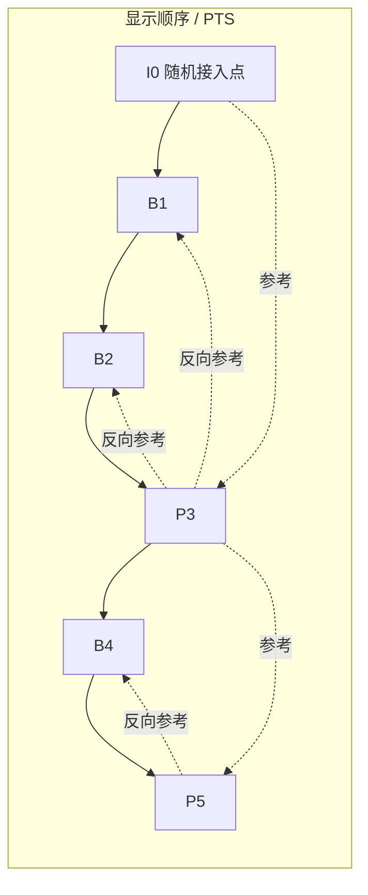

# GOP 与参考帧

> [!tip] 阅读提示
> **前置：** [[视频编码地图]]。
> **初读：** 先读「一句话说明」和「核心机制」，弄清 GOP 与参考帧 解决什么问题、不负责什么。
> **深入：** 「工程要点」、「关键参数与取舍」、「常见误区与故障」 在实现、联调或排障时再读。

## 一句话说明

GOP（Group of Pictures）描述从一个随机接入点到下一个随机接入点之间的图像组织。I 图像可独立解码，P 图像依赖已解码参考图像，B 图像可同时依赖前后参考图像。参考帧管理决定编码效率、解码顺序、随机接入和丢包后的影响范围。

## 核心机制

- 显示顺序和解码顺序可能不同。含 B 帧时，编码器必须先发送/解码后续参考，再按 PTS 显示，因此产生重排序和额外缓冲。
- 闭合 GOP 的边界不依赖前一 GOP，适合切片和随机访问；开放 GOP 可以提高压缩效率，但切换和恢复要带上跨边界依赖。
- H.264 常用 IDR 作为强随机接入点；HEVC 还有 CRA 等 IRAP 图像。具体语义取决于码流结构和解码器实现，不能把所有 I 帧都当作 IDR。
- 参考帧损坏会沿预测链传播。NACK/RTX 只在截止时间和发送缓存允许时有用，无法及时修复时由 [[PLI 与 FIR]]触发新的关键图像。

为了解码 `B1/B2`，接收端通常要先拿到并解码未来参考 `P3`，所以含 B 帧的解码顺序可能是 `I0 → P3 → B1 → B2 → P5 → B4`，而显示仍按图中从左到右进行。箭头只示意一种简化依赖；真实 H.264/HEVC 码流可有多参考、层级 B 和不同随机接入语义。

## 工程要点

- RTC 低延迟常限制 B 帧或关闭帧重排序，并控制 GOP/关键帧间隔；更短 GOP 提升恢复速度，却增加关键帧码率和编码压力。
- 关键帧请求必须限频、合并并设置原因，否则多个接收端的 PLI/FIR 会造成同步的码率峰值。
- 切层、加入会议、解码器重启和网络切换时，验证目标流是否包含完整参数集、随机接入点和必要参考依赖。
- 监控“请求关键帧到收到可解码图像”的时间、关键帧大小和恢复后的丢包/卡顿，而不是只记录请求次数。

## 问题边界

- GOP 是码流图像依赖的一种组织方式，不等于固定的“每 N 帧一个 I 帧”；编码器可能使用开放/闭合结构、B 帧、层级参考和场景切换策略。
- I 图像可以是帧内编码，但只有符合随机接入语义的 IRAP/IDR 才能保证从该处开始独立解码；具体标准和编码器配置必须核对。
- 关键帧请求是控制反馈，不是立刻产生完整可播放帧的命令；编码器排队、网络发送和解码器重建仍需要时间。

## 数据结构与依赖

每个图像在码流中有解码顺序、显示顺序、参考标记和可能的 temporal layer 标识。参考缓冲区维护短期可用于预测的重建图像；输出队列维护等待按 PTS 显示的图像。开放 GOP 的边界可能引用前后 GOP，闭合 GOP 则把依赖限制在边界内。

| 结构 | 压缩效率 | 低延迟/切换特征 |
| --- | --- | --- |
| 全 I | 最低依赖，码率高 | 易随机访问，关键帧压力大 |
| I/P | 常见低延迟折中 | 依赖过去参考，恢复需新 I/IDR |
| I/P/B | 压缩效率高 | B 帧重排序和缓冲增加 |
| 开放 GOP | 跨边界效率高 | 切片/切层/恢复更复杂 |
| 闭合 GOP | 边界独立 | 便于切换、录制和故障恢复 |

## 解码与恢复步骤

1. 识别参数集和随机接入点，初始化或重置解码器参考状态。
2. 按 DTS 接收并解码压缩图像，建立参考缓冲和重排序队列。
3. 按 PTS 输出可显示图像，过期帧根据播放截止时间丢弃。
4. 发现参考缺失时，先判断 NACK/RTX 是否仍赶得上；否则限频发送 PLI/FIR。
5. 收到新的可独立解码图像后清理旧依赖，恢复正常码率控制和统计窗口。

## 时间与缓冲关系

GOP 越长，平时码率可能越低，但从关键帧请求到恢复的最坏时间越长；B 帧数量和层级增加解码重排序缓存。实时播放器必须把编码前瞻、网络重传等待、jitter buffer 和解码重排分别计入延迟预算，不能用 GOP 长度直接当播放延迟。

## 关键参数与取舍

- keyframe interval/GOP length：恢复速度与关键帧码率峰值的取舍。
- B 帧数量和最大重排序：压缩效率与交互延迟的取舍。
- 参考帧数/链深度：质量与丢包传播、内存、解码复杂度的取舍。
- 关键帧请求最小间隔、合并窗口和每路预算：避免多人会议同步触发码率尖峰。

## 常见误区与故障

- 将所有 I 帧都当作 IDR：可能从错误的参考状态开始解码。
- 只看发送端关键帧间隔：接收端还要考虑目标层、参数集、RTP 分片和实际到达顺序。
- 每次 PLI 都立即强制全局关键帧：会造成编码器抖动、上行峰值和其他订阅者受损。
- 恢复后仍保留旧帧队列：旧 PTS 或参考依赖可能再次触发花屏和时序倒退。

## 可观测与验证

- 记录图像类型、DTS/PTS、参考列表、GOP 边界、关键帧大小、请求原因、请求到恢复时长和丢帧/卡顿。
- 用加入中途、网络切换、关键帧包丢失、参考帧包丢失、突发丢包和多订阅者同时请求进行测试。
- 画出“请求→编码器产生→RTP 发送→接收→解码→呈现”的时间线，定位恢复慢在编码、网络、jitter buffer 还是解码。

## 具体例子

30 fps、2 秒 GOP 意味着理想情况下约 60 帧才出现一次关键图像。若接收端刚加入并错过最近关键图像，它可能要等待下一次关键图像；若收到 PLI 后立即生成关键帧，关键帧大小可能让 pacer 和拥塞控制短时超预算，因此应测量请求限频和发送排队。

## 阅读导航

- **上一篇：** [[H264]]
- **下一篇：** [[HEVC]]
- **所属专题：** [[00-知识地图/专题说明/08 视频编码与 H.264|08 视频编码与 H.264]]
- **回看：** [[RTC 知识总览]] · [[00-知识地图/学习路线/学习进度模板|学习进度]] · [[00-知识地图/学习路线/RTC 工程师学习路线.canvas|阶段路线]]

> 读完先回所属专题做练习/验收，再点下一篇。内部链接最多再追一层；不影响理解的陌生词先记下。

## 图谱关系

- 主题：[[视频编码地图]]
- 预测：[[帧内与帧间预测]]
- 实现：[[H264]]
- 扩展：[[HEVC]]
- 恢复：[[PLI 与 FIR]]

## 参考资料

- 《Coding Video: A Practical Guide to HEVC and Beyond》，第 4、6、11 章，`90-参考资料\音视频与 WebRTC 书库\coding-video\translation\04-structures.md`、`90-参考资料\音视频与 WebRTC 书库\coding-video\translation\06-inter-prediction.md`。
- 《Learning WebRTC》，视频流、关键帧与 RTP 章节，`90-参考资料\音视频与 WebRTC 书库\learning-webrtc\translation`。
- 《WebRTC 参考》，关键帧请求和视频恢复章节，`90-参考资料\音视频与 WebRTC 书库\webrtc-reference-zh\content`。
