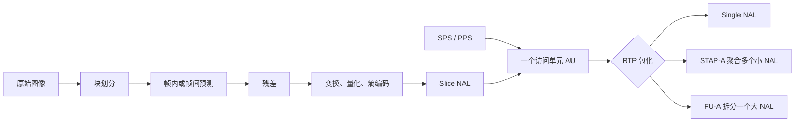

# H264

> [!tip] 阅读提示
> **前置：** [[视频编解码]]、[[YCbCr 与色度抽样]] 初读区。
> **初读：** 读到「初读到此为止」就停。弄清：H.264 在 RTC 里干什么、NAL/参数集大概是什么，以及和 RTP 打包的边界。
> **深入：** Profile/Level、SPS/PPS、误区与观测，对照 [[H264 RTP 负载格式]] 时再读。

## 一句话说明

H.264/AVC 是面向块的视频编码标准。它把图像划分为宏块/编码块，使用帧内或帧间预测得到残差，再经过变换、量化和熵编码形成 NAL 单元。它不是容器，也不规定传输网络；RTC 中通常把编码后的访问单元按 H.264 RTP 负载格式发送。

## 先记住这三句

1. H.264/AVC 是 RTC/直播里最常见的视频压缩标准之一：把图像压成可传的 NAL 单元流。
2. **SPS/PPS** 描述怎么解；**IDR/关键帧** 提供可独立解码的刷新点——缺它们就容易黑屏或花屏。
3. 编码细节在本篇；**怎么切成 RTP 包**见 [[H264 RTP 负载格式]]（Single/STAP/FU-A），两边不要混成一篇。

## 定义

H.264 码流由 NAL 单元组成。SPS/PPS 描述解码参数，切片携带图像数据，IDR 图片提供不依赖此前图像的解码起点。Profile、Level、分辨率、帧率、packetization-mode 和参数集必须在会话协商及接收端能力范围内匹配。

## 核心机制

- 编码器在 [[帧内与帧间预测]]之间选择，并把预测误差交给变换、量化和熵编码。
- P/B 图像依赖参考图像；参考列表和 [[GOP 与参考帧]]决定解码顺序、显示顺序及随机接入成本。
- NAL 单元可以单独放入 RTP，也可以聚合或使用 FU-A 分片；包化边界不能被误认为帧边界。

**图在说什么：** 图像经预测、变换量化与熵编码打成 Slice NAL，再配上 SPS/PPS 组成访问单元，最后才 RTP 包化。

图中从图像到 NAL 是编码过程，从 NAL 到 RTP 包是传输封装过程。一个访问单元可以含多个 NAL；一个 NAL 也可以拆成多个 RTP 包，所以“图像帧、NAL、RTP 包”三个边界不能画等号。

## 具体例子

若路径可用 payload 约 1,200 字节，一个 3,000 字节的 IDR NAL 可能需要 3 个 FU-A 分片；首片设置 Start，中间片不设 Start/End，尾片设置 End。任一分片丢失时，组帧器应丢弃该 NAL 并按策略请求恢复，不能把不完整 NAL 交给解码器。

---

> [!warning] 初读到此为止
> 上面这些已经够第一次阅读。下面是工程展开与排障细节（字段、参数、误区与观测），**第二轮或遇到具体问题时再读**；第一次直接点文末「第一次阅读下一站」即可。

## 工程要点

- 低延迟场景通常限制或关闭 B 帧和过长前瞻，控制 GOP 长度并限制参考帧数量；这会牺牲一部分压缩效率。
- 丢失参考帧后，后续 P/B 图像可能持续损坏。NACK/RTX 适合仍赶得上播放截止时间的包；无法修复时用 PLI/FIR 请求新的关键图像。
- SPS/PPS 需要在解码起点可获得。实时流切换、关键帧请求和新订阅者加入时，检查参数集是否随 IDR 一起送达。
- 编码器输出、RTP 分片和解码器输入都要以字节长度为边界，不能依赖 `0x000001` 起始码在所有封装中存在。

## 问题边界

- H.264 标准规定语法和解码过程，不规定某个编码器的具体码率控制，也不规定 SDP/网络业务的完整重试策略。
- NAL 单元、访问单元、切片、RTP 包和容器 sample 是不同边界。一个访问单元可能包含多个 NAL，一个大 NAL 可能跨多个 RTP 包。
- Profile/Level 是能力约束，不是质量等级。相同 Profile/Level 下，GOP、参考帧、QP、码率控制和实现质量仍可能明显不同。

## 数据结构与码流格式

H.264 NAL 头包含 forbidden_zero_bit、nal_ref_idc 和 nal_unit_type。SPS 描述 profile、level、分辨率、参考帧等参数，PPS 描述熵编码、量化和切片相关参数；切片 NAL 携带宏块/编码块语法。Annex B 使用起始码分隔 NAL，AVC length-prefixed 格式使用长度字段。

| 类型/概念 | 作用 |
| --- | --- |
| SPS/PPS | 解码参数集，需在随机接入点前可用 |
| IDR | 清理参考依赖的随机接入图像 |
| non-IDR I | 帧内编码但可能仍受参考语义约束 |
| Single NAL | 一个 RTP 包承载一个 NAL |
| STAP-A | 聚合多个小 NAL |
| FU-A | 将一个大 NAL 分片到多个 RTP 包 |

## 编码与打包步骤

1. 编码器从重建参考和当前图像选择帧内/帧间模式，形成切片和 NAL。
2. 根据输出格式添加 Annex B 起始码或长度前缀，保存 SPS/PPS/extradata。
3. RTP 打包器按 MTU、扩展头、SRTP 开销计算可用 payload；小 NAL 单包，大 NAL 使用 FU-A。
4. 接收端按 RTP 序号重排并组装 NAL/访问单元，校验 FU-A 的 Start/End 标记。
5. 解码器在参数集和 IDR 可用后恢复参考图像；丢失分片时按截止时间选择重传或请求关键帧。

## 时间与缓冲关系

H.264 RTP 通常使用 90 kHz 媒体时钟，帧 PTS 不等于 NAL 或 RTP 包数量。组装器需要等待同一访问单元的后续分片，但等待过久会错过播放截止时间；解码器还可能因参考和重排序缓存延迟输出。因此应分别统计组帧等待、jitter buffer、解码和呈现延迟。

## 关键参数与取舍

- packetization-mode：决定单 NAL、聚合和分片能力，必须与对端协商。
- Profile/Level、分辨率、帧率、参考帧和最大码率：共同限制解码能力和网络预算。
- IDR 间隔、B 帧/前瞻、CABAC/CAVLC、QP 范围：分别影响恢复、延迟、压缩率和 CPU。
- NAL 单元最大大小与路径 MTU：要扣除 RTP 扩展、SRTP、UDP/IP、隧道和 TURN 开销。

## 常见误区与故障

- 看到 Annex B 起始码就直接送 RTP：RTP payload 通常需要去除起始码并使用对应负载格式。
- FU-A 丢一个分片只影响一个小块：整个 NAL/访问单元可能不可用，参考帧还会放大后续损伤。
- SPS/PPS 只在 SDP 中出现一次就永远足够：新订阅者、解码器重启或流切换时可能需要重新发送。
- 把 packetization-mode 兼容当成完整互通：Profile、Level、参数集、分辨率、帧率和解码器资源仍需匹配。

## 可观测与验证

- 记录 NAL 类型、访问单元边界、RTP 序号/时间戳、分片数、组帧等待、SPS/PPS 版本、IDR 间隔和解码错误。
- 用单 NAL、STAP-A、FU-A、缺首/中/尾分片、重复/乱序、参数集缺失和 MTU 变化做抓包回放。
- 用 `ffprobe`/码流分析器核对 profile/level、参考帧、帧类型、PTS/DTS；把编码输出、RTP 重组和解码输出分层保存。

## 阅读导航

- **上一篇：** [[变换量化与熵编码]]
- **下一篇：** [[GOP 与参考帧]]
- **所属专题：** [[00-知识地图/专题说明/08 视频编码与 H.264|08 视频编码与 H.264]]
- **回看：** [[RTC 知识总览]] · [[00-知识地图/学习路线/学习进度模板|学习进度]] · [[00-知识地图/学习路线/RTC 工程师学习路线.canvas|阶段路线]]

- **第一次阅读下一站：** [[GOP 与参考帧]]

> 读完先回所属专题做练习/验收，再点下一篇。内部链接最多再追一层；不影响理解的陌生词先记下。

## 图谱关系

- 主题：[[视频编码地图]]
- 上位：[[视频编解码]]
- 预测：[[帧内与帧间预测]]
- 随机接入：[[GOP 与参考帧]]
- 传输：[[RTP]]
- RTP 负载：[[H264 RTP 负载格式]]

## 参考资料

- 《Coding Video: A Practical Guide to HEVC and Beyond》，第 4、6、10 章，`90-参考资料\音视频与 WebRTC 书库\coding-video\translation\04-structures.md`、`90-参考资料\音视频与 WebRTC 书库\coding-video\translation\06-inter-prediction.md`。
- 《WebRTC 权威指南》，视频编解码与 RTP 章节，`90-参考资料\音视频与 WebRTC 书库\webrtc-authoritative-guide-zh\content`。
- 《FFmpeg Basics》，第 18、25 章，`90-参考资料\音视频与 WebRTC 书库\ffmpeg-basics\translation\19-interlaced-video.md`、`90-参考资料\音视频与 WebRTC 书库\ffmpeg-basics\translation\26-debugging-and-tests.md`。
