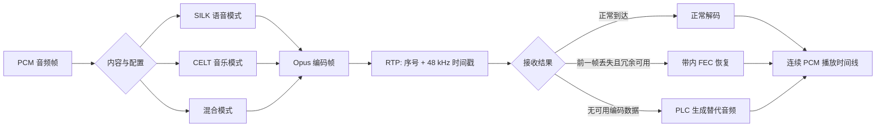

# Opus

> [!tip] 阅读提示
> **前置：** [[PCM 与采样]]、[[音频编解码]] 初读区。
> **初读：** 读到「初读到此为止」就停。弄清：Opus 为何是 RTC 主力、SILK/CELT 大致分工，以及帧时长/码率/FEC 在换什么。
> **深入：** 参数与 SDP、PLC、误区与观测，联调或对照 [[Opus RTP 负载格式]] 时再读。

## 一句话说明

Opus 是面向交互语音和音乐的低延迟有损音频编码器。它可以在语音模式、音乐模式和混合模式之间切换，支持多种帧长、码率、声道数以及带内 FEC、DTX 等实时通信能力。

## 先记住这三句

1. Opus 是面向实时的音频编解码：低延迟、可调码率，WebRTC 里几乎是默认语音/音乐压缩方案。
2. 内部常说 **SILK（语音）/ CELT（音乐/宽带）** 及混合模式——你选的是「场景与码率」，库会切工具。
3. 和 RTC 强相关的旋钮：**帧时长**（常见 20 ms）、**码率**、**DTX**、**in-band FEC/PLC**；它们影响延迟与抗丢包，不只是「好听」。

## 核心机制

- SILK 更适合语音，CELT 更适合宽带音乐，混合模式覆盖中间场景；模式切换由编码器根据配置和内容决定。
- 编码延迟来自帧长、算法前置、重采样与排队。20 ms、48 kHz 的一帧包含每声道 960 个输入时间单位，RTP 时间戳增量仍按 48 kHz 时钟计算。
- DTX 在静音期减少发送，不能把“少发包”解释成媒体时钟停止；接收端仍需维护连续的播放时间。
- 带内 FEC 只对满足条件的丢包提供可能的冗余恢复，必须配合接收端的延迟预算；它不是无条件替代 NACK 的方案。

**图在说什么：** PCM 按内容走 SILK/CELT/混合得到 Opus 帧，再装进 RTP（常用 48 kHz 时间戳）。

FEC 和 PLC 都可能让扬声器继续出声，但证据不同：FEC 从后续 Opus 包中的冗余信息恢复前一帧，通常需要额外等待；PLC 不恢复原始网络字节，而是根据解码器状态合成替代输出。

## 具体例子

48 kHz、20 ms、单声道输入为 960 个样本；若目标码率为 32 kbit/s，理想平均每帧编码负载约为 80 字节，但实际长度会随内容和封装变化。这个估算不能替代 MTU、RTP 头、SRTP 标签和重传/FEC 预算。

---

> [!warning] 初读到此为止
> 上面这些已经够第一次阅读。下面是工程展开与排障细节（字段、参数、误区与观测），**第二轮或遇到具体问题时再读**；第一次直接点文末「第一次阅读下一站」即可。

## 定义

Opus 的输入输出是 PCM 样本，网络上传输的是编码帧。RTP 负载使用 48 kHz 的媒体时钟；输入可以是 8、12、16、24 或 48 kHz，编码器会按协议语义处理采样率，但应用仍必须保证每次调用的每声道样本数和 frame size 正确。

## 工程要点

- 编码器和解码器状态按流独立管理；采样率、声道数、frame size、码率和复杂度必须在生命周期内保持可追踪。
- 解码调用既可能输出正常帧，也可能只消耗输入或返回错误。遇到丢包时区分 PLC、FEC 和真正的解码失败，并记录 concealment 时长。
- 码率改变、DTX 开关和 FEC 配置会改变带宽与质量，应结合拥塞控制、抖动缓冲以及端到端指标验证，而非只看编码器返回值。
- 编解码器前后的格式转换要明确交错/平面布局和所有权，避免把每声道样本数误当成总样本数。

## 问题边界

- Opus API 的 `frame_size` 是每声道输入/输出样本数，不能用编码后字节数推算；编码帧也不必对应一个 RTP 包。
- Opus 的模式、带宽和 FEC/DTX 参数是编码器行为，RTP payload 的时钟、TOC 字节和多帧聚合又属于封装层，必须分开验证。
- PLC/FEC 只能在已有解码状态、时间预算和有效负载条件下改善体验，不能恢复任意丢失或损坏的帧。

## 数据结构与接口

一个 Opus 编码器实例保存预测状态、模式和复杂度；解码器实例保存跨帧的状态。应用至少要维护：采样率、声道数、每帧样本数、目标码率、是否 FEC/DTX、RTP sequence number、RTP timestamp 和丢包状态。

| 参数 | 工程含义 |
| --- | --- |
| `sample_rate` | API 输入采样率；RTP 媒体时钟仍按 48 kHz 语义运行 |
| `frame_size` | 2.5/5/10/20/40/60 ms 对应的每声道样本数 |
| bitrate | 目标编码码率，不等于每个包恒定字节数 |
| complexity | CPU 与质量/码率决策的取舍 |
| FEC/DTX | 额外冗余与静音期间流量的取舍 |

## 编码与接收步骤

1. 把采集 PCM 重采样/格式化为编码器接受的布局，并按 frame size 提供完整每声道样本。
2. 编码器根据内容和配置选择 SILK/CELT/混合模式，生成编码帧和 TOC 信息。
3. 给每个媒体帧分配连续 RTP timestamp；一个 20 ms 帧在 48 kHz 时递增 960。
4. 发送端按 MTU 和聚合策略封装，接收端先按序号/时间戳重排，再把完整帧送入解码器。
5. 对缺包选择等待、FEC、PLC 或丢弃，并将输出样本数/时间继续交给抖动缓冲和播放时钟。

## 时间与缓冲关系

短帧降低算法和丢包影响的粒度，却增加包率、包头开销和调度压力；长帧提高编码效率，却扩大单次丢失的连续损伤。网络抖动缓冲还会在编码帧时长之外增加等待，FEC 通常需要延迟一个后续帧才能利用。静音 DTX 期间 RTP 包减少，但接收端的媒体时间线不能停止。

## 关键参数与取舍

- 20 ms 常是语音交互的折中，不是所有场景的固定最佳值；音乐、低延迟控制和弱网可能选择不同帧长。
- 码率提高通常改善复杂内容，但会增加带宽和拥塞风险；复杂度提高可能改善率失真，但占用实时 CPU。
- FEC 对连续/突发丢包的收益取决于丢包模式和接收端是否能延迟播放；DTX 适合静音流量优化，但要测量唤醒瞬态。
- 立体声、单声道和重采样配置改变每帧样本与码率，协商更新必须和编码器状态切换同步。

## 常见误区与故障

- 把输入采样率 16 kHz 直接当成 RTP 时间戳时钟；Opus RTP 时间戳仍使用 48 kHz 规则。
- 收到一个 RTP 包就调用一次解码器；聚合、多帧和分片语义取决于 payload，必须先解析边界。
- 将 FEC 当作发送端重复包，或把 PLC 当作网络重传；它们的输入、截止时间和统计口径不同。
- 只看编码器返回“成功”，不检查输出长度、sequence/timestamp 连续性和解码后的样本时长。

## 可观测与验证

- 记录每帧输入样本数、编码耗时、输出字节数、模式/带宽、RTP timestamp、序号、FEC/PLC 次数和 concealment 时长。
- 用语音、音乐、静音、突发丢包、乱序、重复包和采样率配置组合做自动化回环，比较总延迟、音频隐藏率、MOS/主观听感和 CPU。
- 验证长时间运行时 timestamp 回绕、DTX 静音恢复、码率动态调整和关闭/重启 codec 的状态清理。

## 阅读导航

- **上一篇：** [[AAC]]
- **下一篇：** [[回声消除]]
- **所属专题：** [[00-知识地图/专题说明/07 音频处理与 Opus|07 音频处理与 Opus]]
- **回看：** [[RTC 知识总览]] · [[00-知识地图/学习路线/学习进度模板|学习进度]] · [[00-知识地图/学习路线/RTC 工程师学习路线.canvas|阶段路线]]

- **第一次阅读下一站：** [[回声消除]]

> 读完先回所属专题做练习/验收，再点下一篇。内部链接最多再追一层；不影响理解的陌生词先记下。

## 图谱关系

- 主题：[[音频技术地图]]
- 输入：[[PCM 与采样]]
- 原理：[[心理声学与 MDCT]]
- 上位：[[音频编解码]]
- 传输：[[RTP]]
- RTP 负载：[[Opus RTP 负载格式]]

## 参考资料

- 《Opus API 1.1.3》，§4.1、§4.2、§4.6，`90-参考资料\音视频与 WebRTC 书库\opus-api-1-1-3\translation`。
- RFC 7587《RTP Payload Format for the Opus Speech and Audio Codec》，§3–4，`90-参考资料\音视频与 WebRTC 书库\webrtc-authoritative-guide-zh\content`（项目资料索引）。
- 《音频编码讲义》，AAC、音频编码器与数字音频章节，`90-参考资料\音视频与 WebRTC 书库\audio-encoding-lecture-zh\content`。
