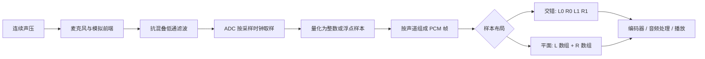

# PCM 与采样

> [!tip] 阅读提示
> **前置：** [[音频技术地图]]。
> **初读：** 先读「一句话说明」和「核心机制」，弄清 PCM 与采样 解决什么问题、不负责什么。
> **深入：** 「工程要点」、「关键参数与取舍」、「常见误区与故障」 在实现、联调或排障时再读。

## 一句话说明

PCM（Pulse Code Modulation）把连续的声压信号按固定采样率取样，再把每个样本量化为整数或浮点数。采样率决定单位时间记录多少个样本，位深/数值格式决定每个样本的表示精度；声道数决定同一时刻有多少条样本序列。

对最高频率为 `f_max` 的信号，采样率必须高于 `2*f_max` 才能在理想条件下避免混叠。实际采集会在 ADC 前使用抗混叠低通滤波器，重采样也必须先限制目标采样率无法表示的频率成分。

## 核心机制

- 采样得到离散时间序列；量化把连续幅度映射到有限级别，量化误差表现为噪声。理想均匀量化器的信噪比近似随位深每增加 1 bit 提升 6.02 dB，但实际还受模拟链路和削波影响。
- PCM 可按交错（packed/interleaved）或平面（planar）布局存储。交错立体声通常是 `L0,R0,L1,R1`，平面布局则分别保存 L、R 数组；`nb_samples` 通常指每声道样本数。
- 音频帧的媒体时长为 `nb_samples / sample_rate`。例如 48 kHz、20 ms、单声道 16-bit PCM 有 960 个样本和 1,920 字节；双声道字节数再乘以 2。
- PCM 通常是编码器的输入和解码器的输出，但并非绝对不能作为 RTP 负载。L16/L24 等 RTP 负载格式可以直接承载未压缩样本；在 WebRTC 中更常见的是先编码成 Opus，再用 RTP 时间戳表达媒体进度，因为原始 PCM 的带宽和丢包成本较高。

采样率决定横向“多久取一次”，位深或浮点格式决定纵向“幅度用多细的刻度记录”，声道布局决定多条样本序列如何放进内存。三者是不同维度，不能只用一个“音质高低”概括。

## 工程要点

- 在接口和日志中同时记录采样率、每声道样本数、声道布局、sample format、平面数、每平面字节数和时间戳，避免把“总样本数”与“每声道样本数”混淆。
- 采集设备、[[音频编解码]]器和播放设备的采样率不一致时，需要明确的重采样策略。持续通话还要处理设备时钟频偏，否则队列会逐渐欠载或积压。
- 输入级过载会造成不可逆削波；格式转换、混音和增益应保留足够余量，必要时在处理链中测量峰值和有效值。
- 录制原始 PCM 时必须额外保存采样率、声道布局和位深；裸文件没有自描述头，不能仅凭文件大小恢复这些信息。

## 问题边界

- 采样解决“连续信号怎样进入数字系统”，量化解决“幅度怎样表示”；编码器、容器和 RTP 解决的是后续压缩或传输问题。
- 采样率不是音质的单一指标。超出信号带宽的采样率不会自动恢复被滤掉的细节，过低采样率则会把不可表示的高频折叠成混叠。
- “音频帧”在采集 API、编码器、FFmpeg 和 RTP 中可能有不同边界。比较它们时应先写清每声道样本数、时长和时钟域。

## 数据结构与格式

| 字段 | 含义 | 典型检查 |
| --- | --- | --- |
| `sample_rate` | 每秒每声道的样本数 | 8/16/48 kHz 是否符合设备与编码器 |
| `nb_samples` | 当前帧每声道样本数 | 48 kHz、20 ms 应为 960 |
| sample format | `s16`、`s24`、`s32`、`flt` 等 | 位宽、符号位和端序 |
| channel layout | 声道位置而不只是数量 | 单声道、立体声、5.1 的映射 |
| plane/stride | 数据平面和每行/每声道步长 | packed 与 planar 不可混读 |

交错 `s16` 立体声的第 `n` 个样本地址可抽象为 `base + n * channels * bytes_per_sample`；平面布局则为 `plane[channel] + n * bytes_per_sample`。实际工程应使用媒体库给出的 linesize/样本格式 API，不要自行假设对齐。

## 数字化步骤

1. 模拟前端用抗混叠滤波器限制输入带宽。
2. ADC 按采样时钟取样，把每个时刻的幅度映射到有限精度。
3. 处理链按声道和样本格式组成音频帧，附加采集时间戳。
4. 编码器消费固定或可变数量的样本；重采样器在设备时钟不一致时改变样本率。
5. 播放端按输出设备的消费时钟取样，未压缩 RTP 则按对应 payload 规范解释字节序、声道和 RTP 时钟。

## 时间与缓冲关系

48 kHz 下，10 ms、20 ms、40 ms 分别对应 480、960、1,920 个每声道样本。缓冲区以样本数计算容量，以 `samples / sample_rate` 计算时长；不能把字节数直接当作播放延迟。输入设备和输出设备的独立时钟如果存在 ppm 级偏差，长时间运行会积累为队列涨落，需要轻微重采样或丢/补样本策略。

## 关键参数与取舍

- 采样率越高，带宽、CPU 和缓冲字节数越高，但可表示带宽更宽。
- 位深越高，量化噪声下限越低，但传输未压缩音频的带宽也按字节数增加。
- 更短音频块降低交互延迟，但提高每秒调用、RTP 包头和调度开销；更长块提高效率，却增加算法和排队延迟。
- L16/L24 这类未压缩 RTP 适合受控带宽或互操作场景；WebRTC 语音通常选择 Opus，并通过协商明确采样率、声道和负载格式。

## 常见误区与故障

- 把 48 kHz 的 `960` 误写成总样本数：双声道仍是每声道 960 个样本，总标量数为 1,920。
- 把裸 PCM 当成自描述格式：文件大小相同并不意味着采样率、声道布局和位深相同。
- 只改采样率字段而不做重采样：这会改变播放速度和音高，而不是完成格式转换。
- 混淆 signed 16-bit 的范围、浮点 `[-1, 1)` 和设备实际满量程，导致削波或整体音量偏小。

## 可观测与验证

- 记录输入/输出的采样率、`nb_samples`、声道布局、字节数、首尾时间戳、队列深度和峰值/RMS。
- 用 1 kHz 正弦、静音、脉冲和双声道不同频率信号检查采样顺序、通道交换、削波和时长。
- 做 10 分钟长时实验，比较理想 `sample_count / sample_rate` 与设备单调时钟，观察队列是否单调增长或周期性欠载。
- 对 L16/L24 RTP 互操作测试，确认 payload 的字节序、RTP 时钟、声道数和丢包后的听感；对 Opus 路径分别测编码前 PCM 和解码后 PCM。

## 具体例子

48 kHz、双声道、16-bit、20 ms 的原始帧包含 `960 * 2 * 2 = 3,840` 字节，原始码率为 `48,000 * 2 * 16 = 1,536 kbit/s`。若把它切成 20 ms 的 RTP 包，还要另算 RTP、UDP、IP、SRTP 和可能的隧道开销；编码成 Opus 后，负载大小由码率和内容决定，不能用 PCM 字节数推断。

## 阅读导航

- **上一篇：** [[00-知识地图/专题说明/05 音视频数据、采集与播放|05 音视频数据、采集与播放]]（回到本专题说明）
- **下一篇：** [[YCbCr 与色度抽样]]
- **所属专题：** [[00-知识地图/专题说明/05 音视频数据、采集与播放|05 音视频数据、采集与播放]]
- **回看：** [[RTC 知识总览]] · [[00-知识地图/学习路线/学习进度模板|学习进度]] · [[00-知识地图/学习路线/RTC 工程师学习路线.canvas|阶段路线]]

> 读完先回所属专题做练习/验收，再点下一篇。内部链接最多再追一层；不影响理解的陌生词先记下。

## 图谱关系

- 主题：[[音频技术地图]]
- 转换：[[心理声学与 MDCT]]
- 编码：[[音频编解码]]
- 实时编码：[[Opus]]
- 时间：[[时钟与时间戳]]

## 参考资料

- 《FFmpeg Basics》，第 16 章数字音频，`90-参考资料\音视频与 WebRTC 书库\ffmpeg-basics\translation\17-digital-audio.md`。
- 《FFmpeg Basics》，第 11 章格式转换，`90-参考资料\音视频与 WebRTC 书库\ffmpeg-basics\translation\12-format-conversion.md`。
- 《Opus API 1.1.3》，§4.1、§4.2，`90-参考资料\音视频与 WebRTC 书库\opus-api-1-1-3\translation`。
