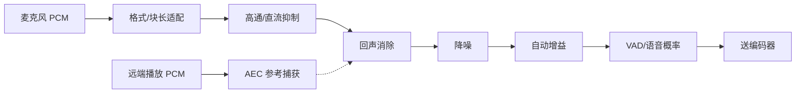

# RTC 音频预处理状态机

> [!tip] 阅读提示
> **前置：** [[PCM 与采样]]、[[回声消除]] 初读区。
> **初读：** 读到「初读到此为止」就停。弄清：采集 PCM 进编码器前，各模块按什么顺序排成一条链。
> **深入：** 子模块状态、线程与观测，做音频质量联调时再读。

## 一句话说明

RTC 音频预处理位于麦克风采集与编码之间，目标是在严格的实时截止内改善可懂度、控制响度并降低回声和静音流量。它不是若干滤镜随意串联：回声消除、降噪、自动增益、语音检测和重采样共享同一时间线，顺序、状态和远端播放参考都会改变结果。它也不负责网络丢包恢复、抖动缓冲或编解码本身。

## 先记住这三句

1. **音频预处理链** 在「麦克风 PCM → 编码器」之间，常见含 AEC、NS、AGC（及增益/重采样）。
2. 模块有 **推荐顺序与状态**（开/旁路/失败降级）；乱序会导致消不干净或语音发闷。
3. 每个模块都吃 CPU 与延迟预算；RTC 要在音质与实时性之间做开关与参数折中。

## 用一句话说清

RTC 音频预处理（APM）在「把麦克风声音发出去」之前，按固定顺序做几件事：消回声（AEC）→ 降噪（NS）→ 自动增益（AGC）→ 是否有人说话（VAD）。

**第一次关键一句：** 远端正在播放的声音，要**单独抽一份参考**给 AEC——乱序或漏参考，会消不干净或把自己的声音弄闷。

（完整管线图与参数坑在折叠线后。）



---

> [!warning] 初读到此为止
> 上面这些已经够第一次阅读。下面先是「原初读区深文」（可跳过），再是工程细节；**第一次直接点文末「第一次阅读下一站」即可。**


## 初读展开（原初读区深文，第二轮再读）

> 下面是本篇原先堆在初读区的展开内容，已整体后移，避免第一次阅读过载。

## 问题边界

- **上游：** 采集回调给出的 PCM 块、采样率/声道、采集时间戳、模拟/数字增益、设备路由与代次；AEC 还需要与扬声器实际播放尽量对齐的远端渲染参考。
- **下游：** 编码前的连续 PCM，以及语音概率、建议增益、残余回声似然等旁路元数据；常见消费者是 [[Opus]] 编码器和 DTX/活动发言人逻辑。
- **易混淆：**
  - 业务“静音按钮”≠ VAD=false。前者是用户意图，后者是信号分类。
  - AGC 抬增益 ≠ 设备硬件增益旋钮本身；模拟 AGC 与数字 AGC 副作用不同。
  - AEC 处理的是声学回声，不是网络环回或混音错误。
  - 环形缓冲吸收抖动 ≠ 永久解决采样时钟漂移。

## 总体处理顺序

一种常见逻辑顺序如下，**具体实现必须以所用 WebRTC APM / 平台版本为准**：

```text
采集 PCM
  -> 格式 / 声道 / 块长适配
  -> 高通或直流抑制
  -> 回声消除（线性 + 残余抑制）
  -> 降噪 NS
  -> 自动增益 / 限幅 AGC
  -> VAD / 语音概率
  -> 送编码器

远端解码 PCM
  -> 播放路径上的参考捕获点
  -> AEC render reference（带时间）
```

**图在说什么：** 近端采集链按固定顺序过 AEC→NS→AGC→VAD；远端播放要单独抽参考给 AEC——乱序会消不干净或发闷。


> （本图已上移到初读区，此处不重复。）


顺序不能只凭主观听感调换：

1. **先剧烈非线性增益再 AEC**：会破坏参考与观测之间的近似线性关系，滤波器更难收敛。
2. **AEC 参考取自错误音量点**（例如音量调节前而非实际 DAC 后）：估计路径与真实声学路径不一致，ERLE 上不去。
3. **先强 NS 再 AEC**：可能抹掉回声残差里对延迟估计仍有用的结构，也可能把近端辅音当噪声杀掉。
4. **VAD 过早门控**：把后续 NS/AGC 的输入“剪断”，噪声估计和电平跟踪会失真。

## 具体例子

**例 1：蓝牙耳机插入。**  
运行中路由从扬声器切到蓝牙。正确路径：设备代次 +1 → Reconfigure → 清空 AEC 滤波器与延迟锁定 → Priming → 重新对齐参考。错误路径：继续用旧 80 ms 延迟估计，表现为远端回声“突然回来”或近端被“挖空”。

**例 2：静音室里 AGC 狂拉。**  
VAD/语音电平估计把空调噪声当语音，数字增益每秒抬升。现象是噪声底呼吸感明显，对端听起来“滋滋”。约束：无语音概率时冻结或回落增益，并限制静音期最大增益。

**例 3：回调 20 ms，算法 10 ms。**  
一次回调拆成两块依次过 APM。若只处理第一块就返回，第二块被丢，时间轴出现空洞，AEC 参考对不齐，编码侧 DTX 也可能误判。正确做法是同一回调内处理完所有子块，或显式排队并计入延迟。

**例 4：时钟漂移。**  
采集时钟偏快 100 ppm，约每 3 分钟多出 ~18 ms 样本。只靠 50 ms 环形缓冲，数十分钟后上溢。应用 ppm 重采样把消费速率对齐，而不是每隔几秒丢一帧。

---

## 输入输出契约

| 方向 | 内容 | 约束 |
| --- | --- | --- |
| 输入 capture | PCM、采样率、声道、每声道样本数、采集时间、增益状态、设备代次 | 块边界清晰；缺字段时不得 silently 假设 |
| 输入 render ref | 远端解码后、尽量贴近实际扬声器输出的参考 PCM 与时间 | 缺块/错声道/错时间会直接拖垮 AEC |
| 输出 | 连续 PCM + 旁路元数据（VAD、增益、残余回声等） | 时间轴连续；旁路/静音也不能丢块造成时间空洞 |
| 粒度 | 常见固定 **10 ms** 块 | 这是接口约束，不是所有算法的自然帧长 |

设备回调块长与 10 ms 不一致时，必须无丢样、无重复地切分或合并，并把这段拼块缓存计入端到端延迟。声道映射（单麦、立体声、参考多声道）要在进入算法前显式归一，不能把“第一个声道”默认为近端人声。

## 生命周期状态机

```text
Uninitialized
  -> Configured          # 采样率/声道/尾长/开关集已设定
  -> Priming             # 积累噪声/电平/延迟估计所需最少块
  -> Running

Running
  -> Reconfigure         # 设备、路由、采样率、声道或关键开关变化
  -> Priming             # 新代次，旧滤波器/增益/延迟不得直接继承
  -> Running

Running
  -> Bypassed / Muted    # 仍推进时间与块计数；不处理 ≠ 丢块

任意状态
  -> Stopping
  -> Closed
```

| 状态 | 允许动作 | 退出条件 | 关键不变量 |
| --- | --- | --- | --- |
| Uninitialized | 分配工作区、读默认配置 | 配置校验通过 | 不接受 capture/render |
| Configured | 绑定设备代次、预分配缓冲 | 首块到达或显式 start | 参数快照已版本化 |
| Priming | 更新噪声/电平/延迟估计；可减弱抑制 | 达到最小块数或估计置信度 | 输出仍连续，可标记 `not_converged` |
| Running | 完整流水线 | 重配/旁路/停止 | 每块有截止时间与代次检查 |
| Reconfigure | 应用新快照、重置或迁移状态 | 进入新 Priming | 旧代次任务不得覆盖新输出 |
| Bypassed/Muted | 拷贝或填零/舒适噪声；维护时钟 | 恢复 Running 或停止 | 时间轴不断裂 |
| Stopping/Closed | 排空、释放、拒收回调 | 无回调再入 | 禁止 use-after-free |

`Priming` 不是“可以随便出糊音”。产品若要求接通瞬间也可懂，应定义 Priming 期的降级策略（例如较弱 NS、较慢 AGC、AEC 未收敛告警），而不是假装已经收敛。

## 子模块状态与数据

### 高通 / 直流抑制

去掉麦克风偏置和极低频隆隆声，避免后续功率估计和 AEC 被直流分量主导。状态通常只有滤波器历史；设备热插拔后应清零历史，防止阶跃爆音。

### 回声消除 AEC

详见 [[回声消除]]。预处理视角下必须盯住：

- **render reference 代次**与 capture 代次一致；设备切换后旧滤波器系数、旧延迟估计一律作废或快速重训。
- **延迟估计**覆盖播放缓冲、硬件输出、声学传播、采集缓冲；估计器本身也是带滞回的小状态机（搜索 → 锁定 → 失锁重搜）。
- **双讲状态**：近端+远端同时说话时限制滤波器更新，并减弱把近端当回声的残余抑制。
- 指标：ERL、ERLE、残余回声似然、延迟估计、收敛标志、参考缺块计数。

```text
AEC 内部（示意）
Idle/NoRef -> Aligning -> Converging -> Converged
Converged -> DoubleTalk -> Converging/Converged
任意 -> PathChange -> Aligning
```

### 降噪 NS

估计噪声谱或噪声概率，再对时频单元施加抑制增益。

| 状态量 | 含义 |
| --- | --- |
| 噪声估计 | 按频带或时频单元的噪声功率/模型 |
| 语音存在概率 | 当前单元更像语音还是噪声 |
| 频带增益 | 平滑后的抑制系数 |
| 平滑历史 | 避免增益帧间跳变造成音乐噪声 |

静音稳态风扇、键盘脉冲、道路噪声、空调低频的统计特性不同，不能只用一个固定能量阈值。过强抑制的典型代价是：音乐噪声、吞字、金属感、辅音被削。测试要分别听：**静音噪声底、近端单讲清晰度、双讲、远场弱语音**。

### 自动增益 AGC

把输入响度拉向目标范围，并用压缩器/limiter 防削波。

```text
ObserveLevel
  -> EstimateSpeechLevel   # 常结合 VAD/语音概率，避免把噪声当语音
  -> ComputeGain
  -> ApplyGain
  -> LimitPeak
  -> UpdateHistory
```

- **模拟 AGC**：调设备输入增益，动态范围大，但受驱动/权限/路由限制，且会改变 AEC 看到的电平关系。
- **数字 AGC**：改 PCM，响应可控，但把已削波的输入“数字抬高”救不回谐波失真。
- 增益必须缓慢变化并设上下限。攻击过快会泵动；释放过慢会在说话变小后长期听不清；把背景噪声当语音会在静音期不断抬高噪声底。

记录：输入峰值/RMS、语音概率、建议增益、实际增益、limiter 触发次数、削波计数。

### 语音活动检测 VAD

输出“当前块包含语音”的概率或分类，供 DTX、噪声估计门控、活动发言人和业务提示使用。

```text
NonSpeech
  --(prob > enter 且持续 >= min_on)--> Speech
Speech
  --(prob < exit 后 hangover 结束)--> NonSpeech
```

| 参数 | 作用 | 调太激进时 |
| --- | --- | --- |
| 进入阈值 / 最小时长 | 抑制突发误触发 | 句首被吃掉 |
| 退出阈值 / hangover | 覆盖词间停顿 | 静音流量偏大、噪声估计被污染 |
| 特征集 | 能量、过零、频谱、学习模型等 | 过拟合某一类噪声 |

VAD=false **不能**证明“没人说话”，也 **不能**证明设备正常。音乐、笑声、键盘、远端残余回声是否算“活动”，必须按产品场景定义，而不是复用同一组阈值。

### 重采样与时钟漂移

设备实际时钟几乎永不等于标称采样率。长期运行时，采集与播放样本数会以 **ppm** 级缓慢偏离。

```text
测缓冲深度误差
  -> 平滑控制器输出比率修正（ppm）
  -> 小步重采样或时域伸缩
  -> 更新深度观测
```

环形缓冲只能暂时吸收差异；一步丢掉或复制整块 PCM 容易爆音。设备切换、休眠恢复、时间戳跳变时应重置积分状态，避免旧误差驱动新设备。比率修正本身也要限速，防止控制器振荡。

## 正常处理步骤（单块）

1. 读取 capture 块与可选 render 参考；校验采样率、声道、代次、时间戳单调性。
2. 若代次变化：进入 Reconfigure → 新 Priming，丢弃不可迁移状态。
3. 块长适配（拆/拼）到算法帧长；累计适配缓冲延迟。
4. 高通 → AEC（无参考则明确降级路径）→ NS → AGC → VAD。
5. 写出 PCM 与元数据；更新耗时、队列深度、缺块与收敛指标。
6. 若本块超过实时截止：按策略旁路后续重模块或整链，并打点，而不是在回调里死等。

## 时间与缓冲关系

| 缓冲 | 作用 | 风险 |
| --- | --- | --- |
| 设备回调积压 | 调度抖动吸收 | 过大增加延迟 |
| 块长适配缓冲 | 对齐 10 ms | 永久滞留 = 固定延迟 |
| AEC 参考 ring | 覆盖延迟搜索 + 尾长 | 太短消不干净；太长费 CPU/内存 |
| 播放/采集时钟差 | 漂移观测 | 不修正最终上溢/下溢 |

端到端音频延迟 ≈ 采集缓冲 + 适配 + AEC/NS/AGC 算法延迟 + 编码帧长 + 网络/抖动缓冲 + 解码播放。预处理每一级“再多攒几帧更稳”都会直接推高通话延迟，需要和消回声/降噪收益一起权衡。

## 关键参数与取舍

- **块长：** 10 ms 是 WebRTC 常见接口；更小块降低延迟但抬高调度与 CPU，更大块相反。
- **AEC 尾长：** 覆盖房间反射 vs CPU/内存/收敛时间。
- **NS 抑制强度：** 噪声残留 vs 语音失真/音乐噪声。
- **AGC 目标电平与时间常数：** 可懂度与泵动/噪声抬升。
- **VAD 迟滞：** DTX 节省 vs 句首句尾损伤。
- **漂移控制带宽：** 跟踪速度 vs 可闻调制。

版本相关行为（模拟 AGC 是否可用、AEC3 默认参数、移动端固定点实现等）必须对着所用提交验证，不能把旧博客参数当成当前默认。

## 实时线程与配置快照

- 音频回调中不做磁盘 I/O、网络请求、等待大锁或无界分配。
- 预分配工作缓冲；跨线程传递不可变音频块或明确所有权的池对象。
- 每个阶段有固定最坏处理时间；超时要记录并采用**明确定义**的旁路/降级，而不是“尽量算完”。
- 配置变更通过**版本化快照**在块边界应用，避免处理半块时参数被另一线程修改。
- capture 与 render 参考若来自不同线程，排队与丢弃策略要成对设计：只丢一边会制造假延迟和假双讲。

## 可观测与故障注入

**建议指标（按块或按秒聚合）：**

- 输入/输出能量、峰值、削波、直流偏移
- 噪声估计、NS 平均增益、VAD 概率与状态时长
- AGC 建议/实际增益、limiter 次数
- AEC 延迟、ERLE、收敛、双讲比例、参考缺块
- 处理耗时（均值/P99）、截止违约次数、队列深度
- 重采样比（ppm）、适配缓冲深度、设备代次变更次数

**注入场景：**

1. 恒定风扇噪声 + 近端正常说话  
2. 键盘脉冲 / 敲击  
3. 纯远端单讲、纯近端单讲、双讲  
4. 播放参考丢失、错声道、参考延迟阶跃  
5. 切换听筒/扬声器/蓝牙  
6. CPU 抢占导致回调超时  
7. 采样时钟 ±50～200 ppm 偏差  
8. 采集块长从 10 ms 变为 20/5 ms 或抖动块长  

**验收不能只听一段好听的录音：** 比较语音失真、残余回声、响度稳定、静音流量、端到端延迟和实时截止违约。单讲 ERLE 很好但双讲吞字，仍算失败。

## 常见误区与故障表现

- **NS/AGC 开得越强越好：** 强处理常以语音失真、泵动、音乐噪声为代价；双讲和弱语音最先坏。
- **VAD=false 就没人说话：** 分类有误判；与业务静音是不同状态机。
- **AEC 只需要麦克风：** 没有时间对齐的播放参考就无法建模回声路径。
- **缓冲能永久解决漂移：** 固定频偏最终会填满或抽空缓冲。
- **旁路等于停止读麦：** 旁路若丢块，所有依赖时间连续的模块（AEC、抖动缓冲、A/V sync）都会被间接打坏。
- **设备切换只改音频设备 ID：** 不重置预处理状态时，最常见主观现象是“回声又来了”或“声音忽大忽小”。
- **把预处理毛刺当网络问题：** 先看本地 ERLE/增益/截止违约，再查丢包与抖动。

## 阅读导航

- **上一篇：** [[NetEQ]]
- **下一篇：** [[00-知识地图/专题说明/08 视频编码与 H.264|08 视频编码与 H.264]]（本专题配套详解已读完，进入下一专题说明）
- **所属专题：** [[00-知识地图/专题说明/07 音频处理与 Opus|07 音频处理与 Opus]]
- **回看：** [[RTC 知识总览]] · [[00-知识地图/学习路线/学习进度模板|学习进度]] · [[00-知识地图/学习路线/RTC 工程师学习路线.canvas|阶段路线]]

- **第一次阅读下一站：** [[00-知识地图/专题说明/08 视频编码与 H.264|08 视频编码与 H.264]]（本专题配套详解已读完，进入下一专题说明）

> 读完先回所属专题做练习/验收，再点下一篇。内部链接最多再追一层；不影响理解的陌生词先记下。

## 图谱关系

- 主题：[[音频技术地图]]、[[客户端工程地图]]
- 输入：[[PCM 与采样]]、[[采集与渲染]]
- 回声：[[回声消除]]
- 输出：[[Opus]]、[[Opus RTP 负载格式]]
- 时间：[[时钟与时间戳]]、[[音视频同步]]
- 线程：[[Native WebRTC 线程模型]]
- 观测：[[WebRTC Stats]]、[[WebRTC 状态机诊断]]

## 参考资料

- 所用 WebRTC Audio Processing Module 的接口、配置和固定提交源码（以仓库钉死的 revision 为准）。
- [[回声消除]] 同目录笔记中的工程要点与 ERLE 验证方法。
- ITU-T P.56、P.863 等语音电平/质量测量资料；具体适用范围需按测试目标核对。
- 《WebRTC 参考》音频处理相关章节，`90-参考资料\音视频与 WebRTC 书库\webrtc-reference-zh\content`。
