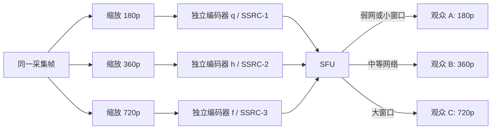

# Simulcast

> [!tip] 阅读提示
> **前置：** [[视频编码地图]]。
> **初读：** 先读「一句话说明」和「定义」，弄清 Simulcast 解决什么问题、不负责什么。
> **深入：** 「工程要点」、「关键参数与取舍」、「常见误区与故障」 在实现、联调或排障时再读。

## 一句话说明

Simulcast 让发送端同时产生多个相互独立的编码层，通常通过不同分辨率、帧率或码率覆盖接收端能力范围，再由 [[SFU]] 按订阅者的窗口和网络条件选择转发。

## 定义

每个 simulcast 层都能独立解码，拥有自己的编码状态、SSRC/RID 标识和码率预算。它与“一个码流内部含多个可丢弃层”的 SVC 不同：simulcast 用重复编码换取切层简单和故障隔离。

## 核心机制

- 发送端为每个层独立进行缩放、编码和 pacing；层之间不共享参考帧，因此切换不必等待另一层的预测链。
- 接收端或 SFU 根据估计带宽、订阅分辨率、活跃说话人和解码能力选择层；切换时要等待目标层的可解码起点。
- 低层通常承担弱网保底，高层承担大窗口画质；层级数量越多，上行码率和 CPU 越高。

三层共享采集内容和媒体时间，但各自有独立编码状态、参考链、序号空间和预算。SFU 通常选择转发其中一层，不是把三层拼成一张更清晰的画面；切换目标层时仍要等该层的可解码起点。

## 工程要点

- 码率控制要把各层和总上行预算一起测量；不能用单层目标码率推断设备实际总开销。
- 通过 SDP 的 RID、方向和相关扩展协商层能力，服务端转发时保留层标识及 RTCP 反馈对应关系。
- 同一内容多层编码会放大关键帧和恢复请求的瞬时带宽；切层策略应与 GOP 与参考帧、带宽估计联动。
- 新订阅者加入或层切换时，优先选择能按时解码的关键图像，不要只按空间分辨率切换。

## 问题边界

- Simulcast 解决“同一发送者为不同接收能力提供多条独立码流”，不负责网络拥塞控制、媒体转码或播放同步本身。
- 层数、分辨率和码率不是规范固定值；不同终端可能只支持两层、不同 RID 语义或不同硬件编码路径。
- SFU 选层是转发决策，不等同于编码器实时改变某一路的分辨率。发送端层配置和服务端订阅策略需要分别观测。

## 数据结构与标识

每个层至少需要独立的编码状态和可关联标识。常见信号包括 RID、SSRC、payload type、分辨率、帧率、目标码率和依赖/关键帧状态。RTCP 反馈必须能映射到具体编码层，否则一条层的丢包会误触发另一条层的恢复。

| 层属性 | 作用 | 例行检查 |
| --- | --- | --- |
| RID/SSRC | 标识发送层 | 重协商、重启和转发后是否稳定 |
| scale/resolution | 覆盖窗口尺寸 | 宽高、SAR、裁剪是否正确 |
| max bitrate/framerate | 上行预算 | 单层和总和是否超限 |
| keyframe state | 切层可解码起点 | 目标层是否有新鲜关键帧 |

## 发送与选层步骤

1. 根据设备能力和目标总码率配置多个独立编码层。
2. 为每层完成缩放、编码、RTP 标识和 pacing，分别维护统计。
3. SFU 收集订阅窗口、活跃说话人、带宽估计和终端解码能力。
4. 选择满足依赖、码率和播放截止时间的最高层，必要时先降层再请求目标层关键帧。
5. 层切换后观察首个可解码帧、队列延迟、RTCP 反馈和总上行/下行预算。

## 时间与缓冲关系

多个层共享采集时间线，但各自编码器可能有不同 lookahead、队列和关键帧时刻。SFU 切换到目标层时，目标层的下一可解码帧可能晚于当前层；应按媒体时间和切层等待预算选择是否短暂保持旧层。上行 pacer 要把所有层的帧峰值统一排程，不能每层各自假设独立带宽。

## 关键参数与取舍

- 层数：适配面更广但编码 CPU、内存和总码率增加。
- 空间/时间比例：低层可保留较高帧率或较低分辨率，取决于会议窗口和动作内容。
- 各层目标码率与关键帧间隔：决定切层质量、恢复速度和上行峰值。
- 选层 hysteresis、最小驻留时间和降级阈值：避免网络波动造成频繁层切换。

## 常见误区与故障

- 只按分辨率选层：低分辨率层可能因帧率、码率或关键帧状态更不适合当前窗口。
- 把不同层的 SSRC 混为一条流：会造成序号、反馈和解码状态污染。
- 层切换没有等待可解码起点：接收端会短暂黑屏或花屏。
- 用单层码率判断上行余量：关键帧、重传、FEC 和所有层峰值都需计入。

## 可观测与验证

- 按 RID/SSRC 记录分辨率、帧率、编码码率、发送码率、关键帧、丢包、RTT、选层原因和切换耗时。
- 在静止、活跃说话人切换、窗口缩放、带宽阶跃、随机/突发丢包和订阅端加入退出场景验证。
- 检查切层是否发生反馈错配、目标层首帧超时、SFU 转发码率超限和发送端 CPU 峰值。

## 具体例子

同一摄像头可配置 180p/360p/720p 三层。小窗口订阅 180p，网络稳定且窗口放大时先选择 360p；只有确认 360p 的关键帧已到达并能按时解码，才停止转发 180p。网络骤降时可立即降层，但应设置 hysteresis 防止阈值附近来回切换。

## 阅读导航

- **上一篇：** [[HEVC]]
- **下一篇：** [[SVC]]
- **所属专题：** [[00-知识地图/专题说明/08 视频编码与 H.264|08 视频编码与 H.264]]
- **回看：** [[RTC 知识总览]] · [[00-知识地图/学习路线/学习进度模板|学习进度]] · [[00-知识地图/学习路线/RTC 工程师学习路线.canvas|阶段路线]]

> 读完先回所属专题做练习/验收，再点下一篇。内部链接最多再追一层；不影响理解的陌生词先记下。

## 图谱关系

- 主题：[[视频编码地图]]
- 对比：[[SVC]]
- 质量控制：[[视频编解码]]
- 关键帧：[[GOP 与参考帧]]
- 服务端：[[SFU]]

## 参考资料

- 《Real-Time Communication with WebRTC》，多人通信与媒体能力协商章节，`90-参考资料\音视频与 WebRTC 书库\real-time-communication-with-webrtc\translation`。
- 《WebRTC 权威指南》，多路视频与带宽适配章节，`90-参考资料\音视频与 WebRTC 书库\webrtc-authoritative-guide-zh\content`。
- 《Coding Video: A Practical Guide to HEVC and Beyond》，第 6、7 章，`90-参考资料\音视频与 WebRTC 书库\coding-video\translation\06-inter-prediction.md`。
