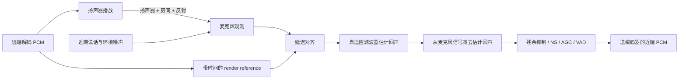

# 回声消除

> [!tip] 阅读提示
> **前置：** [[PCM 与采样]]；知道免提通话会啸叫即可。
> **初读：** 读到「初读到此为止」就停。弄清：AEC 用播放参考减掉麦克风里的回声，以及它依赖的对齐与延迟估计。
> **深入：** 双讲、残余回声、与 NS/AGC 次序，联调啸叫/空心时再读。

## 一句话说明

回声消除（AEC）利用扬声器播放参考信号，估计它经过扬声器、房间和麦克风形成的声学回声，再从麦克风采集信号中抵消估计成分。它是免提双向通话前处理链的一部分，不是编解码器或网络丢包恢复算法。

## 先记住这三句

1. **AEC（回声消除）**：根据「扬声器刚播出的参考」估计并减去麦克风里拾到的回声。
2. 关键是 **参考信号要对齐、延迟估计要稳**；参考错了会伤近端语音。
3. AEC ≠ 降噪：NS 压环境噪声，AEC 专门对付自己扬声器的回声；常和 AGC 等一起排成预处理链。

## 定义

设远端播放参考为 `x(n)`，声学路径为 `h(n)`，麦克风观测为 `d(n) = s(n) + h(n)*x(n) + v(n)`，其中 `s(n)` 是近端说话、`v(n)` 是噪声。自适应滤波器根据参考和误差更新 `h(n)` 的估计，再输出尽量保留 `s(n)` 的残差信号。

## 核心机制

- 参考信号与采集信号必须时间对齐；设备缓冲、系统播放延迟和采集时钟漂移都会改变估计路径。
- 单讲时容易收敛，双讲、突发噪声、扬声器非线性和房间变化会降低估计稳定性；现代处理通常包含双讲检测、非线性残余抑制和舒适噪声策略。
- AEC 输出通常继续进入降噪、自动增益控制和 VAD，再送往 [[音频编解码]]；顺序和采样格式必须按具体实现验证。

**图在说什么：** 远端播放会经空气进麦克风；AEC 用带时间的播放参考对齐后，估计并减去声学回声。

AEC 不是把扬声器声音直接“静音”，而是用播放参考估计它经过真实声学路径后会在麦克风里形成什么，再从混合观测中尽量减去这一部分。参考错位、设备切换或双讲都会让估计变难。

## 具体例子

远端语音经扬声器回到麦克风，若估计路径延迟为 80 ms，AEC 参考至少要覆盖该对齐位置及房间尾响。将扬声器音量突然提高或切换到蓝牙耳机后，应重新测延迟并观察 ERLE 收敛；否则旧滤波器可能把近端语音误消除。

---

> [!warning] 初读到此为止
> 上面这些已经够第一次阅读。下面是工程展开与排障细节（字段、参数、误区与观测），**第二轮或遇到具体问题时再读**；第一次直接点文末「第一次阅读下一站」即可。

## 工程要点

- 记录播放参考的采样率、声道、设备时间戳和实际扬声器输出；只把“送入播放 API 的数据”当参考可能漏掉设备侧延迟。
- 回声尾长要覆盖房间反射，但越长越消耗 CPU 和内存。移动设备切换输出设备、音量或路由时，通常需要重新初始化或快速重训练。
- 先用纯远端单讲、纯近端单讲、双讲、静音和设备切换用例分别测量 ERLE、残余回声和语音损伤，再观察主观听感。
- AEC 不能修复编码丢包或网络抖动；参考链路和采集链路若不在同一时钟域，需要显式处理漂移。

## 问题边界

- AEC 处理的是扬声器到麦克风的声学耦合，不是网络回声、远端混音错误或编码失真；网络问题需要在传输/播放链路单独定位。
- AEC 需要远端播放参考和近端采集信号，只有麦克风单路输入时无法可靠估计回声路径。
- AEC 的“消除”不等于把输出静音。过强的残余抑制会损伤近端语音，应在 ERLE、双讲自然度和残余回声间取舍。

## 数据结构与处理链

处理模块通常维护参考 ring buffer、采集 block、滤波器系数、误差/功率估计、双讲状态、采样率/声道配置和设备延迟估计。参考和采集必须有可对齐的块时间戳；只传裸样本而不记录设备路径和时钟，会让故障难以复现。

常见链路为：播放参考捕获 → 延迟对齐 → 自适应线性滤波 → 误差计算 → 双讲/收敛控制 → 非线性残余抑制 → NS/AGC/VAD → 编码。具体模块顺序和实现由平台决定，不能从名称推断全部处理。

## 算法步骤

1. 取得实际播放参考和麦克风采样，统一采样率、声道、block size。
2. 估计设备/声学路径的初始延迟，把参考窗口对齐到采集窗口。
3. 用 NLMS、频域自适应滤波或平台实现估计回声路径，计算残差。
4. 检测双讲、非线性失真和突变，调整滤波器更新/抑制强度。
5. 经过残余回声抑制后输出到后续前处理和编码，并更新参考/误差统计。

## 时间与缓冲关系

声学回声可能在几十到数百毫秒内多次反射；参考 ring buffer 要覆盖目标尾长，同时不应无限增长。设备播放 DMA、系统 mixer、蓝牙链路和采集缓冲形成未知延迟，AEC 通常需要 delay estimator 或平台提供的 render/capture 对齐。时钟漂移会使最佳延迟缓慢变化，必须持续校正。

## 关键参数与取舍

- block size/frame size：小块响应快但 CPU/调度高，大块降低开销但增加延迟。
- filter tail length：覆盖更多反射但增加计算、内存和收敛时间。
- 双讲阈值、收敛速度、残余抑制强度：回声量与近端语音损伤的取舍。
- 参考通道数、采样率、设备路由：覆盖性与 CPU/互操作的取舍。

## 常见误区与故障

- 只把发送给扬声器的 PCM 当参考：设备音量、系统混音、蓝牙编解码和硬件处理可能改变实际播放信号。
- AEC 处理前后顺序随意调整：增益、降噪和非线性处理会改变滤波器看到的信号。
- 设备切换后继续使用旧滤波器：声学路径已变，可能出现长时间残余回声或啸叫。
- 双讲时强行快速收敛：远端和近端同时说话会被误当成回声，造成语音被削弱。

## 可观测与验证

- 记录 render/capture PTS、估计延迟、滤波器收敛状态、ERLE、残余回声能量、双讲比例、过载和设备路由。
- 使用纯远端单讲、纯近端单讲、双讲、远端音乐、静音、音量变化、设备切换和蓝牙延迟样本测试。
- 结合录音回放与主观听评，确认指标改善没有换来语音断裂、金属音或近端语音过度抑制。

## 阅读导航

- **上一篇：** [[Opus]]
- **下一篇：** [[心理声学与 MDCT]]
- **所属专题：** [[00-知识地图/专题说明/07 音频处理与 Opus|07 音频处理与 Opus]]
- **回看：** [[RTC 知识总览]] · [[00-知识地图/学习路线/学习进度模板|学习进度]] · [[00-知识地图/学习路线/RTC 工程师学习路线.canvas|阶段路线]]

- **第一次阅读下一站：** [[心理声学与 MDCT]]

> 读完先回所属专题做练习/验收，再点下一篇。内部链接最多再追一层；不影响理解的陌生词先记下。

## 图谱关系

- 主题：[[音频技术地图]]、[[客户端工程地图]]
- 输入：[[PCM 与采样]]
- 下游：[[音频编解码]]
- 编码器：[[Opus]]

## 参考资料

- 《WebRTC 参考》，音频处理与 AEC 章节，`90-参考资料\音视频与 WebRTC 书库\webrtc-reference-zh\content`。
- WebRTC Audio Processing Module 文档，`90-参考资料\音视频与 WebRTC 书库\webrtc-authoritative-guide-zh\content`（项目资料索引）。
- 《FFmpeg Basics》，第 16 章数字音频，`90-参考资料\音视频与 WebRTC 书库\ffmpeg-basics\translation\17-digital-audio.md`。
